# Lab 01 - Simulate a Repository Migration from Azure DevOps to GitHub Enterprise Cloud using GitHub CLI and GEI

In this lab, you will learn how to **simulate and validate the
migration** of a source code repository from **Azure DevOps (ADO)** to
**GitHub Enterprise Cloud (GEC)** using the **GitHub CLI**, the **GitHub
Enterprise Importer (GEI)**, and the **ado2gh CLI extension**.  
This involves both a **dry-run** and a **real migration**, using PATs
and validated permissions to confirm readiness and ensure smooth
migration of project assets.

### Objective:

To simulate and validate a successful migration from **Azure DevOps** to
**GitHub Enterprise Cloud** using **GitHub CLI**, **GEI**, and the
**ado2gh extension**, and ensure project readiness for production
migration.

**Pre-requisites**

Ensure the following before you start:

- A GitHub account with repo creation access

- Azure DevOps project and repo access

- GitHub CLI installed (https://cli.github.com)

- GitHub Enterprise Importer CLI (gh-gei) installed

- Two Personal Access Tokens (PATs):

  - **GitHub PAT** (with repo, admin:org, workflow scopes)

  - **Azure DevOps PAT** (with Code (read) and Project & Team scopes)

## Task 1 : Start GitHub Enterprise Cloud Free Trial

1.  Open a browser and go to +++https://github.com/enterprise/trial+++
    and click on **Sign in**. Sign in with your personal GitHub account.

  

2.  Click on **Start your free trial.**

  

3.  Click on **Get started with personal accounts.**

  

4.  Enter below values and then click on **Create enterprise.**

    1.  Enterprise name : +++tfdevops-migr+++

    2.  Enterprise URL slug : +++tfdevops-migr+++

    3.  Industry : education (you can select as per your requirement)

    4.  Number of employees 

    5.  Etner Contact information

    6.  Verify account

    7.  Accept trial term

  

  

5.  Click on **Skip for now** button to sip the payment method.

  

6.  Etner Organization account name : +++devopstogtihub+++ and click on **Create organization and
    continue** button.

  

  

7. Click on **People** tab to check the license.

  

8.  Click on 0 roles link under **Membership** column as shown in below
    image.

  

## Task 2 – Install and Authenticate GitHub CLI

1.  Open PowerShell as administrator start menu and run below command

  +++winget install --id GitHub.cli+++

  

  

2.  Close the PowerShell window.

3.  By default, GitHub CLI is installed in below location. Add GitHub
    CLI to system PATH

  +++C:\Program Files\GitHub CLI+++

4.  Press **Win + S** and search for +++Environment Variables+++ and select **Edit the system environment variables**.

  

   > **Note**: If the search bar is not visible. Right click on the Task bar, click on the **search** and then select **Show search box**.

5.  In the **System Properties** window, click **Environment Variables**.

  

6.  Under **System variables**, find and select **Path**, then
    click **Edit**.

  

7.  Click **New** and **add** GitHub CLI path and then click
    **OK-\>OK-\>OK**.

  +++C:\Program Files\GitHub CLI+++

  

8.  Restart the PowerShell and run below command login.

  +++gh –version+++

  +++gh auth login+++

  

9.  Follow the interactive prompts:

    1.  Choose **GitHub.com**

    2.  Select **HTTPS**

    3.  Authenticate via browser

  

  

  

10. Click on **Authorize github** button.

  

  

11. Switch back to the PowerShell window.

  

12. After login, confirm by running below command

  +++gh auth status+++

  

13. Verify GEC Org Admin Permissions. If you can list org repos, you’re
    properly authenticated and ready.Replace **ORG-NAME** with your
    organization name and then run it.

  +++gh repo list ORG-NAME+++

  

## Task 3 – Install the GEI (GitHub Enterprise Importer) Extension

1.  Run below command to install GitHub Enterprise importer extension.

  +++gh extension install github/gh-gei+++

  

2.  Confirm installation:

  +++gh gei -h+++

  

3.  Verify installation:

  +++gh gei --help+++

  

## Task 4 : Create an Azure DevOps personal access token

1.  Create an Azure DevOps personal access token (PAT). Open a new tab
    in your browser and navigate to - +++https://portal.azure.com/++ and
    Sign in with assigned account.

  - Username: +++@lab.CloudPortalCredential(User1).Username+++

    - Password: +++@lab.CloudPortalCredential(User1).Password+++

  

  

2.  Search for +++Azure DevOps+++ and select **Azure DevOps organizations**.

  

3.  Click on **My Azure DevOps Organization** hyper link.

  

4.  Keep default values in “We need few more details “ page ,select your
    country From filed and then click **Continue**.

  

6.  Click on the existing project- **dev-github-project-XXXX**

  

7.  In the top right corner of the screen, click **User settings**.
    Click **Personal access tokens**.

  

8.  Select **+ New Token**

  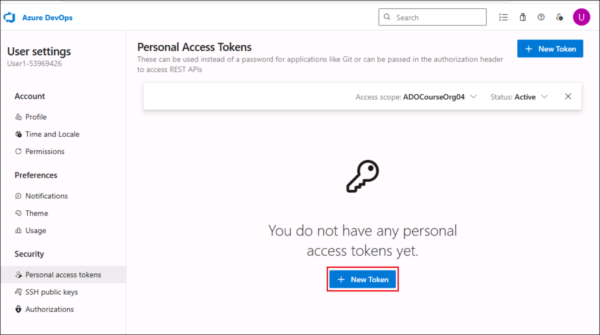

9.  Enter the name as : +++**devopstoken+++** and select the following
    scopes and select **Full access** scopes and click on **Create**.

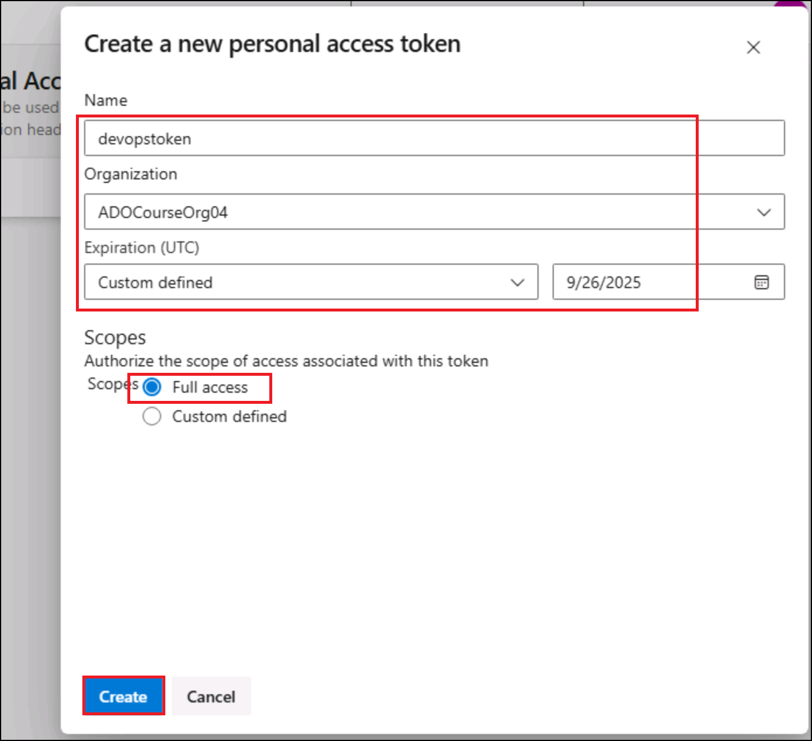

10.  Copy the generated API token and save it in a safe location. For
    your security, it won't be shown again.

  

## Task 5 : Push Repo in Azure DevOps

1.  Open **GitBash** from Desktop and run below command to navigate to
    the project repo.

  +++cd “C:\LabFiles\azure-search-openai-demo”+++

  

2.  Replace you@example.com with your GitHub account and Your Name to be
    replaced with your Github account username in the below commands and
    run them.

  +++git config --global user.email <you@example.com>+++

  +++git config --global user.name "Your Name"+++

  

3.  **Run below commands to push the repo.**

  +++git init+++

  +++git add .+++

  +++git commit -m "Initial commit for migration lab"+++

  

4.  Switch back to Azure DevOps project. Click on + next to DevOps
    project and select **New repository**

  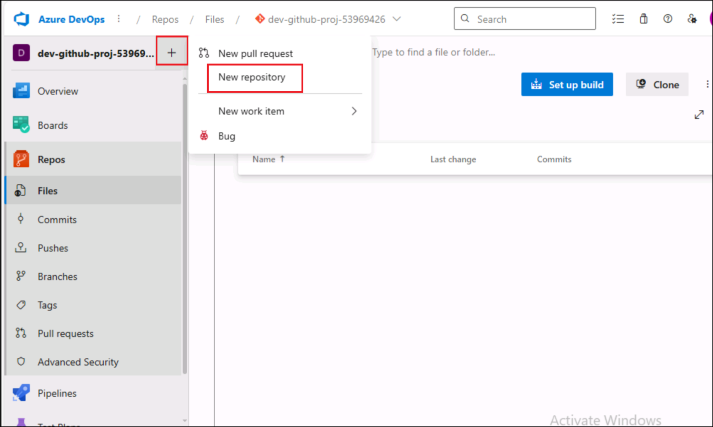

5.  Enter repository name as : +++azure-search-openai-migrated+++ and
    uncheck **Add a README** box and then click on **Create** button.

  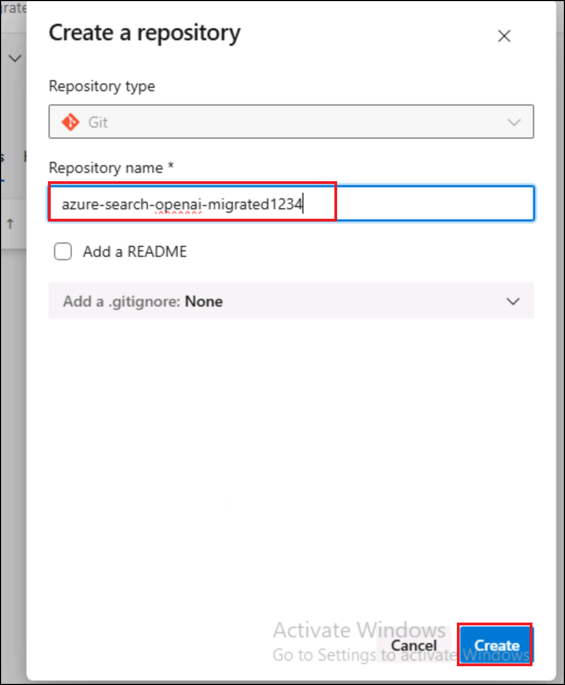

6.  Copy the https url and save it notepad to use it in next steps

  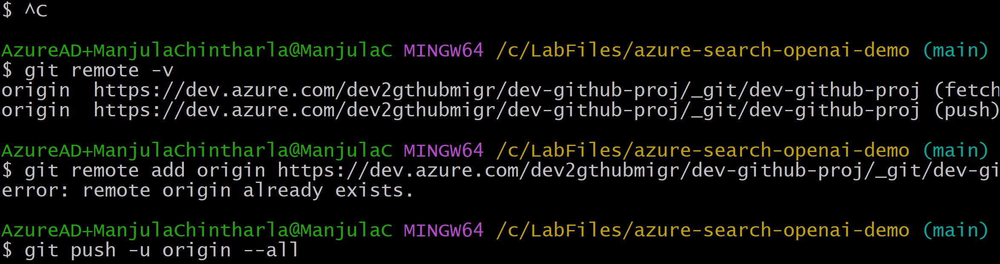

7.  Scroll down and click on **Initialize** button.

  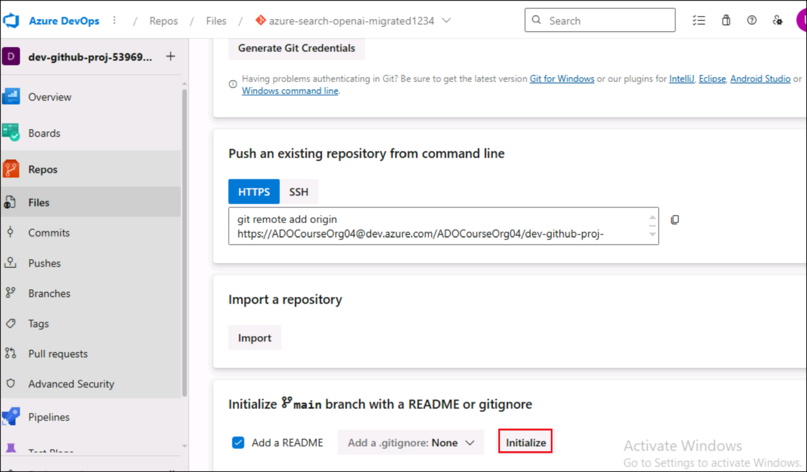

8.  Switch back to **GitBash** and run below command to sign into Azure.
    Select **Work or school account** option and click on **Continue**.

  +++az login+++

  

  

9.  Sign in with your cloud slice accounts.

  - Username: +++@lab.CloudPortalCredential(User1).Username+++

  - Password: +++@lab.CloudPortalCredential(User1).Password+++

  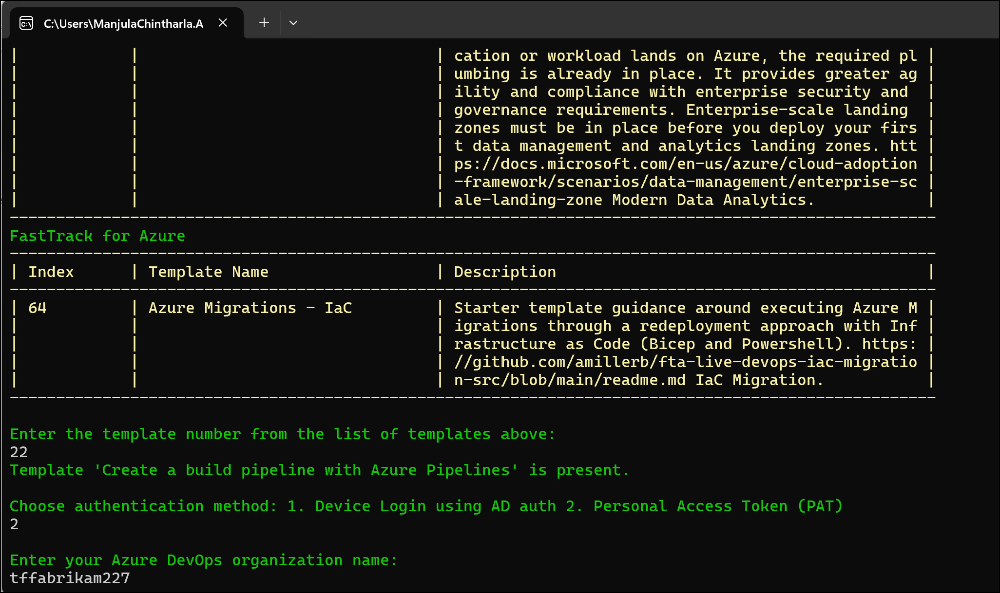

  

  

10. Click on **Yes,all apps** button and then click on **Done**.

  

  

11. Select your subscription and then press enter.

  

  

12. **Run below command to push local folder to Azure Devops .(Eg -**
    <https://dev.azure.com/ADOCourseOrg04/dev-github-proj-53969426/_git/azure-search-openai-migrated).Repalce>
    \< Devops Https url **\> with the https link you copied in previous
    step -Azure DevOps repos**

  +++git remote set-url origin <Devops Https url>+++

  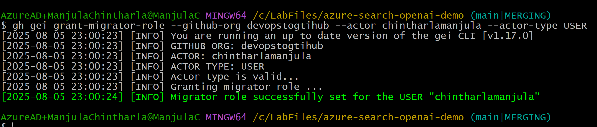

13. Run below commands to pull remote repos.

  +++git pull origin main --allow-unrelated-histories+++

  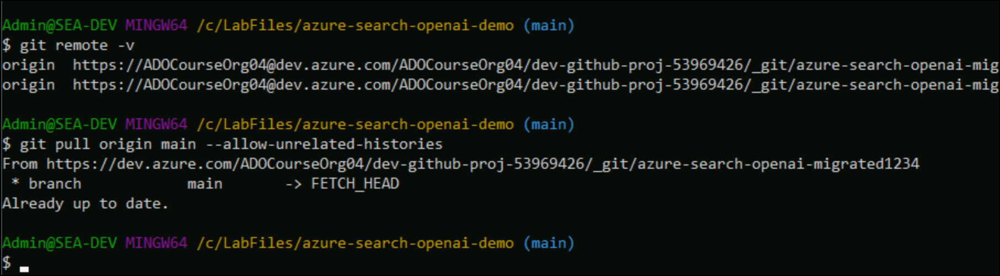

14. Run below command to push the repo to DevOps . if it prompts to sign
    in ,sign in with your DevOps account.

  +++git push -u origin --all+++

  

  >**Note : If you already have repo in Devops then follow steps to pull and resolve conflict – 1. Pull from DevOps with unrelated history:** **git pull origin main --allow-unrelated-histories Step 2 : Resolve conflicts in files like .gitignore, README.md. Step 3 : Stage the resolved files - git add .**

  +++git commit -m "Resolved merge conflicts"+++

15. Go back to Azure DevOps project and check Repos-\> Files .You should
    see your repo here .

  

## Task 6: Create a GitHub Personal Access Token (PAT)

1.  Switch back to GitHub and click on **Settings**.

  

2.  Click on **Developer Settings** from left navigation menu.

  

3.  Click on **Personal Access Tokens-\>Tokens(classic)-\> Generate new
    token(Classic**) . Sign in if it prompts

  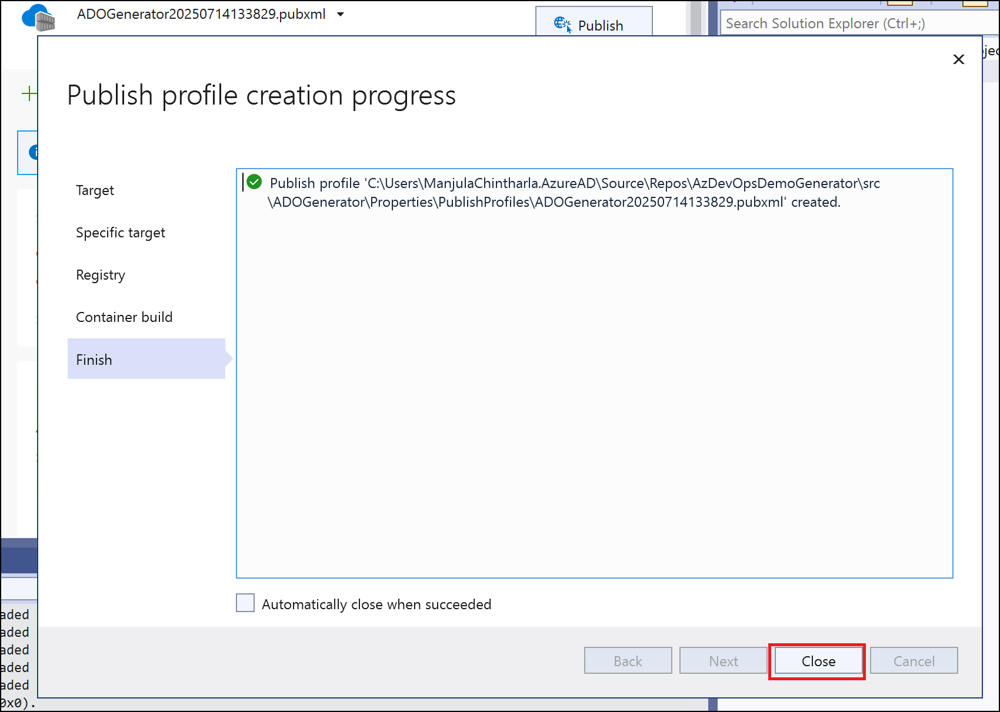

4.  **Enter the token name -** +++**githubtoken+++ and select all scopes
    .**

  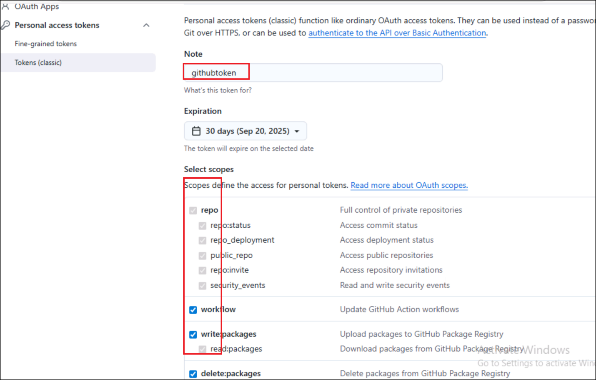

5.  Click on **Generate token -\> Generate token.**

  

6.  Copy the token and save it in notepad to use in next tasks.

  

## Task 7 – Perform Migration

1.  Switch back to **GitBash**. Run the following commands in your
    terminal (replace with your real tokens):

  +++export GH_PAT=ghp_yourgithubpat+++

  +++export AZURE_DEVOPS_PAT=youradopat+++

  +++export ADO_ORG=" your-ado-org"+++ # eg - ADOCourseOrg04

  +++export GEC_ORG="your-githubEC-org"+++ # e.g. devopstogtihub1234

  +++export ADO_PROJECT="your-existing ADO_Projectname"+++ # eg
dev-github-proj-XXXXXXXX

  +++export GITHUB_USERNAME="your GitHub username"+++

  

2.  Run below command to provide migrator role to your GitHub account.

  +++gh gei grant-migrator-role --github-org **devopstogtihub** --actor +
GITHUB_USERNAME --actor-type USER+++

  

3.  Run below command to Install the ado2gh CLI Extension

   +++gh extension install github/gh-ado2gh+++

  

4.  Use the following command template to simulate the repo migration
    without copying data. You're telling GitHub Enterprise Importer
    (GEI) to **simulate** the migration, checking if everything is valid
    and ready to migrate — but **no actual repo, code, or history is
    transferred**.

5.  Run below dry-run command to migrate repos to GEC**  
    (Note: You can check repo in your ADO-\>Org-\> Project-\> Repo )**
    and note down Migration id to a notepad

    +++gh ado2gh migrate-repo --ado-org $ADO_ORG --ado-team-project $ADO_PROJECT  --ado-repo dev-github-proj --github-org $GEC_ORG --github-repo dev-github-proj-migrated-trial --ado-pat $AZURE_DEVOPS_PAT --github-pat $GH_PAT --queue-only+++

  

  +++gh ado2gh wait-for-migration --migration-id RM_xxxxxx --github-pat $GH_PAT+++

6.  Copy repository migration Id and update below command with migration
    id and run.

  +++gh ado2gh wait-for-migration --migration-id <MIGRATION_ID> --github-pat $GH_PAT+++

  

7.  Switch back to GitHub and click on profile and select **Your
    enterprises**.

  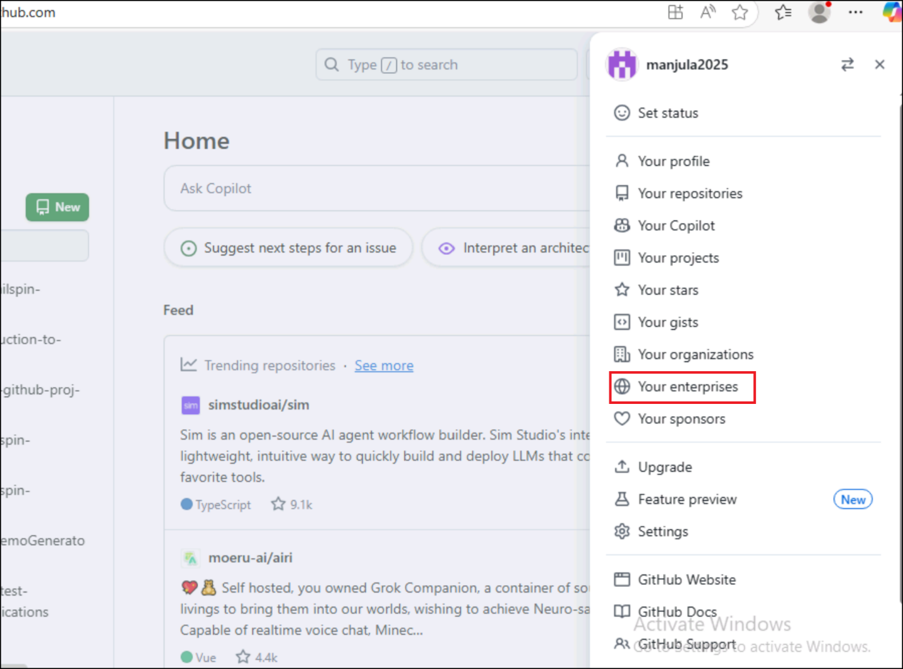

8.  Click on your enterprise account name .

  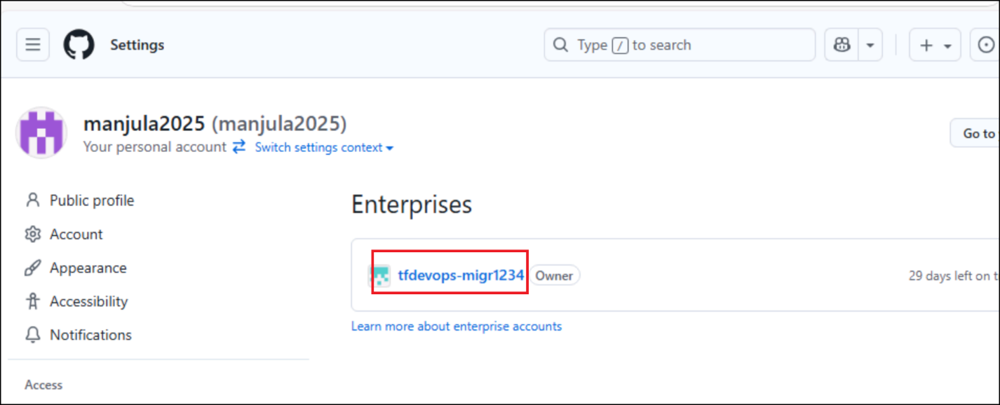

9.  Click on **Organization** tab and then click on your GEC
    organization name.

  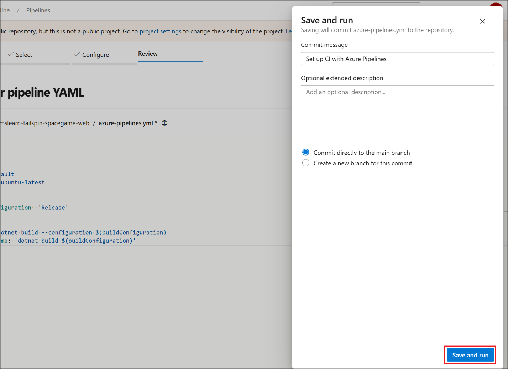

10. Click on **Repositories** tab and you should see the migrated repo
    in GEC.

  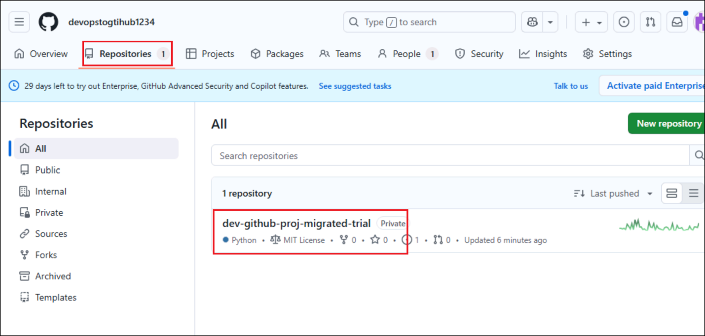

## Summary

In this lab, you performed a trial simulation of migrating a source code
repository from Azure DevOps to GitHub Enterprise Cloud.  
You used the GitHub CLI along with the GitHub Enterprise Importer’s
ado2gh extension to conduct a dry-run of the migration, ensuring the
process completes without errors before actual migration.

This hands-on walkthrough enabled you to:

- Authenticate with both ADO and GEC using PATs

- Configure your source (ADO) and target (GEC) environments

- Run and monitor a trial migration to validate readiness

- Gain confidence in using GEI tooling for future production migrations

