# Lab 02 - Develop with AI-powered code suggestions by using GitHub Copilot and VS Code

Objective:

This lab walks you through the following steps:

- Install GitHub Copilot by using GitHub Codespaces

- Prompt GitHub Copilot for code suggestions

- Accept code suggestions from GitHub Copilot

### Task 1: Get a project intro from Copilot Chat

1.  Open a browser and go to
    <https://github.com/technofocus-pte/githubcopilot> . Sign in with
    your GitHub account.

2.  Click on **Fork** ,

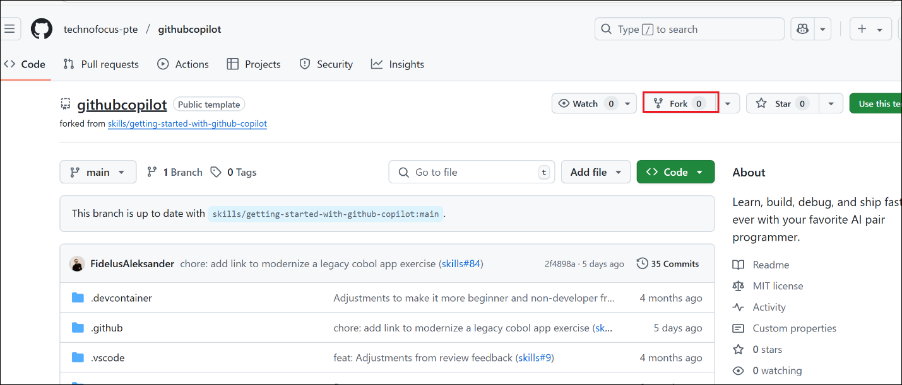

3.  Enter unique name and click on **Create fork**

> 

4.  Scroll down and click on **COPY EXERCISE** button

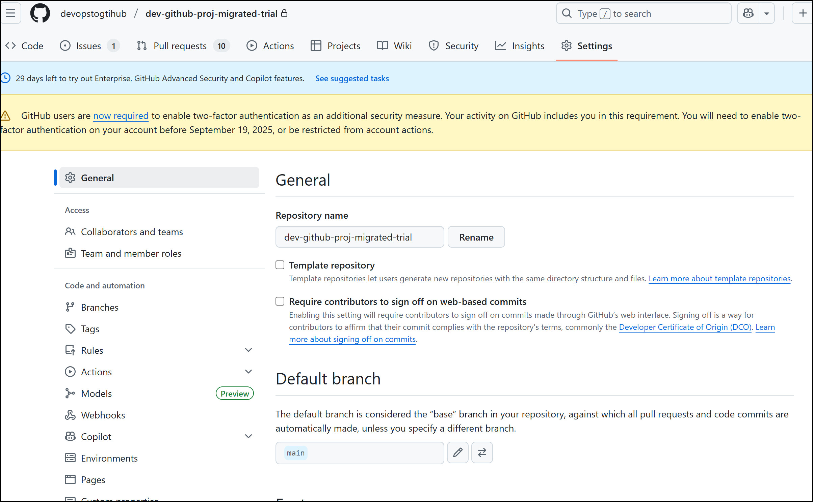

5.  Refresh the page after 20 section and then click on **GO TO
    EXERCISE** button.

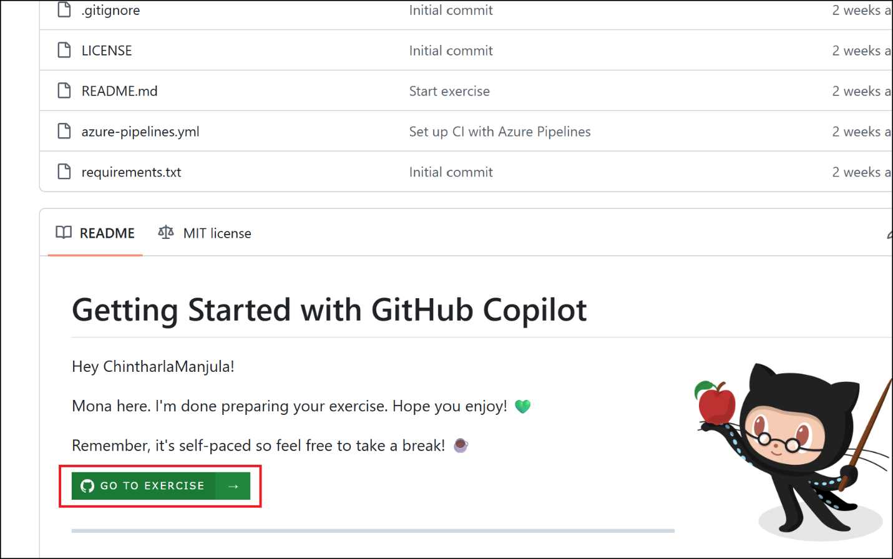

6.  Go through the scenario instructions, scroll down and click on
    **Open a GitHub Codespace.**

7.  Click on **Create new Codespace.**

8.  Wait a moment for Visual Studio Code to load in your browser.

> 

9.  In the left sidebar, click the extensions tab and verify that
    the GitHub Copilot and Python extensions are installed and enabled.

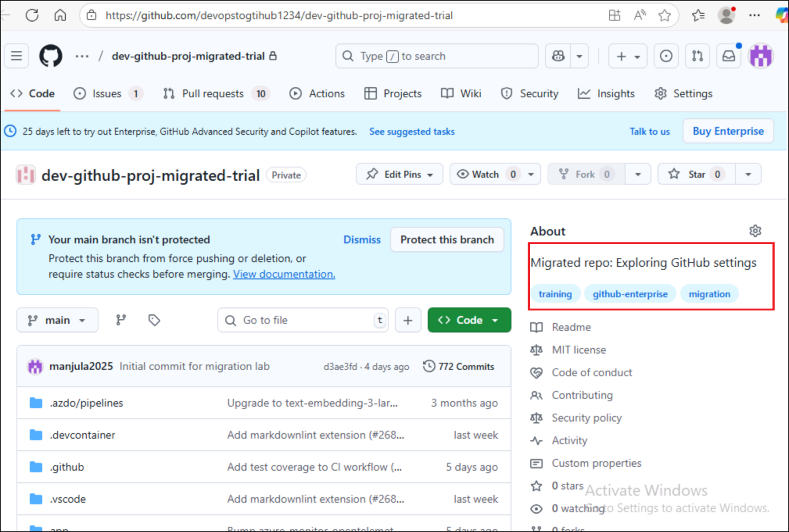

10. At the top of VS Code, locate and click the **Copilot icon** to open
    a Copilot Chat panel. If this is your first time using GitHub
    Copilot, you will need to accept the usage terms to continue.

> 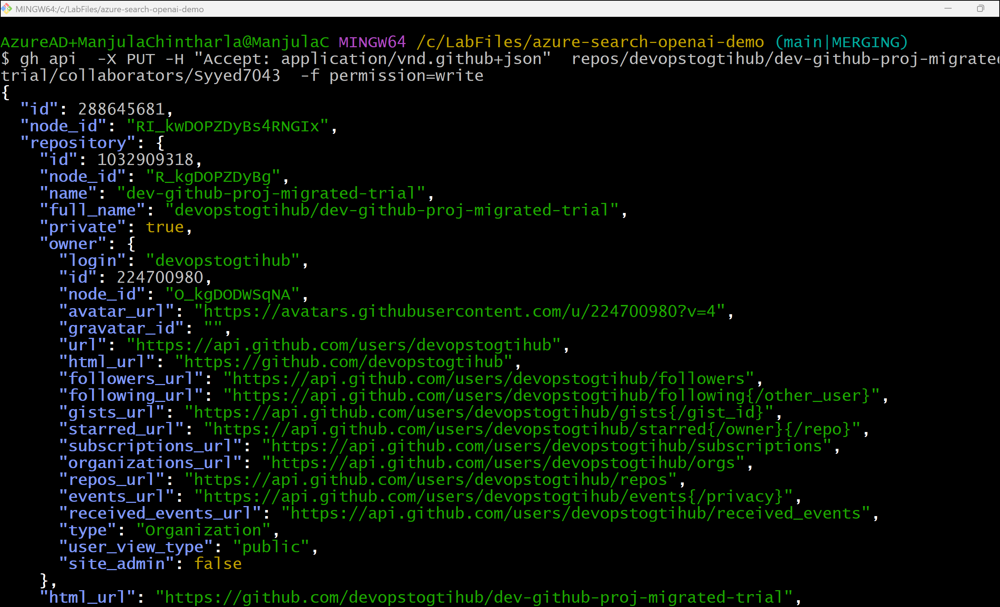

11. Enter the below prompt to ask Copilot to introduce you to the
    project.

> **@workspace Please briefly explain the structure of this project.**
>
> **What should I do to run it?**
>
> 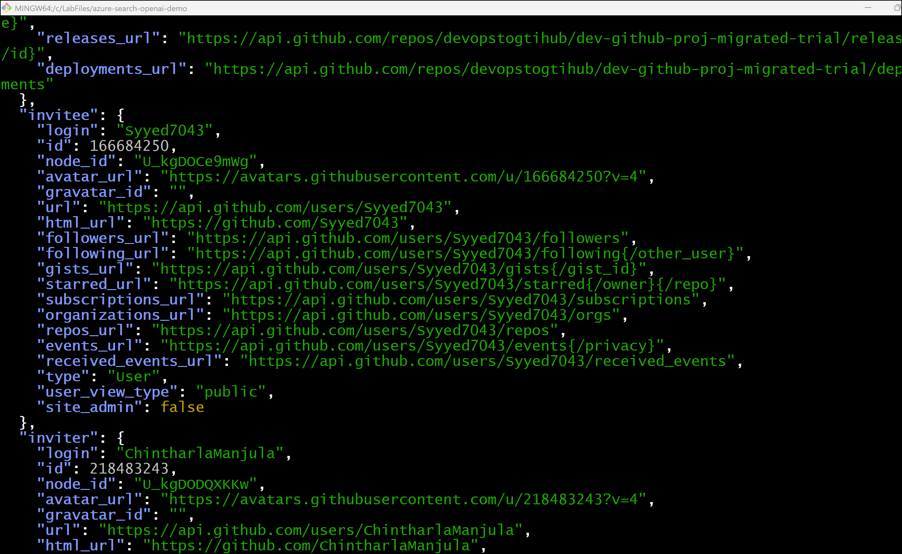
>
> **Note: It is not necessary to follow Copilot's recommended
> instructions. We have already prepared the environment for you.**
>
> 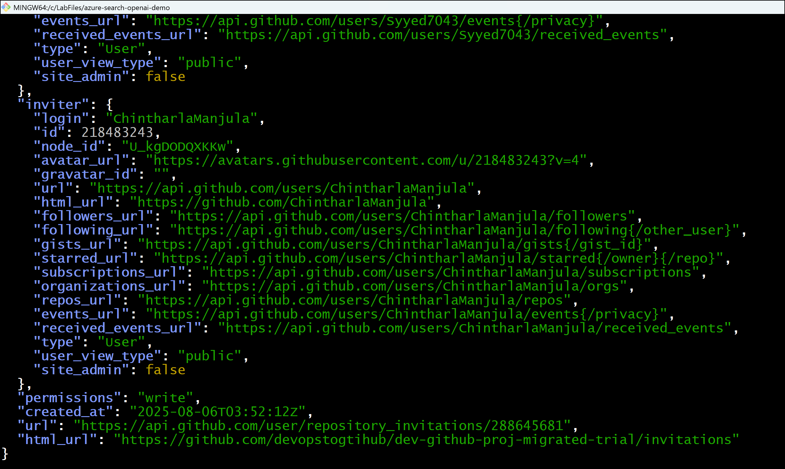

12. Now that we know a bit more about the project, let's actually try
    running it! In the left sidebar, select the **Run and Debug** tab
    and then press the **Start Debugging** icon.

> 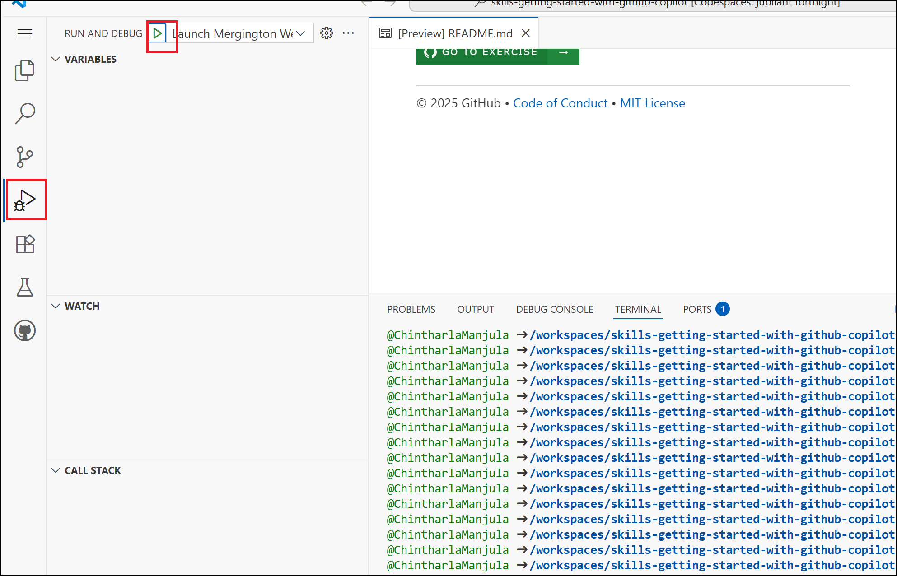

13. We want to see our webpage running in a browser, so let's find the
    url and port. If it isn't visible, expand the lower panel and select
    the Ports tab.

14. In the list, find port 8000 and the related link. Hover over the
    link and select the Open in browser icon.

> 
>
> 

### Task 2 : Use Copilot to help remember a terminal command 

1.  If not already there, return to VS Code.

2.  In the bottom panel, select the **Terminal** tab. On the right side,
    click the **plus + sign** to create a new terminal window.

> Note: This will avoid stopping the existing debug session that is
> hosting our web application service.
>
> 

3.  Within the new terminal window use the keyboard shortcut **Ctrl +
    i** (windows) or Cmd + i (mac) to bring up Copilot's Terminal Inline
    Chat.

> 

4.  Let's ask Copilot to help us remember a command we have forgotten:
    creating a branch and publishing it.

> **Hey copilot, how can I create and publish a new Git branch?**
>
> 
>
> **Tip: This is a simple example, but Copilot is great at providing
> more tailored commands that might involve loops, pattern matching,
> file modification, and more! Don't be afraid to ask Copilot for a
> suggestion. Just remember it is a suggestion and you should always
> verify it first to be safe.**

5.  Copilot probably gave us a command like the following. Rather than
    manually modify it, let's respond back to tell Copilot to use a
    particular name.

> 
>
> **Awesome! Thanks, Copilot! Let's use the**
>
> **branch name "accelerate-with-copilot".**
>
> 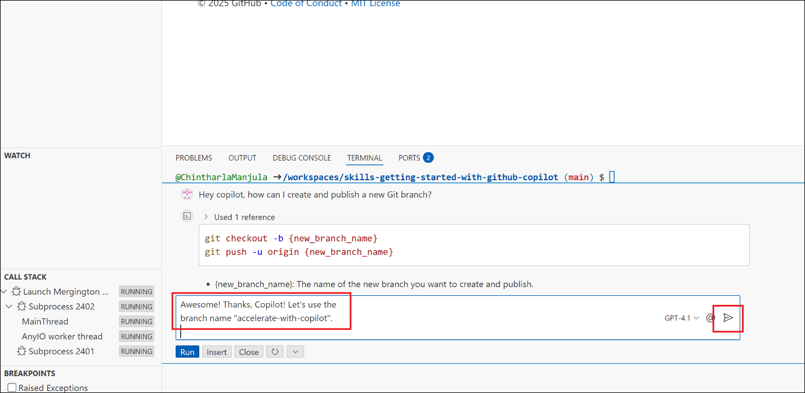
>
> Tip: If Copilot doesn't give you quite what you want, you can always
> continue explaining what you need. Copilot will remember the
> conversation history for follow-up responses.
>
> 

6.  Now that we are happy with the command, press the **Run** button to
    let Copilot run it for us. No need to copy and paste!

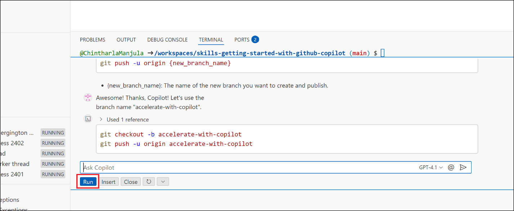

7.  After a moment, look in the VS Code lower status bar, on the left,
    to see the active branch. It should now
    say **accelerate-with-copilot**. If so, you are all done with this
    step!

> 

8.  Now that your branch is pushed to GitHub,

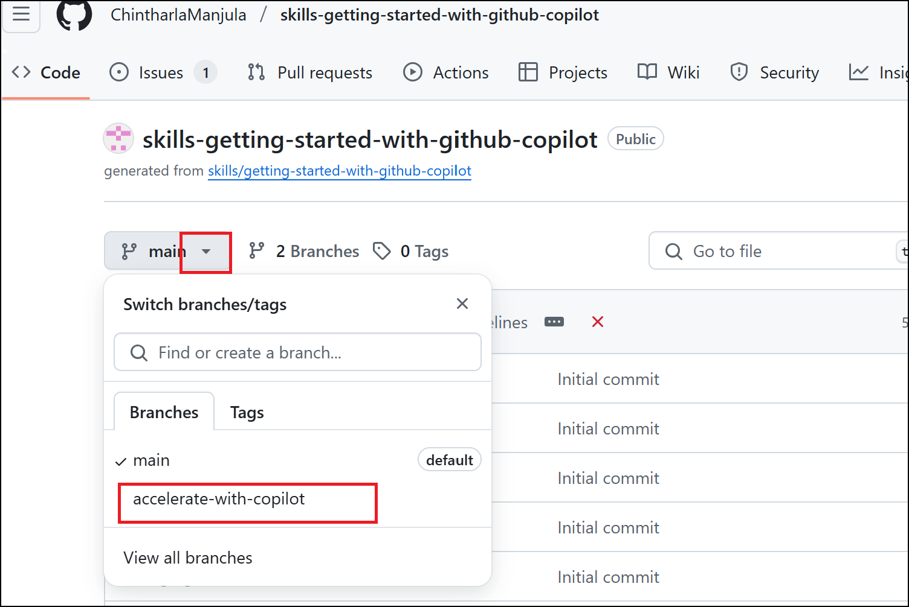

### Summary :

You learnt

- GitHub Copilot features and the subscription plans (Free, Pro,
  Business, and Enterprise) and developed app by using GitHub Copilot
  and VS Code.
