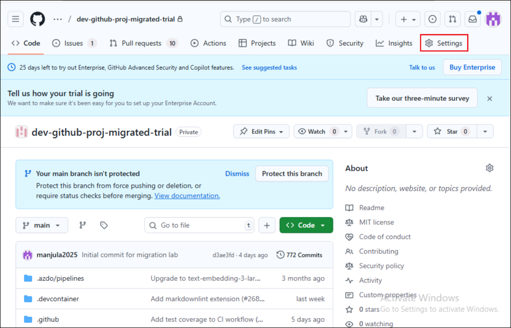
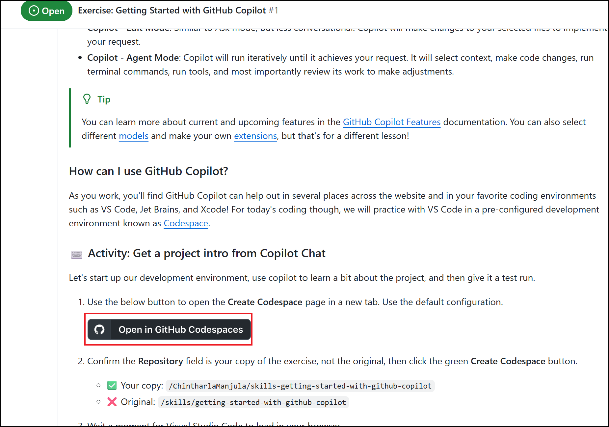
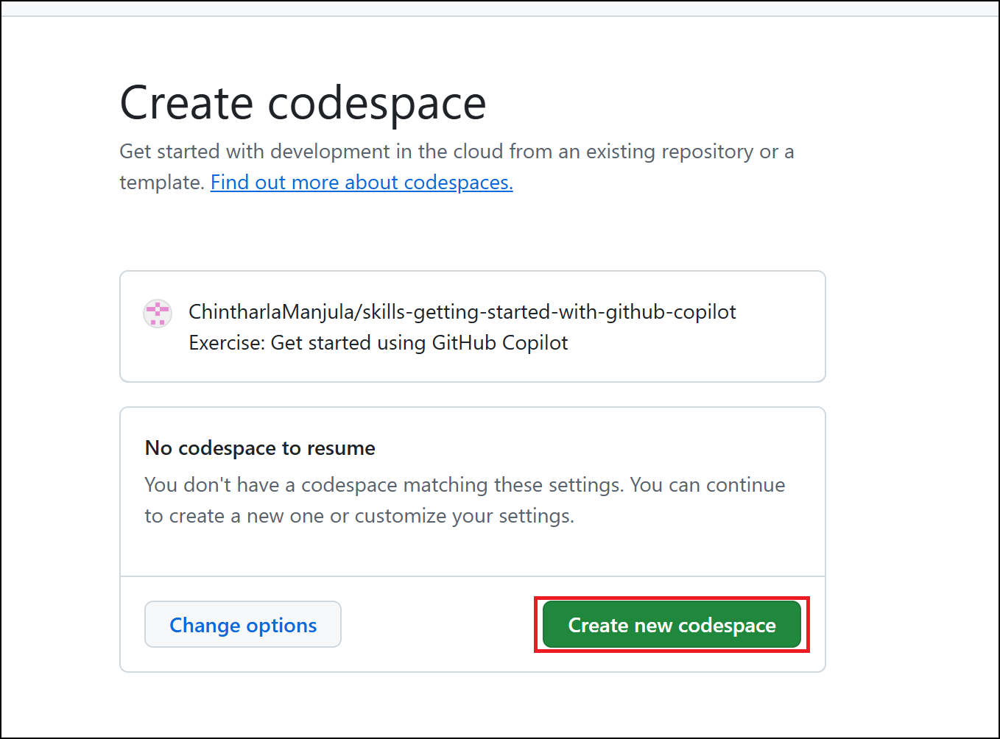
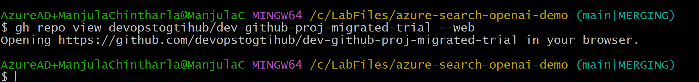
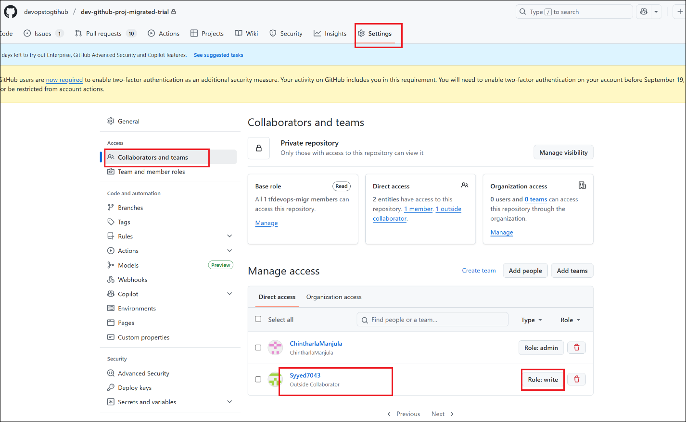
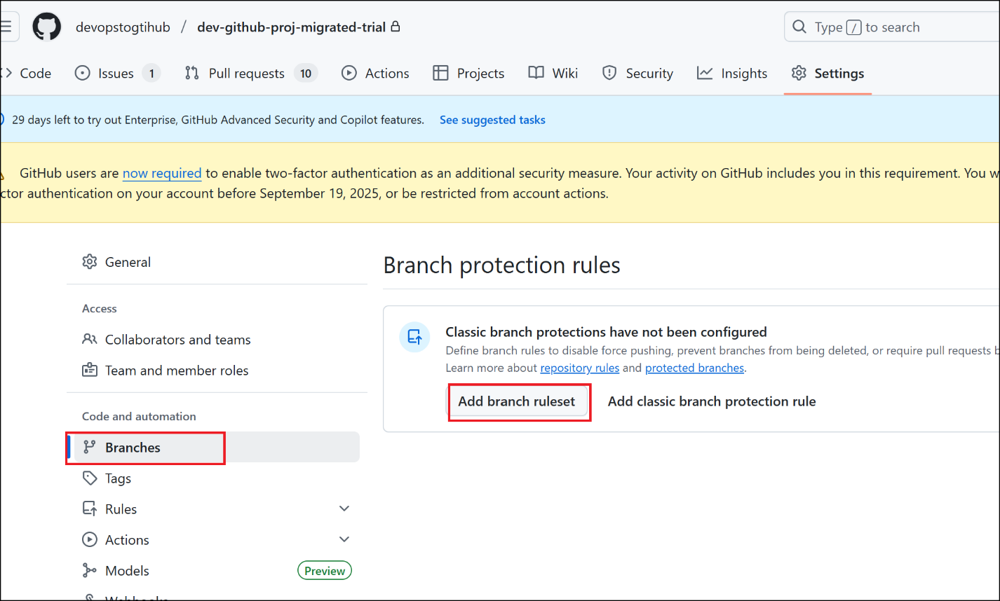
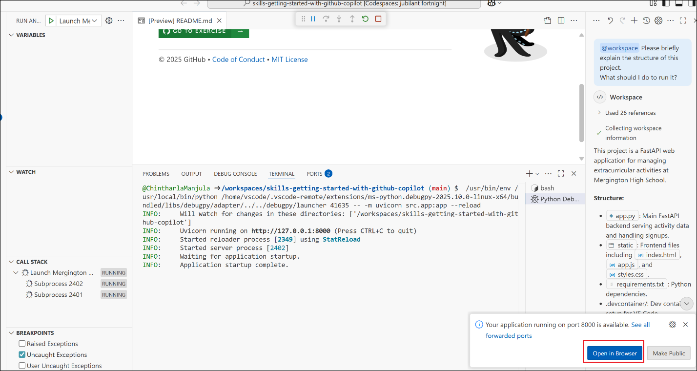
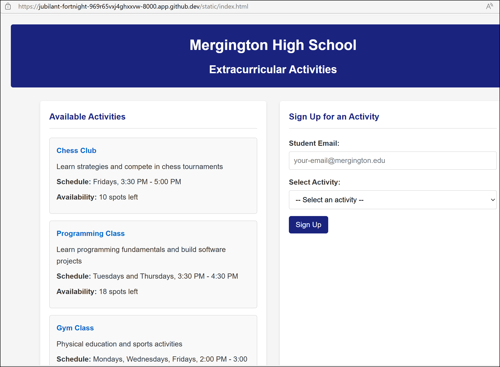
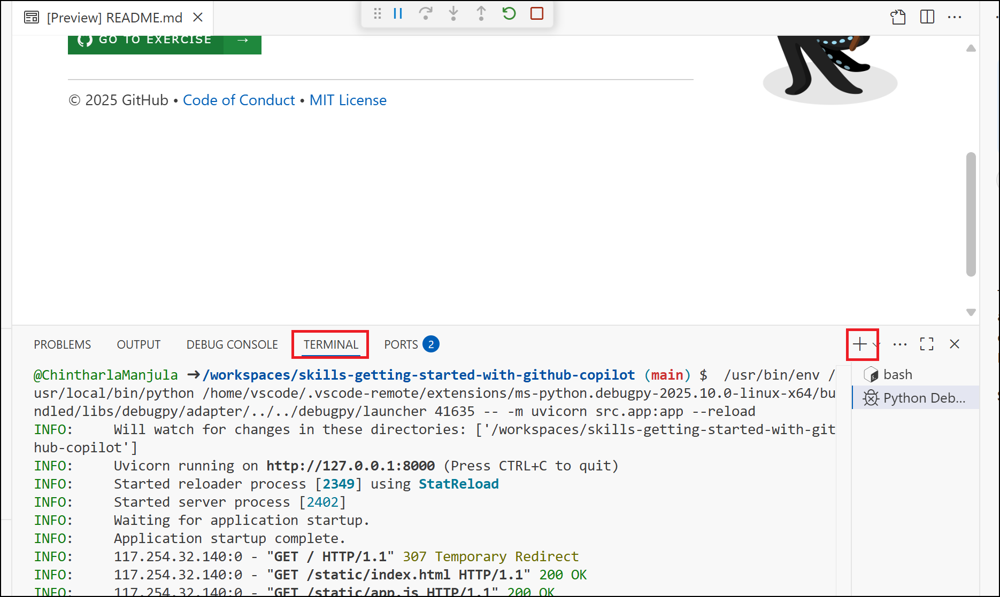
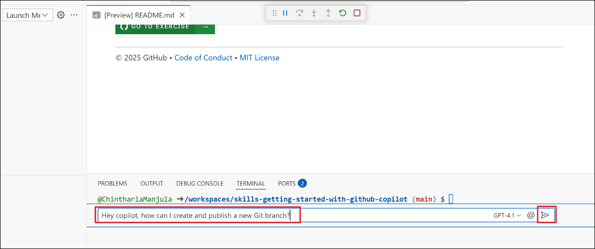

# Lab 2 - Post-Migration GitHub Repository Configuration Using CLI & Web UI

**Objective:**  
Continue from Lab 1 and configure the migrated repository in GitHub
Enterprise Cloud (GEC). Students will use GitHub CLI and GitHub Web UI
to set up metadata, permissions, security, and insights.

**Pre-requisites:**

- GitHub CLI (gh) installed

- Successful completion of Lab 1 with a migrated repository (e.g.,
  dev-github-proj-migrated-trial)

- Authenticated to GitHub (gh auth login)

- Admin access to the target repository

### Task 1: View Repository Settings in Browser

1.  Switch back to GitBah and run below command. This opens the repo in
    browser.

gh repo view devopstogtihub/dev-github-proj-migrated-trial –web

2.  Click on **Settings** tab

3.  Navigate to **Settings** tab and explore:

- Visibility

- Topics

- Branch protection

- Security

### Task 2 : Edit Repository Metadata using CLI

1.  Now that our repo is migrated to GitHub, we'll add a meaningful
    description and categorize it with tags (topics) so that it’s easier
    to manage, discover, and understand the purpose of this repo.

2.  Switch back to GitBash and run below command .

gh repo edit devopstogtihub/dev-github-proj-migrated-trial --description
"Migrated repo: Exploring GitHub settings" --add-topic migration
--add-topic github-enterprise --add-topic training

Note : Use relevant topics that reflect the project purpose (e.g.,
data-science, migrated-repo, azure, gei, etc.).

3.  Run this command in Git Bash to open the repository in your browser.
    This will open the repo's **homepage on GitHub**

gh repo view devopstogtihub/dev-github-proj-migrated-trial –web

4.  You should see the updated description and topics

### Task 3 : Add Collaborators and Assign Roles

1.  Let us grant another GitHub user access to your repository. Repalce
    GITHUB_USERNAME with your team mate Github_username and run it.

2.  This sends a request to **invite** the user to collaborate on your
    repo. Assigns them the **Write** permission (they can push changes,
    but not manage repo settings)

gh api -X PUT -H "Accept: application/vnd.github+json"
repos/devopstogtihub/dev-github-proj-migrated-trial/collaborators/GITHUB_USERNAME
-f permission=write

3.  Ask your team mate fi they got invitation and ask them to
    authenticate

> 

4.  Your team mate should have access to write permission to the repo

5.  Switch back to your GitHub account and the migrate repo . Click on
    **Settings -\>** **Collaborators and Teams** and you should see your
    team mate name under Manage access section with correct role.

### Task 4 : Configure Branch Protection (Web UI Only)

1.  Click on **Branches -\>** **Add branch ruleset**

2.  Enter **main** in **Ruleset Name** text box and select **Active**
    from **Enforcement status** drop down.

3.  Under Target branches , select **Add target -\> Include by
    pattern.**

4.  Enter **main** in **Branch naming pattern** and then click on **Add
    inclusion pattern**.( we used main for the lab purpose , you can use
    branch in your repos)

5.  Under **Branch rules**, select the following:

- Require a pull request before merging- Automatically request Copilot
  code review

- Require linear history

6.  Scroll down and click **Create** or **Save changes**.

### Summary 

- Opened and explored your GitHub Enterprise Cloud (GEC) repository via
  GitHub CLI and Web UI

- Edited repository metadata including description and topics

- Granted access to teammates with the appropriate permissions via CLI

- Configured branch protection rules to enforce secure development
  practices

- Ensured the repository is ready for collaboration and compliant with
  common DevOps standards
