# Lab 03 - Code with Codespaces and Visual Studio Code

GitHub offers a range of features to help your development team
customize a codespace to reach peak configuration and performance needs.
For example, you can:

- Create a codespace from your repository.

- Push code from the codespace to your repository.

- Use VS Code to develop code.

- Customize the codespace with custom images.

- Manage the codespace.

To begin developing using GitHub Codespaces, you can create a codespace
from a template or from any branch or commit in a repository. When you
create a codespace from a template, you can start from a blank template
or choose a template suitable for the work you're doing.

### Objective :

 Practice coding in Codespaces and Visual Studio Code (VS Code).

### Task 1 : Start a codespace

1.  Open a browser and go to https://GitHub.com and sign into GitHub
    with your GitHub account.

2.  Enter the repo link -
    <https://github.com/skills/code-with-codespaces.git> and Fork the
    repo.

3.  Click **Start course** and open the link.

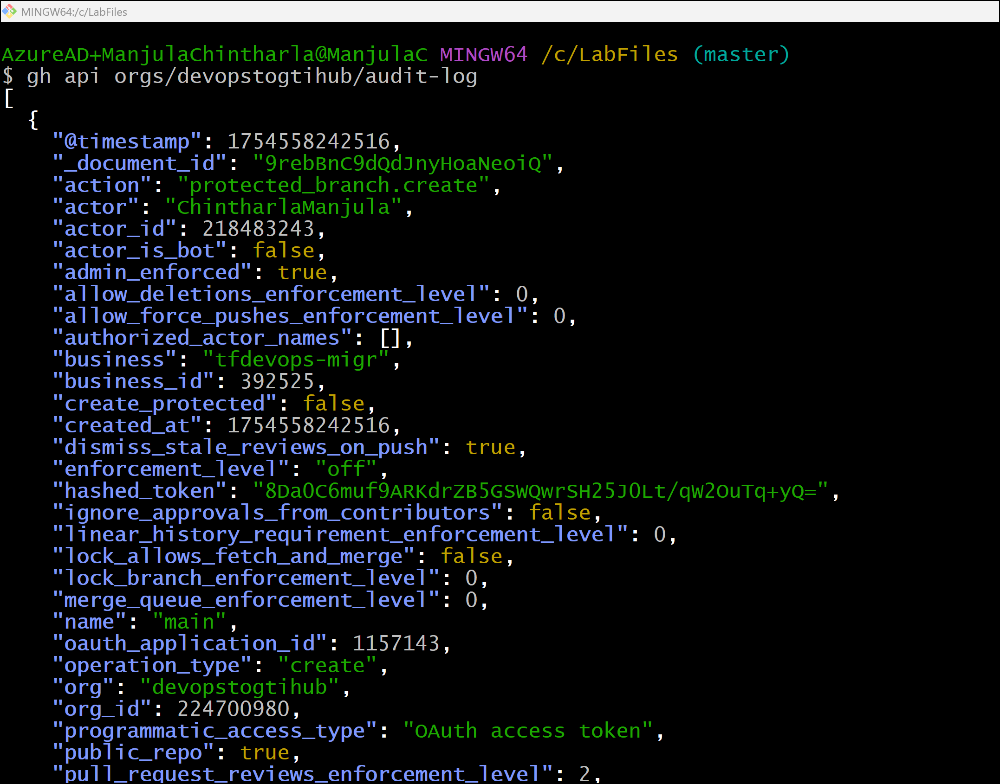

3.  Most of the prompts will automatically fill in for you. For owner,
    choose your personal account or an organization to host the
    repository. Scroll down and click the **Create repository** button
    at the bottom of the form.

4.  After your new repository is created, wait about 20 seconds, then
    refresh the page. Follow the step-by-step instructions in the new
    repository's README.

5.  Click the green **Code** button located in the middle of the page.
    Select the **Codespaces** tab in the box that pops up and then click
    the **Create codespace on main** button.

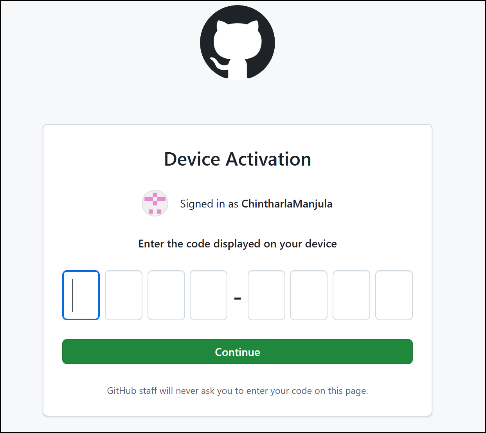

6.  Wait about 2 minutes for the codespace to spin itself up. **Note**:
    It's a virtual machine spinning up in the background.

7.  Verify your codespace is running. The browser should contain a VS
    Code web-based editor and a terminal should be present such as the
    below: 

> 

### Task 2 : Push code to your repository from the codespace

1.  From inside the codespace in the VS Code explorer window, select
    the **index.html** file.Replace the **h1** header with the below and
    Save the file.

\<h1\>Hello from the codespace!\</h1\>

**Note**: The file should autosave.

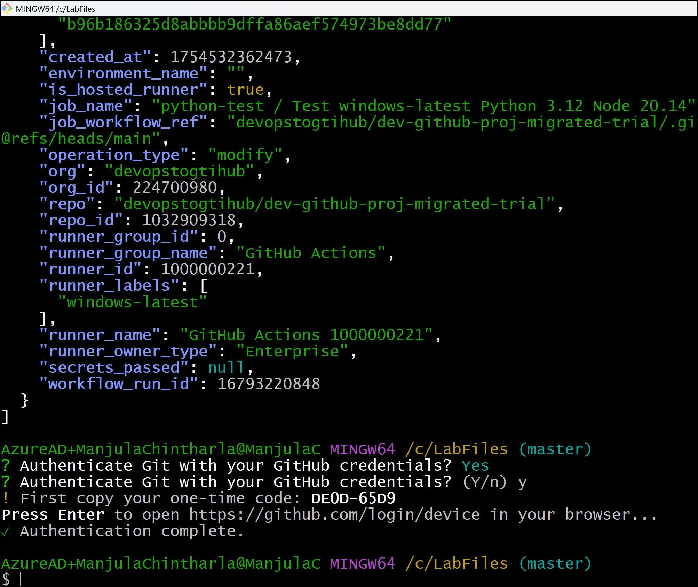

2.  Use the VS Code terminal to commit the file change by entering the
    following commit message:

git commit -a -m "Adding hello from the codespace!"

3.  Push the changes back to your repository. From the VS Code terminal,
    enter:

git push

4.  Your code has been pushed to your repository.Switch back to the
    homepage of your repository and view the index.html to verify the
    new code was pushed to your repository.

5.  Wait about 20 seconds then refresh this page (the one you're
    following instructions from). GitHub Actions will automatically
    update to the next step.

### Task 3 : Add a custom image to your codespace

*You created your first codespace and pushed code using VS Code!*

You can configure the development container for a repository so that any
codespace created for that repository will give you a tailored
development environment, complete with all the tools and runtimes you
need to work on a specific project.

**What are development containers?** Development containers, or dev
containers, are Docker containers that are specifically configured to
provide a fully featured development environment. Whenever you work in a
codespace, you are using a dev container on a virtual machine.

A dev container file is a JSON file that lets you customize the default
image that runs your codespace, VS code settings, run custom code,
forward ports and much more!

Let's add a devcontainer.json file and add a custom image.

1.  Navigating back to your **Code** tab of your repository, click
    the **Add file** drop-down button, and then click **Create new
    file**.

2.  Type or paste the following in the empty text field prompt to name
    your file.

> .devcontainer/devcontainer.json
>
> 

3.  In the body of the new **.devcontainer/devcontainer.json** file, add
    the following content. Click **Commit changes** .

> {
>
> // Name this configuration
>
> "name": "Codespace for Skills!",
>
> // Use the base codespace image
>
> "image": "mcr.microsoft.com/vscode/devcontainers/universal:latest",
>
> "remoteUser": "codespace",
>
> "overrideCommand": false
>
> }
>
> 

4.  Select **Commit changes directly to the main branch**.

> 

5.  Create a new codespace by navigating back to the **Code** tab of
    your repository.

6.  Click the green **Code** button located in the middle of the page.
    Click the **Codespaces** tab on the box that pops up.Click
    the **Create codespace on main** button OR click the + sign on the
    tab. This will create a new codespace on the main branch. (Notice
    your other codespace listed here.)

> 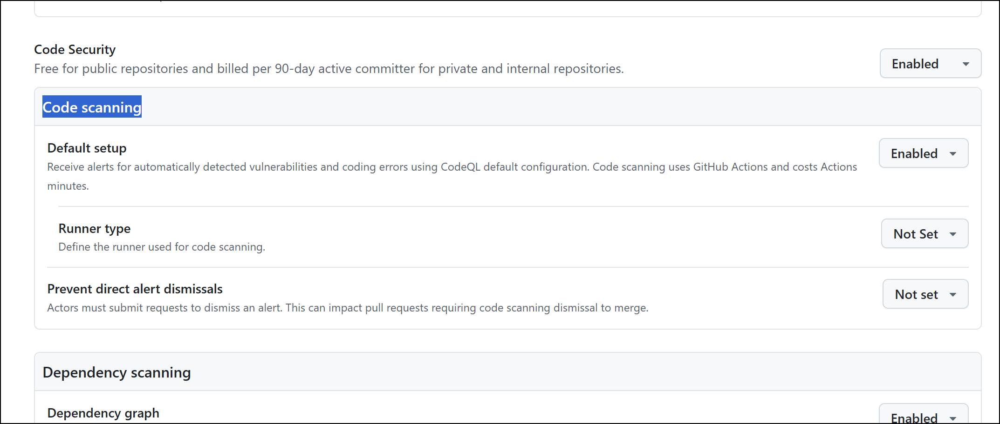
>
> 

7.  Wait about **2 minutes** for the codespace to spin itself up.

> 

8.  Verify that your new codespace is running, as you did
    previously.Note the image being used is the default image provided
    for GitHub Codespaces. It includes runtimes and tools for Python,
    Node.js, Docker, and more.

### Task 4 : Customize your codespace- Add customizations to the devcontainer file

*You created a codespace with a custom image!*

You can customize your codespace by adding VS code extensions, adding
features, setting host requirements, and much more.

Let's customize some settings in the devcontainer.json file!

1.  Navigate to the **.devcontainer/devcontainer.json** file. Click on
    **Edit**

> 

2.  Add the following customizations to the body of the file before the
    last }. Click **Commit changes** 

> // Add the IDs of extensions you want installed when the container is
> created.
>
> "customizations": {
>
> "vscode": {
>
> "extensions": \[
>
> "GitHub.copilot"
>
> \]
>
> },
>
> "codespaces": {
>
> "openFiles": \[
>
> "codespace.md"
>
> \]
>
> }
>
> }
>
> 

3.  Select **Commit changes directly to the main branch**.

4.  Ensure the number of active codespaces does not reach the maximum
    (typically 2 ).Delete the first codespace.

> 
>
> 

5.  Create a new codespace by navigating to the landing page of your
    repository.Click the **Code** button located in the middle of the
    page.Click the **Codespaces** tab on the box that pops up.

**Tip**: To stop an active codespace, click the **•••** next
to **●Active** and select **Stop codespace** from the menu.

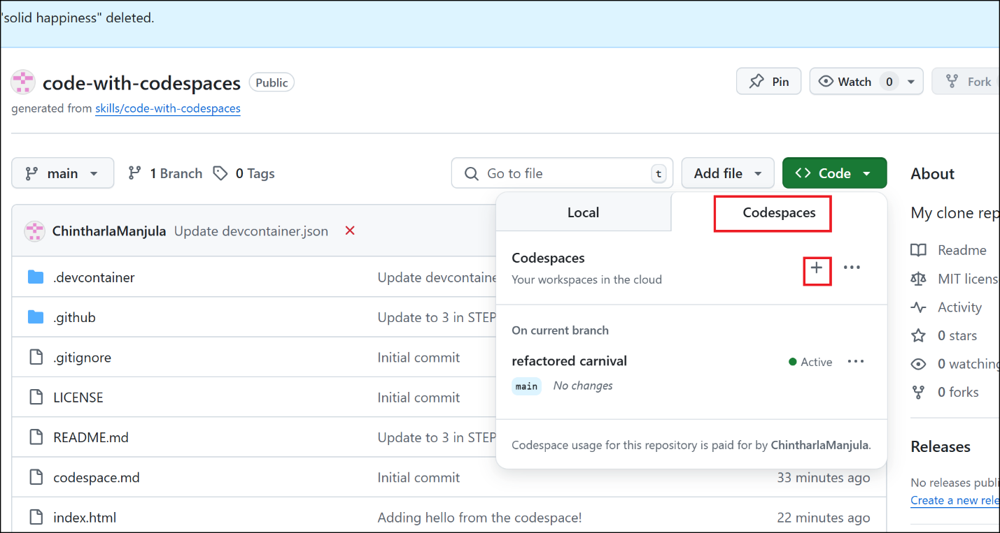

6.  Wait about **2 minutes** for the codespace to spin itself up.

7.  Verify your codespace is running, as you did
    previously.The codespace.md file should show up in the VS Code
    editor.

8.  The copilot extension should show up in the VS Code extension list.

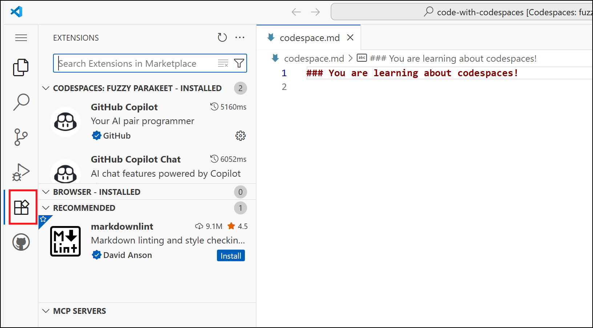

This will add a VS Code extension as well as open a file on start up of
the codespace.

Next lets add some code to run upon creation of the codespace!

### Task 5 : Execute code upon creation of the codespace

1.  Edit the .devcontainer/devcontainer.json file.

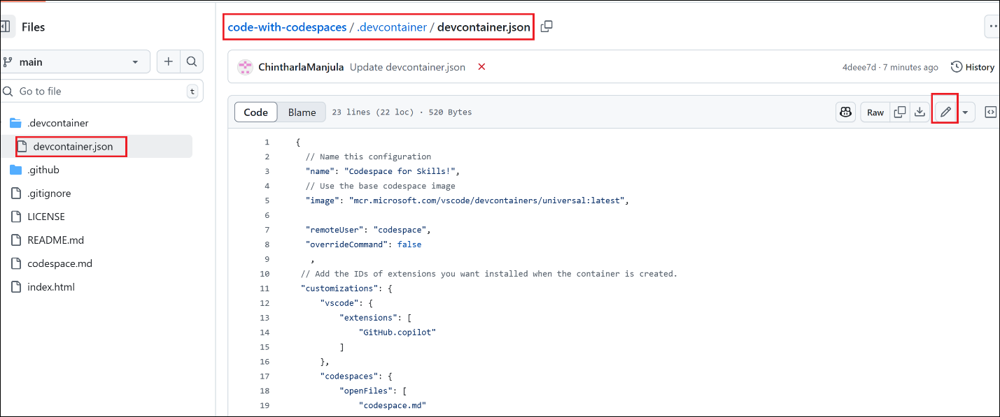

2.  Add the following postCreateCommand to the body of the file before
    the last }.

,

"postCreateCommand": "echo '# Writing code upon codespace creation!'
\>\> codespace.md"

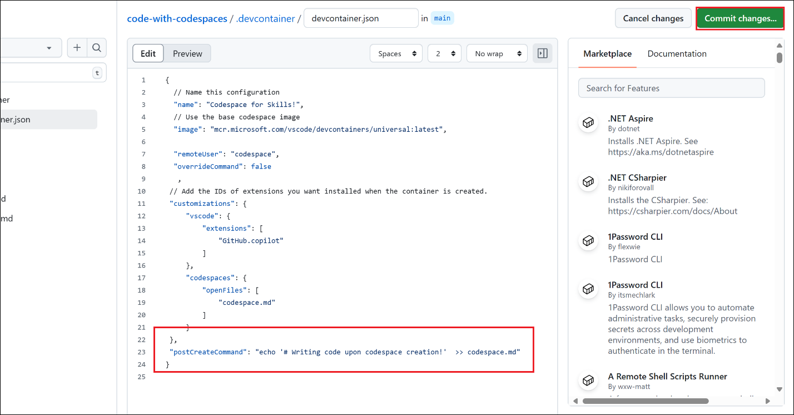

3.  Click **Commit changes** and then select **Commit changes directly
    to the main branch**.

4.  Create a new codespace by navigating to the landing page of your
    repository.

5.  Click the **Code** button located in the middle of the page.Click
    the **Codespaces** tab on the box that pops up.Click the 
    **codespace +** button.

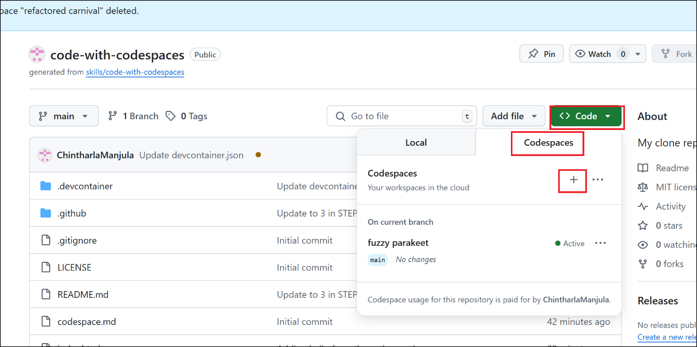

6.  Wait about **2 minutes** for the codespace to spin itself up.

7.  Verify your codespace is running, as you did previously.

8.  Verify the codespace.md file now has the text Writing code upon
    codespace creation!.

### Task 6: Personalize your codespace- Enable a dotfile for your codespace

When using any development environment, customizing the settings and
tools to your preferences and workflows is an important step. GitHub
Codespaces offers two main ways of personalizing your
codespace: Settings Sync with VS Code and dotfiles.

Dotfiles will be the focus of this activity.

**What are dotfiles?** Dotfiles are files and folders on Unix-like
systems starting with . that control the configuration of applications
and shells on your system. You can store and manage your dotfiles in a
repository on GitHub.

Let's see how this works!

1.  Start from the landing page of your repository.In the upper-right
    corner of any page, click your profile photo, and then
    click **Settings**.

> 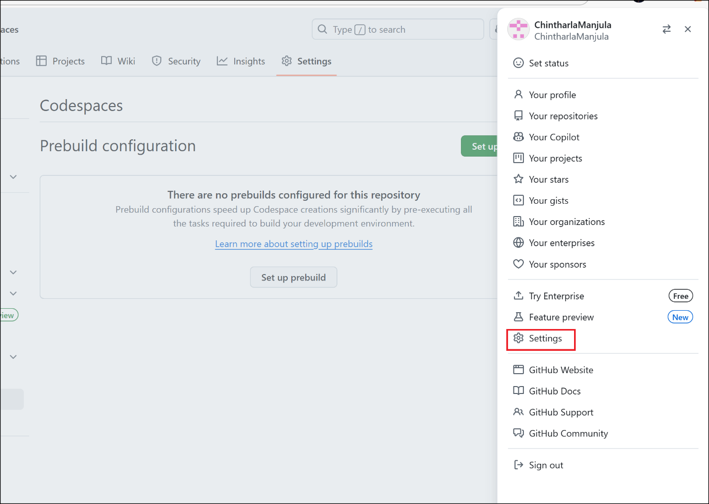

2.  In the **Code, planning, and automation** section of the sidebar,
    click **Codespaces**.

3.  Under **Dotfiles**, select **Automatically install dotfiles** so
    that GitHub Codespaces automatically installs your dotfiles into
    every new codespace you create.

> 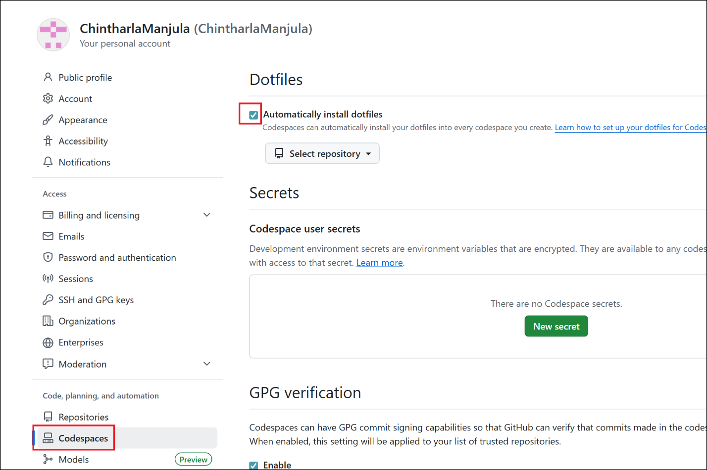

4.  Click **Select repository** and then choose your current skills
    working repository as the repository from which to install dotfiles.

> 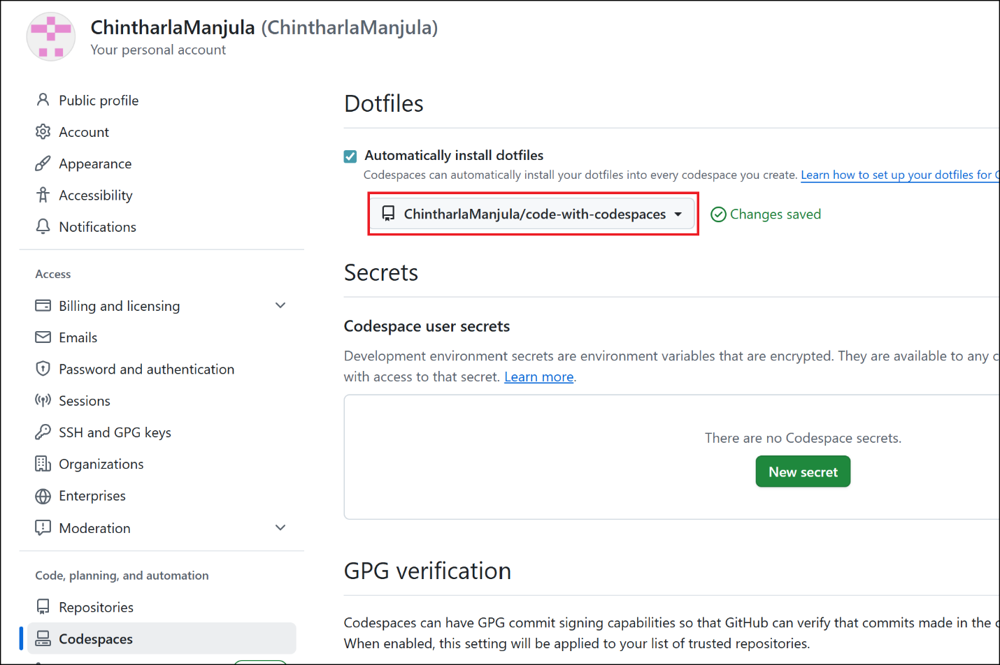

### Task 7 : Add a dotfile to your repository and run your codespace

1.  Start from the landing page of your repository.Click
    the **Code** button located in the middle of the page.

2.  Click the **Codespaces** tab on the box that pops up.Click the on
    **codespace +**

> 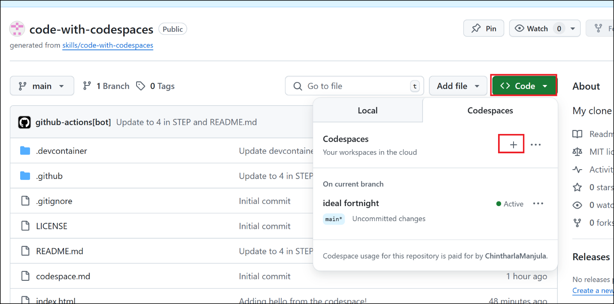

3.  Wait about **2 minutes** for the codespace to spin itself up.

4.  Verify your codespace is running. The browser should contain a VS
    Code web-based editor and a terminal should be present such as the
    below:

5.  From inside the codespace in the VS Code explorer window, create a
    new file **setup.sh**.

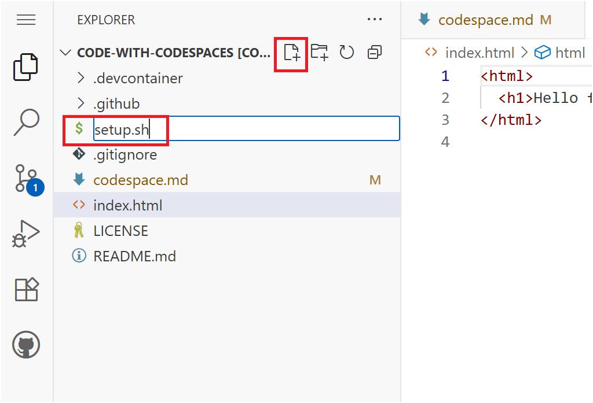

6.  Enter the following code into the file. Save the file.

> \#!/bin/bash
>
> sudo apt-get update
>
> sudo apt-get install sl
>
> echo "export PATH=\\PATH:/usr/games" \>\> ~/.bashrc

**Note**: The file should autosave.

7.  Commit the file changes. From the VS Code terminal enter:

> git add setup.sh --chmod=+x

git commit -m "Adding setup.sh from the codespace!"

8.  Push the changes back to your repository. From the VS Code terminal,
    enter:

git push

9.  Switch back to the homepage of your repository and view
    the setup.sh to verify the new code was pushed to your repository.

10. Close the codespace web browser tab.

### Summary :

*Congratulations friend, you've completed this course!*

Here's a recap of all the tasks you've accomplished in your repository:

- You learned how to create a codespace and push code to your repository
  from the codespace.

- You learned how to use custom images in your codespace.

- You learned how to customize your codespace.

- You learned how to personalize your codespace.
