# Lab 3 – Monitoring GitHub Repository Activity and Security Using Audit Logs & Insights

## Objective

Learn how to monitor and secure your GitHub Enterprise Cloud (GEC)
environment by:

Accessing audit logs

Analyzing repository insights

Enabling security scanning tools

### Pre-requisites

Before starting, ensure:

- Lab 1 (GEI Migration) completed

- Lab 2 (Repo config + permissions) completed

- You have **Admin access** to your GEC Org

- GitHub CLI (gh) is installed & authenticated

## Task 1: View Organization Audit Logs using GitHub CLI

1.  Run below command to check audits in your organization (eg : gh api
    orgs/devopstogtihub/audit-log)

    +++gh api orgs/$GEC_ORG/audit-log+++

    

2.  You can use this link to check logs in browser eg-
    [https://github.com/organizations/\<YOURGIHUBT_GEC_ORG\>/settings/audit-log](https://github.com/organizations/%3cYOURGIHUBT_GEC_ORG%3e/settings/audit-log)

    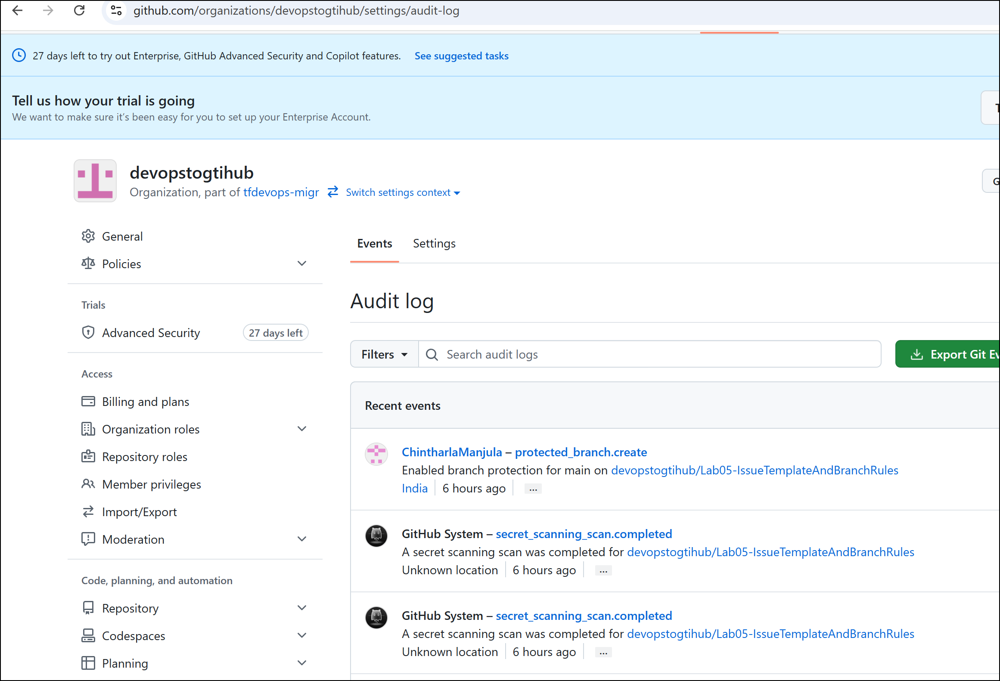

## Task 2: Filter Audit Log for Specific Events

1.  Identify changes like repo creation, collaborator additions, branch
    rule edits with filters.

2.  Run below command to refresh Auth for Enterprise Audit Access. Enter
    y to start authorization and copy the code and then press enter

    +++gh auth refresh -h github.com -s admin:enterprise+++

    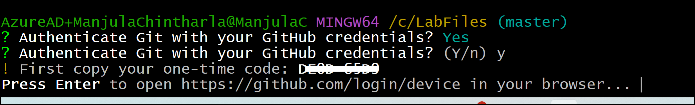

3.  Enter the generated code and click on **Continue**

    

4.  Click on **Authorize github** button

    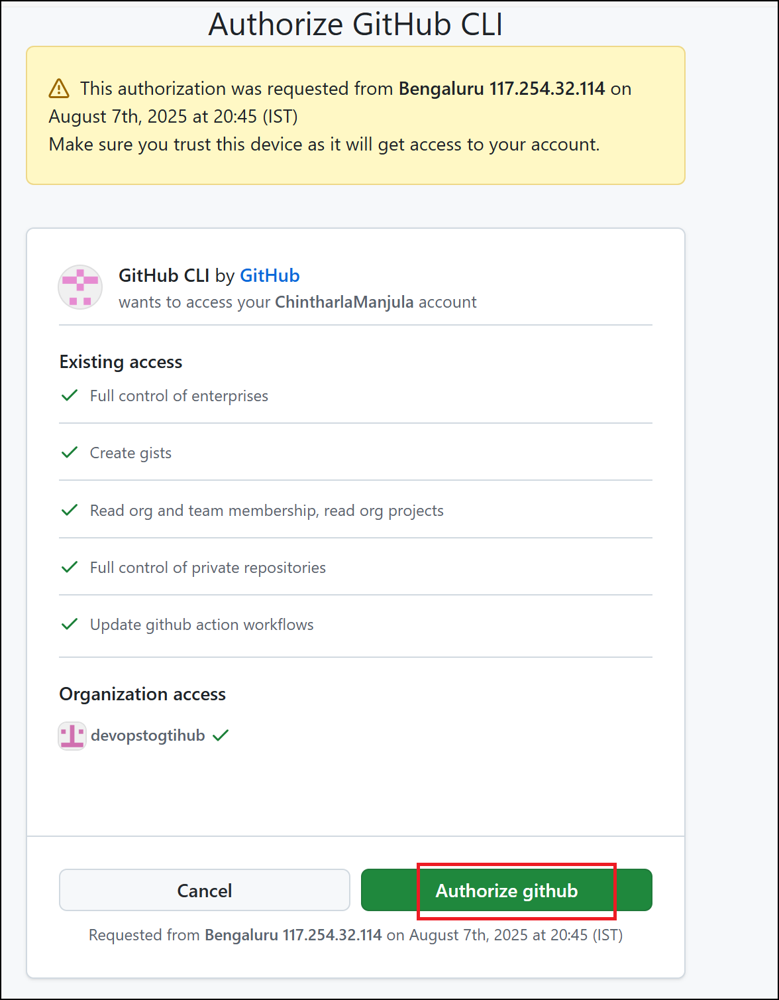

    

5.  Switch back to GitBash and you should see Authentication complete
    message.

    

6.  Repalce “**YOUR-ENTERPRISE-account** “ with your GEC account name
    and run below command to check view Enterprise-Wide Audit Log

    +++gh api enterprises/YOUR-ENTERPRISE-account/audit-log+++

    

7.  Replace YOUR-ENTERPRISE-ACCOUNT with your enterprise account name
    and run command using filter ( to get account name -Github Account-
    \> Profile-\> Your enterprises )

    +++gh api enterprises/YOUR-ENTERPRISE-ACCOUNT/audit-log --jq '.\[\] | select(.action=="repo.create")'+++

    

## Task 3: Enable GitHub Security & Code Scanning

1.  Switch back to GitHub Enterprise account.

    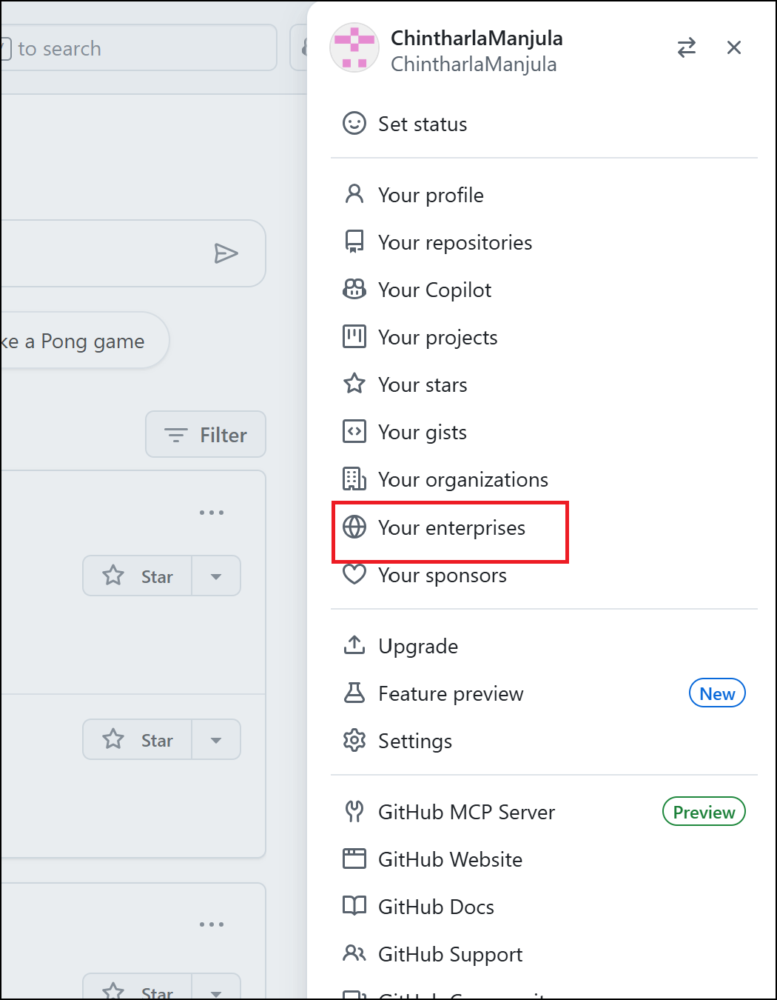

2.  Click on your Enterprise account name

    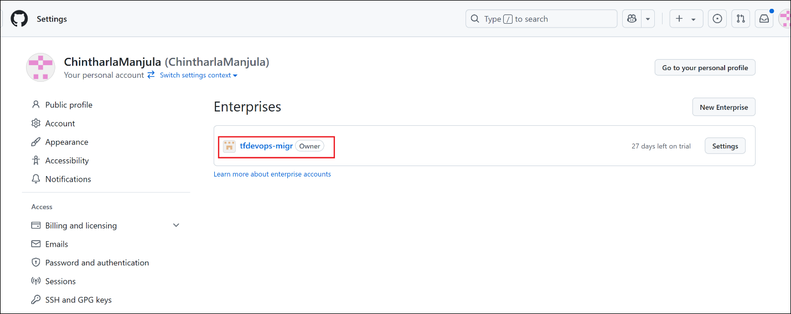

3.  Navigate to **Settings → Advanced Security → New configuration**

    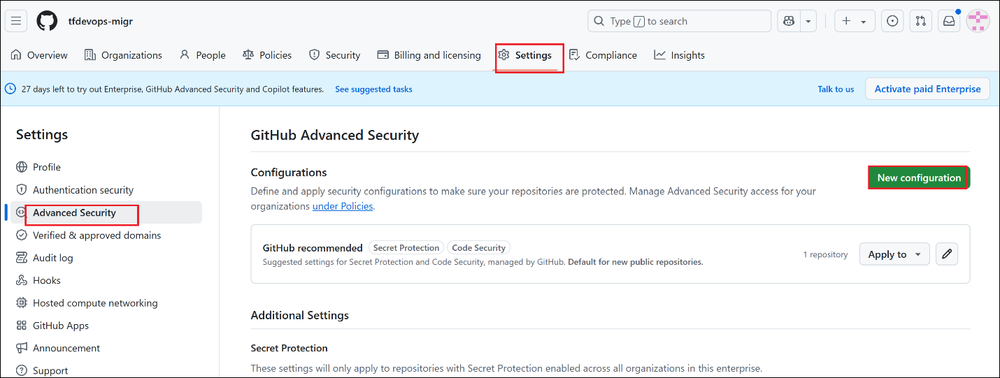

4.  Enter configuration name as – +++**GECsecurity+++,** description and
    enable below

    - **Dependabot Alerts**

    - **Secret Scanning**

    - **Code Scanning** (Set up default workflow)

    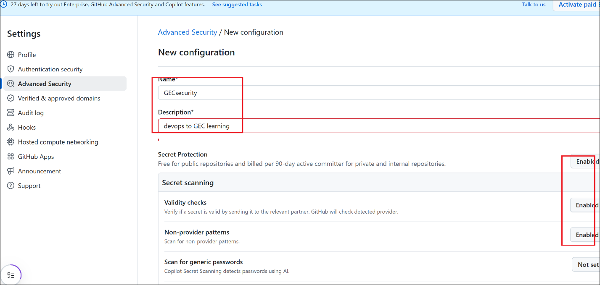

    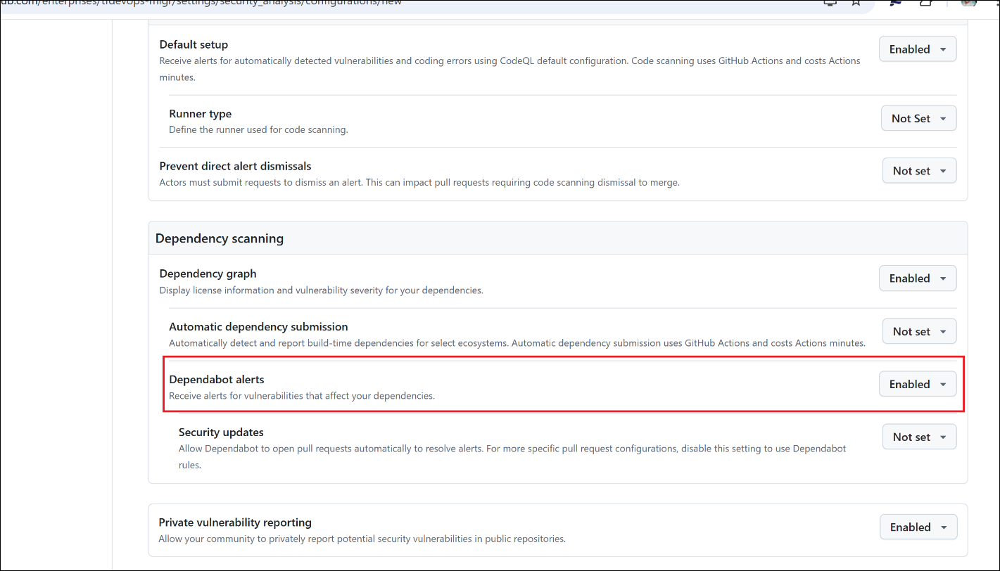

    

3.  After enabled security alerts then click on **Save configuration**.

    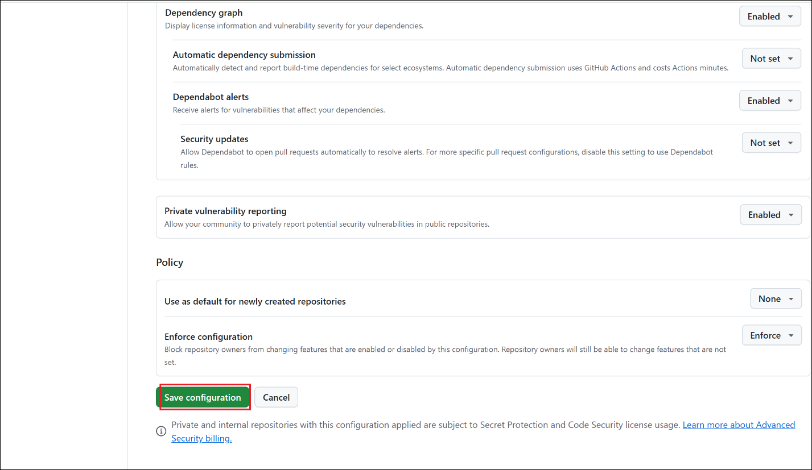

    

## Task 4: Analyze Repository Insights

1.  Click on **Organization** tab and then click on your organization
    name

    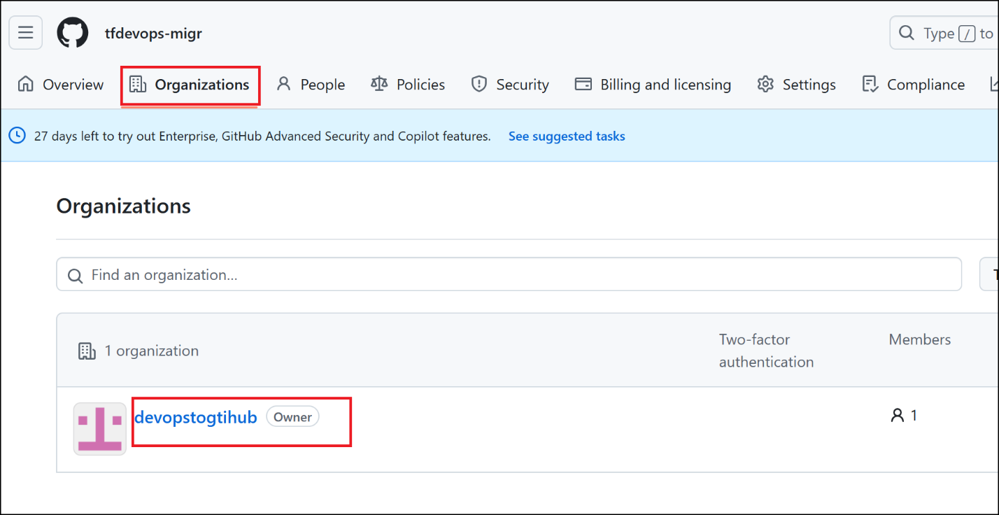

2.  Click on **Repositories** tab and then click on migrated repo

    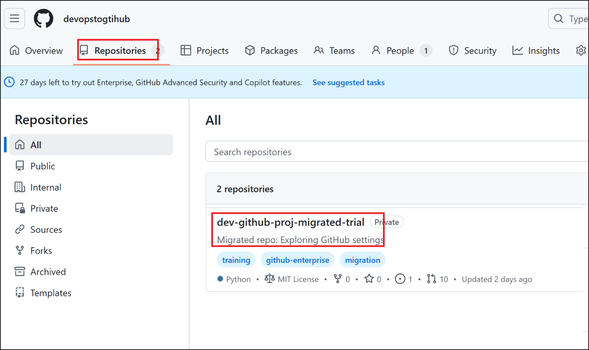

3.  Click on **Insights** tab

    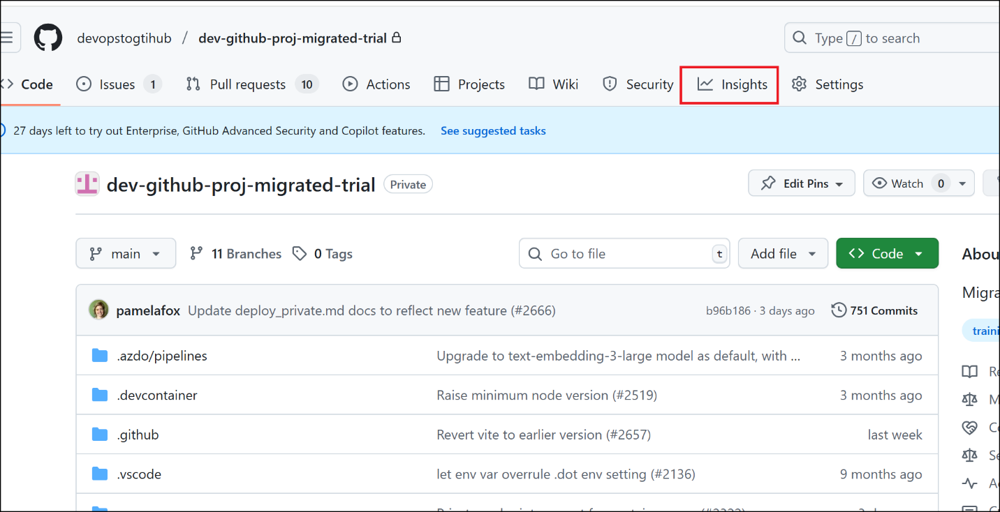

4.  Explore:

    - **Traffic**: Views, Clones, Referrers

    - **Contributors**: Team contributions over time

    - **Dependency Graph**: Libraries in use

    - **Security Alerts**: Detected by scanners

    - **Community Standards**: Checklist for README, License, etc.

    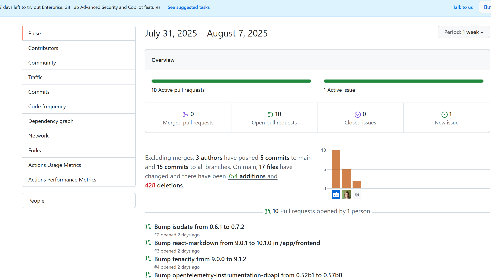

## Summary

By completing this lab, you:

- Accessed and filtered **Org/Enterprise audit logs**

- Enabled **Security tools** like **Dependabot**, **Secret Scanning**,
  and **Code Scanning**

- Explored **Insights** to evaluate contributor activity and repository
  health

- Strengthened your GitHub observability, transparency, and compliance
  skills

