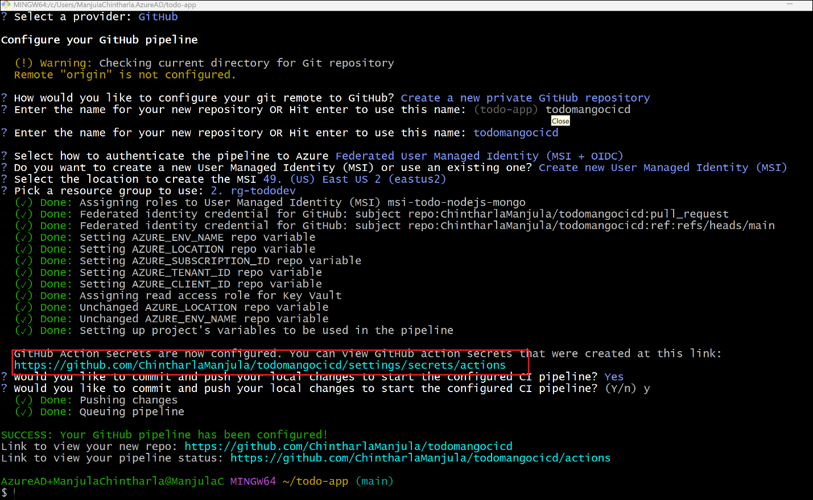

# Lab 04 - Create a GitHub Actions CI-CD pipeline using the Azure Developer CLI

To set up a fully functional CI/CD pipeline using GitHub Actions and the
Azure Developer CLI (azd) with a ready-to-use application template. This
hands-on exercise helps students understand how to automate deployment
workflows for cloud-native applications on Azure

A blueprint for getting a React web app with a Node.js API and a MongoDB
database running on Azure. The blueprint includes sample application
code (a ToDo web app) which can be removed and replaced with your own
application code. Add your own source code and leverage the
Infrastructure as Code assets (written in Bicep) to get up and running
quickly.

Let's jump in and get this up and running in Azure. When you are
finished, you will have a fully functional web app deployed to the
cloud. In later steps, you'll see how to setup a pipeline and monitor
the application.

**Prerequisites**

- Azure Developer CLI installed (azd)

- GitHub account

- Azure subscription

- Git installed and configured

- Node.js with npm (18.17.1+) 

------------------------------------------------------------------------

### Task 1 : Initialize the Template and Authenticate with Azure

1.  Open **Gitbash** from Dekstop and run below commands to create
    directory

> mkdir todo-app
>
> cd todo-app

2.  Run below command to initialize the **todo-nodejs-mongo.** Follow
    next steps when prompts for inputs

**azd init -t [technofocus-pte](https://github.com/technofocus-pte)/todonodejsmongodbAz**

3.  When prompted, enter a unique environment name (e.g., **todoenv**).
    This sets up the project with source code, infrastructure, and
    pipeline files

4.  This ensures you're logged in before provisioning resources. This
    opens a default tab to log into Azure. Sign in with your Azure
    subscription account

> azd auth login

### Task 2 : Provision Azure Resources

1.  Run below command to provision resource into Azure. It takes few
    minutes to provision resources. Select below values when prompted

    1.  **Select an Azure subscription to use** : select your Azure
        subscription

    2.  Enter a value for the 'location' infrastructure parameter:
        **Central US**

**azd provision**

- This deploys the infrastructure defined in the Bicep files (MongoDB,
  App Service, etc.)

### Step 3: Configure GitHub Actions Pipeline

1.  Run below command to configure a CI/CD pipeline (using GitHub
    Actions or Azure DevOps) to deploy your application whenever code is
    pushed to the main branch.

**azd pipeline config**

2.  Select below values

- Select a provider:**GitHub**

- **Select -** **Create a new private GitHub repository**

- Enter the name for your new repository OR Hit enter to use this name:
  (todo-app) **todomangocicd**

- Select how to authenticate the pipeline to Azure \[Use arrows to move,
  type to filter\]

> **Federated User Managed Identity (MSI + OIDC)**

- Federated Service Principal (SP + OIDC)

- Client Credentials (SP + Secret)

- Skip authentication setup (for manually configured pipelines or
  existing set up)

- **Do you want to create a new User Managed Identity (MSI) or use an
  existing** one? \[Use arrows to move, type to filter\]

> **Create new User Managed Identity (MSI)**

- Use existing User Managed Identity (MSI)

- Select the location to create the MSI :eastus2

- **Pick a resource group to use: \[Use arrows to move, type to
  filter\]**

- Create a new resource group-**rg-tododev**

- **Would you like to commit and push your local changes to start the
  configured CI pipeline? (Y/n) : yes**

- Choose **GitHub** as the provider

- Provide GitHub repo details (you can create a new repo or use an
  existing one)

- When prompted to commit and push changes, enter y

This sets up a .github/workflows/azure-dev.yml file with a CI/CD
pipeline using GitHub Actions.

------------------------------------------------------------------------

### Task 4: Verify the Pipeline and Test the Pipeline

1.  Click on the GitHub link generated in above task

> 
>
> 

2.  Click on Actions tab.You’ll see the workflow running and deploying
    your app to Azure

3.  Switch back to GitBash and run below command to delete all the Azure
    resources created with this template.Enter Y when prompted to delete

> azd down

**Summary:**

- Initialize a project using the todo-nodejs-mongo Azure Developer CLI
  template

- Authenticate with Azure and provision cloud resources

- Configure a GitHub Actions pipeline for automated deployment

- Make code changes and observe how the pipeline deploys updates to
  Azure

- Optionally integrate azd as a GitHub Action for enhanced automation

By the end of the guide, you will have a working CI/CD setup that
automatically provisions and deploys changes to Azure whenever code is
pushed to GitHub.
