# Lab 04 - Simulate Dry Run Migration of Multiple Repositories from ADO to GEC

## Objective

Learn how to **simulate the dry-run migration** of **multiple Azure
DevOps (ADO) repositories** into **GitHub Enterprise Cloud (GEC)** using
a **batch-driven scripting approach**. This lab leverages **GitHub
CLI**, **GitHub Enterprise Importer (GEI)**, and custom shell scripts to
validate the readiness of large-scale repo migrations before executing
actual transfers.

## Task 1 : : Create Local Repositories

1.  Switch back to GitBash and run below commands to create directory.

    +++cd **"C:\LabFiles"+++**

    +++mkdir Lab04-MultiRepo && cd Lab04-MultiRepo+++

    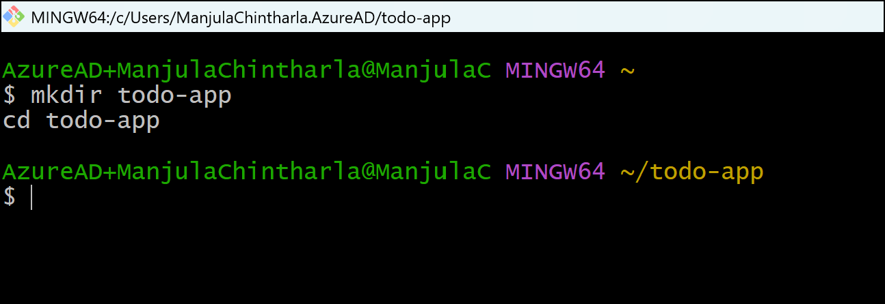

2.  Update below commands with your GitHub account name and email id and
    then run them.

    +++git config --global user.email "you@example.com"+++

    +++git config --global user.name "Your Name"+++

    

3.  Run below script to create repositories

    ```
    for repo in repo1 repo2 repo3
    do
      mkdir $repo && cd $repo
      git init
      echo "# $repo for migration" > README.md
      git add . && git commit -m "Initial commit for $repo"
      cd ..
    done
    ```

    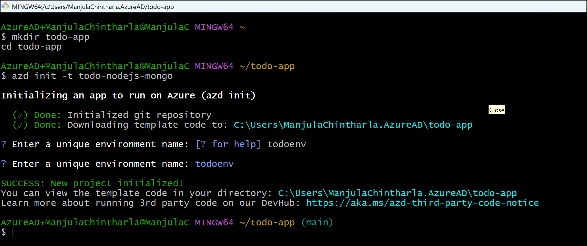

4.  Open GitBash from Desktop and run below command to navigate to the
    project repo and commit changes

    +++git init+++

    +++git add .+++

    +++git commit -m "Lab 04 multi repo migration lab"+++

    

    >Note : If not committing then run this rm -rf repo1/.git repo2/.git repo3/.git and re-run above inti,add and commit commands

5.  Switch back to GitBash and run below command to sign into Azure.
    Sign in with your Azure subscription account.

    +++az login+++

    - Username: +++@lab.CloudPortalCredential(User1).Username+++

    - Access Token: +++@lab.CloudPortalCredential(User1).AccessToken+++

    

    

    

6.  Select your subscirption.Enter 1 to select your subsdcirption.

    

    

## Task 2 : Create Repos in Azure DevOps

1.  Go to back to Azure DevOps browser tab and select your existing
    DevOps project under Azure DevOps Organization.

    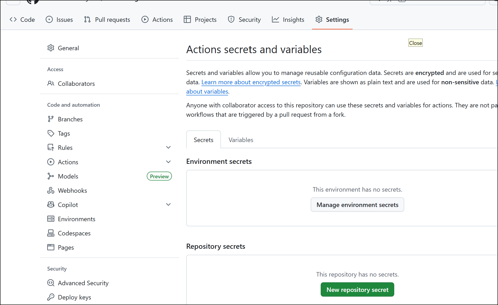

2.  Hover on **Repo** from the left navigation menu and select **File**.

    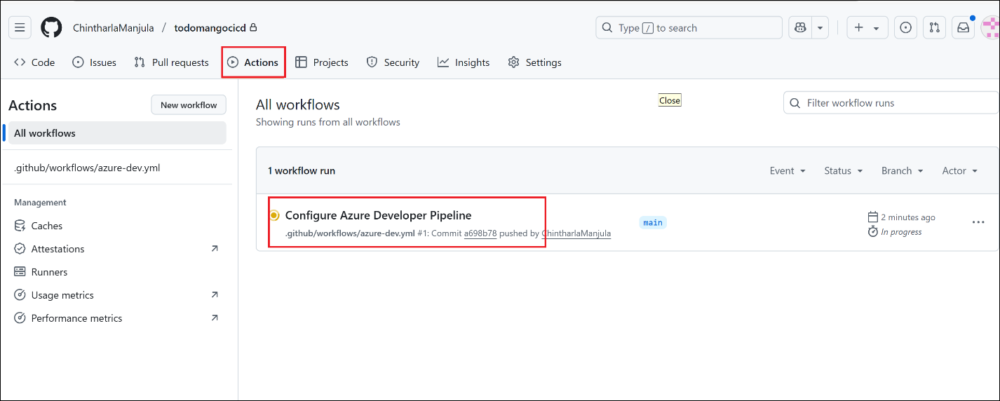

3.  Click the repo dropdown from top navigation menu and select **New
    Repository**

    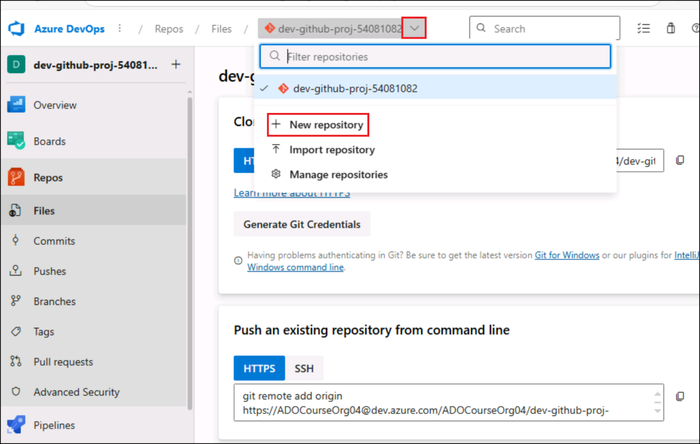

4.  Create the following repositories (leave default settings): **Do NOT
    add README/gitignore** here, as your local repos already have those.

    - +++repo1+++

    - +++repo2+++

    - +++repo3+++

    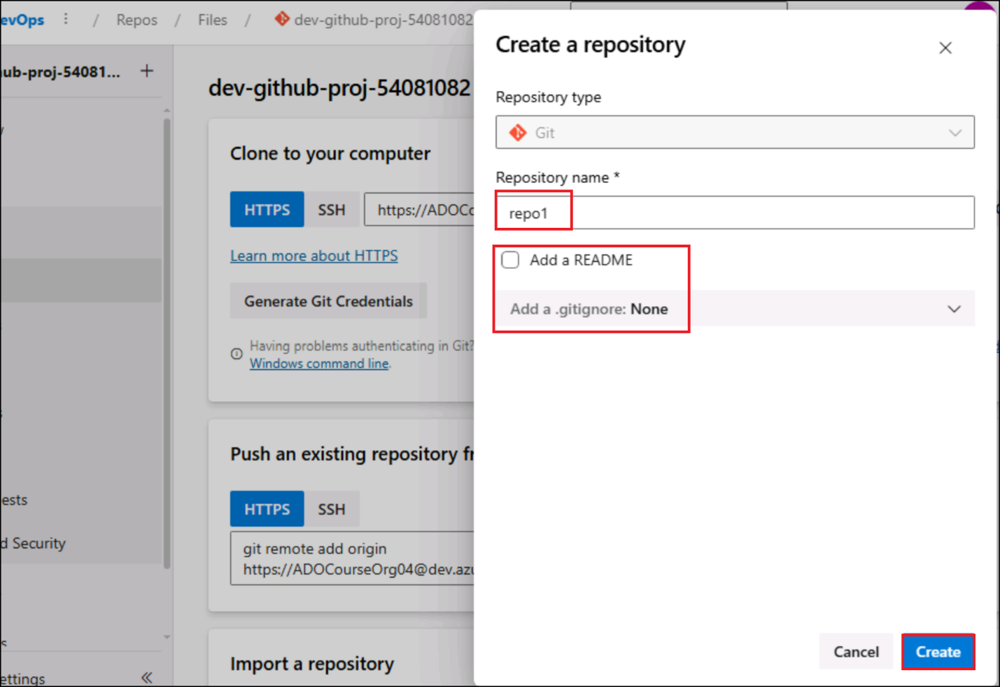

    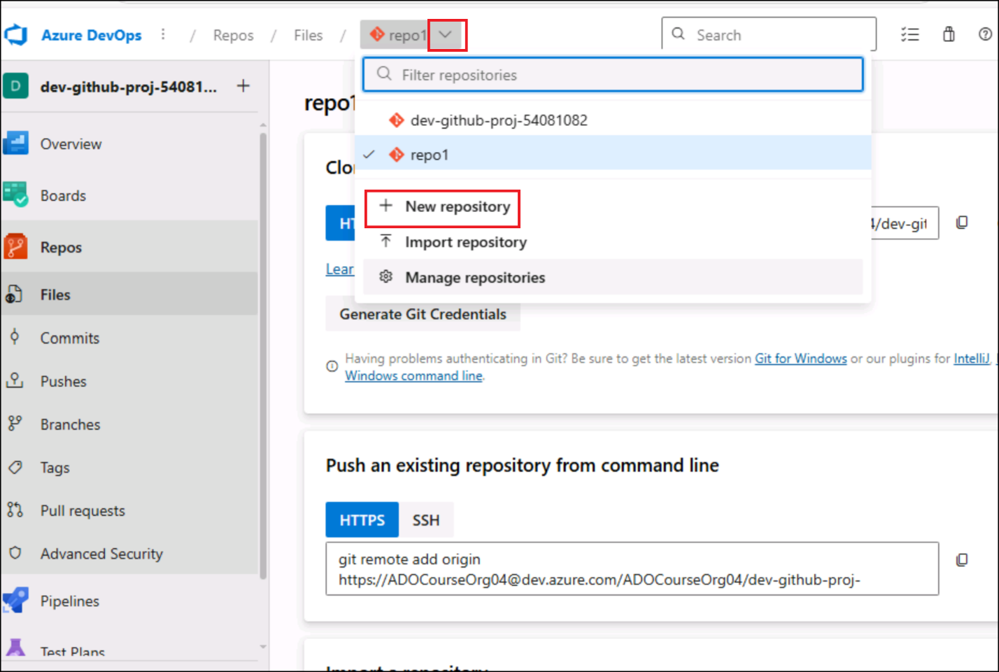

    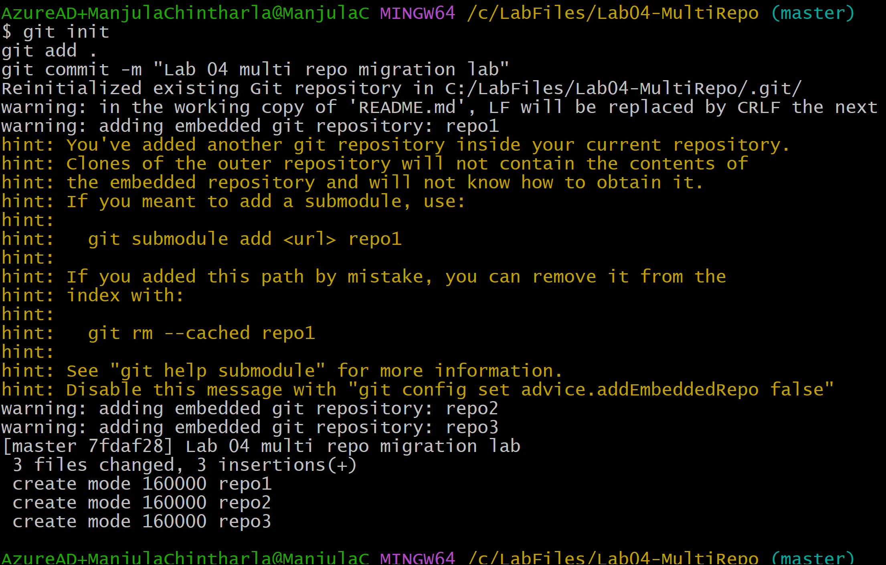

    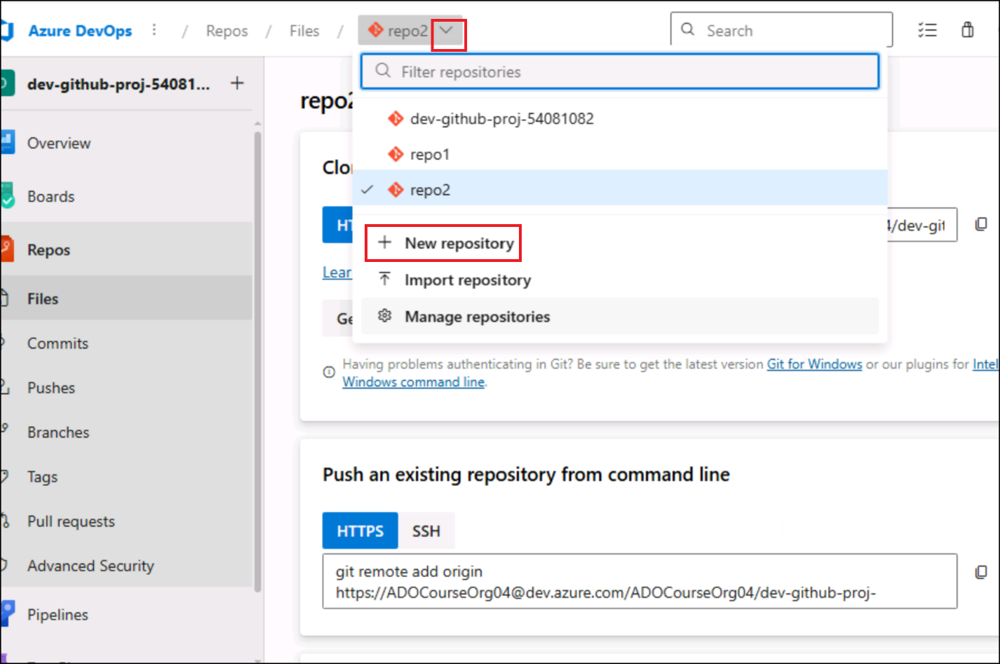

    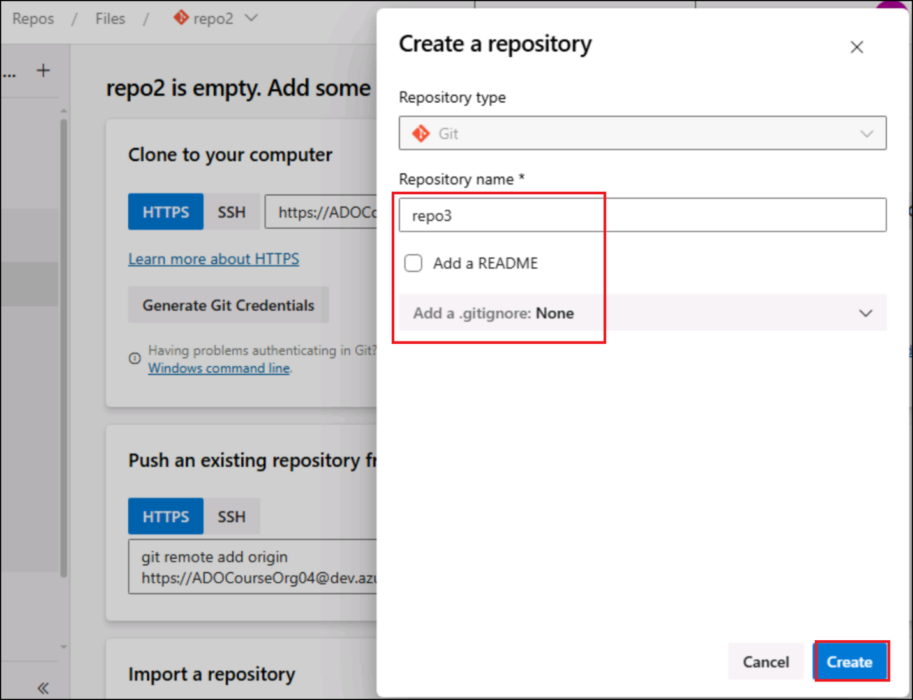

## Task 3 : Push local repos to ADO repos

1.  Switch back to GitBash. Run the commands . sign in with your
    assigned DevOps account when prompted

    +++cd repo1+++

    +++git remote add origin https://dev.azure.com/$ADO_ORG/$ADO_PROJECT/_git/repo1+++

    +++git commit -m "Initial commit for migration lab"+++

    +++cd ..+++

    

    

    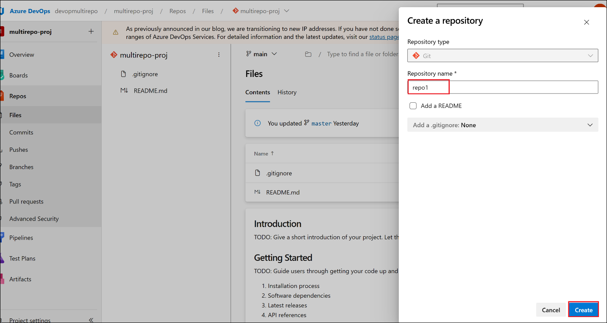

2.  Replace \<**DEVOPS_ORG**\> with your DevOps org name
    (ADOCourseOrg04) with \< **DEV_PROJECT**\> with your project name
    and run the commands . sign in with your assigned DevOps account
    when prompted

    +++cd repo2+++

    +++git remote add origin https://dev.azure.com/$ADO_ORG/$ADO_PROJECT/\_git/repo2+++

    +++git push -u origin –all+++

    +++cd ..+++

    

3.  Replace \<**DEVOPS_ORG**\> with your DevOps org name
    (ADOCourseOrg04) with \< **DEV_PROJECT**\> with your project name
    and run the commands . sign in with your assigned DevOps account
    when prompted (URL
    https://ADOCourseOrg04@dev.azure.com/ADOCourseOrg04/dev-github-proj-54081082/\_git/repo2)

    +++cd repo3+++

    ++git remote add origin https://dev.azure.com/$ADO_ORG/$ADO_PROJECT/\_git/repo3+++

    +++git push -u origin –all+++

    +++cd ..+++

    

4.  Go back to Azure DevOps project and check **Repos-\> Files** .You
    should see your repo here .

    

    

## Task 4: Simulate Dry-Run Migration of Multiple Repositories using Scripted Batch Mode

1.  Update below commands with your ADO’s PAT and GitHub’s PAT and run

    +++export AZURE_DEVOPS_PAT=your_ado_pat_here+++

    +++export GH_PAT=your_github_pat_here+++

    

2.  Run below command to create csv file and the below repo data and
    then save the file. This CSV acts as the migration map to control
    which ADO repos go to which GitHub repos.

    +++vi repo-dryrun-map.csv+++

    

3.  Add below data to the file and save the file ( replace
    ado_org,ado_project,ado_repo,github_org,github_repo with your
    values) (Esc +wq and press enter)

    ```
    ado_org,ado_project,ado_repo,github_org,github_repo
    https://dev.azure.com/<DEVOPS_ORG>,MDEVOPS_PROJ>,repo1,<GITHUB_ORG>,repo1-migrated
    https://dev.azure.com/<DEVOPS_ORG>,MDEVOPS_PROJ>,repo2,<GITHUB_ORG>,repo2-migrated
    https://dev.azure.com/<DEVOPS_ORG>,MDEVOPS_PROJ>,repo3,<GITHUB_ORG>,repo3-migrated
    ```
    
    

    

4.  Create another file with the name **dryrun-multi.sh** . Each
    migration will be queued in dry-run mode

    +++vi dryrun-multi.sh+++

    

5.  Add the code below to it and save the file (Esc +wq and press enter)

    ```
    #!/bin/bash
    echo " Starting Dry Run Migration for Multiple Repos"
    # Skip header
    tail -n +2 repo-dryrun-map.csv | while IFS=',' read -r ado_org ado_project ado_repo github_org github_repo
    do
      # Skip empty lines
      if [[ -z "$ado_repo" || -z "$github_repo" ]]; then
        continue
      fi
      echo "Migrating $ado_repo ➜ $github_repo"
      gh ado2gh migrate-repo \
        --ado-org "$ado_org" \
        --ado-team-project "$ado_project" \
        --ado-repo "$ado_repo" \
        --github-org "$github_org" \
        --github-repo "$github_repo" \
        --ado-pat "$AZURE_DEVOPS_PAT" \
        --github-pat "$GH_PAT" \
        --queue-only
      echo "Dry Run Queued for $ado_repo"
      echo "--------------------------------------"
    done
    ```


    

6.  Run below commands to allow script to run

    +++chmod +x dryrun-multi.sh+++

    +++./dryrun-multi.sh+++

    

    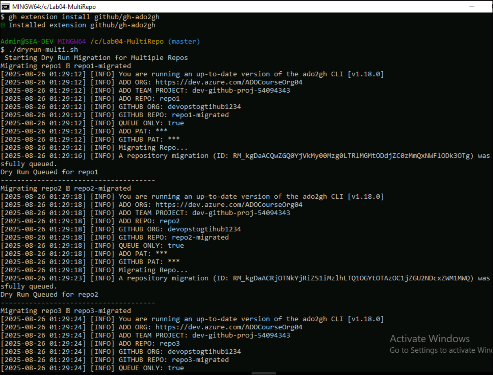

    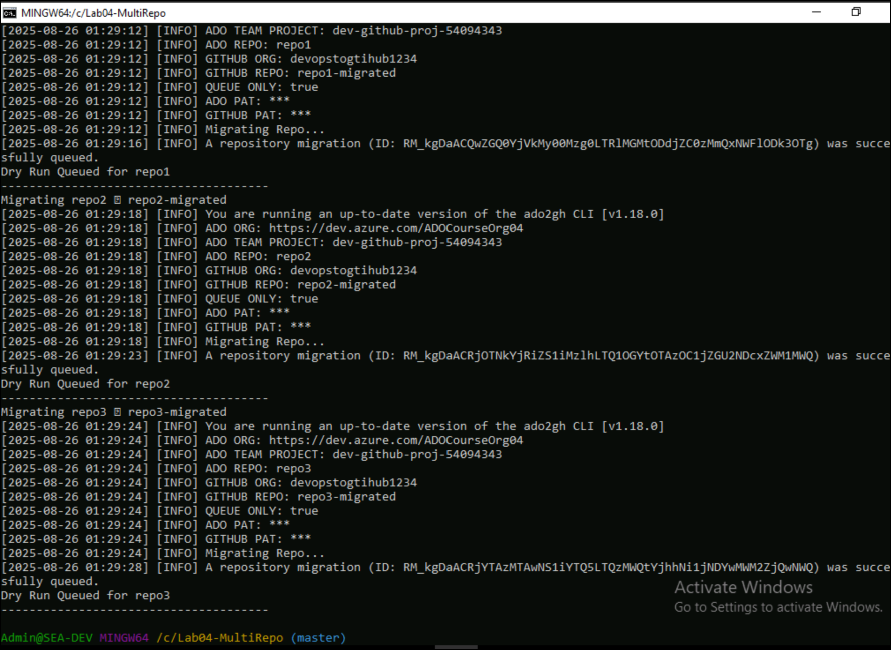

### Summary: 

In this lab, you learnt:

1.  **Generate a Personal Access Token (PAT)** in Azure DevOps with full
    scope access for authentication.

2.  **Create and initialize local repositories** (repo1, repo2, repo3)
    to simulate real project repos.

3.  **Push these repositories to Azure DevOps**, creating matching
    remote repositories in your ADO project.

4.  **Build a mapping CSV file** to define the migration path from ADO
    repos to GitHub Enterprise Cloud target repos.

5.  **Write and execute a shell script** (dryrun-multi.sh) that reads
    from the CSV and runs **dry-run migrations** for each repo using the
    gh ado2gh migrate-repo command in batch mode with --queue-only flag.

6.  **Validate that each migration has been queued**, and optionally
    monitor results via gh ado2gh wait-for-migration and logs.


