# Lab 06 - Migrate Azure DevOps Repositories and Deploy via Azure Pipelines using GitHub Enterprise Cloud

### Objective : 

In this lab, you will take on the role of a developer working on an
application in Azure DevOps who has been asked to move to GitHub
Enterprise Cloud while maintaining the CI/CD setup.

You will:

1.  Migrate the repository from Azure DevOps to GEC using the **gh
    ado2gh** migration tool.

2.  Create a service connection in Azure DevOps to the migrated GEC
    repository.

3.  Configure an Azure Pipeline that builds and deploys the application
    from the release-pipeline branch in GEC to Azure App Service.

4.  Push changes from your local repository to GEC to trigger the
    pipeline.

This lab uses a **realistic developer workflow** — you will be working
in a development branch (release-pipeline) and testing the build/deploy
process before merging into main.

### Important Note on PR Workflow

In a **real enterprise workflow**:

- Developers make changes in a feature or development branch.

- They commit and push changes to that branch in the remote repository
  (GEC).

- A **Pull Request (PR)** is created targeting the main branch.

- The PR undergoes review and must be approved before merging.

In this lab, we will **not** merge into main automatically.  
Instead, we will stop after confirming that our changes in
release-pipeline successfully build and deploy.  
You will practice the **PR review and approval process** in **Lab 8**,
where we simulate a fully automated and approved merge-to-main workflow.

## Exercise 1 - Set up your environment

In this lab, we are integrating a DevOps strategy into the processes. In
this section, you make sure that your environment reflects the team's
efforts so far.

To do this, you:

- Add a user to ensure Azure DevOps can connect to your Azure
  subscription.

- Set up an Azure DevOps project for this module.

- Add the build pipeline.

### Task 1 – Install and Authenticate GitHub CLI

1.  Open Powershell as administrator from tool bar and run below command
    to install GitHub Cli

winget install --id GitHub.cli

2.  Close the PowerShell window.

3.  By default, GitHub CLI is installed in below location. Add GitHub
    CLI to system PATH

> C:\Program Files\GitHub CLI

4.  Press **Win + S** and search for **Environment Variables** and
    select **Edit the system environment variables**

5.  In the **System Properties** window, click **Environment
    Variables**.

6.  Under **System variables**, find and select **Path**, then
    click **Edit**.

7.  Click **New** and **add** GitHub CLI path and then click
    **OK-\>OK-\>OK**.

> C:\Program Files\GitHub CLI
>
> 

8.  Restart the PowerShell and run below command login.(Use your
    personal GitHub account used for day1 labs )

gh --version

gh auth login

9.  Follow the interactive prompts:

    1.  Choose **GitHub.com**

    2.  Select **HTTPS**

    3.  Authenticate via browser

10. Click on **Authorize github** button.

11. Switch back to PowerShell window.

12. After login, confirm by running:

gh auth status

13. Verify GEC Org Admin Permissions. If you can list org repos, you’re
    properly authenticated and ready.Replace ORG-NAME with your
    organization name and then run it.

> gh repo list ORG-NAME

### Task 2 – Install the GEI (GitHub Enterprise Importer) Extension

1.  Run below command to install GitHub Enterprise importer extension.

gh extension install github/gh-gei

2.  Confirm installation:

> gh gei -h

3.  Verify installation:

gh gei --help

### Task 3 : Create an Azure DevOps personal access token

1.  Create an Azure DevOps personal access token (PAT). Open a new tab
    in your browser and navigate to - <https://portal.azure.com/> and
    sign in with assigned account.

2.  **Cancel** the Welcome window.

3.  Search for **Azure DevOps** and select **Azure DevOps
    organizations**.

4.  Click on **My Azure DevOps Organization** hyper link.

5.  Keep the default values and then click on **Continue** button.

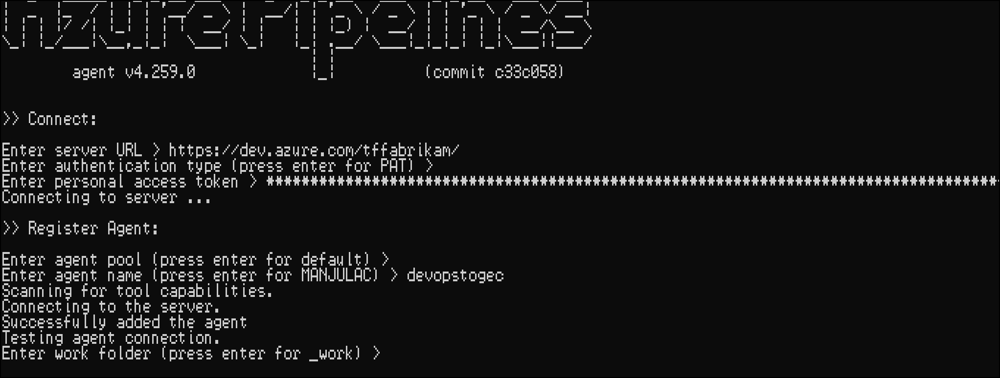

6.  Click on the existing organization link as shown in below image.

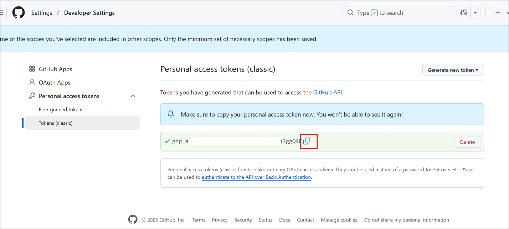

7.  In the top right corner of the screen, click **User settings**.
    Click **Personal access tokens**.

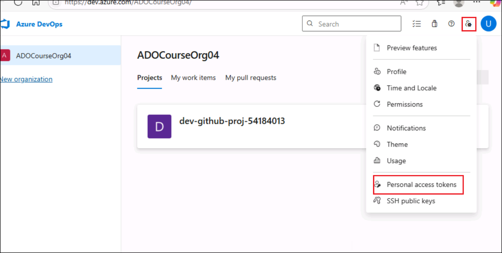

8.  Select **+ New Token**

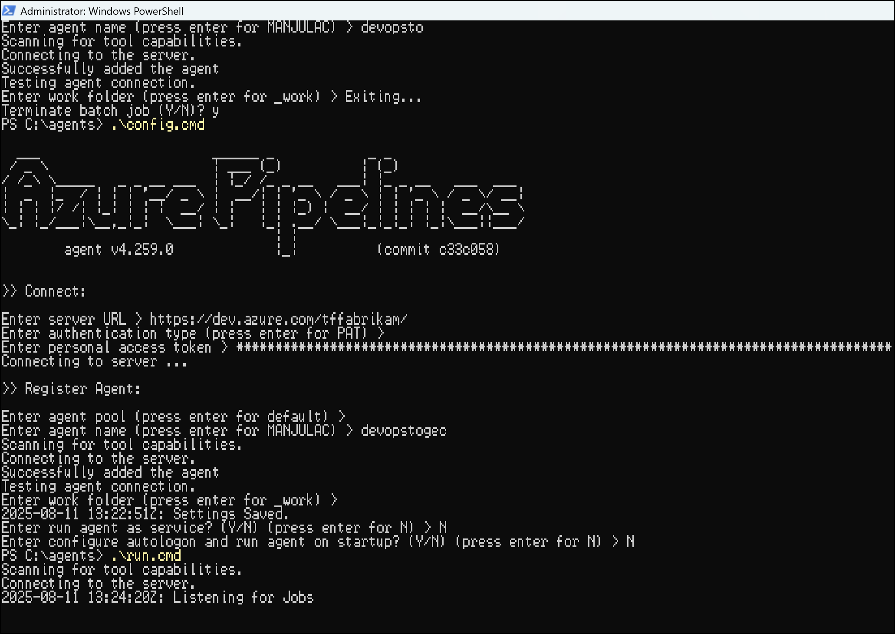

9.  Enter the name as : **devopstoken** and select Full access scope and
    then click on **Create**

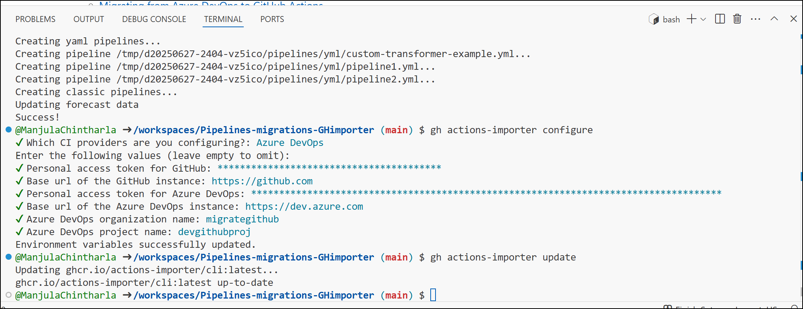

10. Copy the generated API token and save it in a safe location. For
    your security, it won't be shown again.

### Task 4 : Create Repos in ADO

1.  Switch back to DevOps Organization page and click on the existing
    project.

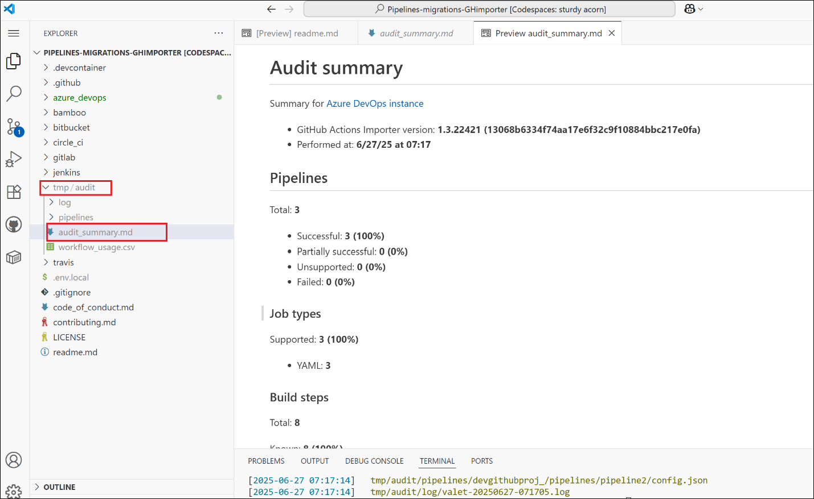

2.  Hover on **Repos** from left navigation menu and select **Files**.

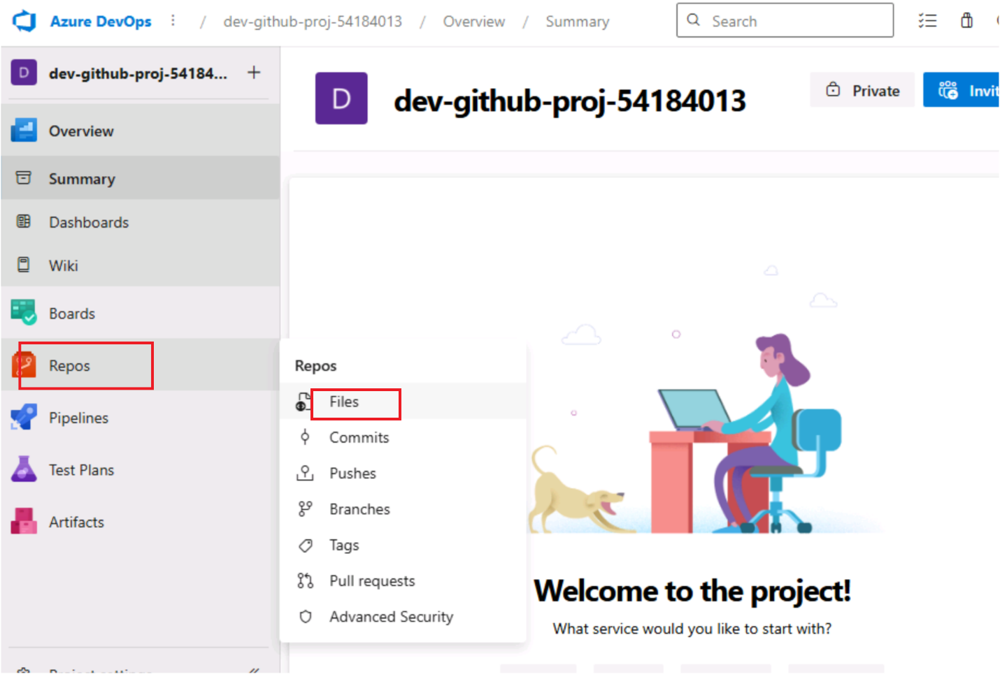

3.  Click on the project drop down form top navigation menu and select
    **New repository**.

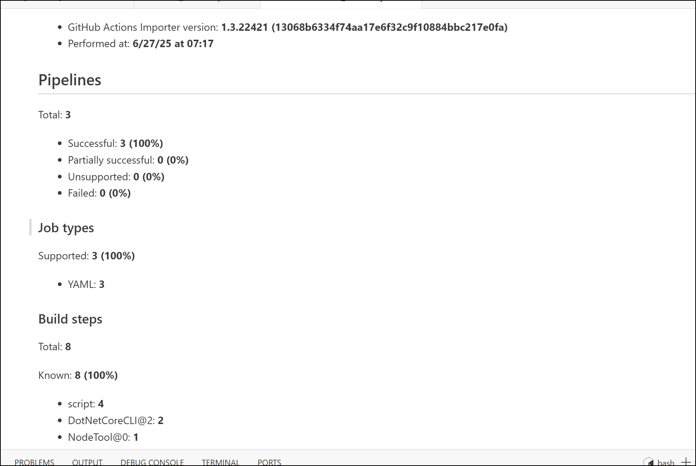

4.  Enter the Repository name as **tailspin-spacegame-web-deploy**.
    Unselect “Add a README” checkbox and then click on **Create**.

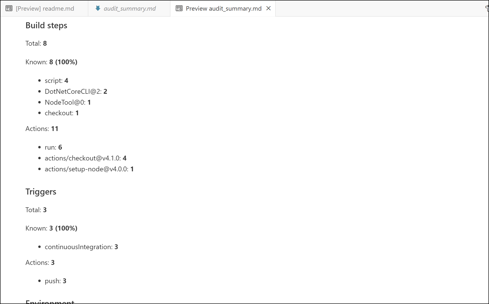

5.  Copy the HTTPS url to use in next exercise 2

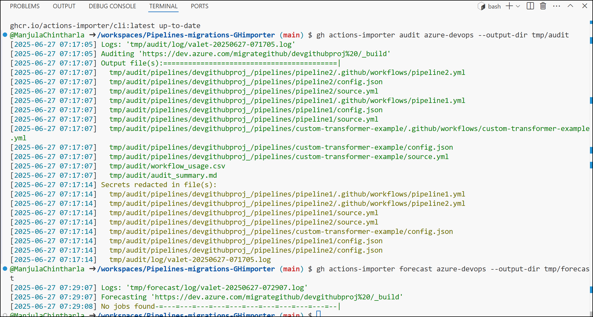

### Task 4 : Create GitHub personal access token

6.  Open GitHub in new browser tab and sign in with your GitHub account.

7.  Click on profile from right top corner and select **Settings**.

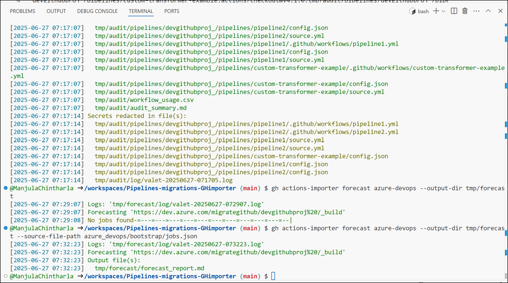

8.  Click on **Developer settings** from left navigation menu.

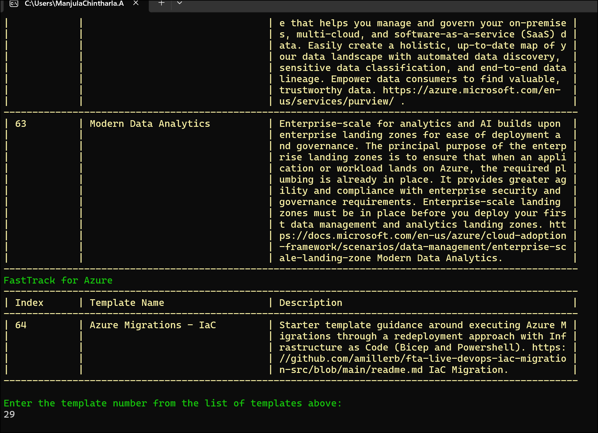

9.  Expand Persnal access tokens -\> Tokens(Classic). Click on Generate
    new token -\> Generate new token (classic)

> 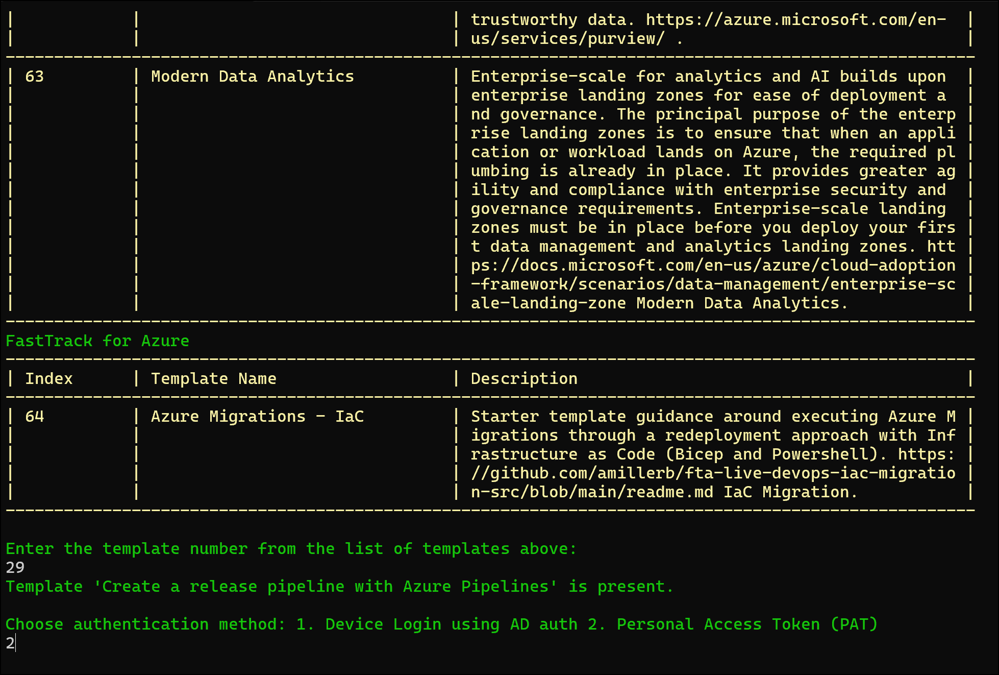

10. Enter Note as : **githubtoken** and select all the scope items.

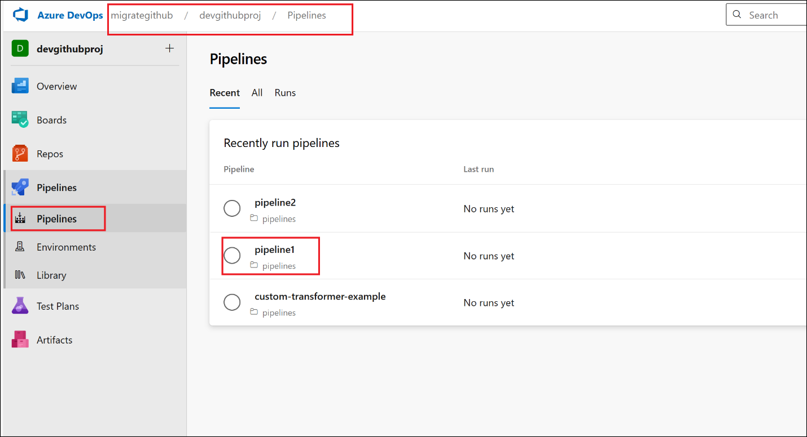

11. Click on **Generate token**

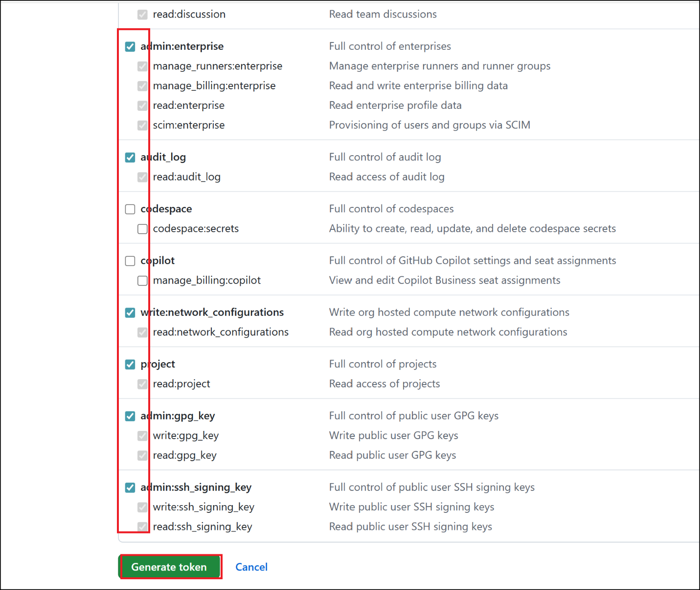

12. Copy and save the token in a note pad to use in upcoming tasks.

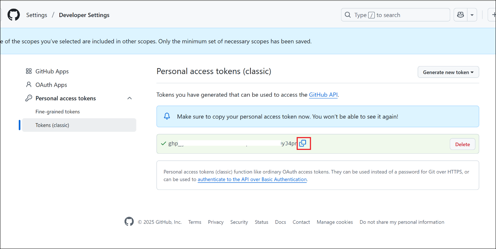

## Exercise 2 - Set up your Azure DevOps environment

In this section, you'll ensure that your Microsoft Azure DevOps
organization is set up to complete the rest of this module.

The modules in this learning path form a progression, in which you
follow the Tailspin web team through its DevOps journey.

### Task 1 : Fetch the branch from GitHub

1.  Open Visual Studio and click on **Open Folder**

2.  Go to **C:\Labfiles\Lab06** and select **the** folder

3.  Open bash in the Terminal and run below command to go the folder

cd mslearn-tailspin-spacegame-web-deploy

4.  A *remote* is a Git repository where team members collaborate (like
    a repository on GitHub). Here you list your remotes and add a remote
    that points to Microsoft's copy of the repository so that you can
    get the latest sample code.

5.  Run the following command to list your remotes:

git remote -v

6.  Origin specifies your repository on GitHub. When you fork code from
    another repository, the original remote (the one you forked from) is
    commonly named upstream.

7.  Run the following command to create a remote named *upstream* that
    points to the Microsoft repository:

> git remote add upstream
> https://github.com/MicrosoftDocs/mslearn-tailspin-spacegame-web-deploy.git
>
> git remote -v

8.  Run the following commands in new terminal to fetch
    the *release-pipeline* branch from the MicrosoftDocs repository, and
    check out a new branch *upstream/release-pipeline*.

> git fetch upstream release-pipeline
>
> git checkout -b release-pipeline upstream/release-pipeline

### Task 5 : Push Repo in Azure DevOps

1.  **Replace** you@example.com **with your GitHub account and Your Name
    to be replaced with your Github account username in the below
    commands and run them.**

**git config --global user.email "you@example.com"**

**git config --global user.name "Your Name"**

2.  **Run below commands to push the repo.**

git init

git add .

git commit -m "Initial commit for migration lab"

3.  **Switch back to GitBash and run below command to sign into Azure.
    Select Work or school account option and click on Continue.**

**az login**

4.  **Sign in with your cloud slice accounts.**

- Username: <+++@lab.CloudPortalCredential>(User1).Username+++

- Password: +++@lab.CloudPortalCredential(User1).Password+++

> 
>
> 

5.  **Click on Yes,all apps button and then click on Done.**

6.  **Select your subscription and then press enter.**

7.  **Run below command to push local folder to Azure Devops .(Replace**
    https://dev.azure.com/ADOCourseOrg04/dev-github-proj-53969426/\_git/azure-search-openai-migrated
    **with the https link you copied in previous step -Azure DevOps
    repos**

> git remote set-url origin \< Devops Repo Https url **\>**
>
> 

8.  **Run below command to push the repo to Devops . if it prompts to
    sign in ,sign in with your DevOps account.**

> git push -u origin --all

**Note : If you already have repo in Devops then follow steps to pull
and resolve conflict – 1. Pull from DevOps with unrelated history:**
**git pull origin main --allow-unrelated-histories Step 2 : Resolve
conflicts in files like .gitignore, README.md. Step 3 : Stage the
resolved files - git add .**

**git commit -m "Resolved merge conflicts"**

9.  **Go back to Azure Devops project and check Repos-\> Files .You
    should see your repo here .**

### Task 2 : Migrate Azure DevOps Repo to GitHub Enterprise Cloud

1.  Switch back to Visual Studio and run below commands to set
    environment varaibles. Make sure to update variables with your
    values and then run them.

export AZURE_DEVOPS_PAT="YOUR_AZDO_PAT"

export GH_PAT="ghp_xxxxxxxxxxxxxxxxxxxxx"

export ADO_ORG=" your-ado-org" \# eg - ADOCourseOrg04

export GEC_ORG="your-githubEC-org" \# e.g. devopstogtihub1234

export ADO_PROJECT="your-existing ADO_Projectname" \# eg
dev-github-proj-XXXXXXXX

2.  Run below commands to verify GitHub login status. If not logged in
    then run 2^(nd) command gh auth login and follow the process to
    loginto GitHub.

gh auth status

gh auth login

3.  Run below command to grant migrator role to your account.(replace
    your-github-username with your username)

gh gei grant-migrator-role --github-org $GEC_ORG --actor
\<your-github-username\> --actor-type USER

eg :gh gei grant-migrator-role --github-org devopstogtihub1234 --actor
chintharlamanjula --actor-type USER

4.  Run below command to install GitHub cli extensions

> gh extension install github/gh-ado2gh

5.  Run below dry-run command to migrate repos to GEC**  
    (Note: We have used repo -** **tailspin-spacegame-web-deploy . You
    can check this in your ADO-\>Org-\> Project-\> Repo )**

gh ado2gh migrate-repo --ado-org 
$ADO_ORG --ado-team-project $ADO_PROJECT --ado-repo tailspin-spacegame-web-deploy
--github-org $GEC_ORG
--github-repo lab06-migrate-repos --ado-pat $AZURE_DEVOPS_PAT --github-pat $GH_PAT --queue-only

1.  Copy repository migration and update below command with migration id
    and run.

gh ado2gh wait-for-migration --migration-id \<MIGRATION_ID\>
--github-pat $GH_PAT

2.  Switch back to Github GEC -\> organization and you should see repo

### Task 3 : Create a Service Connection in Azure DevOps to GitHub Enterprise Cloud

1.  Switch back to ADO browser page, In **Azure DevOps** ,select your
    project.

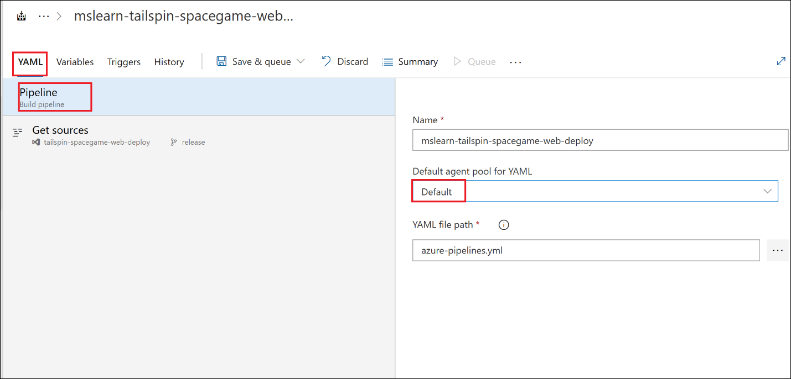

2.  Click on **Project Settings**

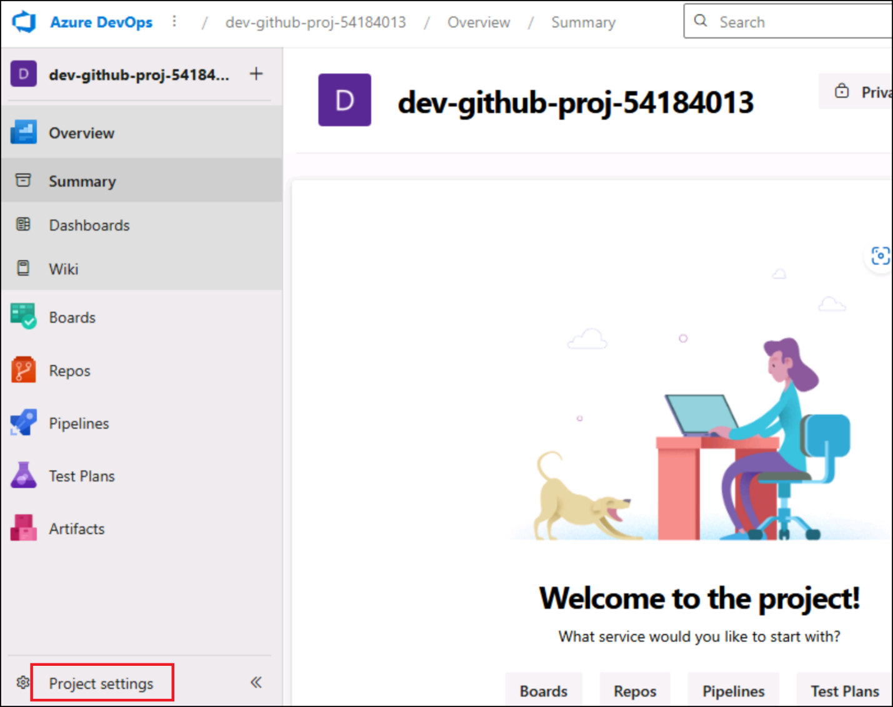

3.  Click **Service connections -\> Create service connection.**

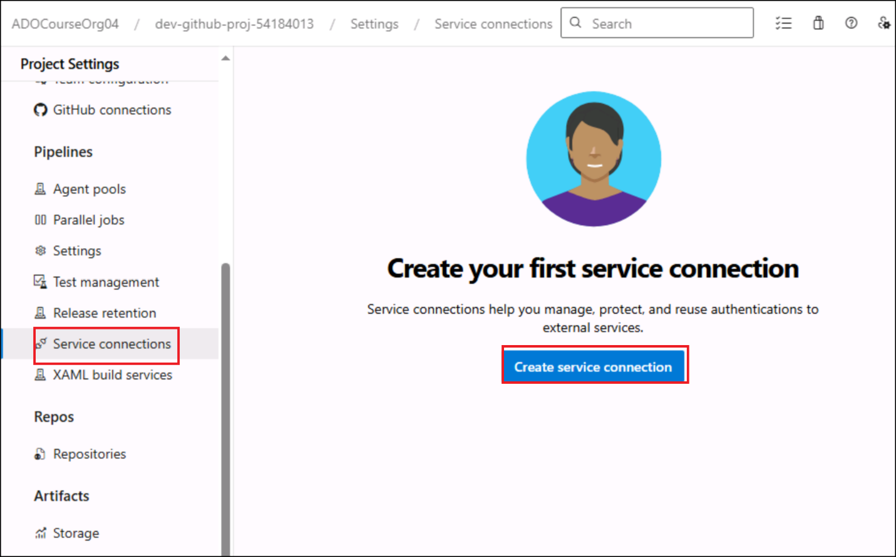

4.  Select **GitHub** and then click **Next.**

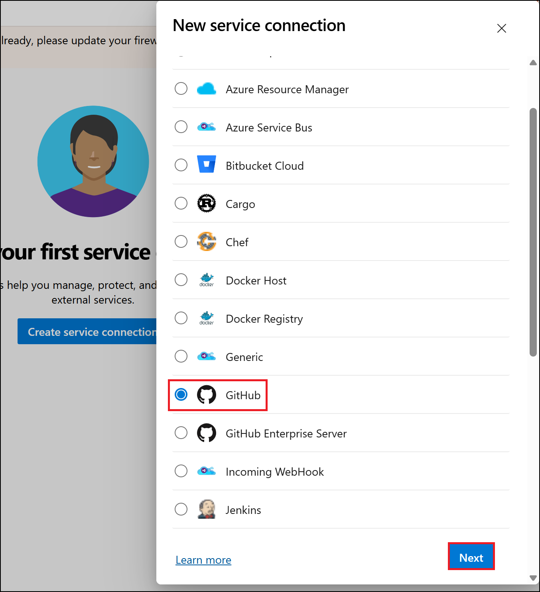

5.  Select **OAuth Configuration ; AzurePipelines** and then click on
    **Authorize** button. Sign in with your GitHub account.

6.  Keep the default connection name and click on **Save** button.

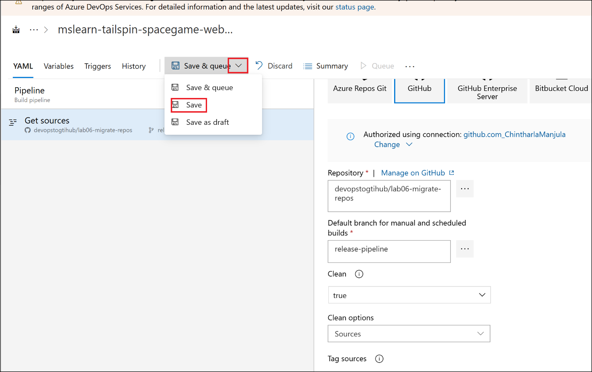

### Task 4 : Update GitHub Authorization to Include GEC Organization

1.  Go to **GitHub.com** and log into your account. Navigate to
    **Profile -\>Settings**

2.  Click on **Applications** from left navigation menu under
    Integrations. 

3.  Click on **Authorized OAuth Apps tab** and then click on **Azure
    Pipelines (OAuth)**

> 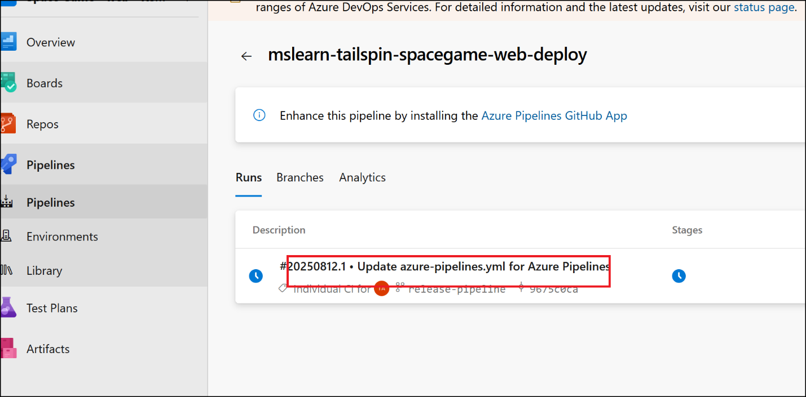

4.  Scroll down and under the Organization access section, Click on
    Grant button next to your GEC organization.

### Task 4 : Create and run a pipeline in ADO

1.  Switch back to DevOps Organization page and click on the existing
    project.

2.  Click on **Pipelines** from left navigation menu and then click on
    **Create Pipeline**.

3.  Select **Azure Repo git** tile

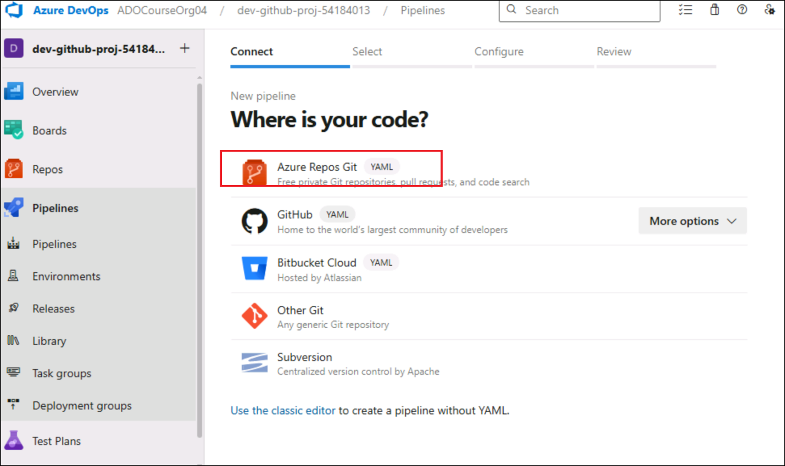

5.  Select the **tailspin-spacegame-web-deploy** repo.

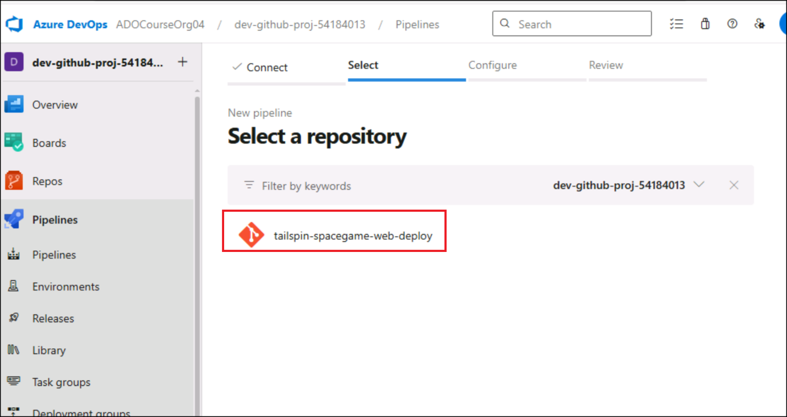

6.  Select **ASP.NET**

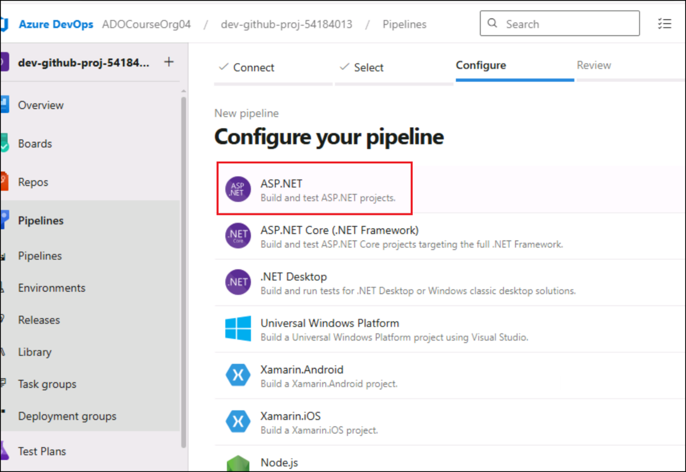

7.  Click on **Save and run** drop down and select **Save**.

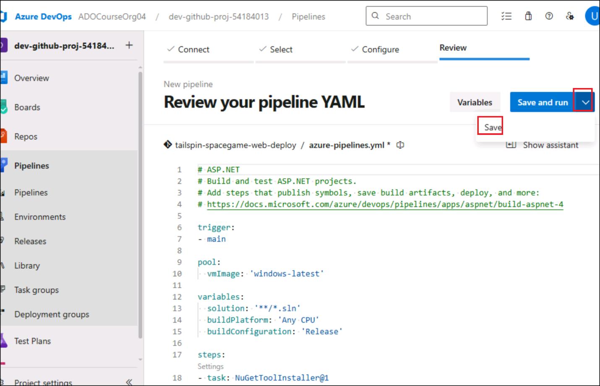

8.  Keep the default commit message and then click on Save.

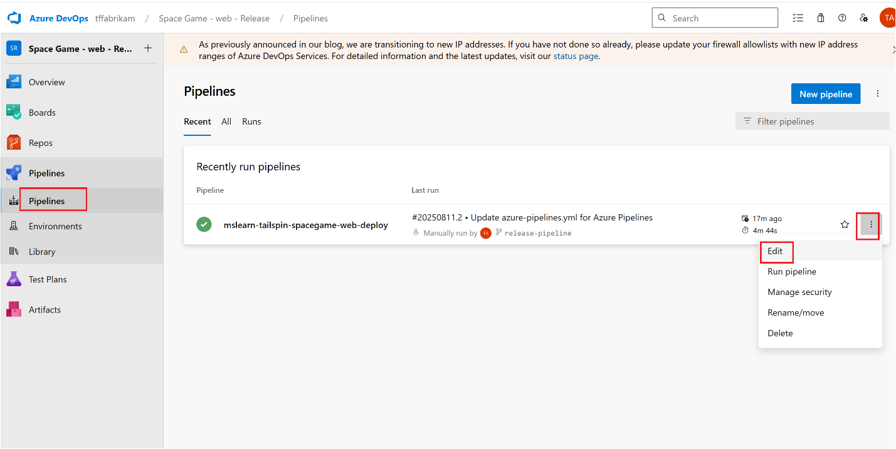

### Task 6 : Run the Pipeline Against GEC Repo

Next, you'll manually trigger the pipeline to run. This step ensures
that your project is set up to build from your GitHub repository. The
initial pipeline configuration builds the application and produces a
builds artifact.

1.  Click on Pipelines from left navigation menu, select the pipeline
    and click **Edit** button as shown in below image

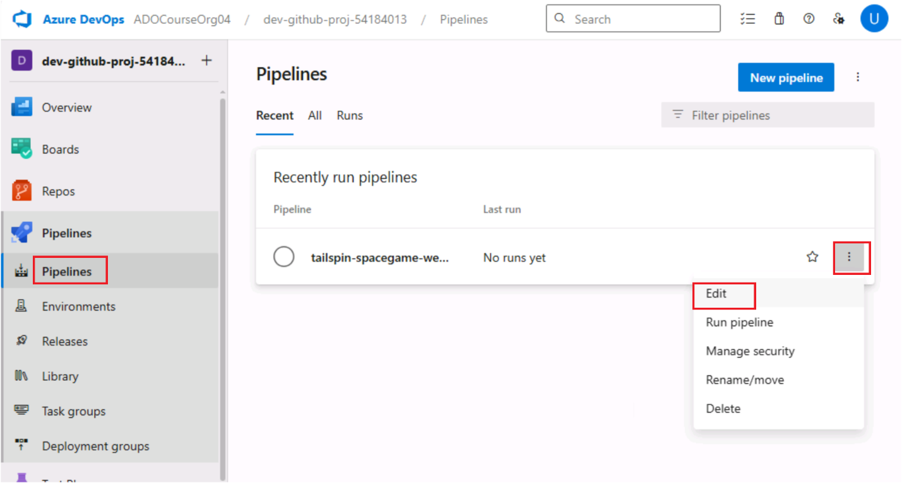

2.  Replace the **Azure-pipeline.yml** code with below code and then
    click on **Validate and Save**

> trigger:
>
> - '\*'
>
> pool:
>
>   vmImage: 'windows-latest'  # Microsoft-hosted agent
>
> variables:
>
>   buildConfiguration: 'Release'
>
>   wwwrootDir: 'Tailspin.SpaceGame.Web/wwwroot'
>
>   dotnetSdkVersion: '8.x'
>
> steps:
>
> \- task: UseNode@1
>
>   displayName: 'Use Node.js 18.20.8'
>
>   inputs:
>
>     version: '18.20.8'
>
> - task: UseDotNet@2
>
>   displayName: 'Use .NET SDK $(dotnetSdkVersion)'
>
>   inputs:
>
>     packageType: sdk
>
>     version: '$(dotnetSdkVersion)'
>
> - task: Npm@1
>
>   displayName: 'Run npm install'
>
>   inputs:
>
>     command: 'install'
>
>     verbose: false
>
> - powershell: |
>
>     $scssPath = "$(wwwrootDir)/scss"
>
>     if (Test-Path $scssPath) {
>
>       Write-Host "SCSS directory found. Compiling..."
>
>       npx sass $scssPath:$(wwwrootDir)/css
>
>     } else {
>
>       Write-Host "SCSS directory not found. Skipping Sass compilation."
>
>     }
>
>   displayName: 'Compile Sass assets'
>
> - script: 'npx gulp'
>
>   displayName: 'Run gulp tasks'
>
>   workingDirectory: Tailspin.SpaceGame.Web
>
> - script: |
>
>     echo "$(Build.DefinitionName), $(Build.BuildId), $(Build.BuildNumber)" \> buildinfo.txt
>
>   displayName: 'Write build info'
>
>   workingDirectory: $(wwwrootDir)
>
> - task: DotNetCoreCLI@2
>
>   displayName: 'Restore project dependencies'
>
>   inputs:
>
>     command: 'restore'
>
>     projects: '\*\*/\*.csproj'
>
> - task: DotNetCoreCLI@2
>
>   displayName: 'Build the project - $(buildConfiguration)'
>
>   inputs:
>
>     command: 'build'
>
>     arguments: '--no-restore --configuration $(buildConfiguration)'
>
>     projects: '\*\*/\*.csproj'
>
> - task: DotNetCoreCLI@2
>
>   displayName: 'Publish the project - $(buildConfiguration)'
>
>   inputs:
>
>     command: 'publish'
>
>     projects: '\*\*/\*.csproj'
>
>     publishWebProjects: false
>
>     arguments: '--no-build --configuration $(buildConfiguration) --output $(Build.ArtifactStagingDirectory)/$(buildConfiguration)'
>
>     zipAfterPublish: true
>
> - task: PublishBuildArtifacts@1
>
>   displayName: 'Publish Artifact: drop'
>
>   inputs:
>
>     pathToPublish: '$(Build.ArtifactStagingDirectory)'
>
>     artifactName: 'drop'
>
>     publishLocation: 'Container'

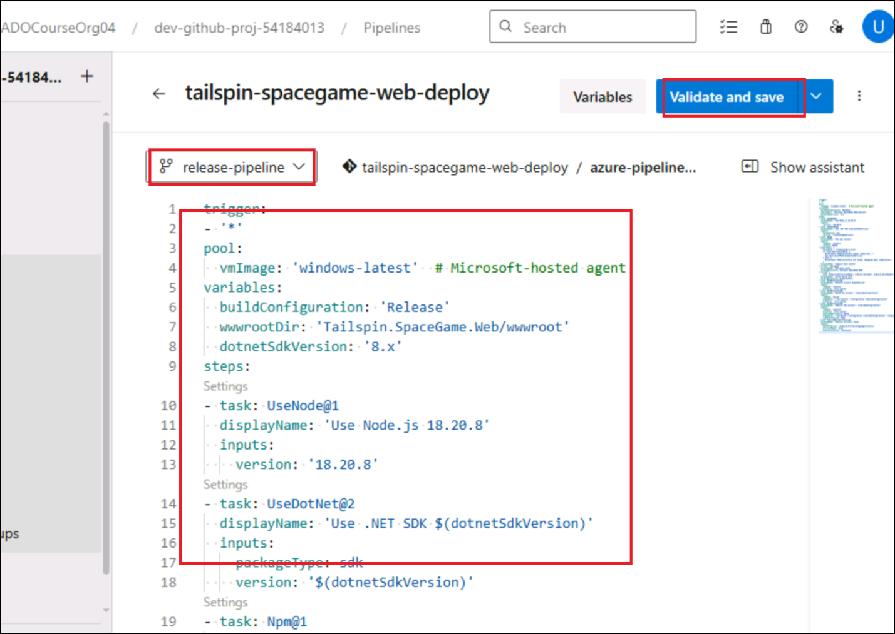

3.  Click on **Save** now.

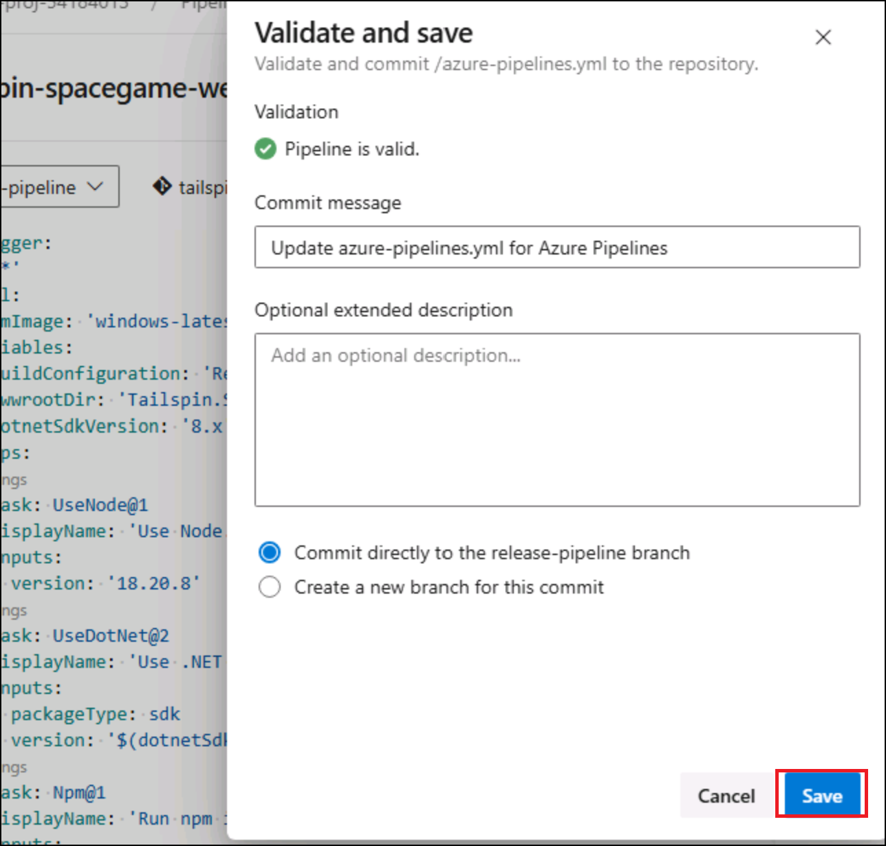

4.  Click on three dots next to **Run** and select **Triggers**.

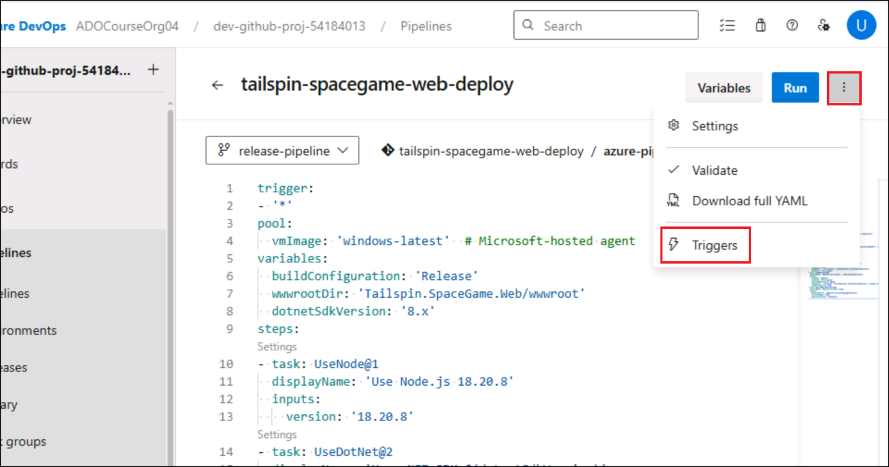

5.  Select **YAML** tab -\> Pipelines ,Make sure **Default agent pool
    for YAML** is set to **Azure pipelines** agent **.**

6.  Click on **Get sources**. Select **GtiHub** and then click next to
    **Repository**.

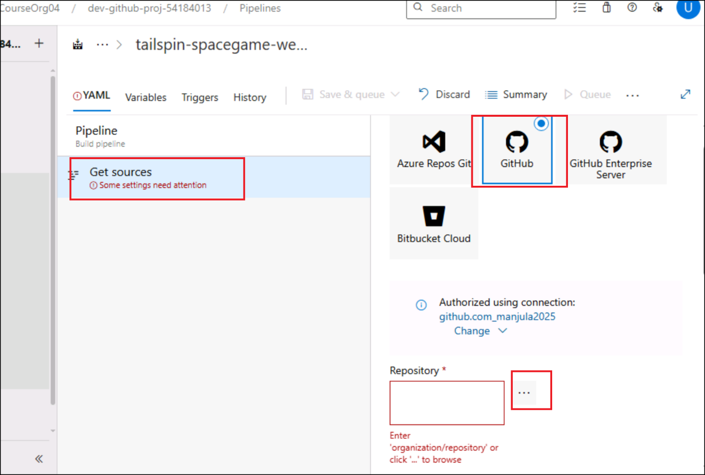

7.  Select the Lab06 repo form GEC organization and then click on
    **Select** button.

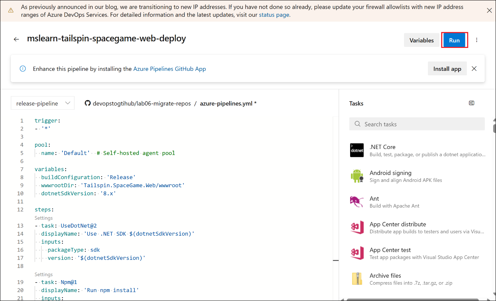

8.  Click on **Default branch for manual and scheduled builds** to
    select the branch.Select **release-pipeline** branch and then click
    on **Select** button.

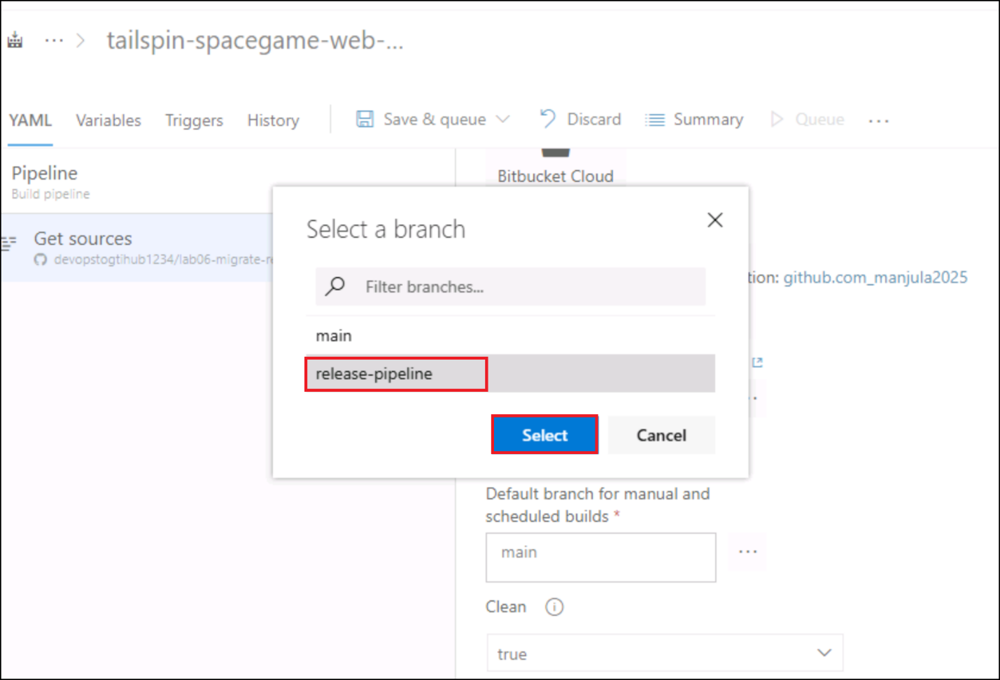

9.  Click on **Save & queue -\> Save.**

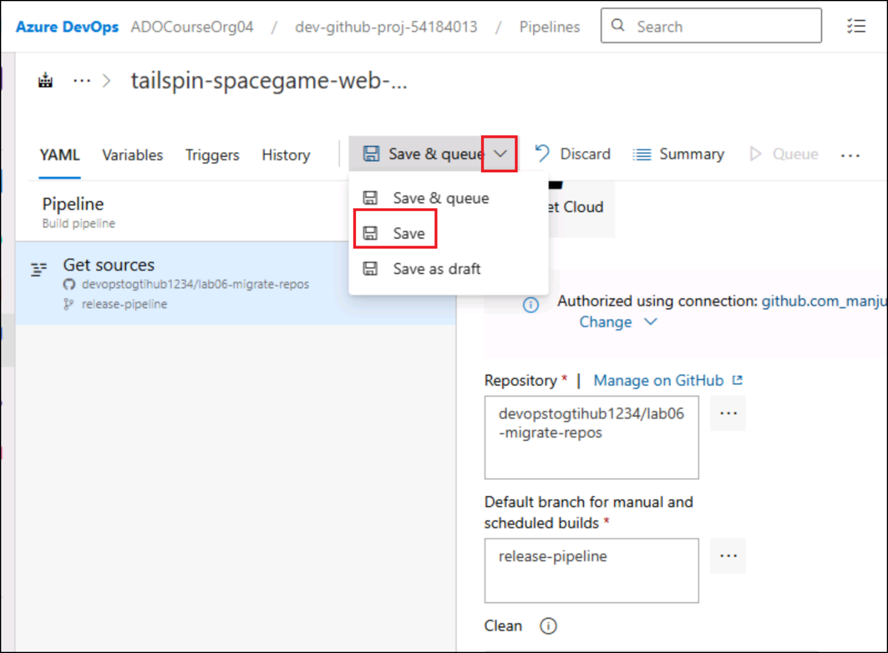

10. Enter the comments and then click on **Save**.

11. Click on **Pipeline** from top navigation menu or from left
    navigation menu.

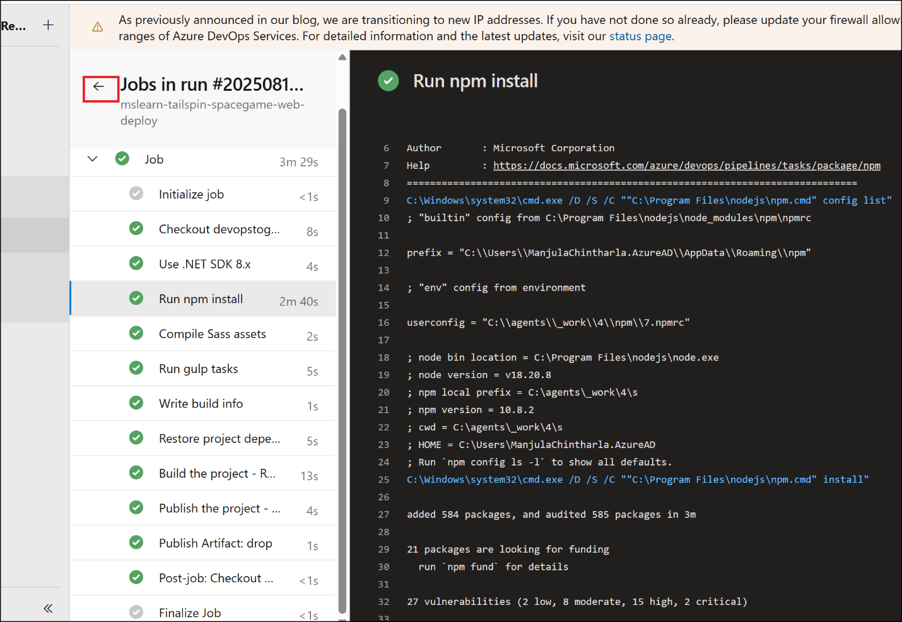

12. Select the pipeline which is in running status.

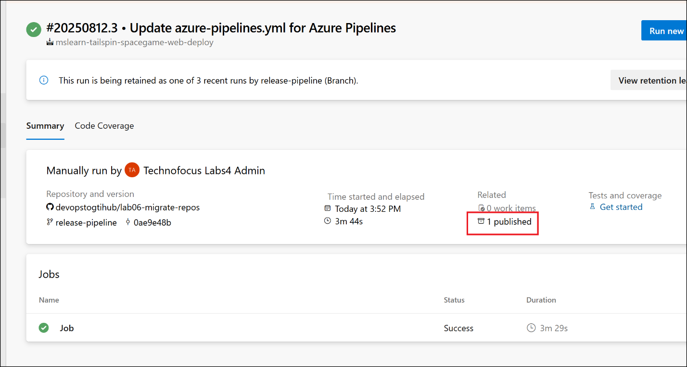

13. Click on the run.

14. Wait for the pipeline to run successfully.

> 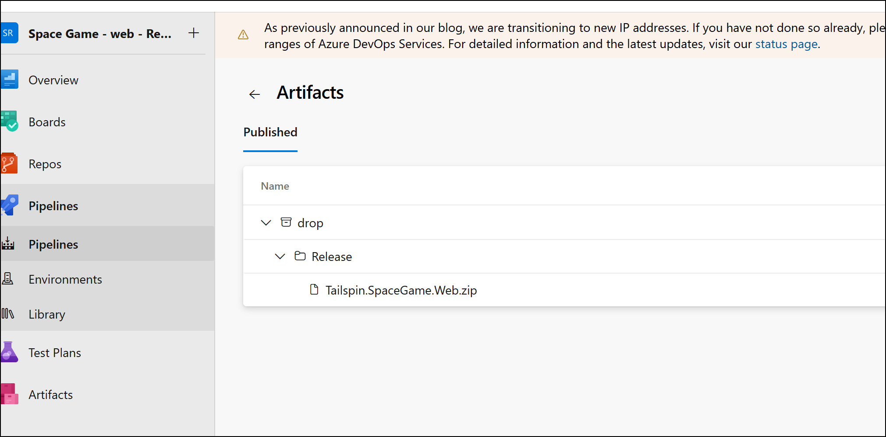

15. Select your published artifact.

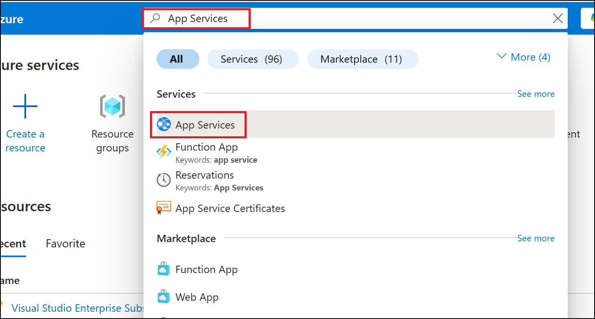

16. The ***Tailspin.Space.Game.Web.zip*** is your build artifact. This
    file contains your built application and its dependencies.

> 

17. Click on **Pipelines** form left navigation menu and select the
    recent pipeline to **Edit**.

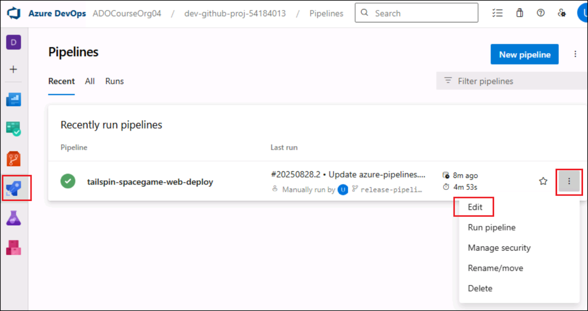

18. Select the release-pipeline branch and click on three dots next to
    **Run** and select **Triggers**

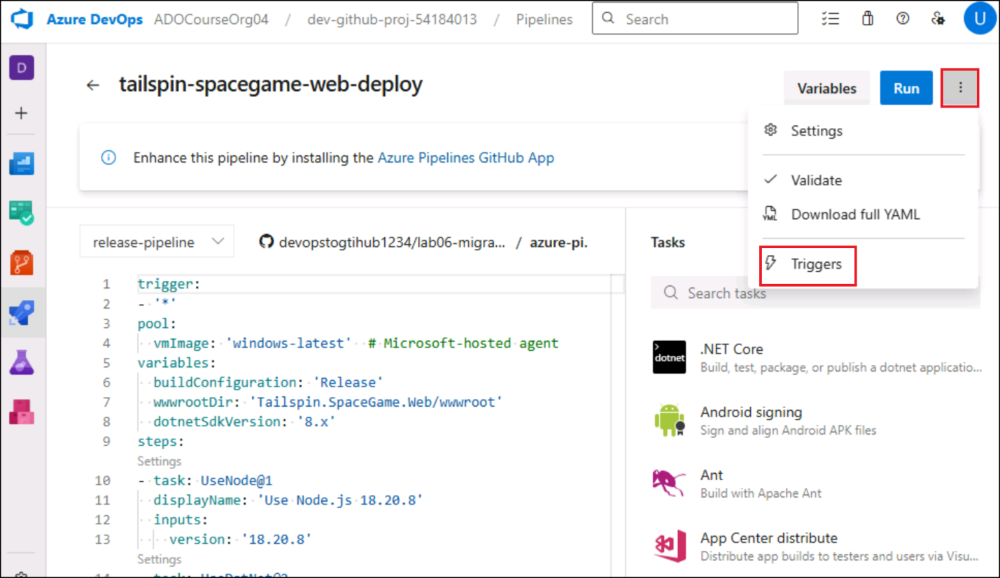

19. Select **Triggers-\> GEC-org/Lab06-migrate-repos**, select
    **Override the YAML continuous integration trigger from here** check
    box and then select **release-pipeline** branch as branch
    specification.

> 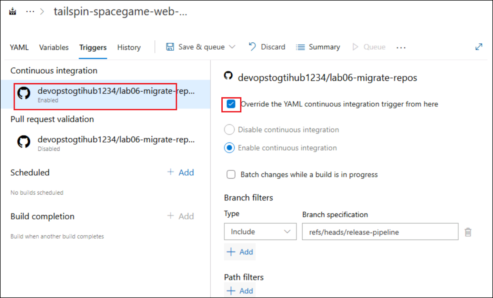

20. Click on **Save & queue -\> Save**

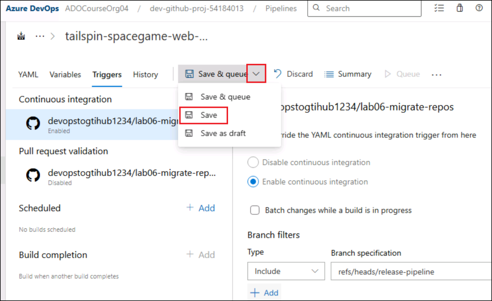

21. Enter the comment and **Save**.

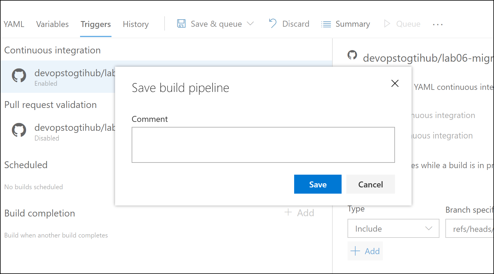

22. Replace the **azure-pipeline.yml** code with below code and then
    click on **Validate and save** button.

> trigger:
>
> \- '\*'
>
> pool:
>
>   vmImage: 'windows-latest'
>
> variables:
>
>   buildConfiguration: 'Release'
>
>   wwwrootDir: 'Tailspin.SpaceGame.Web/wwwroot'
>
>   dotnetSdkVersion: '8.x'
>
> steps:
>
> \- task: UseNode@1
>
>   displayName: 'Use Node.js 18.20.8'
>
>   inputs:
>
>     version: '18.20.8'
>
> \- task: UseDotNet@2
>
>   displayName: 'Use .NET SDK $(dotnetSdkVersion)'
>
>   inputs:
>
>     packageType: sdk
>
>     version: '$(dotnetSdkVersion)'
>
> \- task: Npm@1
>
>   displayName: 'Run npm install'
>
>   inputs:
>
>     command: 'install'
>
>     verbose: false
>
> \- powershell: |
>
>     $scssPath = "$(wwwrootDir)/scss"
>
>     if (Test-Path $scssPath) {
>
>       Write-Host "SCSS directory found. Compiling..."
>
>       npx sass $scssPath:$(wwwrootDir)/css
>
>     } else {
>
>       Write-Host "SCSS directory not found. Skipping Sass
> compilation."
>
>     }
>
>   displayName: 'Compile Sass assets'
>
> \- script: 'npx gulp'
>
>   displayName: 'Run gulp tasks'
>
>   workingDirectory: Tailspin.SpaceGame.Web
>
> \- script: |
>
>     echo "$(Build.DefinitionName), $(Build.BuildId),
> $(Build.BuildNumber)" \> buildinfo.txt
>
>   displayName: 'Write build info'
>
>   workingDirectory: $(wwwrootDir)
>
> \- task: DotNetCoreCLI@2
>
>   displayName: 'Restore project dependencies'
>
>   inputs:
>
>     command: 'restore'
>
>     projects: '\*\*/\*.csproj'
>
> \- task: DotNetCoreCLI@2
>
>   displayName: 'Build the project - $(buildConfiguration)'
>
>   inputs:
>
>     command: 'build'
>
>     arguments: '--no-restore --configuration $(buildConfiguration)'
>
>     projects: '\*\*/\*.csproj'
>
> \- task: DotNetCoreCLI@2
>
>   displayName: 'Publish the project - $(buildConfiguration)'
>
>   inputs:
>
>     command: 'publish'
>
>     projects: '\*\*/\*.csproj'
>
>     publishWebProjects: false
>
>     arguments: '--no-build --configuration $(buildConfiguration)
> --output $(Build.ArtifactStagingDirectory)/$(buildConfiguration)'
>
>     zipAfterPublish: true
>
> \- task: PublishBuildArtifacts@1
>
>   displayName: 'Publish Artifact: drop'
>
>   inputs:
>
>     pathToPublish: '$(Build.ArtifactStagingDirectory)'
>
>     artifactName: 'drop'
>
>     publishLocation: 'Container'

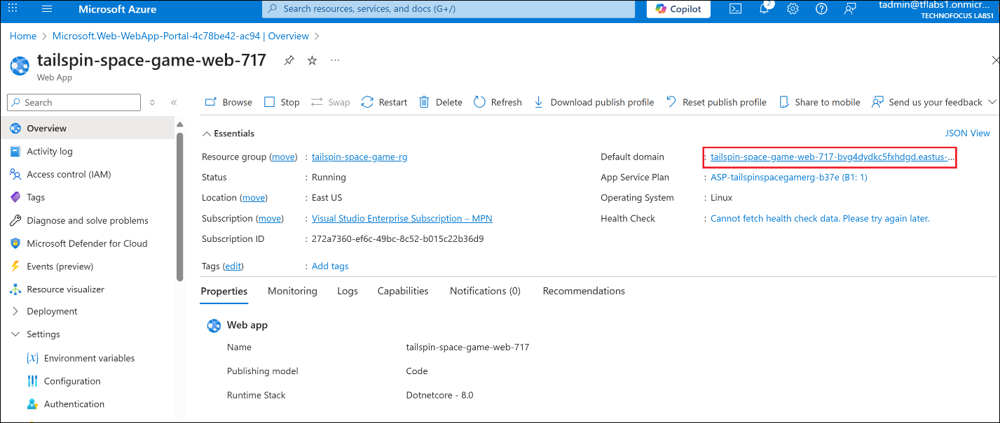

23. Click on **Save**.

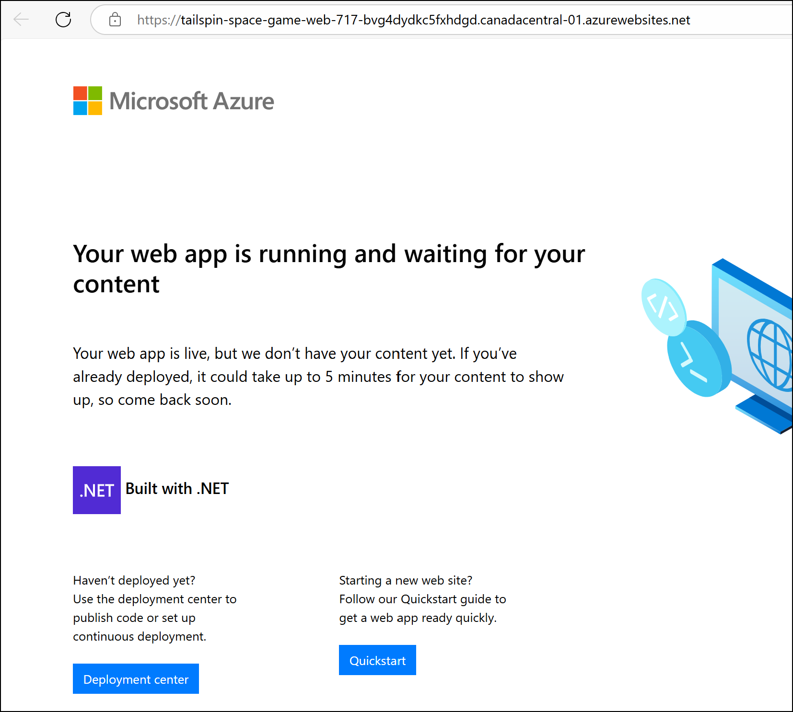

24. Click on **Run** button to run the pipeline.

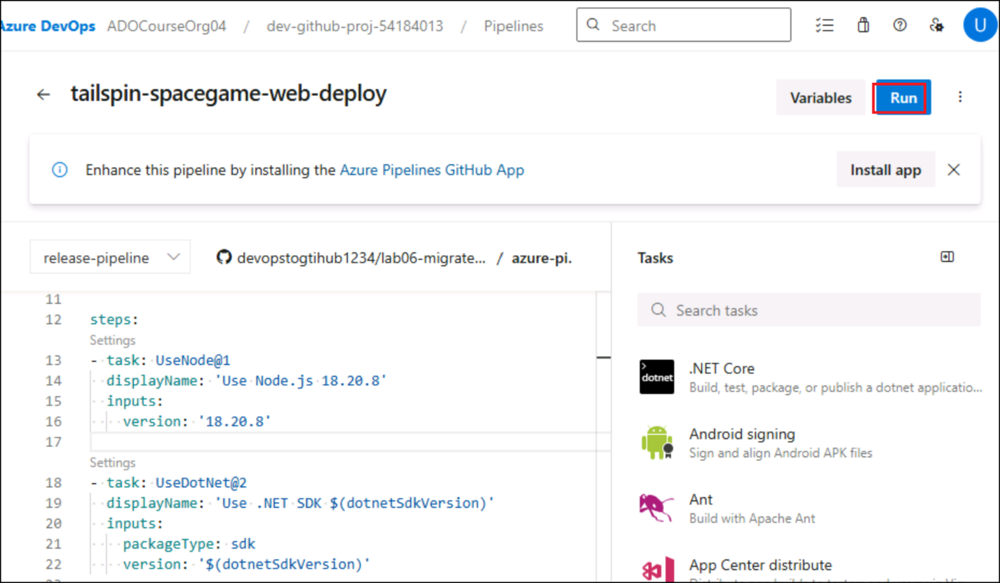

25. In **Run pipeline** window, click on **Run**.

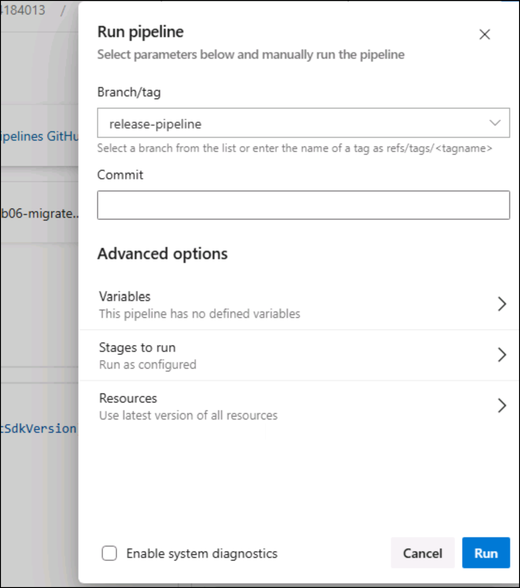

26. Click on the **Job**.

27. Wait for the job to run completely.

You now have a build pipeline for the Space Game web project. Next,
you'll add a deployment stage to deploy your build artifact to Azure App
Service.

## Exercise 3 - Deploy the web application to Azure App Service

In this exercise, you create a multistage pipeline to build and deploy
your application to Azure App Service. You learn how to:

- Create an App Service instance to host your web application.

- Create a multistage pipeline.

- Deploy to Azure App Service.

### **Task 1: Create the App Service instance**

1.  Open a new tab in your browser and go to https://portal.azure.com
    and sign in with your Azure subscription.

2.  Search for  **App Services** and select it.

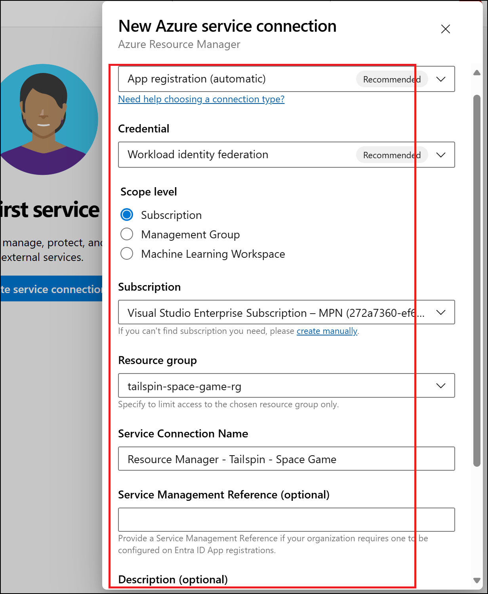

3.  Select **Create** \> **Web App** to create a new Web App.

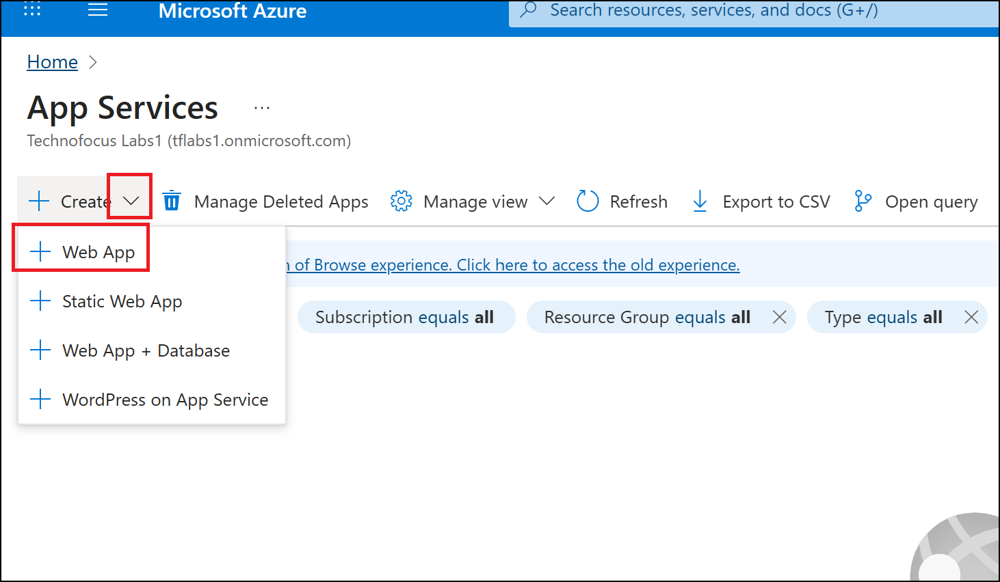

4.  On the **Basics** tab, enter the following values. Select **Review +
    create**.

[TABLE]

> 
>
> 

5.  Select **Create**.


6.  The deployment takes a few moments to complete

7.  When deployment is complete, select **Go to resource**. The **App
    Service** Essentials displays details related to your deployment.


8.  Select the URL to verify the status of your App Service.


### Task 2 : Create a service connection

7.  Switch back to Azure DevOps tab, go to your **ADO-** project.


8.  From the lower-left corner of the page, select **Project settings**.


9.  Under **Pipelines**, select **Service connections**. Select **New
    service connection**.


10. Select **Azure Resource Manager** then select **Next**.


11. Fill out the required fields as follows: If prompted, sign in to
    your Microsoft account.

    - Scope level : Subscription

    - Subscription : Your Azure subscription

    - Resource Group : **select existing resource group-
      ResourceGroup1**

    - Service connection name : ***Resource Manager - Tailspin - Space
      Game***

> 

12. Ensure that **Grant access permission to all pipelines** is
    selected. Select **Save**.


### Task 3 : Add the Build stage to your pipeline

A *multistage pipeline* allows you to define distinct phases that your
change passes through as it's promoted through the pipeline. Each stage
defines the agent, variables, and steps required to carry out that phase
of the pipeline. In this section, you define one stage to perform the
build. You define a second stage to deploy the web application to App
Service.

To convert your existing build configuration to a multistage pipeline,
you add a stages section to your configuration, and then you add one or
more stage sections for each phase of your pipeline. Stages break down
into jobs, which are a series of steps that run sequentially as a unit.

1.  Switch back to Visual Studio code and replace the code
     ***azure-pipelines.yml*** with below code **save**:

> trigger:
>
> - release-pipeline
>
> variables:
>
>   buildConfiguration: 'Release'
>
>   wwwrootDir: 'Tailspin.SpaceGame.Web/wwwroot'
>
>   dotnetSdkVersion: '8.x'
>
> stages:
>
> - stage: Build
>
>   displayName: 'Build the web application'
>
>   jobs:
>
>   - job: BuildJob
>
>     displayName: 'Build job'
>
>     pool:
>
>       vmImage: 'windows-latest'  # Updated from 'Default' to working agent pool
>
>     steps:
>
>     - task: UseNode@1
>
>       displayName: 'Use Node.js 18.20.8'
>
>       inputs:
>
>         version: '18.20.8'
>
>     - task: UseDotNet@2
>
>       displayName: 'Use .NET SDK $(dotnetSdkVersion)'
>
>       inputs:
>
>         packageType: sdk
>
>         version: '$(dotnetSdkVersion)'
>
>     - task: Npm@1
>
>       displayName: 'Run npm install'
>
>       inputs:
>
>         command: 'install'
>
>         verbose: false
>
>     - powershell: |
>
>         $scssPath = "$(wwwrootDir)/scss"
>
>         if (Test-Path $scssPath) {
>
>           Write-Host "SCSS directory found. Compiling..."
>
>           npx sass $scssPath:$(wwwrootDir)/css
>
>         } else {
>
>           Write-Host "SCSS directory not found. Skipping Sass compilation."
>
>         }
>
>       displayName: 'Compile Sass assets'
>
>     - script: 'npx gulp'
>
>       displayName: 'Run gulp tasks'
>
>       workingDirectory: Tailspin.SpaceGame.Web
>
>     - script: |
>
>         echo "$(Build.DefinitionName), $(Build.BuildId), $(Build.BuildNumber)" \> buildinfo.txt
>
>       displayName: 'Write build info'
>
>       workingDirectory: $(wwwrootDir)
>
>     - task: DotNetCoreCLI@2
>
>       displayName: 'Restore project dependencies'
>
>       inputs:
>
>         command: 'restore'
>
>         projects: '\*\*/\*.csproj'
>
>     - task: DotNetCoreCLI@2
>
>       displayName: 'Build the project - $(buildConfiguration)'
>
>       inputs:
>
>         command: 'build'
>
>         arguments: '--no-restore --configuration $(buildConfiguration)'
>
>         projects: '\*\*/\*.csproj'
>
>     - task: DotNetCoreCLI@2
>
>       displayName: 'Publish the project - $(buildConfiguration)'
>
>       inputs:
>
>         command: 'publish'
>
>         projects: '\*\*/\*.csproj'
>
>         publishWebProjects: false
>
>         arguments: '--no-build --configuration $(buildConfiguration) --output $(Build.ArtifactStagingDirectory)/$(buildConfiguration)'
>
>         zipAfterPublish: true
>
>     - task: PublishBuildArtifacts@1
>
>       displayName: 'Publish Artifact: drop'
>
>       inputs:
>
>         pathToPublish: '$(Build.ArtifactStagingDirectory)'
>
>         artifactName: 'drop'
>
>         publishLocation: 'Container'


2.  From the integrated terminal, run below command to fetch latest
    updates from GEC.

> git fetch origin

3.  Run below command to merger remote changes into you local repo.

git checkout release-pipeline

4.  run below command to update origin to point to the migrated GEC repo

git remote set-url origin
<https://github.com/$GEC_ORG/lab06-migrate-repos.git>

5.  Update with your GitHub username and email and then run the commands

git config --global user.email "you@example.com"

git config --global user.name "Your Name"

6.  From the integrated terminal, run the following commands to stage,
    commit, and then push your changes to your remote branch.

> git add azure-pipelines.yml
>
> git commit -m "Add a build stage"

git push --force origin release-pipeline

7.  In Azure Pipelines, navigate to your pipeline to view the logs.

8.  Select the pipeline run.


9.  Click on **Build job**.


10. Wait for the build to complete successful.

11. After the build finishes, select the back button to return to the
    summary page and check the status of your pipeline and published
    artifact.

### Task 4 : Create the dev environment and Store your web app name in a pipeline variable

An *environment* is an abstract representation of your deployment
environment. You can use environments to define specific criteria for
your release, such as which pipeline is authorized to deploy to the
environment. You can also use environments to set up manual approvals
for specific user/group to approve before deployment is resumed.

The *Deploy* stage that we're creating uses the name to identify to
which App Service instance to deploy; for
example, *tailspin-space-game-web-1234*.

Although you could hard-code this name in your pipeline configuration,
defining it as a variable makes your configuration more reusable.

1.  From Azure Pipelines, select **Environments** from left navigation
    menu and click on **Create environment**.

> 

2.  Enter the Environment name as **dev** ,select None as resource and
    then click on **Create**.


3.  select **Library** from left navigation menu and then click  **+
    Variable group** to create a new variable group.


4.  Enter ***Release*** for the **variable group
    name**.Select **Add** under **Variables** to add a new variable.

> 

5.  Enter ***WebAppName*** for the variable name and your App Service
    instance's name for its value: for
    example, ***tailspin-space-game-web-***.(Webapp name you created in
    previous task-2s).Select **Save**.


### Task 5 : Add the deployment stage to your pipeline

We extend our pipeline by adding a deployment stage to deploy the *Space
Game* to App Service using the download and AzureWebApp@1 tasks to
download the build artifact and then deploy it.

1.  From Visual Studio Code, replace the contents
    of ***azure-pipelines.yml*** with the following yaml:

> trigger:
>
>   - '\*'
>
> variables:
>
>   buildConfiguration: 'Release'
>
>   wwwrootDir: 'Tailspin.SpaceGame.Web/wwwroot'
>
>   dotnetSdkVersion: '8.x'
>
> stages:
>
>   - stage: Build
>
>     displayName: 'Build the web application'
>
>     jobs:
>
>       - job: Build
>
>         displayName: 'Build job'
>
>         pool:
>
>           vmImage: 'windows-latest'
>
>         steps:
>
>           - task: UseDotNet@2
>
>             displayName: 'Use .NET SDK $(dotnetSdkVersion)'
>
>             inputs:
>
>               packageType: sdk
>
>               version: '$(dotnetSdkVersion)'
>
>           - task: UseNode@1
>
>             displayName: 'Use Node.js 18.20.8'
>
>             inputs:
>
>               version: '18.20.8'
>
>           - task: Npm@1
>
>             displayName: 'Run npm install'
>
>             inputs:
>
>               command: 'install'
>
>               verbose: false
>
>           - powershell: |
>
>               $scssPath = "$(wwwrootDir)/scss"
>
>               if (Test-Path $scssPath) {
>
>                 Write-Host "SCSS directory found. Compiling..."
>
>                 npx sass $scssPath:$(wwwrootDir)/css
>
>               } else {
>
>                 Write-Host "SCSS directory not found. Skipping Sass compilation."
>
>               }
>
>             displayName: 'Compile Sass assets'
>
>           - script: 'npx gulp'
>
>             displayName: 'Run gulp tasks'
>
>             workingDirectory: Tailspin.SpaceGame.Web
>
>           - script: |
>
>               echo "$(Build.DefinitionName), $(Build.BuildId), $(Build.BuildNumber)" \> buildinfo.txt
>
>             displayName: 'Write build info'
>
>             workingDirectory: $(wwwrootDir)
>
>           - task: DotNetCoreCLI@2
>
>             displayName: 'Restore project dependencies'
>
>             inputs:
>
>               command: 'restore'
>
>               projects: '\*\*/\*.csproj'
>
>           - task: DotNetCoreCLI@2
>
>             displayName: 'Build the project - $(buildConfiguration)'
>
>             inputs:
>
>               command: 'build'
>
>               arguments: '--no-restore --configuration $(buildConfiguration)'
>
>               projects: '\*\*/\*.csproj'
>
>           - task: DotNetCoreCLI@2
>
>             displayName: 'Publish the project - $(buildConfiguration)'
>
>             inputs:
>
>               command: 'publish'
>
>               projects: '\*\*/\*.csproj'
>
>               publishWebProjects: false
>
>               arguments: '--no-build --configuration $(buildConfiguration) --output $(Build.ArtifactStagingDirectory)/$(buildConfiguration)'
>
>               zipAfterPublish: true
>
>           - task: PublishBuildArtifacts@1
>
>             displayName: 'Publish Artifact: drop'
>
>             inputs:
>
>               pathToPublish: '$(Build.ArtifactStagingDirectory)'
>
>               artifactName: 'drop'
>
>               publishLocation: 'Container'
>
>   - stage: Deploy
>
>     displayName: 'Deploy the web application'
>
>     dependsOn: Build
>
>     jobs:
>
>       - deployment: Deploy
>
>         pool:
>
>           vmImage: 'windows-latest'
>
>         environment: dev
>
>         variables:
>
>           - group: Release
>
>         strategy:
>
>           runOnce:
>
>             deploy:
>
>               steps:
>
>                 - download: current
>
>                   artifact: drop
>
>                 - task: AzureWebApp@1
>
>                   displayName: 'Azure App Service Deploy: website'
>
>                   inputs:
>
>                     azureSubscription: 'Resource Manager - Tailspin - Space Game'
>
>                     appName: '$(WebAppName)'
>
>                     package: '$(Pipeline.Workspace)/drop/$(buildConfiguration)/\*.zip'

Notice the highlighted section and how we're using
the download and AzureWebApp@1 tasks. The pipeline fetches
the $(WebAppName) from the variable group we created earlier.

Also notice how we're using environment to deploy to
the **dev** environment.

2.  From the integrated terminal, add *azure-pipelines.yml* to the
    index. Then commit the change and push it up to GitHub.

git add azure-pipelines.yml

git commit -m "Add a deployment stage"

git push origin release-pipeline

3.  In Azure Pipelines, navigate to your pipeline to view the logs.


4.  Select deployment stage.


5.  Wait for the **Build** to complete.You will have to manually permit
    Deployment to initiate the process

6.  Once build is successfully then click on **View** next to the
    warning message “  
    **This pipeline needs permission to access 2 resources before this
    run can continue to Deploy the web application”**


7.  Review and allow both permissions.


8.  Wait for the deployment to complete.

9.  After the build finishes, select the back button to return to the
    summary page and check the status of your stages. Both stages
    finished successfully in our case.

**Note:**  
In real-world scenarios, pipelines do not directly push changes to the
main branch.  
Instead, developers push changes to a feature or release branch (e.g.,
release-pipeline).  
The next step is to create a Pull Request (PR) to merge these changes
into main.  
This ensures that code changes go through review, approvals, and
automated checks before deployment.  
Directly pushing to main without review is generally avoided in
enterprise environments for compliance and quality control.

### Task 6 : View the deployed website on App Service

1.  Switch back to App Service tab open, refresh the page. Otherwise,
    navigate to your Azure App Service in the Azure portal and select
    the instance's **URL**: for
    example, ***https://tailspin-space-game-web-XXXXX.azurewebsites.net***


2.  The *Space Game* website is successfully deployed to Azure App
    Service.

## Exercise 4 - Clean up your environment

Congratulations! You're all done with creating pipelines and resources.
In this unit, you're going to clean up your Azure resources and Azure
DevOps environment.

### Task 1 : Clean up Azure resources

1.  Navigate to [Azure
    portal](https://portal.azure.com/).Select **Resource groups** from
    the left panel.


2.  Select existing resource group **ResourceGroup1.**

> 

3.  Select all the resource and then click on Delete ( Delete only
    resource and not the Resource group) as shown in below image.


4.  Enter delete and then click on Delete.


## Summary

In this lab, we have

- Successfully migrated an Azure DevOps repository (with multiple
  branches) to GitHub Enterprise Cloud (GEC).

- Configured an Azure DevOps Pipeline to build and deploy code from a
  GEC branch to Azure App Service.

- Triggered a build and verified deployment using changes committed to
  the release-pipeline branch.

- Understood the value of separating **development branches** from main
  in CI/CD workflows.

- Learned why many organizations **require Pull Request approvals**
  before code merges into main, ensuring quality and security.

In this lab, we intentionally **did not automate merging changes into
main**.  
This was done to mirror real-world governance where:

1.  Developers push to a branch.

2.  A PR is created.

3.  Code is reviewed and approved.

4.  Only then is it merged into main.

We will practice this **end-to-end PR approval and merge process** in
**Lab 8**, including automation options for scenarios where governance
rules allow it.
