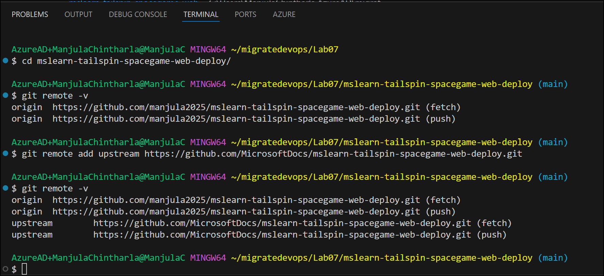
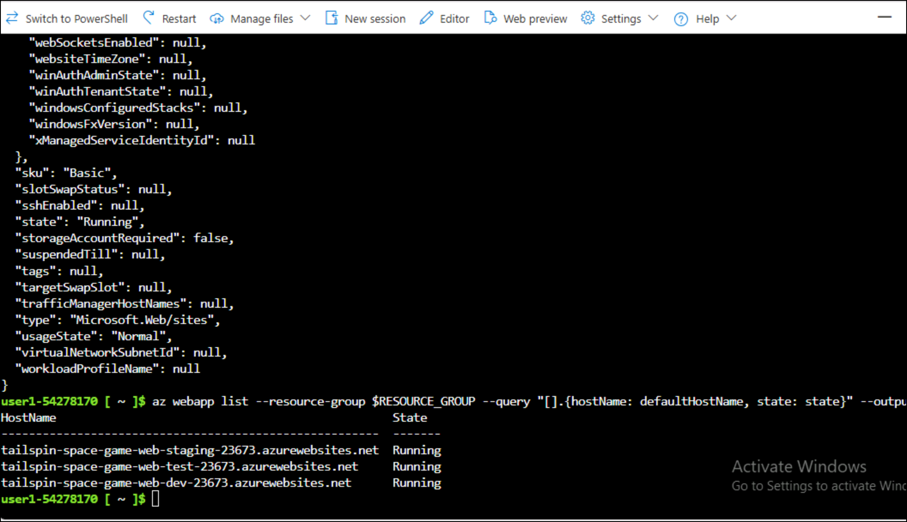
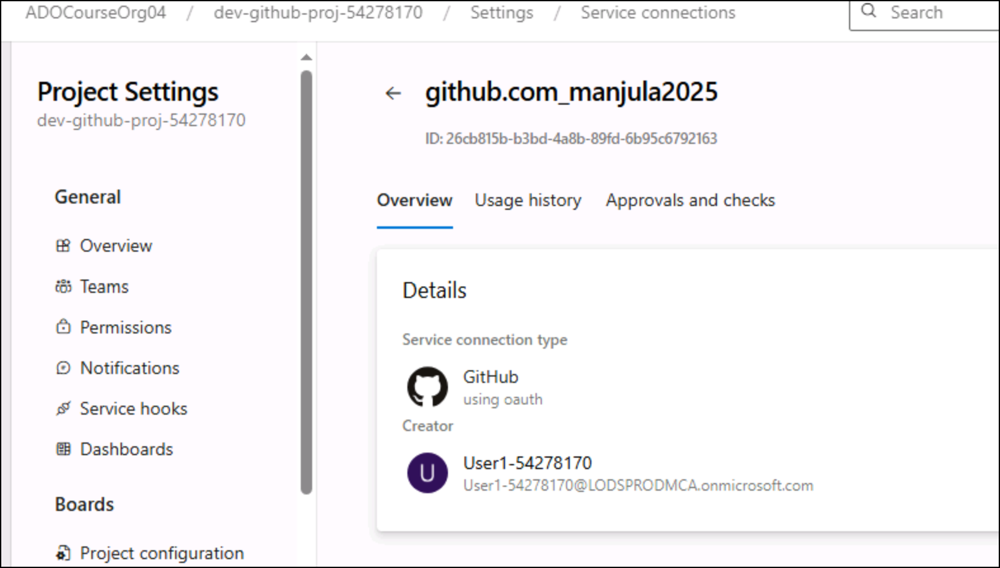
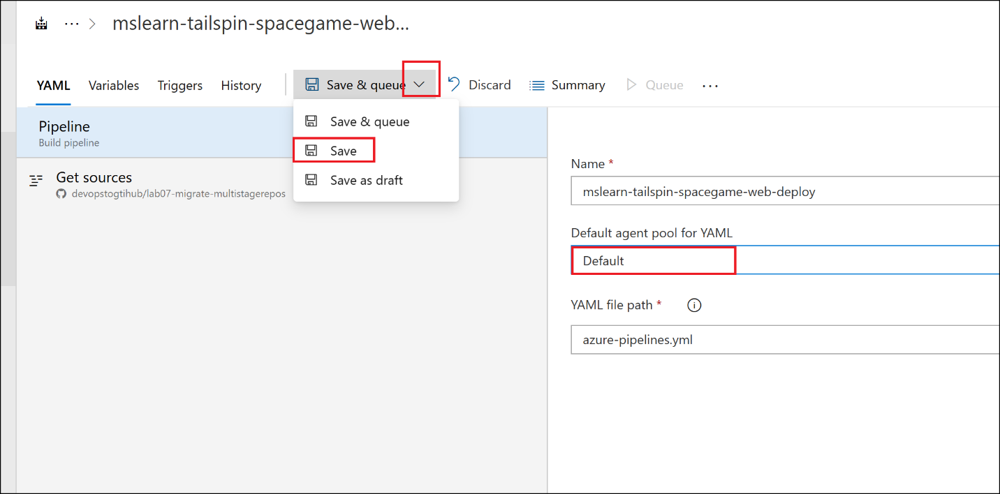
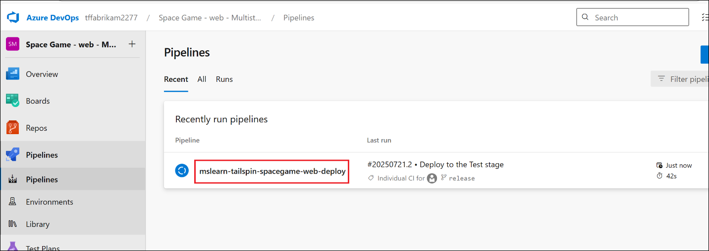
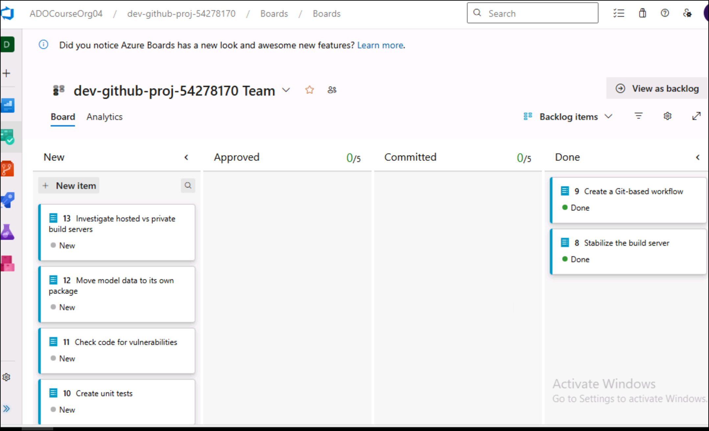

# Lab 07 - Enable GitHub Collaboration and Code Review Workflows with Azure Pipelines

Objectives  
By the end of this lab, you will:

- Enable GitHub branch protections to require Pull Request reviews
  before merge.

- Practice creating Pull Requests from a feature/release branch to main
  in GEC.

- Perform code reviews and approvals in GitHub Enterprise Cloud.

- Integrate Azure Pipelines so that PR validation builds run
  automatically.

- Understand how PR-driven workflows improve code quality, security, and
  compliance.

**Note for this lab**

All code changes will be merged to main **only via Pull Requests**.  
We will not push changes directly to main from the pipeline — this
reinforces review culture and simulates real-world governance where
branch policies protect production code.

## Exercise 1 - Set up your environment

In this exercise, you make sure that your Azure DevOps organization is
set up to complete the rest of this module. You also create the Azure
App Service environments that you deploy to later.

1.  To accomplish these goals, you:

2.  Add a user to ensure Azure DevOps can connect to your Azure
    subscription.

3.  Set up an Azure DevOps project for this module.

4.  On Azure Boards, move the work item for this module to
    the Doing column.

5.  Make sure your project is set up locally so that you can push
    changes to the pipeline.

6.  Create the Azure App Service environments by using the Azure CLI in
    Azure Cloud Shell.

7.  Create pipeline variables that define the names of your App Service
    environments.

8.  Create a service connection that enables Azure Pipelines to securely
    access your Azure subscription.

### Task 1 : Create an Azure DevOps personal access token

1.  Create an Azure DevOps personal access token (PAT). Open a new tab
    in your browser and navigate to - <https://portal.azure.com/> and
    sign in with assigned account.

2.  Search for **Azure DevOps** and select **Azure DevOps
    organizations**.

3.  Click on **My Azure DevOps Organization** hyper link.

4.  Click on **Create new organization** button.

5.  Click on **Continue**.

6.  Enter the organization name as : **tffabrikamXXX** (should be
    unique, replace XXX with nunber)enter the characters shown in your
    screen and then click on **Continue**.

7.  In the top right corner of the screen, click **User settings**.
    Click Personal access tokens.

8.  Select **+ New Token**

9.  Enter the name as : **devopstoken** and select the following scopes
    (you may need to select Show all scopes at the bottom of the page to
    reveal all scopes):

    - Agents Pool: **Read & write**

    - Build: **Read & execute**

    - Code: **Read, write, & manage**

    - Deployment Groups : Read & manage

    - GitHub Connections: Read & manage

    - Pipeline Resources: Use and manage

    - Project and Team: **Read, write, & manage**

    - Pull Request Threads: Read & write

    - Release: **Read, write, execute, & manage**

    - Service Connections: **Read, query, & manage**

    - Team Dashboard: Read & manage

    - Task Groups: **Read, create, & manage**

    - **Test Management: Read & write**

    - Variable Groups: **Read, create, & manage**

10. Copy the generated API token and save it in a safe location. For
    your security, it won't be shown again.

### Task 2 : Download and configure the agent

1.  From Left down corner, click on **Organization settings**.

2.  Choose **Agent pools**.Select the **Default** pool.

3.  Select the **Agents** tab, and choose **New agent**.

4.  On the **Get the agent** dialog box, choose **Windows**.On the left
    pane, select the processor architecture of the installed Windows OS
    version on your machine. The x64 agent version is intended for
    64-bit Windows, whereas the x86 version is intended for 32-bit
    Windows.

5.  On the right pane, click the **Download** button.

6.  Follow the instructions on the page to download the agent.

7.  Unpack the agent into the directory of your choice. Make sure that
    the path to the directory contains no spaces because tools and
    scripts don't always properly escape spaces. A recommended folder
    is C:\agents. Extracting in the download folder or other user
    folders may cause permission issues.

** Important**

We strongly recommend you configure the agent from an elevated
PowerShell window. If you want to configure as a service, this
is **required**.You must not use [**Windows PowerShell
ISE**](https://learn.microsoft.com/en-us/powershell/scripting/windows-powershell/ise/introducing-the-windows-powershell-ise) to
configure the agent.

** Important**

For security reasons we strongly recommend making sure the agents folder
(C:\agents) is only editable by admins.

** Note**

Please avoid using mintty based shells, such as git-bash, for agent
configuration. Mintty is not fully compatible with native Input/Output
Windows API and we can't guarantee the setup script will work correctly
in this case.

### Task 3 : Configure and run the agent

1.  Start an elevated (PowerShell) window as administrator and set the
    location to where you unpacked the agent.

cd “C:\agents“

2.  Run config.cmd. This will ask you a series of questions to configure
    the agent. When setup asks for your server URL, for Azure DevOps
    Services, answer https://dev.azure.com/{your-organization}.

.\config.cmd

3.  The authentication method used for registering the agent is used
    only during agent registration. Press Enter accepting the
    Authentication mthos is PAT when prompts for -**Enter authentication
    type (press enter for PAT) and then enter your PAT and press
    Enter.**

> 

4.  Press Enter when prompts “Enter agent pool (press enter for
    default)”

5.  Type Agent name of your choice and press Enter

6.  Press Enter when prompt “Enter work folder (press enter for \_work)”
    as we want to use **Default** Agent

7.  Just Enter when prompt Enter run agent as service? (Y/N) (press
    enter for N) and Enter configure autologon and run agent on startup?
    (Y/N) (press enter for N)

> 

8.  Run the following the command to start the agent.

.\run.cmd

9.  Minimize the window and continue with next tasks.

Note : To restart the agent, press Ctrl+C to stop the agent, and then
run **run.cmd** to restart it.

## Exercise 2 - Set up your Azure DevOps environment

In this section, you'll ensure that your Microsoft Azure DevOps
organization is set up to complete the rest of this module.

The modules in this learning path form a progression, in which you
follow the Tailspin web team through its DevOps journey.

### Task 1 : Get the Azure DevOps project

Here, you ensure that your Azure DevOps organization is set up to
complete the rest of this module. You do this by running a template that
creates a project for you in Azure DevOps.

1.  Open Visual Studio from Desktop and sign in with your accounts.

2.  Click on **Clone a repository**

3.  Enter Repository location as
    <https://github.com/microsoft/AzDevOpsDemoGenerator.git> and select
    location and then click on **Clone**.

4.  **Set ADOGenerator as the Startup Project** In Visual Studio.
    Right-click on the ADOGenerator project in the Solution Explorer.
    Select **Set as Startup Project**.

> 

5.  **Build the Solution** Build the solution to ensure all dependencies
    are restored and the project compiles successfully.

6.  In Visual Studio, **right-click on the solution in the Solution
    Explorer** and select **Build Solution.**

> Note : Alternatively, you can use the command line: dotnet build

7.  Wait for the build to complete.

8.  Run the Project To run the project as a console application. In
    Visual Studio**, press F5** or click on the **Start** button.

Note : Alternatively, you can run the project from the command line:

> **dotnet run --project src/ADOGenerator/ADOGenerator.csproj**
>
> 

9.  Enter **1** (Create a new project….)when prompted for options

10. When prompted to **Enter the template number from the list of
    templates**, enter **30** for **Create a release pipeline with Azure
    Pipelines**, then press **Enter**.

> 

11. Choose your authentication method as Personal Access Token (PAT).
    Type 2 and press Enter.

** Note:**If you set up a PAT, make sure to authorize the
necessary **scopes**. For this module, you can use **Full access**, but
in a real-world situation, you should ensure you grant only the
necessary scopes.

12. Enter your Azure DevOps organization name (eg :**tffabrikanXX**),
    then press **Enter**.

13. Enter your Azure DevOps PAT, then press **Enter**.

14. Enter a project name such as ***Space Game - web - Multistage***,
    then press **Enter**.

15. Once your project is created, go to your Azure DevOps organization
    in your browser
    (at https://dev.azure.com/\<your-organization-name\>/) and select
    the project.

### Task 2 : Move the work item to Doing

Here, you assign a work item to yourself on Azure Boards. You also move
the work item to the Doing state. In practice, you and your team would
create work items at the start of each *sprint* or work iteration.

This work assignment gives you a checklist from which to work. It gives
other team members visibility into what you're working on and how much
work is left. The work item also helps enforce work-in-progress (WIP)
limits so that the team doesn't take on too much work at one time.

 Note:Within an Azure DevOps organization, work items are numbered
sequentially. In your project, the number for each work item might not
match what you see here.

Here you move the first item, Create a multistage pipeline, to
the Doing column. Then you assign yourself to the work item. Create a
multistage pipeline relates to defining each stage of deploying
the *Space Game* website.

1.  Switch back to your Azure DevOps tab, click on the project
    name-**Space Game – Web - Multistage.**

2.  Click on **Boards** from left navigation menu and close the welcome
    window.

3.  Select **Boards** again from left navigation menu and you should see
    below items already created

> **Create a multi-stage pipeline**
>
> **Connect the web app to a database**
>
> **Automate quality tests**
>
> **Automate performance tests**
>
> **Improve release cadence**
>
> 

4.  In the Create a multistage pipeline card, select the **Create a
    multi-stage pipeline**

. Then, assign the work item to yourself. Move the work item from
the **To Do** column to the **Doing** column.

### Task 3: Fetch the branch from GitHub

1.  In Visual Studio Code, Click on File-\> Open Folder

2.  Navigate to C:\Labfiles\Lab07 and open
    mslearn-tailspin-spacegame-web-deploy

3.  Click on Terminal -\> New Terminal- \> GitBash

> 

4.  Open **Terminal** and run below command to go the folder

cd mslearn-tailspin-spacegame-web-deploy

5.  A *remote* is a Git repository where team members collaborate (like
    a repository on GitHub). Here you list your remotes and add a remote
    that points to Microsoft's copy of the repository so that you can
    get the latest sample code.

6.  Run the following command to list your remotes:

git remote -v

7.  Origin specifies your repository on GitHub. When you fork code from
    another repository, the original remote (the one you forked from) is
    commonly named upstream.

8.  Run the following command to create a remote named *upstream* that
    points to the Microsoft repository:

> git remote add upstream
> <https://github.com/MicrosoftDocs/mslearn-tailspin-spacegame-web-deploy.git>
>
> git remote -v

9.  To fetch a branch named release from the Microsoft repository, and
    to switch to that branch, run the following git commands.

git fetch upstream release

git checkout -B release upstream/release

### Task 4 : Migrate Azure DevOps Repo to GitHub Enterprise Cloud

1.  Switch back to Visual Studio and run below commands to set
    environment varaibles. Make sure to update variables with your
    values and then run them.

export AZURE_DEVOPS_PAT="YOUR_AZDO_PAT"

export GH_PAT="ghp_xxxxxxxxxxxxxxxxxxxxx"

export ADO_ORG="https://dev.azure.com/your-ado-org" \# or simply
"your-ado-org" if you prefer

export GEC_ORG="your-githubEC-org" \# e.g. devopstogtihub

2.  Run below commands to verify GitHub login status. If not logged in
    then run 2^(nd) command gh auth login and follow the process to
    loginto GitHub.

gh auth status

gh auth login

3.  Run below command to grant migrator role to your account.(replace
    your-github-username with your username)

gh gei grant-migrator-role --github-org $GEC_ORG --actor
\<your-github-username\> --actor-type USER

eg :gh gei grant-migrator-role --github-org devopstogtihub --actor
chintharlamanjula --actor-type USER

4.  Replace **tffabrikam** with your Azure DevOps **org name** with your
    org url and run the command and **devopstogithub-org** with your
    GitHub **org name and run the command.**Copy the migration id to use
    it in the next step**.  
    (Note: We have used repo -** **tailspin-spacegame-web-deploy . You
    can check this in your ADO-\>Org-\> Project-\> Repo )**

gh ado2gh migrate-repo --ado-org  tffabrikam --ado-team-project "**Space
Game - web - Multistage**" --ado-repo tailspin-spacegame-web-deploy
--github-org devopstogtihub --github-repo lab07-migrate-multistagerepos --ado-pat $AZURE_DEVOPS_PAT --github-pat $GH_PAT --queue-only

16. Copy repository migration and update below command with migration id
    and run.

gh ado2gh wait-for-migration --migration-id \<MIGRATION_ID\>
--github-pat $GH_PAT

17. Switch back to GitHub browser tab, click profile and select **Your
    enterprises**.

18. Click on your enterprise account.

19. Click on **Organizations** tab and then select the organization you
    have created.

20. Click on Repositories tab and you should see migrated repo

## Exercise 3 : Create the Azure App Service environments

Here, you create the environments that define the pipeline stages. You
create one App Service instance for each stage: ***Dev*, *Test*,
and *Staging***.

In Create a release pipeline with Azure Pipelines, you brought up App
Service through the Azure portal. Although the portal is a great way to
explore what's available on Azure or to do basic tasks, bringing up
components such as App Service can be tedious.

In this module, you use the Azure CLI to bring up three App Service
instances. You can access the Azure CLI from a terminal or through
Visual Studio Code. Here, you access the Azure CLI from Azure Cloud
Shell. This browser-based shell experience is hosted in the cloud. In
Cloud Shell, the Azure CLI is configured for use with your Azure
subscription.

### Task 1 : **Create the App Service instances**

Here, you create the App Service instances for the three stages you
deploy to: *Dev*, *Test*, and *Staging*. Here's a brief overview of the
process you follow:

1.  Go to the Azure portal-https://portal.azure.com  and sign in.From
    the menu, select **Cloud Shell**. When prompted, select
    the **Bash** experience.

2.  Run az configure to set your default region. Replace \<REGION\> with
    the name of the region you selected.

az configure --defaults location=eastus

3.  From the Cloud Shell, generate a random number that makes your web
    app's domain name unique.

webappsuffix=$RANDOM

4.  To create a resource group named *tailspin-space-game-rg*, run the
    following az group create command.

az group create --name tailspin-space-game-rg

5.  Run below command to register Microsoft.web service provider.

> az provider register --namespace Microsoft.Web

6.  To create the App Service plan named *tailspin-space-game-asp*, run
    the following az appservice plan create command.

az appservice plan create --name tailspin-space-game-asp
--resource-group tailspin-space-game-rg --sku B1 --is-linux

** Important:**If the B1 SKU isn't available in your Azure
subscription, **select a different plan**, such as S1 (Standard).

7.  To create the three App Service instances, one for each environment
    (*Dev*, *Test*, and *Staging*), run the following az webapp
    create commands.

az webapp create --name tailspin-space-game-web-dev-$webappsuffix
--resource-group tailspin-space-game-rg --plan tailspin-space-game-asp
--runtime "DOTNETCORE|8.0"

az webapp create --name tailspin-space-game-web-test-$webappsuffix
--resource-group tailspin-space-game-rg --plan tailspin-space-game-asp
--runtime "DOTNETCORE|8.0"

az webapp create --name tailspin-space-game-web-staging-$webappsuffix
--resource-group tailspin-space-game-rg --plan tailspin-space-game-asp
--runtime "DOTNETCORE|8.0"

For learning purposes, you apply the same App Service plan, B1 Basic, to
each App Service instance here. In practice, you'd assign a plan that
matches your expected workload.

For example, for the environments that map to
the *Dev* and *Test* stages, B1 Basic might be appropriate because you
want only your team to access the environments.

For the *Staging* environment, you'd select a plan that matches your
production environment. That plan would likely provide greater CPU,
memory, and storage resources. Under the plan, you can run performance
tests, like load tests, in an environment that resembles your production
environment. You can run the tests without affecting live traffic to
your site.

8.  To list each App Service instance's host name and state, run the
    following az webapp list command.

az webapp list --resource-group tailspin-space-game-rg --query
"\[\].{hostName: defaultHostName, state: state}" --output table

9.  Go back to the Azure portal tab and click on **Resource groups**
    tile.

10. Click on resource group name

11. Click on **Dev** app service name (
    **tailspin-space-game-web-dev-XXXX**).

12\. Click on default domain link.

12. Default home page appears.

### Task 2 : Create pipeline variables in Azure Pipelines

In Create a release pipeline with Azure Pipelines, you added a variable
to your pipeline that stores the name of your web app in App Service.
Here you do the same. But this time, you add one variable for each App
Service instance that corresponds to a *Dev*, *Test*, or *Staging* stage
in your pipeline.

You could hard-code these names in your pipeline configuration, but if
you define them as variables, your configuration is more reusable.
Additionally, if the names of your App Service instances change, you can
update the variables and trigger your pipeline without modifying your
configuration.

1.  In Azure DevOps, go back to your **Space Game - web -
    Multistage** project.

2.  Select  **Pipelines -\>** **Library** from left navigation menu.

3.  Select **+ Variable group**.

4.  Under **Properties**, enter **Release** for the variable group name.
    Under **Variables**, select **+ Add**.

5.  For the name of your variable, enter ***WebAppNameDev***. For the
    value, enter the name of the App Service instance that corresponds
    to your *Dev* environment, such
    as ***tailspin-space-game-web-dev-XXXX***.( these are your host name
    and you can also get from Azure portal-\> Resource group-\> App
    service name for dev,test and staging)

6.  Repeat the previous two steps twice more to create variables for
    your *Test* and *Staging* environments. Replace XXXX with your app
    number and **Save**.

[TABLE]

### Task 3 : Create a service connection for ARM and GitHub

Here, you create a service connection that enables Azure Pipelines to
access your Azure subscription. Azure Pipelines uses this service
connection to deploy the website to App Service. You created a similar
service connection in the previous labs.

** Important:**Make sure that you're signed in to both the Azure portal
and Azure DevOps under the same Microsoft account.

1.  In Azure DevOps, go to your **Space Game - web -
    Multistage** project.

2.  From the lower-left corner of the page, select **Project settings**.

3.  Under **Pipelines**, select **Service connections**. Select **Create
    service connection**.

4.  Select **Azure Resource Manager**, and then select **Next**.

5.  Fill in these fields. Then, select **Grant access permission to all
    pipelines** check box and then click on **Save**.

[TABLE]

> 

6.  Click on **Service connections** form left navigation menu again.

7.  Click on the **New Service connection** button.

8.  Select **GitHub** and then click **Next**.

9.  Select **AzurePipelines** from **OAuth Configuration** drop down and
    then click on **Authorize** button.

10. Keep the default service name, select **Grant access permission to
    all pipelines** security check box and then click on **Save** .

11. Click on project name from top navigation menu.

### Task 4 : Configure pipeline to use GEC repo

1.  Select the Pipelines from the left navigation menu and select the
    pipeline to **Edit**.

2.  Select **release** branch and then click next to **Run** button and
    select **Triggers**.

3.  Configure CI settings under **Triggers** tab, **select Override the
    YAML continuous integration trigger from here** checkbox and then
    include **release** branch

4.  Select **YAML** tab and select **Get sources-\>GitHub** and then
    click on **Repository**

5.  Select the repo (**devopstogithub/Lab07-migrate-multistagerepos**)
    which was migrated in above tasks and then click on **Select**
    button.

6.  Click on **Pipeline** under YAML

7.  Select **Default** under **Default agent pool for YAML** drop down
    and then click on **Save & queue-\> Save**.

8.  Enter some comments and click on **Save** to save the build
    pipeline.

## Exercise 4 - Promote to the Dev stage

The team has a plan and is ready to begin implementing their release
pipeline. Your Azure DevOps project is set up, and your Azure App
Service instances are ready to receive build artifacts.

At this point, remember that the team's pipeline has only two stages.
The first stage produces the build artifact. The second stage deploys
the *Space Game* web app to App Service. Here, you follow along with
Andy and Mara as they modify the pipeline. They're going to deploy to
the App Service environment that corresponds to the *Dev* stage.

The *Dev* stage resembles the deployment stage that you made in
the Create a release pipeline in Azure Pipelines module. There, you used
a CI trigger to start the build process. Here you do the same.

### Task 1 : Promote changes to the Dev stage

Here, you modify your pipeline configuration to promote the build to
the *Dev* stage.

1.  In Visual Studio Code, replace **azure-pipelines.yml** code with
    below code and save the file

trigger:

branches:

include:

\- '\*'

pr:

branches:

include:

\- '\*'

pool:

name: 'Default' \# Self-hosted agent pool

variables:

buildConfiguration: 'Release'

releaseBranchName: 'release'

dotnetSdkVersion: '8.x'

wwwrootDir: 'Tailspin.SpaceGame.Web/wwwroot'

stages:

\- stage: 'Build'

displayName: 'Build the web application'

jobs:

\- job: 'Build'

displayName: 'Build job'

pool:

name: 'Default'

demands:

\- npm

steps:

\- task: UseDotNet@2

displayName: 'Use .NET SDK $(dotnetSdkVersion)'

inputs:

packageType: sdk

version: '$(dotnetSdkVersion)'

\- task: Npm@1

displayName: 'Run npm install'

inputs:

command: 'install'

verbose: false

\- powershell: |

$scssPath = "$(wwwrootDir)/scss"

if (Test-Path $scssPath) {

Write-Host "SCSS directory found. Compiling..."

npx sass $scssPath:$(wwwrootDir)/css

} else {

Write-Host "SCSS directory not found. Skipping Sass compilation."

}

displayName: 'Compile Sass assets'

\- script: 'npx gulp'

displayName: 'Run gulp tasks'

workingDirectory: Tailspin.SpaceGame.Web

\- script: |

echo "$(Build.DefinitionName), $(Build.BuildId), $(Build.BuildNumber)"
\> buildinfo.txt

displayName: 'Write build info'

workingDirectory: $(wwwrootDir)

\- task: DotNetCoreCLI@2

displayName: 'Restore project dependencies'

inputs:

command: 'restore'

projects: 'Tailspin.SpaceGame.Web/Tailspin.SpaceGame.Web.csproj'

\- task: DotNetCoreCLI@2

displayName: 'Build the project - $(buildConfiguration)'

inputs:

command: 'build'

arguments: '--no-restore --configuration $(buildConfiguration)'

projects: 'Tailspin.SpaceGame.Web/Tailspin.SpaceGame.Web.csproj'

\- task: DotNetCoreCLI@2

displayName: 'Publish the project - $(buildConfiguration)'

inputs:

command: 'publish'

projects: 'Tailspin.SpaceGame.Web/Tailspin.SpaceGame.Web.csproj'

publishWebProjects: true

arguments: '--no-build --configuration $(buildConfiguration) --output
$(Build.ArtifactStagingDirectory)/$(buildConfiguration)'

zipAfterPublish: true

\- task: PublishBuildArtifacts@1

displayName: 'Publish Artifact: drop'

inputs:

pathToPublish: '$(Build.ArtifactStagingDirectory)'

artifactName: 'drop'

publishLocation: 'Container'

\- stage: 'Dev'

displayName: 'Deploy to the dev environment'

dependsOn: Build

condition: |

and

(

succeeded(),

eq(variables\['Build.SourceBranchName'\],
variables\['releaseBranchName'\])

)

jobs:

\- deployment: Deploy

pool:

name: 'Default'

environment: dev

variables:

\- group: Release

strategy:

runOnce:

deploy:

steps:

\- download: current

artifact: drop

\- task: AzureWebApp@1

displayName: 'Azure App Service Deploy: website'

inputs:

azureSubscription: 'Resource Manager - Tailspin - Space Game'

appName: '$(WebAppNameDev)'

package: '$(Pipeline.Workspace)/drop/$(buildConfiguration)/\*.zip'

** Note:**In practice, you might deploy from some other branch, such
as main. You can include logic that allows changes to be promoted to
the *Dev* stage from multiple branches, such as release and main.

2.  Run below commands to change origin so it points to your **GEC
    repo** (the one you migrated to).

> \# Remove the old origin
>
> git remote remove origin
>
> \# Add your GEC repo as the new origin .Replace your-GEC-org with your
> org name – eg devopstogtihub
>
> git remote add origin
> [https://github.com/\<your-GEC-org\>/lab07-migrate-repos.git](https://github.com/%3cyour-GEC-org%3e/lab07-migrate-repos.git)
>
> \# Verify remotes
>
> git remote -v
>
> 

3.  From the integrated terminal, add ***azure-pipelines.yml*** to the
    index. Commit the change, and push it up to GitHub.

git add azure-pipelines.yml

git commit -m "Deploy to the Dev stage"

git push origin release

4.  Switch back AzureDevops project and click on Pipeline form left
    navigation menu and then click on the running pipeline.

5.  Click on the running build

6.  Click on **View** button next to warning message **“This pipeline
    needs permission to access a resource before this run can continue
    to Build the web application**”

7.  Review the permission and permit access by clicking on **Permit**
    button.

8.  Wait for the Build to complete.

9.  Now click on **View** again next to the warning message “  
    **This pipeline needs permission to access 2 resources before this
    run can continue to Deploy to the dev environment”**

10. Provide permission to both dev and release

11. Wait for the deployment to be completed.

12. Switch back to Azure App service tab and click on Dynamic URL of Dev
    app.

13. You see that the *Space Game* website is deployed to App Service,
    and is running.

## Exercise 5 - Promote to the Test stage

Your release pipeline still has two stages, but they're now different
than before. The stages are *Build* and *Dev*. Every change you push to
GitHub triggers the *Build* stage to run. The *Dev* stage runs only when
the change is in the *release* branch. Here, you add the *Test* stage to
the pipeline.

Tailspin team decided to use a scheduled trigger to promote the build
from the Dev stage to the Test stage at 3 A.M. each morning. This
simulates a scenario where your application is promoted to Test
automatically at an agreed time for QA and automated testing.

To set up the scheduled trigger:

- Define the schedule in your build configuration.

- Define the Test stage, which includes a condition that runs the stage
  only if the build reason is marked as Schedule.

For learning purposes, we’ll define the schedule but also allow the
build to go directly from Dev to Test without waiting for 3 A.M. This
lets you complete the lab without delay.

### Task 1 : Promote changes to the Test stage

Here, you modify your pipeline configuration to deploy the build to
the *Test* stage.

1.  In Visual Studio Code, replace the code **azure-pipelines.yml** with
    below code and save the file

> trigger:
>
>   branches:
>
>     include:
>
>       - '\*'
>
> pr:
>
>   branches:
>
>     include:
>
>       - '\*'
>
> schedules:
>
> \- cron: '0 3 \* \* \*'
>
>   displayName: 'Deploy every day at 3 A.M.'
>
>   branches:
>
>     include:
>
>       - release
>
>   always: false
>
> pool:
>
>   name: 'Default'  # Self-hosted agent pool
>
> variables:
>
>   buildConfiguration: 'Release'
>
>   releaseBranchName: 'release'
>
>   dotnetSdkVersion: '8.x'
>
>   wwwrootDir: 'Tailspin.SpaceGame.Web/wwwroot'
>
> stages:
>
> \- stage: 'Build'
>
>   displayName: 'Build the web application'
>
>   jobs:
>
>   - job: 'Build'
>
>     displayName: 'Build job'
>
>     pool:
>
>       name: 'Default'
>
>       demands:
>
>         - npm
>
>     steps:
>
>     - task: UseDotNet@2
>
>       displayName: 'Use .NET SDK $(dotnetSdkVersion)'
>
>       inputs:
>
>         packageType: sdk
>
>         version: '$(dotnetSdkVersion)'
>
>     - task: Npm@1
>
>       displayName: 'Run npm install'
>
>       inputs:
>
>         command: 'install'
>
>         verbose: false
>
>     - powershell: |
>
>         $scssPath = "$(wwwrootDir)/scss"
>
>         if (Test-Path $scssPath) {
>
>           Write-Host "SCSS directory found. Compiling..."
>
>           npx sass $scssPath:$(wwwrootDir)/css
>
>         } else {
>
>           Write-Host "SCSS directory not found. Skipping Sass
> compilation."
>
>         }
>
>       displayName: 'Compile Sass assets'
>
>     - script: 'npx gulp'
>
>       displayName: 'Run gulp tasks'
>
>       workingDirectory: Tailspin.SpaceGame.Web
>
>     - script: |
>
>         echo "$(Build.DefinitionName), $(Build.BuildId),
> $(Build.BuildNumber)" \> buildinfo.txt
>
>       displayName: 'Write build info'
>
>       workingDirectory: $(wwwrootDir)
>
>     - task: DotNetCoreCLI@2
>
>       displayName: 'Restore project dependencies'
>
>       inputs:
>
>         command: 'restore'
>
>         projects:
> 'Tailspin.SpaceGame.Web/Tailspin.SpaceGame.Web.csproj'
>
>     - task: DotNetCoreCLI@2
>
>       displayName: 'Build the project - $(buildConfiguration)'
>
>       inputs:
>
>         command: 'build'
>
>         arguments: '--no-restore --configuration
> $(buildConfiguration)'
>
>         projects:
> 'Tailspin.SpaceGame.Web/Tailspin.SpaceGame.Web.csproj'
>
>     - task: DotNetCoreCLI@2
>
>       displayName: 'Publish the project - $(buildConfiguration)'
>
>       inputs:
>
>         command: 'publish'
>
>         projects:
> 'Tailspin.SpaceGame.Web/Tailspin.SpaceGame.Web.csproj'
>
>         publishWebProjects: true
>
>         arguments: '--no-build --configuration $(buildConfiguration)
> --output $(Build.ArtifactStagingDirectory)/$(buildConfiguration)'
>
>         zipAfterPublish: true
>
>     - task: PublishBuildArtifacts@1
>
>       displayName: 'Publish Artifact: drop'
>
>       inputs:
>
>         pathToPublish: '$(Build.ArtifactStagingDirectory)'
>
>         artifactName: 'drop'
>
>         publishLocation: 'Container'
>
> \- stage: 'Dev'
>
>   displayName: 'Deploy to the dev environment'
>
>   dependsOn: Build
>
>   condition: |
>
>     and(
>
>       succeeded(),
>
>       eq(variables\['Build.SourceBranchName'\],
> variables\['releaseBranchName'\])
>
>     )
>
>   jobs:
>
>   - deployment: Deploy
>
>     pool:
>
>       name: 'Default'
>
>     environment: dev
>
>     variables:
>
>       - group: Release
>
>     strategy:
>
>       runOnce:
>
>         deploy:
>
>           steps:
>
>           - download: current
>
>             artifact: drop
>
>           - task: AzureWebApp@1
>
>             displayName: 'Azure App Service Deploy: website'
>
>             inputs:
>
>               azureSubscription: 'Resource Manager - Tailspin - Space
> Game'
>
>               appName: '$(WebAppNameDev)'
>
>               package:
> '$(Pipeline.Workspace)/drop/$(buildConfiguration)/\*.zip'
>
> \- stage: 'Test'
>
>   displayName: 'Deploy to the test environment'
>
>   dependsOn: Dev
>
>   condition: |
>
>     or(
>
>       eq(variables\['Build.Reason'\], 'Schedule'),
>
>       succeeded()
>
>     )
>
>   jobs:
>
>   - deployment: Deploy
>
>     pool:
>
>       name: 'Default'
>
>     environment: test
>
>     variables:
>
>       - group: Release
>
>     strategy:
>
>       runOnce:
>
>         deploy:
>
>           steps:
>
>           - download: current
>
>             artifact: drop
>
>           - task: AzureWebApp@1
>
>             displayName: 'Azure App Service Deploy: website'
>
>             inputs:
>
>               azureSubscription: 'Resource Manager - Tailspin - Space
> Game'
>
>               appName: '$(WebAppNameTest)'
>
>               package:
> '$(Pipeline.Workspace)/drop/$(buildConfiguration)/\*.zip'

2.  From the integrated terminal to the index,
    add ***azure-pipelines.yml***. Then, commit the change, and push it
    up to GitHub.

git add azure-pipelines.yml

git commit -m "Deploy to the Test stage"

git push origin release

3.  Switch back to **Azure Devops-\> Project-\>Pipelines** and click on
    Pipeline name-**mslearn-tailspin-spacegame-deploy**

4.  Click on **Deploy to Test Stage running** job

5.  Wait for the deployment to dev stage complete

6.  Click on View next to the warning message **“This pipeline needs
    permission to access a resource before this run can continue to
    Deploy to the test environment”**

7.  Click on **Permit-\>Permit** to permit access to deploy to test
    environment.

8.  Wait for the deployment to be completed

9.  Switch back to Azure portal-\>Resource group and click on Azure Test
    app service name.

10. Click on Default domain

11. App is up and running.

## Exercise 6 : Promote to Staging

Your release pipeline now has three stages: *Build*, *Dev*, and *Test*.
You and the Tailspin team have one more stage to implement: *Staging*.

In this part, you'll:

- Create the **staging** environment in Azure Pipelines, and assign
  yourself as an approver.

- Define the *Staging* stage, which runs only after an approver verifies
  the results of the *Test* stage.

### Task 1 : Update approvals in the staging environment

Here, you create an environment in Azure Pipelines for *Staging*. For
learning purposes, you assign yourself as the approver. In practice, you
would assign the users who are required to approve changes before those
changes move to the next stage. For the Tailspin team, Amita approves
changes so that they can be promoted from *Test* to *Staging*.

Earlier in this module, you specified environment settings for
both *Dev* and *Test* stages. Here's an example for the *Dev* stage.

ymlCopy

\- stage: 'Deploy'

displayName: 'Deploy the web application'

dependsOn: Build

jobs:

\- deployment: Deploy

pool:

name: Default s

environment: dev

variables:

\- group: Release

You can define an environment through Azure Pipelines that includes
specific criteria for your release. This criteria can include the
pipelines that are authorized to deploy to the environment. You can also
specify the human approvals that are needed to promote the release from
one stage to the next. Here, you specify those approvals.

1.  Switch back to Azure DevOps project, click on
    **Pipelines-\>Environments**

2.  Select the staging environment.

3.  Select **Approvals and checks** tab and then select **Approvals**
    check.

4.  Under **Approvers**, select your account. Under **Instructions to
    approvers**, enter ***Approve this change when it's ready for
    staging*** and then click on **Create**.

> 
>
> 

### Task 2 : Promote changes to Staging

Here you modify your pipeline configuration to deploy the build to
the *Staging* stage.

1.  Switch back to Visual Studio Code, replace the
     *azure-pipelines.yml* code with below code.

> trigger:
>
>   branches:
>
>     include:
>
>       - '\*'
>
> pr:
>
>   branches:
>
>     include:
>
>       - '\*'
>
> schedules:
>
> \- cron: '0 3 \* \* \*'
>
>   displayName: 'Deploy every day at 3 A.M.'
>
>   branches:
>
>     include:
>
>       - release
>
>   always: false
>
> pool:
>
>   name: 'Default'
>
> variables:
>
>   buildConfiguration: 'Release'
>
>   releaseBranchName: 'release'
>
>   dotnetSdkVersion: '8.x'
>
>   wwwrootDir: 'Tailspin.SpaceGame.Web/wwwroot'
>
> stages:
>
> \- stage: 'Build'
>
>   displayName: 'Build the web application'
>
>   jobs:
>
>   - job: 'Build'
>
>     displayName: 'Build job'
>
>     pool:
>
>       name: 'Default'
>
>       demands:
>
>         - npm
>
>     steps:
>
>     - task: UseDotNet@2
>
>       displayName: 'Use .NET SDK $(dotnetSdkVersion)'
>
>       inputs:
>
>         packageType: sdk
>
>         version: '$(dotnetSdkVersion)'
>
>     - task: Npm@1
>
>       displayName: 'Run npm install'
>
>       inputs:
>
>         command: 'install'
>
>         verbose: false
>
>     - powershell: |
>
>         $scssPath = "$(wwwrootDir)/scss"
>
>         if (Test-Path $scssPath) {
>
>           Write-Host "SCSS directory found. Compiling..."
>
>           npx sass $scssPath:$(wwwrootDir)/css
>
>         } else {
>
>           Write-Host "SCSS directory not found. Skipping Sass
> compilation."
>
>         }
>
>       displayName: 'Compile Sass assets'
>
>     - script: 'npx gulp'
>
>       displayName: 'Run gulp tasks'
>
>       workingDirectory: Tailspin.SpaceGame.Web
>
>     - script: |
>
>         echo "$(Build.DefinitionName), $(Build.BuildId),
> $(Build.BuildNumber)" \> buildinfo.txt
>
>       displayName: 'Write build info'
>
>       workingDirectory: $(wwwrootDir)
>
>     - task: DotNetCoreCLI@2
>
>       displayName: 'Restore project dependencies'
>
>       inputs:
>
>         command: 'restore'
>
>         projects:
> 'Tailspin.SpaceGame.Web/Tailspin.SpaceGame.Web.csproj'
>
>     - task: DotNetCoreCLI@2
>
>       displayName: 'Build the project - $(buildConfiguration)'
>
>       inputs:
>
>         command: 'build'
>
>         arguments: '--no-restore --configuration
> $(buildConfiguration)'
>
>         projects:
> 'Tailspin.SpaceGame.Web/Tailspin.SpaceGame.Web.csproj'
>
>     - task: DotNetCoreCLI@2
>
>       displayName: 'Publish the project - $(buildConfiguration)'
>
>       inputs:
>
>         command: 'publish'
>
>         projects:
> 'Tailspin.SpaceGame.Web/Tailspin.SpaceGame.Web.csproj'
>
>         publishWebProjects: true
>
>         arguments: '--no-build --configuration $(buildConfiguration)
> --output $(Build.ArtifactStagingDirectory)/$(buildConfiguration)'
>
>         zipAfterPublish: true
>
>     - task: PublishBuildArtifacts@1
>
>       displayName: 'Publish Artifact: drop'
>
>       inputs:
>
>         pathToPublish: '$(Build.ArtifactStagingDirectory)'
>
>         artifactName: 'drop'
>
>         publishLocation: 'Container'
>
> \- stage: 'Dev'
>
>   displayName: 'Deploy to the dev environment'
>
>   dependsOn: Build
>
>   condition: |
>
>     and
>
>     (
>
>       succeeded(),
>
>       eq(variables\['Build.SourceBranchName'\],
> variables\['releaseBranchName'\])
>
>     )
>
>   jobs:
>
>   - deployment: Deploy
>
>     pool:
>
>       name: 'Default'
>
>     environment: dev
>
>     variables:
>
>       - group: Release
>
>     strategy:
>
>       runOnce:
>
>         deploy:
>
>           steps:
>
>           - download: current
>
>             artifact: drop
>
>           - task: AzureWebApp@1
>
>             displayName: 'Azure App Service Deploy: website'
>
>             inputs:
>
>               azureSubscription: 'Resource Manager - Tailspin - Space
> Game'
>
>               appName: '$(WebAppNameDev)'
>
>               package:
> '$(Pipeline.Workspace)/drop/$(buildConfiguration)/\*.zip'
>
> \- stage: 'Test'
>
>   displayName: 'Deploy to the test environment'
>
>   dependsOn: Dev
>
>   jobs:
>
>   - deployment: Deploy
>
>     pool:
>
>       name: 'Default'
>
>     environment: test
>
>     variables:
>
>       - group: Release
>
>     strategy:
>
>       runOnce:
>
>         deploy:
>
>           steps:
>
>           - download: current
>
>             artifact: drop
>
>           - task: AzureWebApp@1
>
>             displayName: 'Azure App Service Deploy: website'
>
>             inputs:
>
>               azureSubscription: 'Resource Manager - Tailspin - Space
> Game'
>
>               appName: '$(WebAppNameTest)'
>
>               package:
> '$(Pipeline.Workspace)/drop/$(buildConfiguration)/\*.zip'
>
> \- stage: 'Staging'
>
>   displayName: 'Deploy to the staging environment'
>
>   dependsOn: Test
>
>   jobs:
>
>   - deployment: Deploy
>
>     pool:
>
>       name: 'Default'
>
>     environment: staging
>
>     variables:
>
>       - group: Release
>
>     strategy:
>
>       runOnce:
>
>         deploy:
>
>           steps:
>
>           - download: current
>
>             artifact: drop
>
>           - task: AzureWebApp@1
>
>             displayName: 'Azure App Service Deploy: website'
>
>             inputs:
>
>               azureSubscription: 'Resource Manager - Tailspin - Space
> Game'
>
>               appName: '$(WebAppNameStaging)'
>
>               package:
> '$(Pipeline.Workspace)/drop/$(buildConfiguration)/\*.zip'

This code adds the *Staging* stage. The stage deploys to
the **staging** environment, which includes a release approval.

2.  From the integrated terminal, add ***azure-pipelines.yml*** to the
    index. Next, commit the change and push it up to GitHub.

**git add azure-pipelines.yml**

**git commit -m "Deploy to Staging"**

**git push origin release**

3.  Switch back to the Azure Pipeline and click on the running pipeline.

4.  Click on the **Deploy to Staging** run.

5.  Wait for the build, dev and test deployment to be completed.

6.  Click on **View** next to the warning message “  
    **This pipeline needs permission to access a resource before this
    run can continue to Deploy to the staging environment”**

7.  Click on **Permit -\>Permit** to permit access to deploy to the
    staging environment.

8.  When the build reaches *Staging*, you see that the pipeline waits
    for all checks to pass. Click on the tile

9.  In this case, there's one check - the manual release approves. Click
    on **Review**.

10. Add a comment and then click on **Approve** button. In practice, to
    verify that they meet your requirements, you should inspect the
    changes.

11. Wait for the deployment to be completed.

12. Click on Arrow to see all jobs status.

13. Switch back to Azure portal- \> Resource group and select Staging
    Azure app service

14. Click on **Default domain**.

15. You see that the *Space Game* website is deployed to App Service and
    is running.

### Task 3 : Promote Staging changes to main in GEC

Now that your changes have passed manual approval and are successfully
deployed to the Staging environment, it’s time to promote them to the
main branch in GitHub Enterprise Cloud (GEC).

1.  Switch back to GitHub tab and click on profile and select **Your
    enterprises**

2.  Click on Enterprise account name.

3.  Click on Organizations tab and select your enterprise organization.

4.  Click on repositories tab and then click on your
    **Lab07-migrate-multistagerepos** repository

5.  In yellow banner ,click on **Compare & pull request** button next to
    **“release had recent pushes XX minutes ago”**

6.  Add the pr title as “**Promote post-Staging approval**” and select
    base branch as “**main**” and source branch as “**release”.** Add a
    brief description (optional for lab) and then click **Create pull
    request**.

> 

7.  Scroll down and click on **Merge pull request.**

8.  Keep the default commit message and then click on **Confirm merge**
    button.

> 
>
> 

## Exercise 7 : Clean up your Azure DevOps environment

You're finished with the tasks for this module. In this unit, you clean
up your Azure resources, move the work item to the **Done** state on
Azure Boards, and clean up your Azure DevOps environment.

### Task 1 : Clean up Azure resources

1.  Go to the Azure portal, and sign in.From the menu bar, select Cloud
    Shell. When prompted, select the **Bash** experience.

2.  To delete the resource group that you used, tailspin-space-game-rg,
    run the following az group delete command. When prompted, to confirm
    the operation, enter y.

az group delete --name tailspin-space-game-rg

### Task 2 : Move the work item to Done

Now, move the work item that you assigned to yourself earlier in this
module. Move **Create a multistage pipeline** to the **Done** column.

In practice, "Done" often means putting working software into the hands
of your users. For learning purposes, here, you mark this work as done
because you fulfilled the goal for the Tailspin team. They wanted to
define a complete multistage pipeline to deliver new features.

At the end of each *sprint*, or work iteration, you and your team can
hold a retrospective meeting. In the meeting, share the work you
completed, what went well, and what you can improve.

1.  From Azure DevOps project, go to **Boards**, and from the menu,
    select **Boards**.

2.  Move the **Create a multistage pipeline** work item, from
    the **Doing** column to the **Done** column.

### Task 3 : Disable the pipeline or delete your project

1.  In Azure Pipelines, go to your pipeline.

2.  From the dropdown, select **Settings**.

3.  Under **Processing of new run requests**, select **Disabled**, and
    then select **Save**.Now, your pipeline no longer processes build
    requests.

4.  You can also delete the project, click on **Project settings**

5.  Click on **Delete** button under **Delete project**, enter the
    project name and then click on **Delete** button.

### Summary

This lab mirrored a typical enterprise GitHub workflow:

1.  Developer commits changes to a branch.

2.  Opens a Pull Request.

3.  Code review & approval required before merge.

4.  Merge triggers pipeline to deploy changes.

This flow ensures every change is reviewed, discussed, and tested before
it reaches main.
