# Lab 08 - Migrating Code Collaboration from Azure DevOps to GitHub

Preconditions :

1.  Make sure you Agent is up and running

2.  PAT should be active and can use the token created in previous lab

## Exercise 1 - Set up your Azure DevOps environment

In this section, you'll ensure that your Microsoft Azure DevOps
organization is set up to complete the rest of this module.

The modules in this learning path form a progression, in which you
follow the Tailspin web team through its DevOps journey.

### Task 1 : Get the Azure DevOps project

Here, you ensure that your Azure DevOps organization is set up to
complete the rest of this module. You do this by running a template that
creates a project for you in Azure DevOps.

1.  Open Visual Studio from Desktop and sign in with your accounts.

2.  Click on **Clone a repository**

3.  Enter Repository location as
    <https://github.com/microsoft/AzDevOpsDemoGenerator.git> and select
    location and then click on **Clone**.

4.  **Set ADOGenerator as the Startup Project** In Visual Studio.
    Right-click on the ADOGenerator project in the Solution Explorer.
    Select **Set as Startup Project**.

> 

5.  **Build the Solution** Build the solution to ensure all dependencies
    are restored and the project compiles successfully.

6.  In Visual Studio, **right-click on the solution in the Solution
    Explorer** and select **Build Solution.**

> Note : Alternatively, you can use the command line: dotnet build

7.  Wait for the build to complete.

8.  Run the Project To run the project as a console application. In
    Visual Studio**, press F5** or click on the **Start** button.

Note : Alternatively, you can run the project from the command line:

> **dotnet run --project src/ADOGenerator/ADOGenerator.csproj**
>
> 

9.  Enter **1** (Create a new project….) when prompted for options

10. When prompted to **Enter the template number from the list of
    templates**, enter **23 for Implement a code workflow in your build
    pipeline using Git and GitHub**, then press **Enter**.

> 

11. Choose your authentication method as Personal Access Token (PAT).
    Type **2** and press Enter.

** Note:**If you set up a PAT, make sure to authorize the
necessary **scopes**. For this module, you can use **Full access**, but
in a real-world situation, you should ensure you grant only the
necessary scopes.

12. Enter your Azure DevOps organization name (eg :**tffabrikanXX**),
    then press **Enter**.

13. Enter your Azure DevOps PAT, then press **Enter**.

14. Enter a project name such as ***Space Game - web - Workflow***, then
    press **Enter**.

15. Once your project is created, go to your Azure DevOps organization
    in your browser
    (at https://dev.azure.com/\<your-organization-name\>/) and select
    the project.

### Task 2 : Move the work item to Doing

Here, you assign a work item to yourself on Azure Boards. You also move
the work item to the Doing state. In practice, you and your team would
create work items at the start of each *sprint* or work iteration.

This work assignment gives you a checklist from which to work. It gives
other team members visibility into what you're working on and how much
work is left. The work item also helps enforce work-in-progress (WIP)
limits so that the team doesn't take on too much work at one time.

 Note: Within an Azure DevOps organization, work items are numbered
sequentially. In your project, the number for each work item might not
match what you see here.

Here you move the first item, Create a multistage pipeline, to
the Doing column. Then you assign yourself to the work item. Create a
multistage pipeline relates to defining each stage of deploying
the *Space Game* website.

1.  Switch back to your Azure DevOps tab, click on the project name.

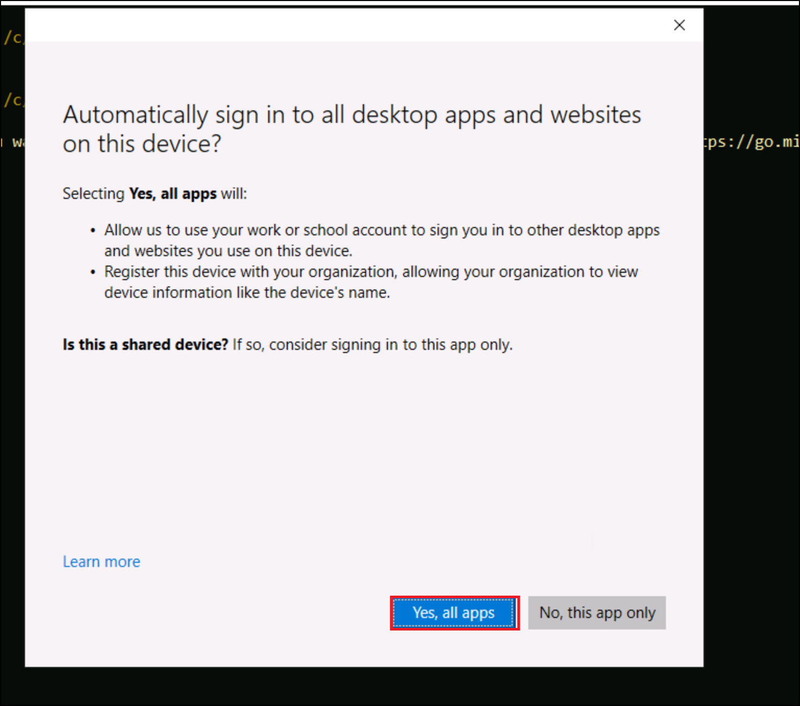

2.  Hover on **Boards** from left navigation menu and select **Boards**

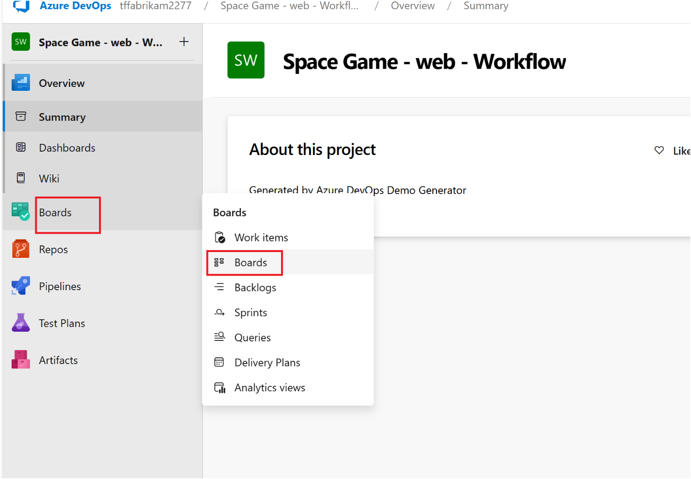

3.  Click on **New Item** under **To Do** column as shown in below
    image.

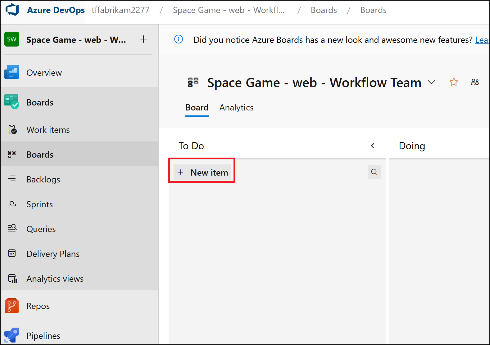

4.  Create the items below. Enter the item name and then click on **Add
    to top**.

> **Stabilize the build server**
>
> **Create a Git-based workflow**
>
> **Create unit tests**
>
> **Check code for vulnerabilities**
>
> **Move model data to its own package**
>
> **Investigate hosted vs private build servers**
>
> 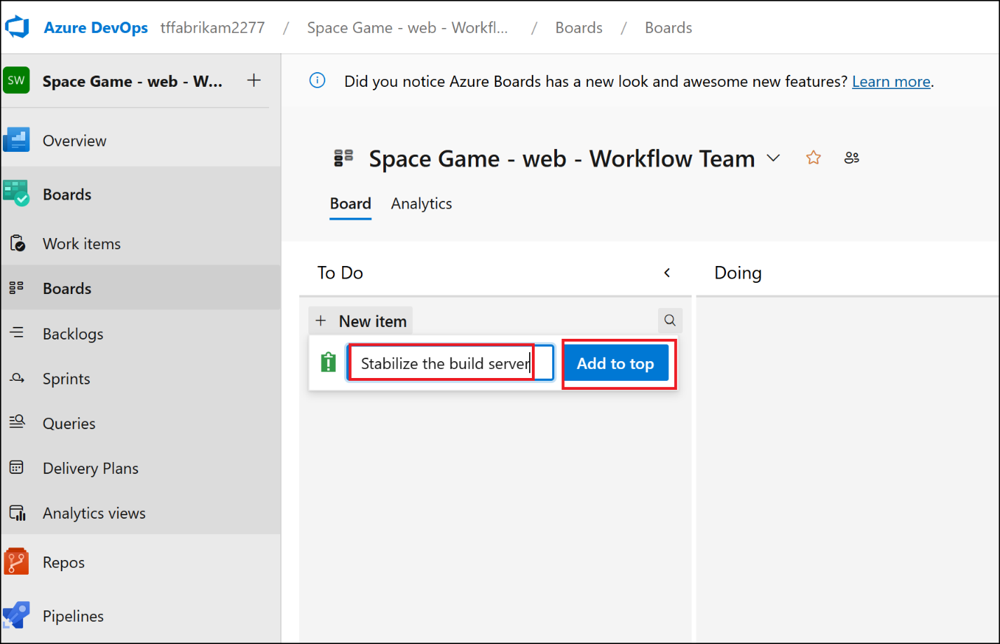
>
> 

5.  In the Create a multistage pipeline card, select the **Stabilize the
    build server**. Then, assign the work item to yourself. Move the
    work item from the **To Do** column to the **Done** column.

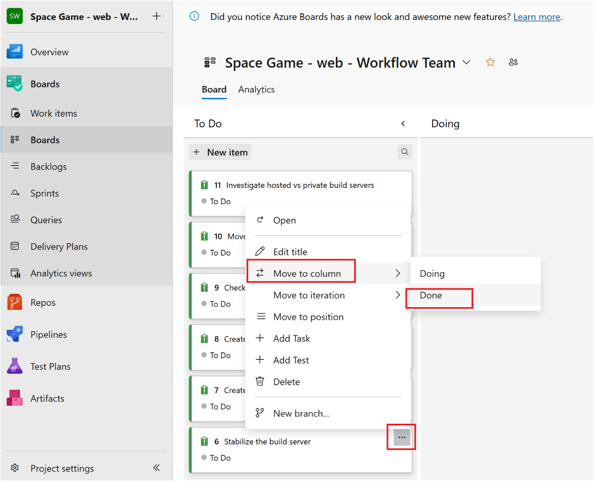

6.  In the Create a multistage pipeline card, select the **Create a
    Git-based workflow**. Then, assign the work item to yourself. Move
    the work item from the **To Do** column to the **Doing** column.

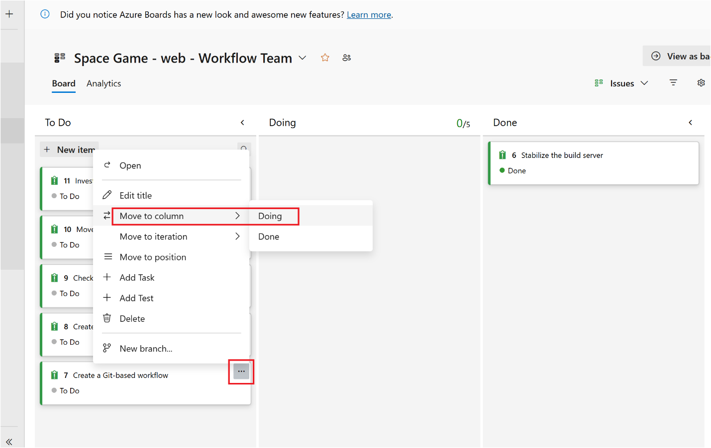

### Task 3 : Fetch the branch from GitHub

1.  On GitHub, go to
    the https://github.com/MicrosoftDocs/mslearn-tailspin-spacegame-web.git repository.

2.  Select **Fork** at the top-right of the screen.

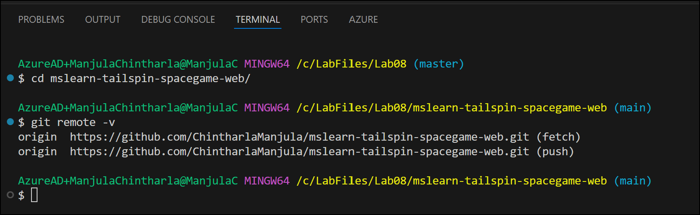

3.  Choose your GitHub account as the Owner, then select **Create
    fork**.

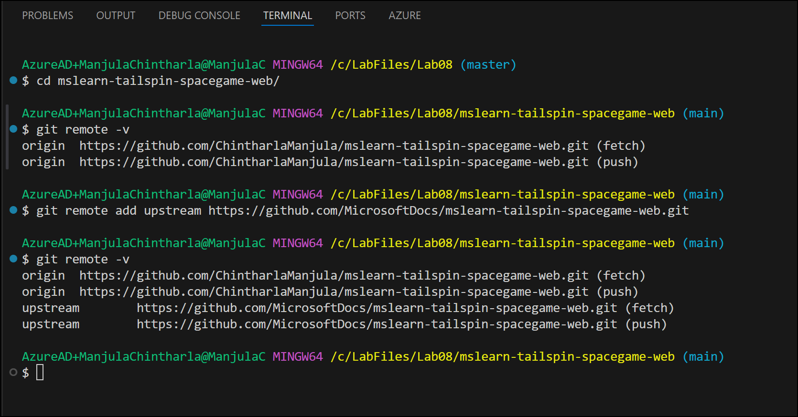

4.  Select Code, and then, from the HTTPS tab, select the copy button to
    copy the URL to your clipboard.

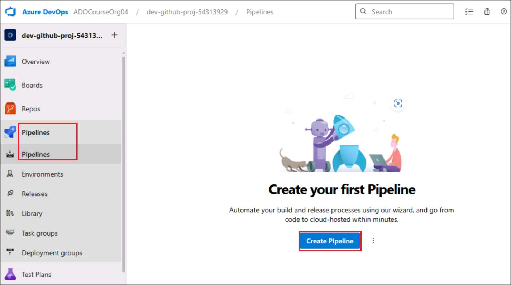

5.  Open Visual Studio Code, go to the terminal window.

> 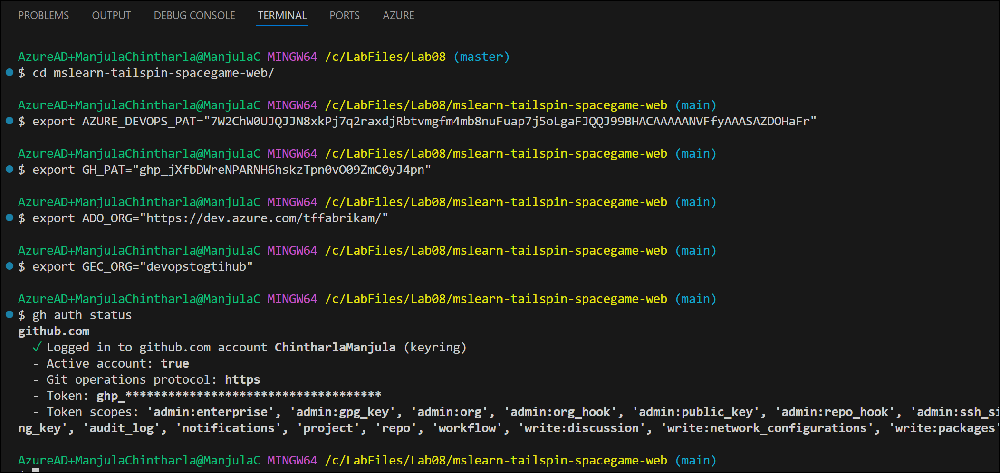

6.  Update the command below with your forked repo link and run the git
    clone command. Replace YOURUSERNAME with your GitHub username.

> git clone
> https://github.com/\<\<YOURUSERNAME\>\>/mslearn-tailspin-spacegame-web.git
>
> 

7.  Open Terminal and run below command to go the folder

cd mslearn-tailspin-spacegame-web-deploy

8.  A *remote* is a Git repository where team members collaborate (like
    a repository on GitHub). Here you list your remotes and add a remote
    that points to Microsoft's copy of the repository so that you can
    get the latest sample code.

9.  Run the following command to list your remotes:

git remote -v

10. Origin specifies your repository on GitHub. When you fork code from
    another repository, the original remote (the one you forked from) is
    commonly named upstream.

11. Run the following command to create a remote named *upstream* that
    points to the Microsoft repository:

> git remote add upstream
> https://github.com/MicrosoftDocs/mslearn-tailspin-spacegame-web.git
>
> git remote -v

## Exercise 2 - Create a pull request

In this exercise, you'll practice the process of submitting a pull
request and merging your changes into the main branch so that everyone
can benefit from your work.

In Create a build pipeline with Azure Pipelines, you created a Git
branch named build-pipeline, where you defined a basic build pipeline
for the *Space Game* website. Recall that your build definition is in a
file named ***azure-pipelines.yml***.

Although your branch produces a build artifact, that work exists only on
the build-pipeline branch. You need to merge your branch into
the main branch.

Recall that a *pull request* tells the other developers that you have
code ready to review, if necessary, and you want your changes merged
into another branch, such as the main branch.

### Task 1 : Create a GitHub connection

Here, you create a service connection that enables Azure Pipelines to
access your Azure subscription. Azure Pipelines uses this service
connection to deploy the website to App Service. You created a similar
service connection in the previous labs.

** Important:**Make sure that you're signed in to both the Azure portal
and Azure DevOps under the same Microsoft account.

1.  In Azure DevOps, go to your **Space Game - web - Workflow** project.

2.  From the lower-left corner of the page, select **Project settings**.

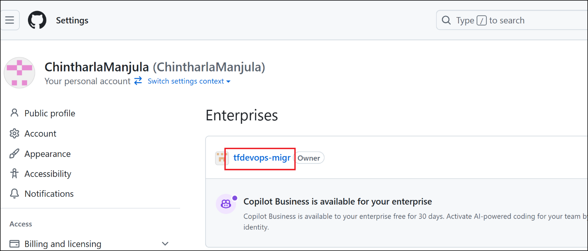

3.  Under **Pipelines**, select **Service connections**. Select **Create
    service connection**.

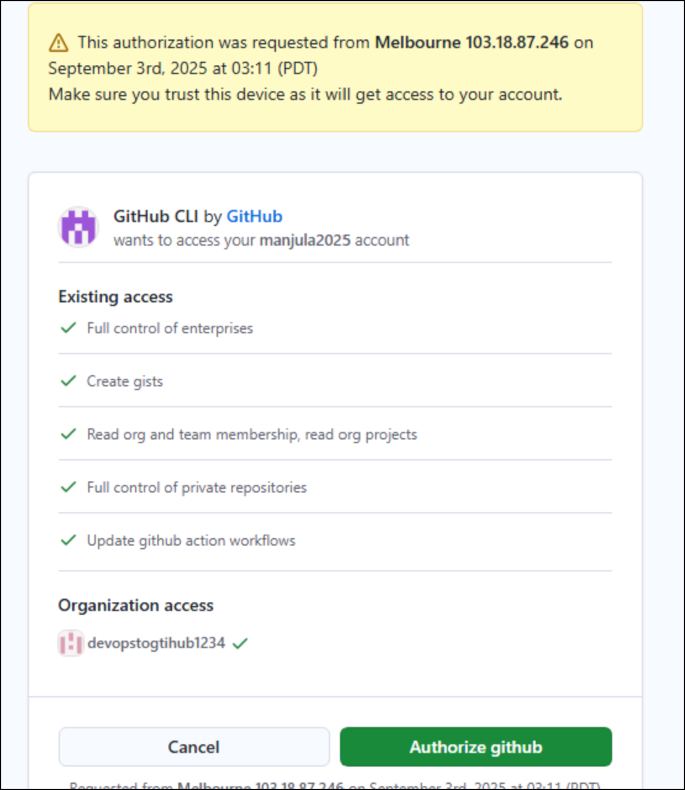

4.  Select **GitHub** and then click **Next**.

5.  Select **AzurePipelines** from **OAuth Configuration** drop down and
    then click on **Authorize** button.

6.  Sign into GitHub and select your repo.

7.  Keep the default service name, select **Grant access permission to
    all pipelines** security check box and then click on **Save** .

8.  Click on project name from top navigation menu.

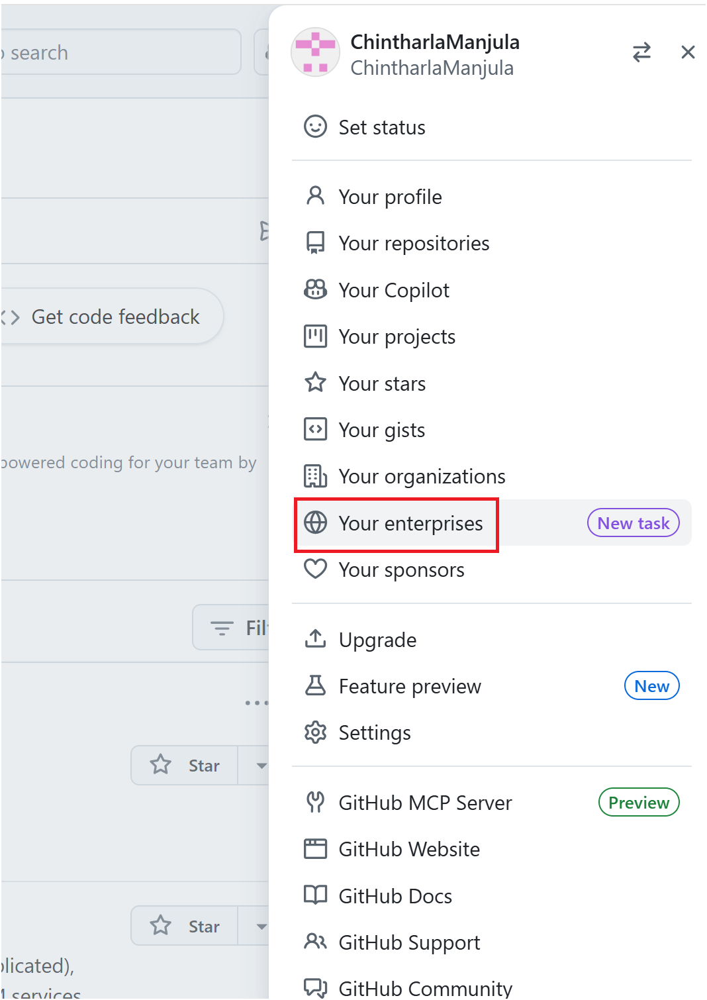

9.  Select the **Pipelines** from the left navigation menu and select
    the pipeline to **Edit**.

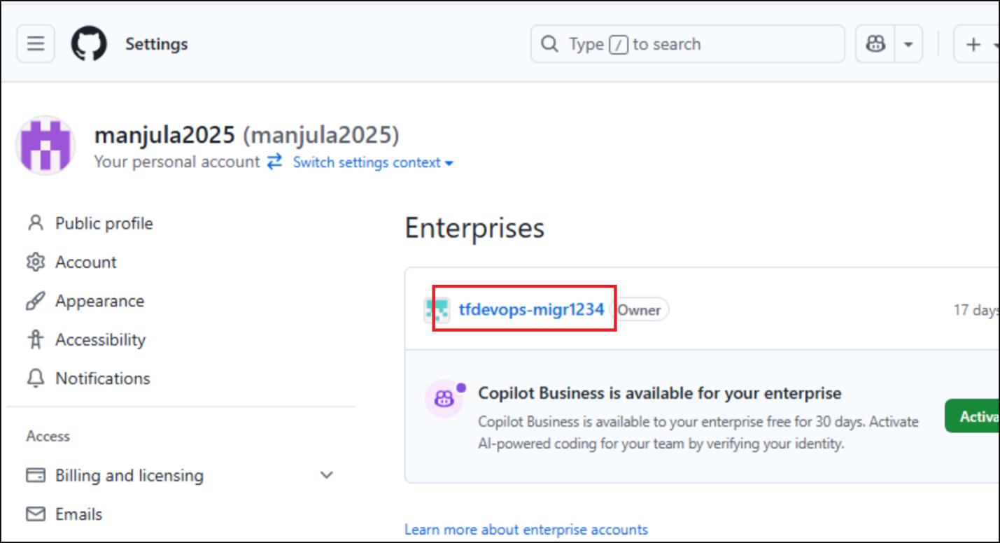

10. Select **code-workflows** branch and then click next to **Run**
    button and select **Triggers**.

11. Configure CI settings under **Triggers** tab, **select Override the
    YAML continuous integration trigger from here** checkbox and then
    include **code-workflows** branch

12. Select **YAML** tab and select **Pipeline** and then select Default
    from **Default agent pool for YAML** dropdown

13. Select **Get sources-\>GitHub** and then click on **Repository**

14. Select the repo - **mslearn-tailspin-spacegame-web** and then click
    on **Select** button.

15. Keep all the default values and then click on **Save & queue-\>
    Save**.

16. Enter some comment and click on Save to save the build pipeline.

### Task 1 : Create a branch and add starter code

Although you could use the build pipeline you built in the previous
module, let's create a new branch named code-workflow. This branch is
based on main, so you can practice the process from the beginning.

1.  In Visual Studio Code, open the integrated terminal.Run below
    command to switch to the main branch:

git checkout main

2.  Ensure that you have the latest version of the code from GitHub:

git pull origin main

3.  Create a branch named code-workflow:

git checkout -B code-workflow

4.  From the file explorer, open ***azure-pipelines.yml*** and replace
    its contents with this:

> trigger:
>
> \- '\*'
>
> pool:
>
>   name: 'Default'  # Self-hosted agent pool
>
>   demands:
>
>   - npm
>
> variables:
>
>   buildConfiguration: 'Release'
>
>   wwwrootDir: 'Tailspin.SpaceGame.Web/wwwroot'
>
>   dotnetSdkVersion: '8.x'
>
> steps:
>
> \- task: UseDotNet@2
>
>   displayName: 'Use .NET SDK $(dotnetSdkVersion)'
>
>   inputs:
>
>     version: '$(dotnetSdkVersion)'
>
> \- task: Npm@1
>
>   displayName: 'Run npm install'
>
>   inputs:
>
>     verbose: false
>
> \- script: './node_modules/.bin/node-sass $(wwwrootDir) --output
> $(wwwrootDir)'
>
>   displayName: 'Compile Sass assets'
>
> \- script: './node_modules/.bin/gulp'
>
>   displayName: 'Run gulp tasks'
>
> \- script: 'echo "$(Build.DefinitionName), $(Build.BuildId),
> $(Build.BuildNumber)" \> buildinfo.txt'
>
>   displayName: 'Write build info'
>
>   workingDirectory: $(wwwrootDir)
>
> \- task: DotNetCoreCLI@2
>
>   displayName: 'Restore project dependencies'
>
>   inputs:
>
>     command: 'restore'
>
>     projects: '\*\*/\*.csproj'
>
> \- task: DotNetCoreCLI@2
>
>   displayName: 'Build the project - $(buildConfiguration)'
>
>   inputs:
>
>     command: 'build'
>
>     arguments: '--no-restore --configuration $(buildConfiguration)'
>
>     projects: '\*\*/\*.csproj'
>
> \- task: DotNetCoreCLI@2
>
>   displayName: 'Publish the project - $(buildConfiguration)'
>
>   inputs:
>
>     command: 'publish'
>
>     projects: '\*\*/\*.csproj'
>
>     publishWebProjects: false
>
>     arguments: '--no-build --configuration $(buildConfiguration)
> --output $(Build.ArtifactStagingDirectory)/$(buildConfiguration)'
>
>     zipAfterPublish: true
>
> \- task: PublishBuildArtifacts@1
>
>   displayName: 'Publish Artifact: drop'
>
>   condition: succeeded()

### Task 2 : Push your branch to GitHub

Here, you'll push your code-workflow branch to GitHub and watch Azure
Pipelines build the application.

1.  In the terminal, run git status to see what uncommitted work exists
    on your branch. You'll see that azure-pipelines.yml has been
    modified. You'll commit that to your branch shortly, but you first
    need to ensure that Git is tracking this file which is
    called staging the file.

Only staged changes are committed when you run git commit. Next, you run
the git add command to add *azure-pipelines.yml* to the staging area, or
index.

git status

2.  Run the following git add command to add azure-pipelines.yml to the
    staging area:

git add azure-pipelines.yml

3.  Run the following git commit command to commit your staged file to
    the code-workflow branch:

git commit -m "Add the build configuration"

> 

4.  Run this git push command to push, or upload,
    the code-workflow branch to your repository on GitHub:
    The -m argument specifies the commit message. The commit message
    becomes part of a changed file's history. It helps reviewers
    understand the change, and it helps future maintainers understand
    how the file changed over time.

git push origin code-workflow

5.  Switch back to Azure DevOps project and select the project.

6.  Switch back to Azure DevOps project and select the running pipeline.

7.  Click on the running build.

8.  Click on **View** next to the warning message “  
    **This pipeline needs permission to access a resource before this
    run can continue”**

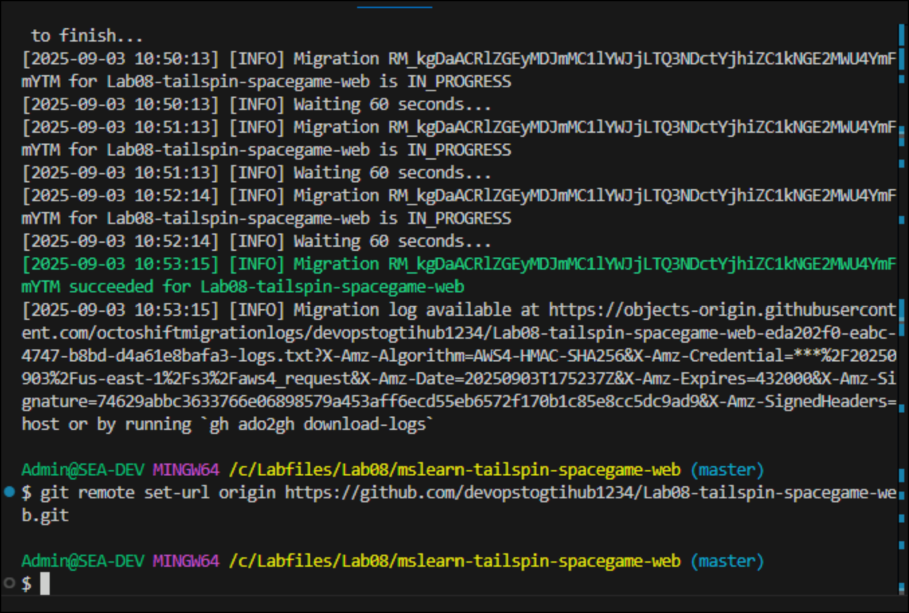

9.  Click on **Permit -\> Permit** to grant permission to run build.

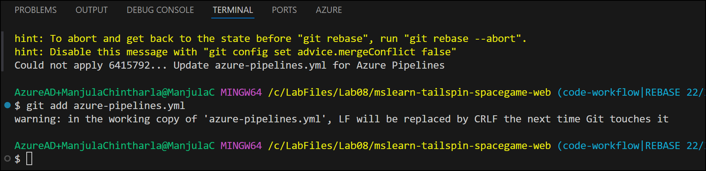

10. Wait for them to be completed.

### Task 2 : Create a pull request

1.  In a browser, sign in to [GitHub](https://www.github.com/).Go to
    your **mslearn-tailspin-spacegame-web** repository.In
    the **Branch** drop-down list, select your code-workflow branch.

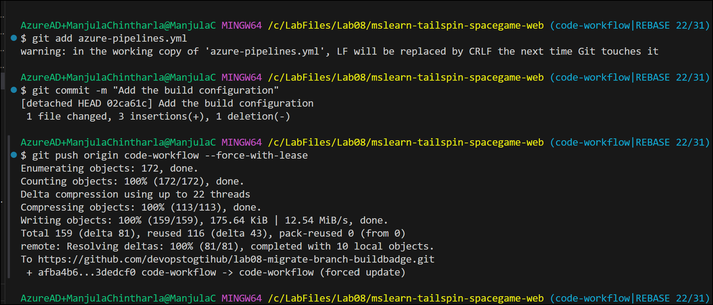

2.  To start your pull request, select **Contribute** and then **Open
    pull request**.

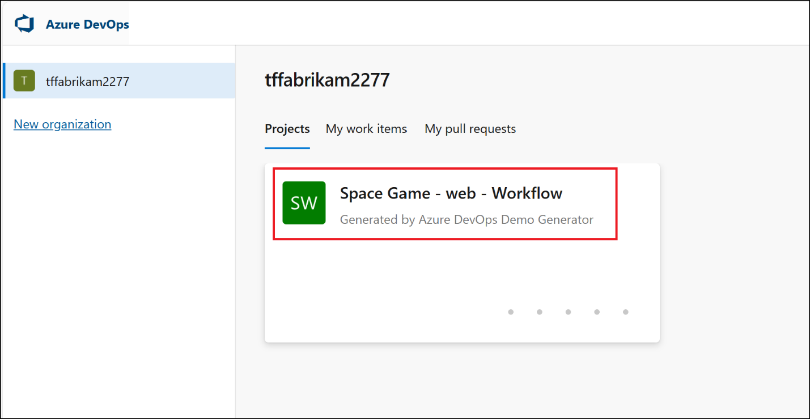

3.  Ensure that the **base** specifies your forked repository and not
    the Microsoft repository.Your selection looks like this.This process
    involves an extra step because you're working from a forked
    repository. When you work directly with your own repository, and not
    a fork, your main branch is selected by default.

1.  Enter a title and description for your pull request. This step
    doesn't merge any code. It tells others that you have proposed
    changes to be merged into the main branch.

    - Title: ***Configure Azure Pipelines***

    &nbsp;

    - Description:***This pipeline configuration builds the application
      and produces a build for the Release configuration**.*

    &nbsp;

    - To complete your pull request, select **Create pull request**.

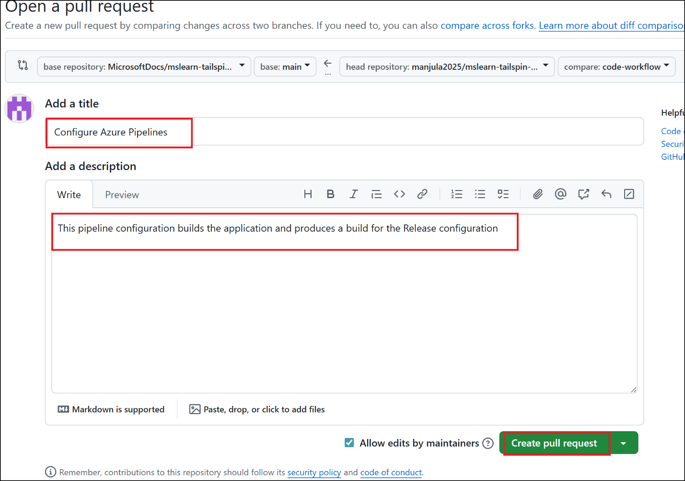

1.  Click on **Pull request** and select the first request

2.  The pull request window is displayed. You can see that the build
    status in Azure Pipelines is configured to appear as part of the
    pull request. That way, you and others can view the status of the
    build as it's running.

3.  The pull request window is displayed. You can see that the build
    status in Azure Pipelines is configured to appear as part of the
    pull request. That way, you and others can view the status of the
    build as it's running.

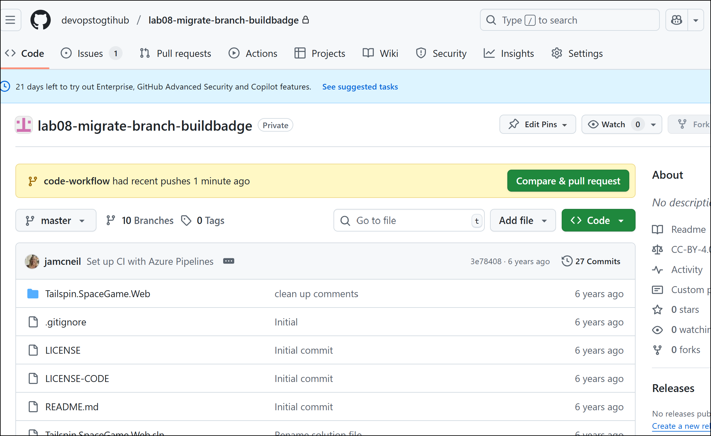

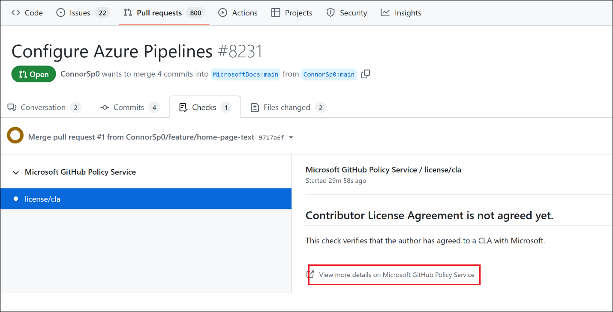

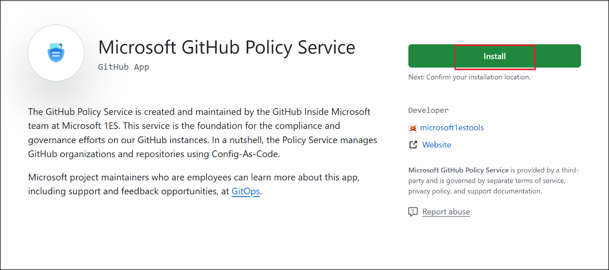

4.  Select **Merge pull request**, and then select **Confirm merge**.

5.  To delete the code-workflow branch from GitHub, select **Delete
    branch**.

## Exercise 3 - Push a change through the pipeline

In this unit, you'll practice the complete code workflow by pushing a
small change to the *Space Game* website to GitHub.

Mara has been given the task of changing some text on the home page of
the website, *Index.cshtml*. In this unit, you'll follow along.

Let's briefly review the steps to follow to complete the task:

- Synchronize your local repository with the latest main branch on
  GitHub.

- Create a branch to hold your changes.

- Make the code changes you need, and verify them locally.

- Push your branch to GitHub.

- Merge any recent changes from the main branch on GitHub into your
  local working branch, and verify that your changes still work.

- Push up any remaining changes, watch Azure Pipelines build the
  application, and submit your pull request.

### Task 1 : Fetch the latest main branch

In the previous unit, you created a pull request and merged
your code-workflow branch into the main branch on GitHub. Now you need
to pull the changes to main back to your local branch.

The git pull command fetches the latest code from the remote repository
and merges it into your local repository. This way, you know you're
working with the latest code base.

1.  In your terminal, run git checkout main to switch to
    the main branch:

git checkout main

2.  To pull down the latest changes, run this git pull command:

git pull origin main

3.  In Visual Studio Code, go to the terminal window and run the
    following dotnet build command to build the application:

dotnet build --configuration Release

4.  Run the following dotnet run command to run the application:

dotnet run --configuration Release --no-build --project
Tailspin.SpaceGame.Web

5.  After your computer trusts your local SSL certificate, run
    the dotnet run command a second time and go
    to http://localhost:5000 from a new browser tab to see the running
    application.

.

### Task 2 : Make changes and test it locally

1.  In your terminal, run the following git checkout command:

git checkout -B feature/home-page-text

1.  In Visual Studio Code, open *Index.cshtml* in
    the *Tailspin.SpaceGame.Web/Views/Home* directory.

2.  Look for this text near the top of the page:

\<p\>An example site for learning\</p\>

3.  replace the text in the previous step with the following "mistyped"
    text, and then save the file: Note that the word "oficial" is
    intentionally mistyped. We'll address that error later in this
    module.

\<p\>Welcome to the oficial Space Game site!\</p\>

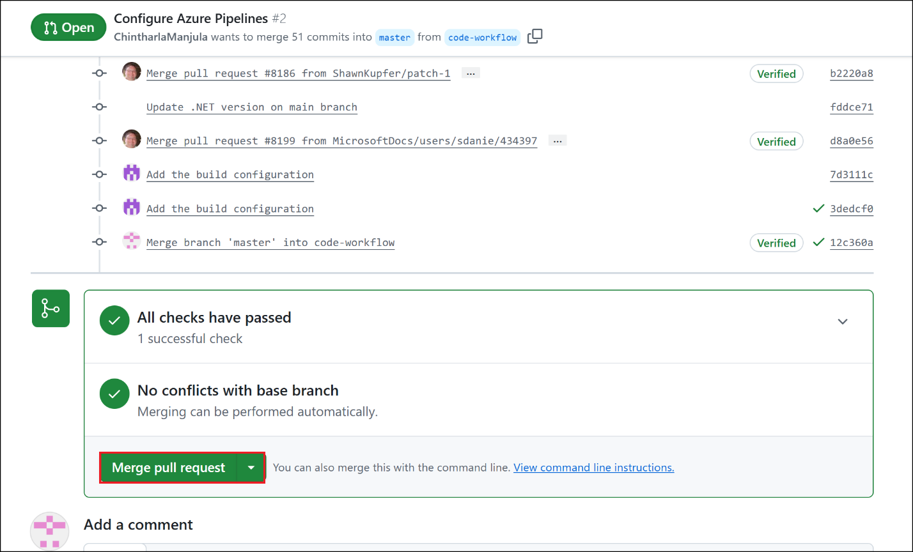

4.  In your terminal, run the following dotnet build command to build
    the application:

dotnet build --configuration Release

5.  Run the following dotnet run command to run the application:

dotnet run --configuration Release --no-build --project
Tailspin.SpaceGame.Web

6.  On a new browser tab, go to http://localhost:5000 to see the running
    application.

You can see that the home page contains the updated text.

7.  When you're finished, return to the terminal window, and then
    press **Ctrl+C** to stop the running application.

> 

### Task 3 :Commit and push your branch

Here you'll stage your changes to *Index.cshtml*, commit the change to
your branch, and push your branch up to GitHub.

1.  Run git status to check and see whether there are uncommitted
    changes on your branch: You'll see that Index.cshtml has been
    modified. Like before, the next step is to make sure that Git is
    tracking this file, which is called staging the file.

git status

2.  Run the following git add command to stage *Index.cshtml*:

git add Tailspin.SpaceGame.Web/Views/Home/Index.cshtml

3.  Run the following git commit command to commit your staged file to
    the feature/home-page-text branch:

git commit -m "Improve the text at the top of the home page"

4.  Run this git push command to push, or upload,
    the feature/home-page-text branch to your repository on GitHub:

git push origin feature/home-page-text

5.  Just as before, you can locate your branch on GitHub from the branch
    drop-down box.

### Task 4 : Watch Azure Pipelines build the application

Just as you did previously, Azure Pipelines automatically queues the
build when you push changes to GitHub.

As an optional step, trace the build as it moves through the pipeline,
and verify that the build succeeds.

**Synchronize any changes to the main branch**

While you were busy working on your feature, changes might have been
made to the remote main branch. Before you create a pull request, it's
common practice to get the latest from the remote main branch.

To do this, first check out, or switch to, the main branch. Then, merge
the remote main branch with your local main branch.

Next, check out your feature branch, and then merge your feature branch
with the main branch.

Let's try the process now.

1.  In your terminal, run this git checkout command to check out
    the main branch:

git checkout main

2.  To download the latest changes to the remote main branch and merge
    those changes into your local main branch, run this git
    pull command:

git pull origin main

> 

3.  To check out your feature branch, run git checkout:

git checkout feature/home-page-text

4.  Merge your feature branch with main:

git merge main

. 

### Task 5 : Push your local branch again

When you incorporate changes from the remote repository into your local
feature branch, you need to push your local branch back to the remote
repository a second time.

Although you didn't incorporate any changes from the remote repository,
let's practice the process to see what happens.

1.  In a browser, sign in to [GitHub](https://www.github.com/).Go to
    your **mslearn-tailspin-spacegame-web** repository.

2.  In the drop-down list, select
    your **feature/home-page-text** branch.

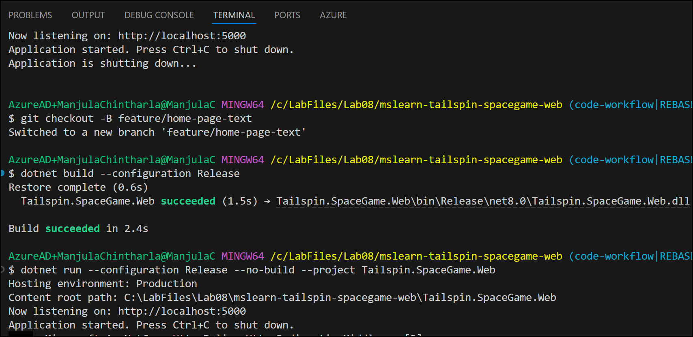

3.  To start your pull request, select **Contribute** and then **Open
    pull request**.

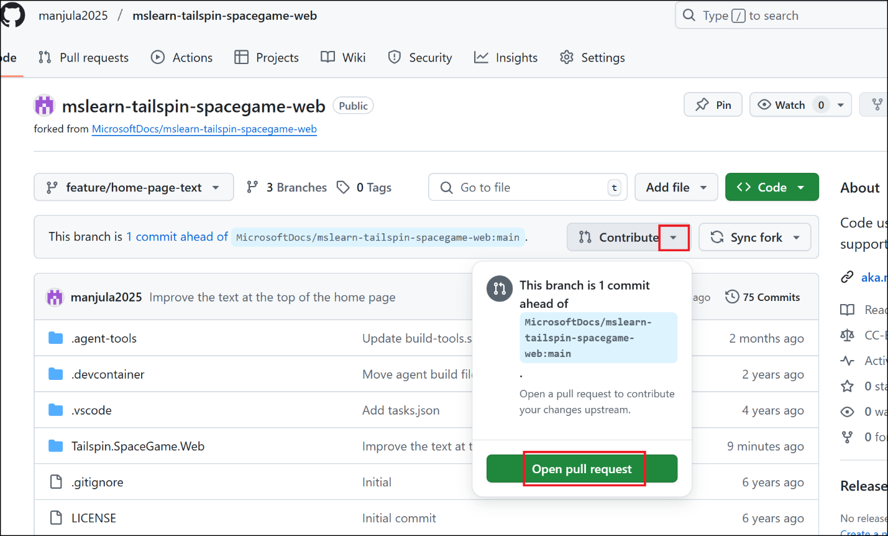

4.  Ensure that the **base** drop-down list specifies your repository
    and not the Microsoft repository.

5.  Enter a title and a description for your pull request.

    - **Title**: *Improve the text at the top of the home page*

    &nbsp;

    - **Description**: *Received the latest home page text from the
      product team.*

6.  To complete your pull request, select **Create pull request**.This
    step doesn't merge any code. It tells others that you have changes
    that you're proposing to merge.The pull request window is displayed.
    As before, a pull request triggers Azure Pipelines to build your
    application by default.

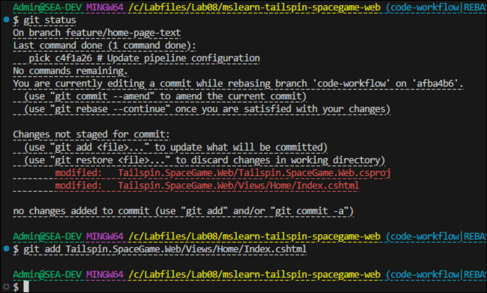

## Exercise 4 - Add a build badge

It's important for team members to know the build status. An easy way to
quickly determine the build status is to add a build badge to
the *README.md* file on GitHub. Let's check in on the team to see how
it's done.

### Task 1 : Check **build badge**

A *badge* is part of Microsoft Azure Pipelines. It has methods you can
use to add an SVG image that shows the status of the build on your
GitHub repository.

Most GitHub repositories include a file named *README.md*, which is a
Markdown file that includes essential details and documentation about
your project. GitHub renders this file on your project's home page.

1.  In Azure DevOps, navigate to your organization.Select **Organization
    settings** from the bottom corner.

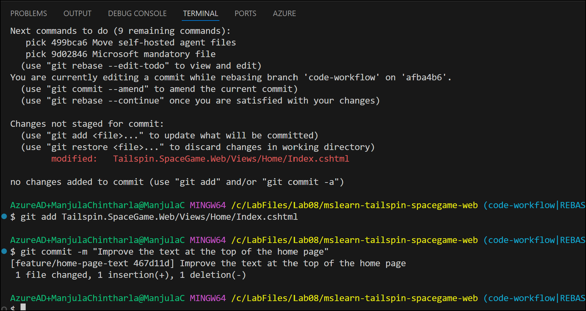

2.  Under **Pipelines**, select **Settings**.Turn off **Disable
    anonymous access to badges**.

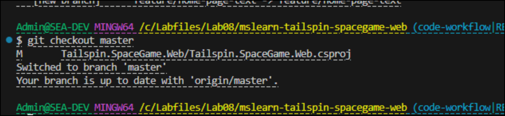

3.  Go to your project.Navigate to **Project settings** from the bottom
    corner.

4.  Under **Pipelines**, select **Settings**.Turn off **Disable
    anonymous access to badges**.

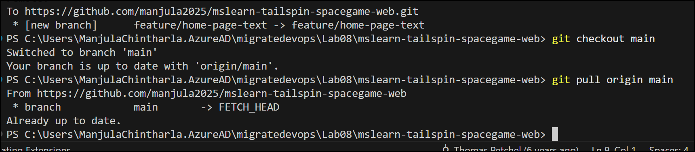

### Task 2 : Add the build badge

Up until now, you created Git branches locally to make changes to
the *Space Game* project. You can also propose changes directly through
GitHub. In this section, you do that to set up your status badge.

1.  In Azure DevOps, in the left pane, select **Pipelines**, then select
    your pipeline.

2.  Select the ellipsis (**...**) in the upper right, then
    select **Status badge**.

3.  Under **Sample Markdown**, select the **Copy** button to copy the
    Markdown code to the clipboard.

> 

4.  In GitHub, go to your project.Make sure you're on the main branch.
    In the files area, open the *README.md* file.Select **Edit this
    file** (the pencil icon) to open the file in the editor.

> 

5.  At the top of the page, add a blank line, and then paste the
    contents of the clipboard. Select the **Preview** tab to see your
    proposed changes.

6.  GitHub renders the Markdown file and shows you the build
    badge.Select **Commit changes**.

7.  In the *Commit message* area, specify a commit message, such as
    "**Add build badge**".Leave the **Commit directly to
    the main branch** option selected, then select **Commit changes** to
    commit your changes to the main branch.

### Task 3 : Add a build history widget to the dashboard

1.  In Azure DevOps, select **Overview**, then
    select **Dashboards**.Select **Add a widget**.

2.  In the **Add widget** pane, search for **Build History**.Drag
    the **Build History** tile to the canvas.

3.  Select the **Gear** icon to configure the widget.

    1.  Keep the **Build History** title.

    &nbsp;

    1.  In the **Pipeline** drop-down list, select your pipeline.

    &nbsp;

    1.  Keep **All branches** selected.

    2.  Select **Save**.

> 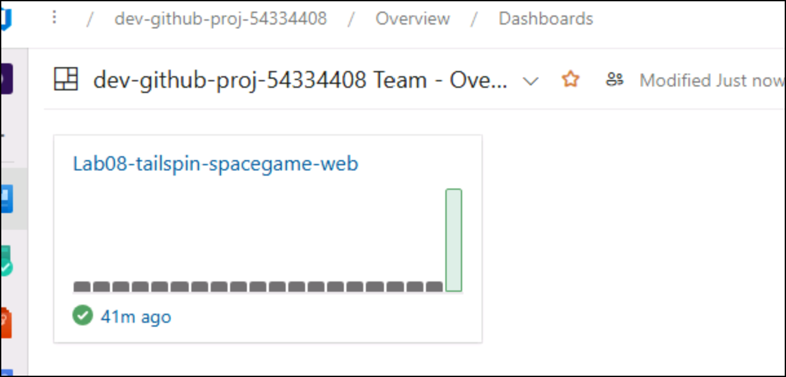
>
> 

4.  Select **Done Editing**.The **Build History** widget is displayed on
    the dashboard.

5.  Hover over each build to view the build number, when the build was
    completed, and the elapsed build time.Each build succeeded, so the
    bars on the widget are all green. If the build had failed, it would
    appear in red.

6.  Select one of the bars to drill down into that build.

### Task 4 : Set up approvals

In this section, you'll set up a rule on GitHub that requires at least
one reviewer to approve a pull request before it can be merged into
the main branch. You'll then verify that the rule works by pushing up a
fix to the typing error that Mara made earlier.

1.  In GitHub, go to your *Space Game* project repository.Select
    the **Settings** tab near the top of the page.On the left menu,
    select **Branches**.Make sure that **main** is selected as your
    default branch.

2.  Select **Add classic branch protection rule**.

3.  Under **Branch name pattern**, enter **main**.

- Select the **Require a pull request before merging** check box.

- Select the **Require approvals** check box.

- Keep the **Required approving reviews** value at **1**.

4.  Select **Create**.

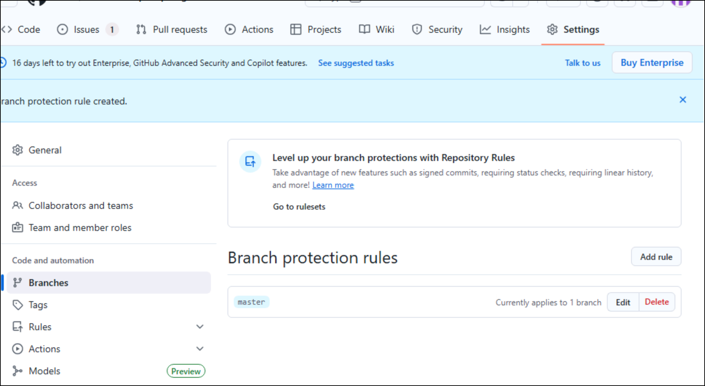

### Task 5 : Submit the fix

In this section, you submit a fix to the typing error on the home page.
Remember that the word "official" is mistyped as "oficial."

1.  In Visual Studio Code, go to the terminal.To check out
    the main branch, run git checkout:

git checkout main

2.  To pull down the latest changes to the main branch from GitHub,
    run git pull:

git pull origin main

3.  To fix the error, create and check out a branch:

git checkout -B bugfix/home-page-typo

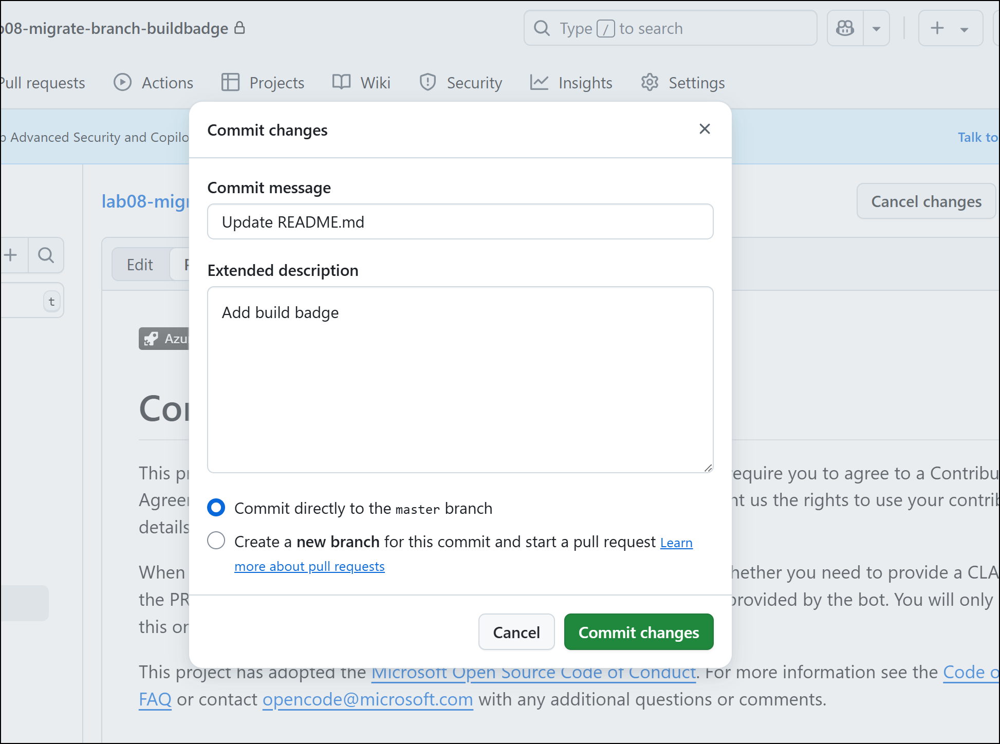

4.  In File Explorer, open **Index.cshtml**.Locate the error:

\<p\>Welcome to the oficial Space Game site!\</p\>

5.  Change the line to correct the error:

\<p\>Welcome to the official Space Game site!\</p\>

6.  Save the file.

7.  In the terminal, stage and commit the change and push the branch to
    GitHub.

git status

git add Tailspin.SpaceGame.Web/Views/Home/Index.cshtml

git commit -m "Fix typing error on the home page"

git push origin bugfix/home-page-typo

## Exercise 5 - Clean up your Azure DevOps environment

### Task 1 : Move the work item to Done

1.  In Microsoft Azure DevOps, select **Boards** on the left menu, then
    select **Boards**.

2.  Drag the **Create a Git-based workflow** work item from
    the **Doing** column to the **Done** column.

> 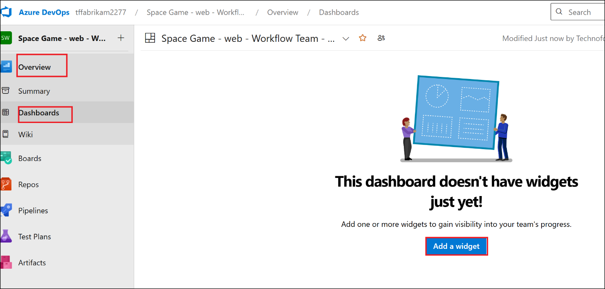
>
> 

Task 2 : **Delete your project**

1.  Click on **Project settings.**

2.  Click on **Delete** button under Delete project section. Enter the
    project name and then click on **Delete** button.

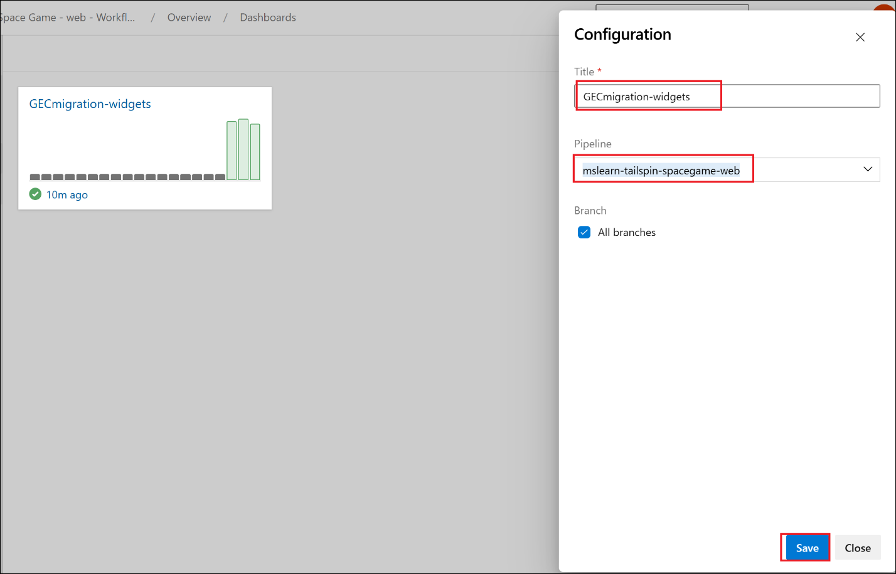
