# Lab 08 - Migrating Repositories from Azure DevOps to GitHub Enterprise Cloud Using GitHub CLI

The objective of this lab is to learn and practice the complete workflow
for migrating an existing Azure DevOps repository to GitHub Enterprise
Cloud (GEC) using the GitHub CLI, while integrating Azure Pipelines for
CI/CD.  
This includes:

- Preparing the Azure DevOps environment.

- Migrating repositories using gh ado2gh.

- Resolving merge conflicts and creating pull requests.

- Verifying builds through Azure Pipelines.

- Adding build badges and history widgets for project visibility.

- Configuring branch protection and cleaning up resources
  post-migration.

## Exercise 1 - Set up your Azure DevOps environment

In this section, you'll ensure that your Microsoft Azure DevOps
organization is set up to complete the rest of this module.

### Task 1 : Fetch the branch from GitHub

1.  Open Visual Studio Code, go to the terminal window.

> 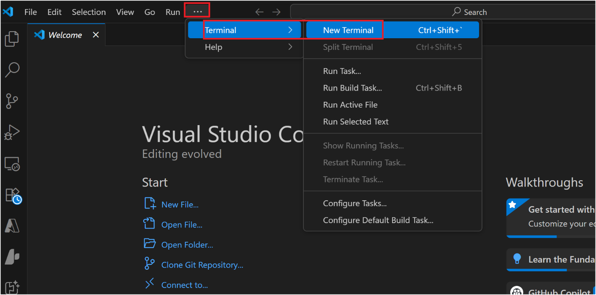

2.  Select **Git Bash** .

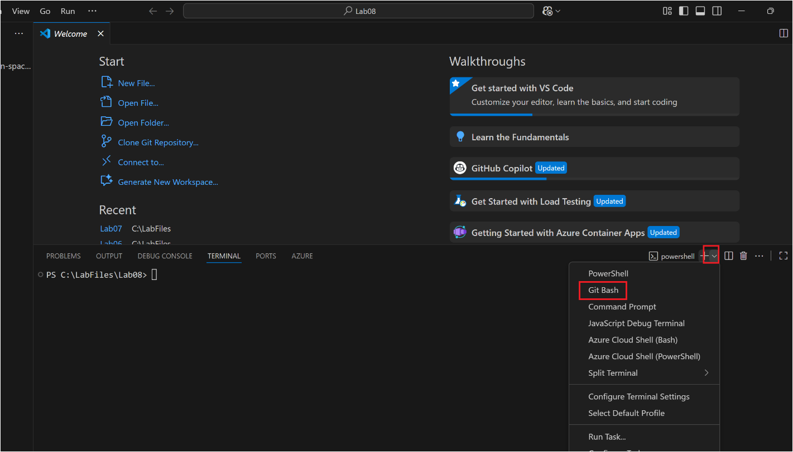

3.  Open Terminal and run below command to go the folder **C:\Lab08**

cd mslearn-tailspin-spacegame-web

4.  A *remote* is a Git repository where team members collaborate (like
    a repository on GitHub). Here you list your remotes and add a remote
    that points to Microsoft's copy of the repository so that you can
    get the latest sample code.

5.  Run the following command to list your remotes:

git remote -v

6.  Run the following command to create a remote named *upstream* that
    points to the Microsoft repository:

> git remote add upstream
> https://github.com/jamcneil/mslearn-tailspin-spacegame-web.git
>
> git remote -v

### Task 2 : Create Repos in ADO

1.  Switch back to DevOps Organization page and click on the existing
    project.

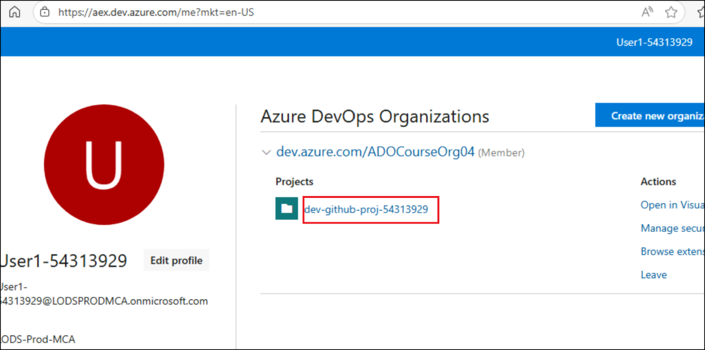

2.  Hover on **Repos** from left navigation menu and select **Files**.

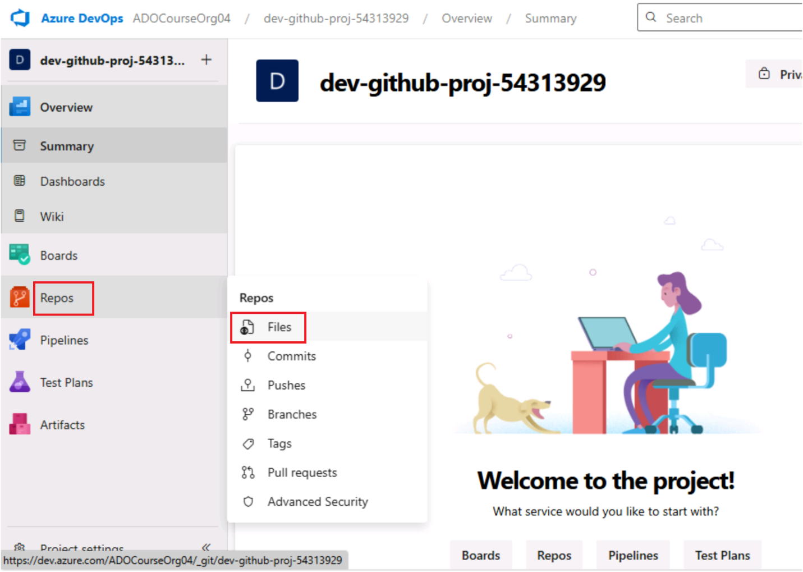

3.  Click on the project drop down form top navigation menu and select
    **New repository**.

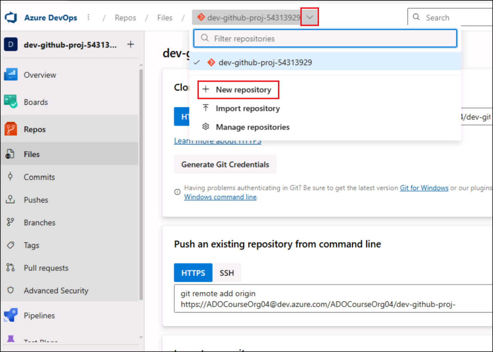

4.  Enter the Repository name as **Lab08**-**tailspin-spacegame-web**.
    Unselect “Add a README” checkbox and then click on **Create**.

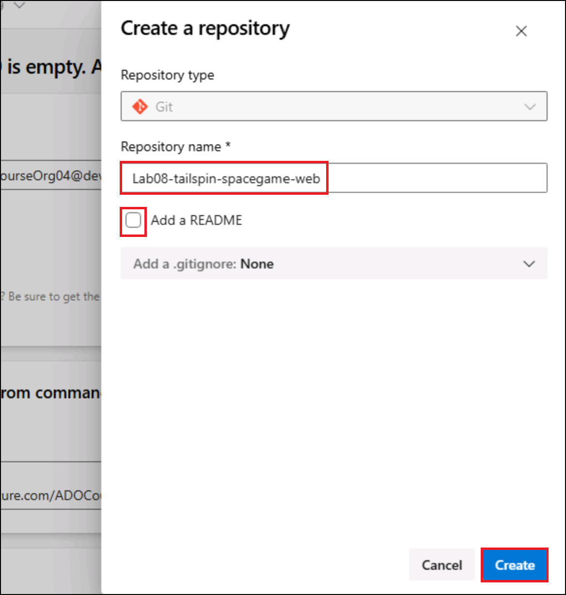

5.  Copy the HTTPS url to use in next exercise 2

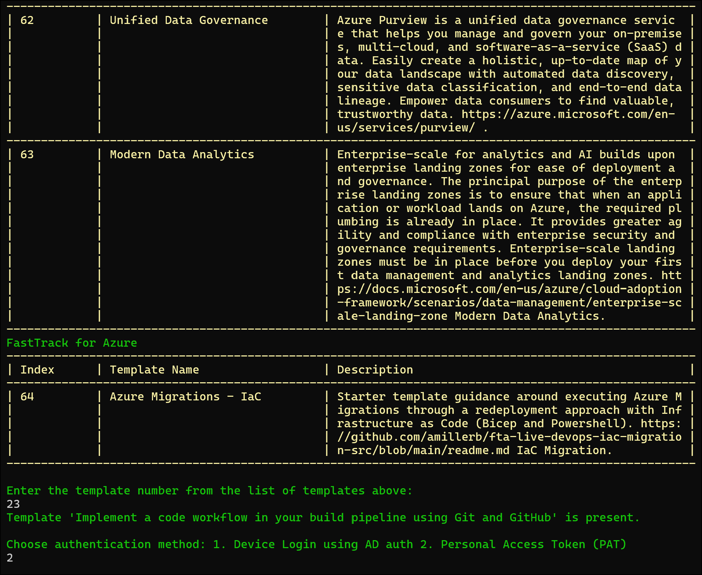

### Task 3 : Push Repo in Azure DevOps

1.  **Replace** you@example.com **with your GitHub account and Your Name
    to be replaced with your Github account username in the below
    commands and run them.**

**git config --global user.email "you@example.com"**

**git config --global user.name "Your Name"**

2.  **Run below commands to push the repo.**

git init

git add .

git commit -m "Initial commit for migration lab"

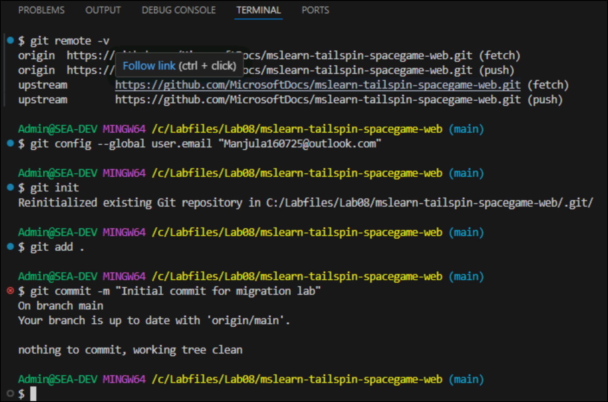

3.  **Run below command to sign into Azure. Select Work or school
    account option and click on Continue.**

**az login**

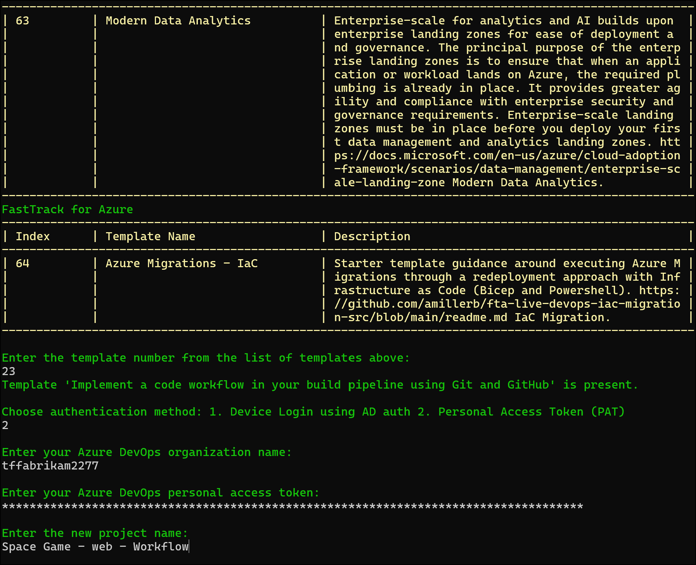

4.  **Sign in with your cloud slice accounts.**

- Username: <+++@lab.CloudPortalCredential>(User1).Username+++

- Password: <+++@lab.CloudPortalCredential(User1).Password>+++

> 

5.  Click on **Yes**,all apps button and then click on **Done**.

6.  Select your subscription and then press enter.

7.  **Run below command to push local folder to Azure Devops .(Replace**
    https://dev.azure.com/ADOCourseOrg04/dev-github-proj-53969426/\_git/azure-search-openai-migrated
    **with the https link you copied in previous step -Azure DevOps
    repos**

> git remote set-url origin \< Devops Repo Https url **\>**
>
> 

8.  Run below command to fetch all remote branchs. Sign in with your
    cloud slice account when prompts

> git fetch --all
>
> 
>
> 

9.  Run below code to create local tracking branches for each remote
    branch

> for branch in $(git branch -r | grep -v '\\\>'); do
>
> git branch --track ${branch#origin/} $branch
>
> done

10. Run below command to pull all branches to update them locally

> git pull --all

11. **Run below command to push the repo to Devops . if it prompts to
    sign in ,sign in with your DevOps account.**

> git push -u origin --all

**Note : If you already have repo in Devops then follow steps to pull
and resolve conflict – 1. Pull from DevOps with unrelated history:**
**git pull origin main --allow-unrelated-histories Step 2 : Resolve
conflicts in files like .gitignore, README.md. Step 3 : Stage the
resolved files - git add . step 4 : git commit -m "Resolved merge
conflicts"**

12. **Go back to Azure DevOps project and check** Repos-\> Files **.You
    should see your repo here .**

### Task 4 : Create pipeline to use GEC repo

1.  Click on **Pipelines** from left navigation menu and then select
    Pipeline.Click on **Create Pipeline**.

2.  Select **Azure Repo git** tile

3.  Select the **Lab08-tailspin-spacegame-web** repo.

4.  Select **ASP.NET**

5.  Click on **Run** drop down and select **Save**.

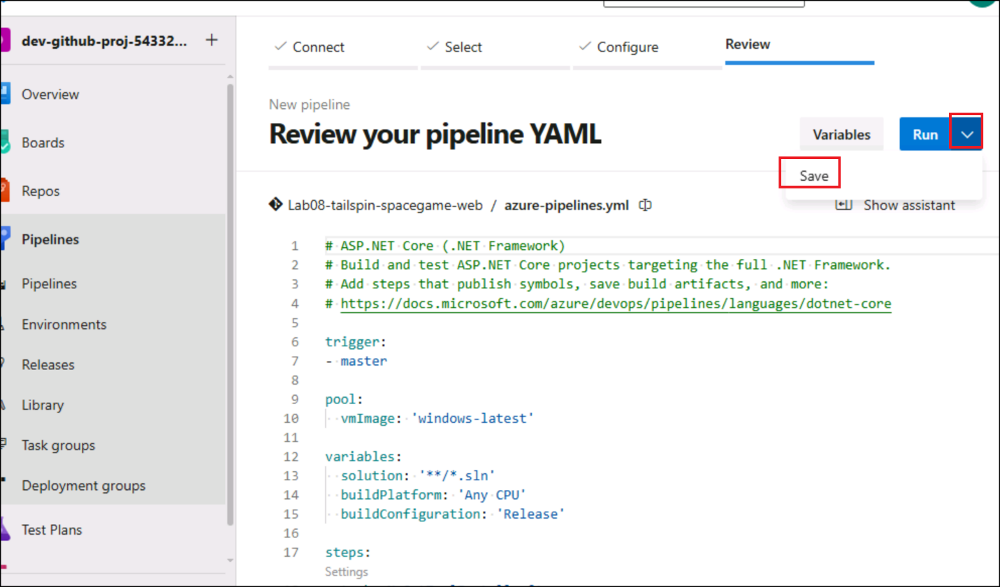

### Task 5 : Migrate Azure DevOps Repo to GitHub Enterprise Cloud

1.  Switch back to Visual Studio and run below commands to set
    environment varaibles. Make sure to update variables with your
    values and then run them.

export AZURE_DEVOPS_PAT="YOUR_AZDO_PAT"

export GH_PAT="ghp_xxxxxxxxxxxxxxxxxxxxx"

export ADO_ORG="https://dev.azure.com/your-ado-org" \# or simply
"your-ado-org" if you prefer

export GEC_ORG="your-githubEC-org” e.g. devopstogtihub1234

export ADO_PROJECT="**dev-github-proj-XXXXX**" \#ADO project – replace
XXXXX with your project number

2.  Run below commands to verify GitHub login status. If not logged in
    then run 2^(nd) command gh auth login and follow the process to
    loginto GitHub.

gh auth status

gh auth login

3.  Run below command to install gh extension

gh extension install github/gh-gei

gh extension install github/gh-ado2gh

4.  Run below command to grant migrator role to your account.(replace
    your-github-username with your username)

gh gei grant-migrator-role --github-org $GEC_ORG --actor
\<your-github-username\> --actor-type USER

eg :gh gei grant-migrator-role --github-org devopstogtihub --actor
chintharlamanjula --actor-type USER

5.  Run below dry-run command to migrate repos to GEC and copy migration
    id**  
    (Note: We have used repo -** **tailspin-spacegame-web-deploy . You
    can check this in your ADO-\>Org-\> Project-\> Repo )**

gh ado2gh migrate-repo --ado-org 
$ADO_ORG --ado-team-project $ADO_PROJECT --ado-repo **Lab08**-**tailspin-spacegame-web**
--github-org $GEC_ORG
--github-repo **Lab08**-**tailspin-spacegame-web**  --ado-pat $AZURE_DEVOPS_PAT --github-pat $GH_PAT --queue-only

1.  Copy repository migration and update below command with migration id
    and run.

gh ado2gh wait-for-migration --migration-id \<MIGRATION_ID\>
--github-pat $GH_PAT

2.  Switch back to GitHub browser tab, click profile and select **Your
    enterprises**.

3.  Click on your enterprise account.

4.  Click on **Organizations** tab and then select the organization you
    have created.

5.  Click on **Repositories** tab and you should see migrated repo

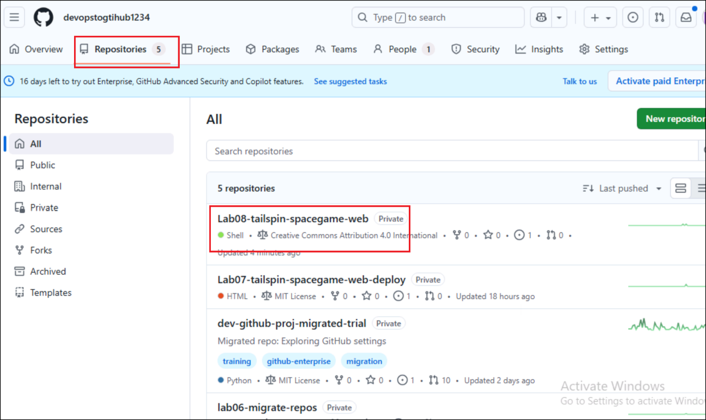

6.  Click on copy and copy the url to use in next task

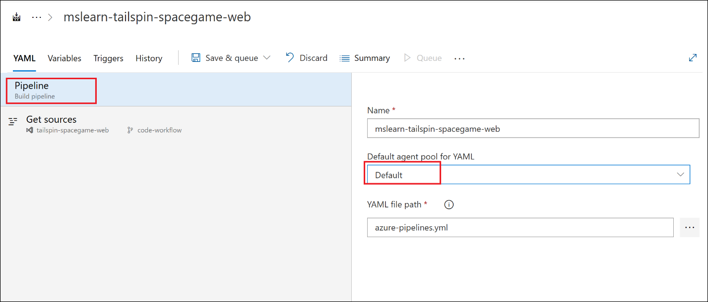

## Exercise 2 - Create a pull request

In this exercise, you'll practice the process of submitting a pull
request and merging your changes into the main branch so that everyone
can benefit from your work.

In Create a build pipeline with Azure Pipelines, you created a Git
branch named build-pipeline, where you defined a basic build pipeline
for the *Space Game* website. Recall that your build definition is in a
file named ***azure-pipelines.yml***.

Although your branch produces a build artifact, that work exists only on
the build-pipeline branch. You need to merge your branch into
the main branch.

Recall that a *pull request* tells the other developers that you have
code ready to review, if necessary, and you want your changes merged
into another branch, such as the main branch.

### Task 1 : Create a GitHub Enterprise Cloud connection

Here, you create a service connection that enables Azure Pipelines to
access your Azure subscription. Azure Pipelines uses this service
connection to deploy the website to App Service. You created a similar
service connection in the previous labs.

** Important:**Make sure that you're signed in to both the Azure portal
and Azure DevOps under the same Microsoft account.

1.  In Azure DevOps, go to your **existing**  project.

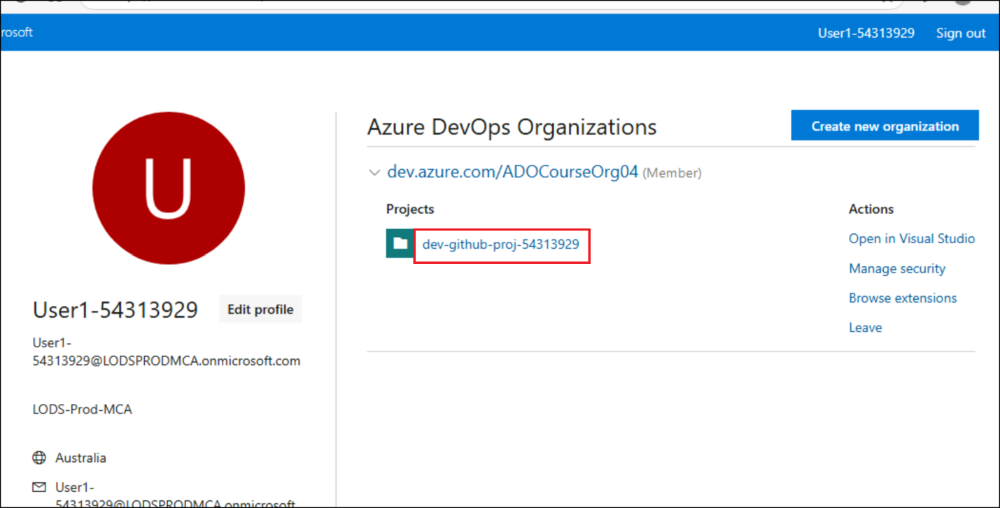

2.  From the lower-left corner of the page, select **Project settings**.

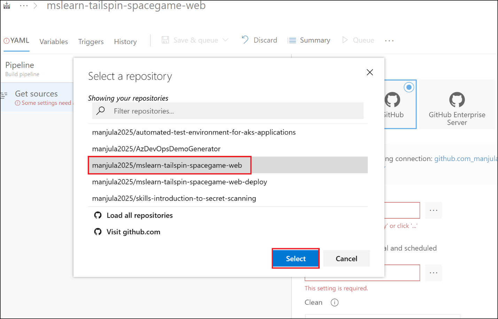

3.  Under **Pipelines**, select **Service connections**. Select **Create
    service connection**.

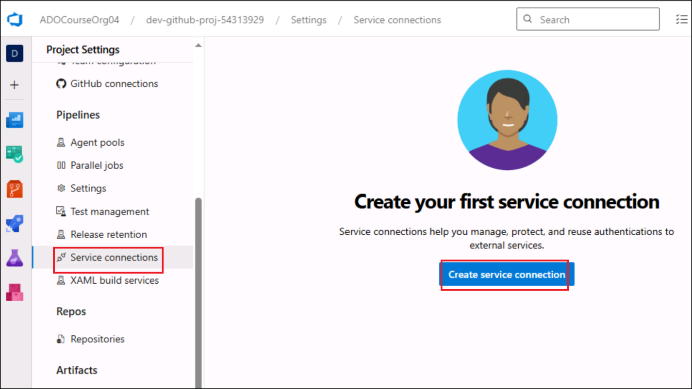

4.  Select **GitHub** and then click **Next**.

5.  Select **AzurePipelines** from **OAuth Configuration** drop down and
    then click on **Authorize** button.

6.  Keep the default service name, and then click on **Save** .

7.  Click on project name from top navigation menu.

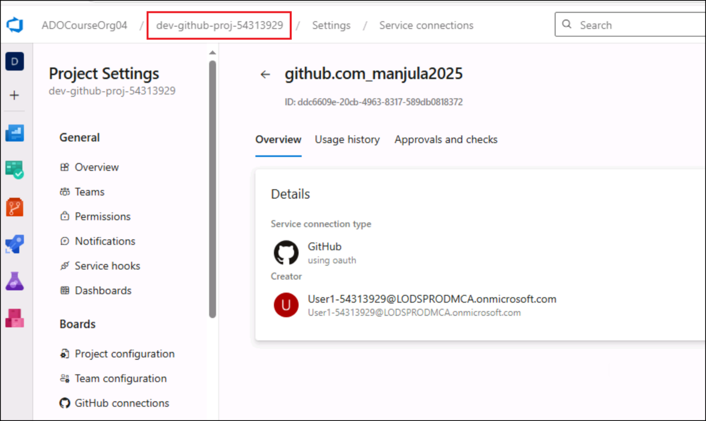

8.  Select the **Pipelines** from the left navigation menu and select
    the pipeline to **Edit**.

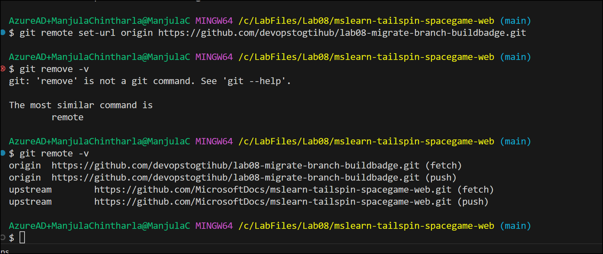

9.  Select **code-workflows** branch and then click next to **Run**
    button and select **Triggers**.

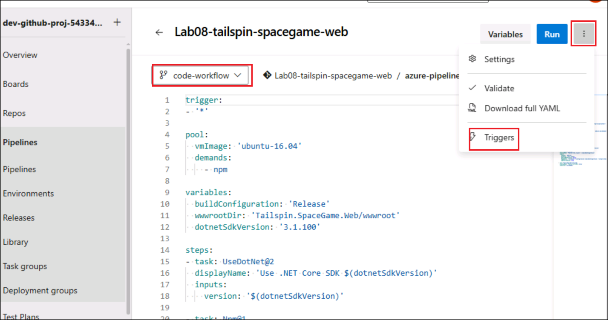

10. Configure CI settings under **Triggers** tab, **select Override the
    YAML continuous integration trigger from here** checkbox and then
    include **code-workflows** branch

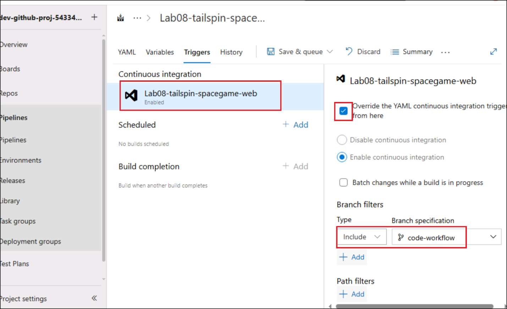

11. Select **YAML** tab and select **Pipeline** and then make sure
    Default from **Default agent pool for YAML** is set to **“Azure
    Pipeline”**

12. Select **Get sources-\>GitHub** and then click on **Repository**

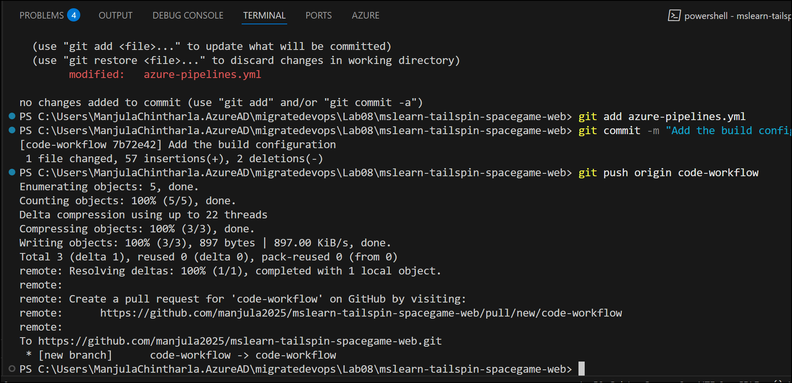

13. Select the repo – **devopstogtihub/lab08-migrate-branch-buildbadge**
    and then click on **Select** button.

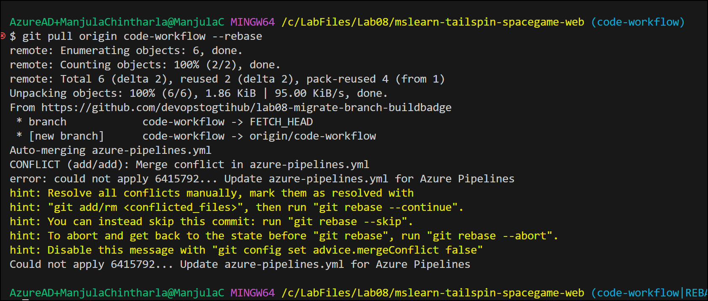

14. Keep all the default values and then click on **Save & queue-\>
    Save**.

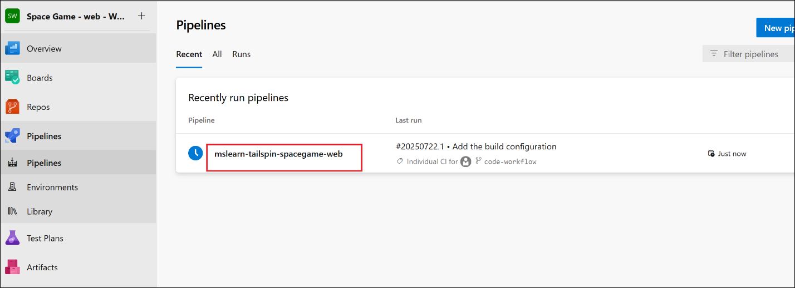

15. Enter some comment and click on Save to save the build pipeline.

### Task 2 : Add starter code to a branch

1.  Switch back to Visual Studio Code, Run below command to switch to
    change origin to GEC origin . replace your-GEC-org\> with yout
    GEC_org and your-GEC-repo with your GEC_repo and then run the
    command

git remote set-url origin
[https://github.com/\<your-GEC-org\>/\<your-GEC-repo\>.git](https://github.com/%3cyour-GEC-org%3e/%3cyour-GEC-repo%3e.git)

2.  Run below command to switch to main

git checkout master

3.  Run below command to create a branch named code-workflow:

git checkout -B code-workflow

4.  From the file explorer, open ***azure-pipelines.yml*** and replace
    its contents with this:

trigger:

\- '\*'

pool:

vmImage: 'windows-latest'

variables:

buildConfiguration: 'Release'

wwwrootDir: 'Tailspin.SpaceGame.Web/wwwroot'

dotnetSdkVersion: '8.x'

steps:

\- task: UseNode@1

displayName: 'Use Node.js 18.20.8'

inputs:

version: '18.20.8'

\- task: UseDotNet@2

displayName: 'Use .NET SDK $(dotnetSdkVersion)'

inputs:

version: '$(dotnetSdkVersion)'

> \- task: Npm@1
>
>   displayName: 'Run npm install'
>
>   inputs:
>
>     verbose: false
>
> \- script: './node_modules/.bin/node-sass $(wwwrootDir) --output
> $(wwwrootDir)'
>
>   displayName: 'Compile Sass assets'
>
> \- script: './node_modules/.bin/gulp'
>
>   displayName: 'Run gulp tasks'
>
> \- script: 'echo "$(Build.DefinitionName), $(Build.BuildId),
> $(Build.BuildNumber)" \> buildinfo.txt'
>
>   displayName: 'Write build info'
>
>   workingDirectory: $(wwwrootDir)
>
> \- task: DotNetCoreCLI@2
>
>   displayName: 'Restore project dependencies'
>
>   inputs:
>
>     command: 'restore'
>
>     projects: '\*\*/\*.csproj'
>
> \- task: DotNetCoreCLI@2
>
>   displayName: 'Build the project - $(buildConfiguration)'
>
>   inputs:
>
>     command: 'build'
>
>     arguments: '--no-restore --configuration $(buildConfiguration)'
>
>     projects: '\*\*/\*.csproj'
>
> \- task: DotNetCoreCLI@2
>
>   displayName: 'Publish the project - $(buildConfiguration)'
>
>   inputs:
>
>     command: 'publish'
>
>     projects: '\*\*/\*.csproj'
>
>     publishWebProjects: false
>
>     arguments: '--no-build --configuration $(buildConfiguration)
> --output $(Build.ArtifactStagingDirectory)/$(buildConfiguration)'
>
>     zipAfterPublish: true
>
> \- task: PublishBuildArtifacts@1
>
>   displayName: 'Publish Artifact: drop'
>
>   condition: succeeded()

### Task 3 : Push your branch to GitHub

Here, you'll push your code-workflow branch to GEC and watch Azure
Pipelines build the application.

1.  In the terminal, run git status to see what uncommitted work exists
    on your branch. You'll see that azure-pipelines.yml has been
    modified. You'll commit that to your branch shortly, but you first
    need to ensure that Git is tracking this file which is
    called staging the file.

Only staged changes are committed when you run git commit. Next, you run
the git add command to add *azure-pipelines.yml* to the staging area, or
index.

git status

2.  Run below command tp make sure you are on the code-workflow branch

> git checkout code-workflow
>
> 

3.  Run below command to rebase your local changes on top of the remote
    branch

git add azure-pipelines.yml

git commit -m "Update pipeline configuration"

git pull origin code-workflow --rebase

4.  You see conflict tin your yml file (The part between \<\<\<\<\<\<\<
    HEAD and ======= is your local version.

> The part between ======= and \>\>\>\>\>\>\> is the remote version from
> GEC.\_)
>
> 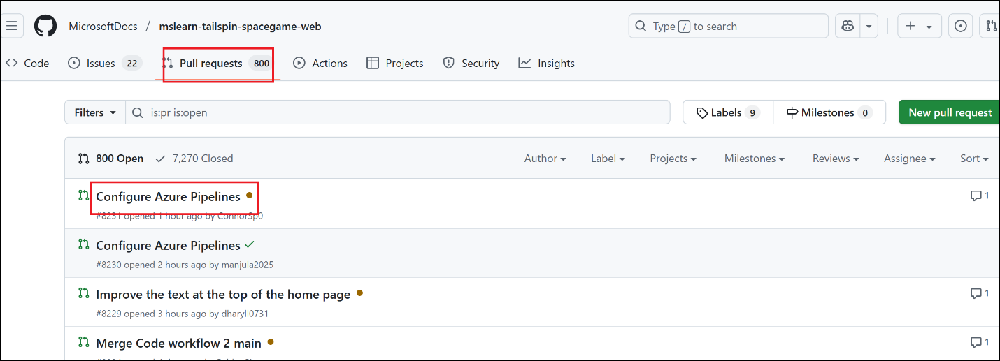

5.  Delete the conflict markers (\<\<\<\<\<\<\<, =======,
    \>\>\>\>\>\>\>) and make the file match the final desired pipeline
    config. Delete the code as shown in below image and then **save**
    the file

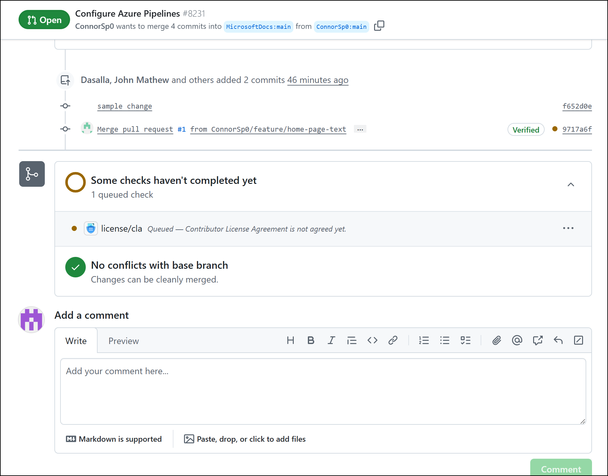

6.  Run the following git add command to add azure-pipelines.yml to the
    staging area:

git add azure-pipelines.yml

7.  Run the following git commit command to commit your staged file to
    the code-workflow branch:

git commit -m "Add the build configuration"

8.  Run this git push command to push, or upload,
    the code-workflow branch to your repository on GitHub:
    The -m argument specifies the commit message. The commit message
    becomes part of a changed file's history. It helps reviewers
    understand the change, and it helps future maintainers understand
    how the file changed over time. Push with force-with-lease to update
    the remote safely

> git push origin code-workflow --force-with-lease

9.  Switch back to Azure DevOps project and select the running pipeline.

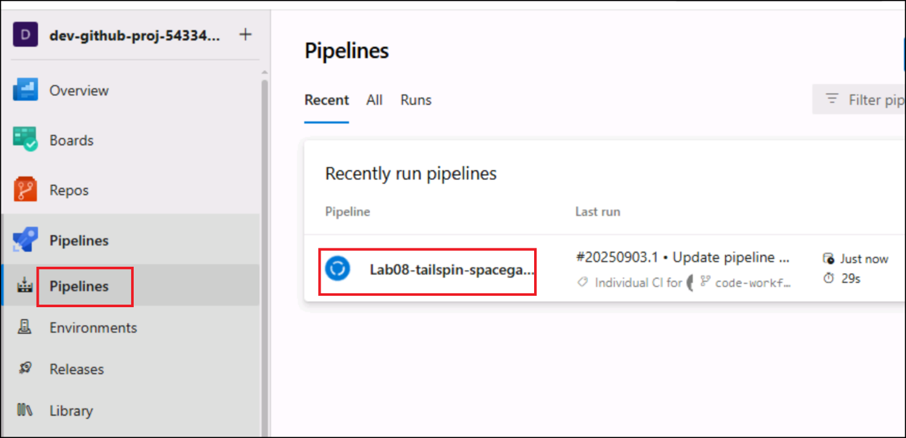

10. Click on the running build.

Note : if permission require then click on **View** next to the warning
message “  
**This pipeline needs permission to access a resource before this run
can continue”c**lick on **Permit -\> Permit** to grant permission to run
build.

11. Wait for them to be completed.

### Task 4 : Create a pull request

1.  In a browser, sign in to [GitHub](https://www.github.com/).Go to
    your **GEC-\> Organization-\> lab08-migrate-branch-buildbadge repo**

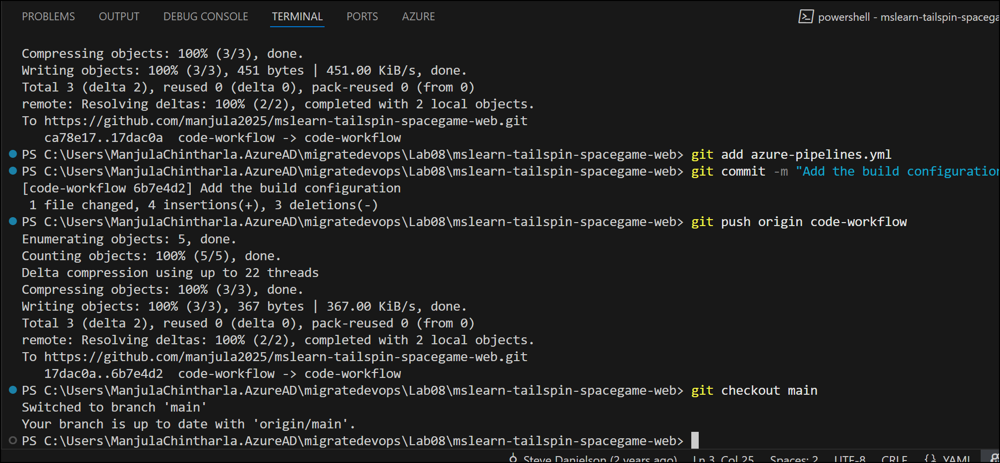

2.  On the **code-workflow had recent pushes X minutes ago** yellow
    banner, click on **Compare and pull request** button.

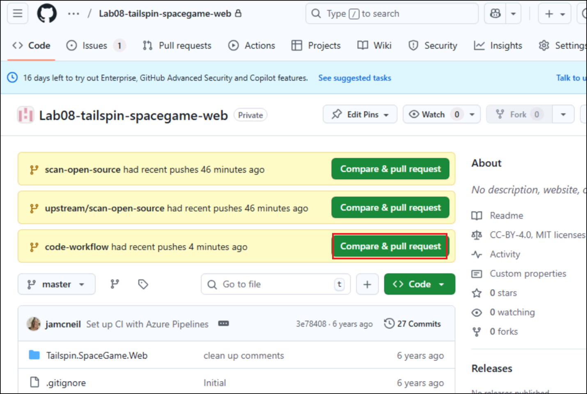

1.  Enter a title and description for your pull request. This step
    doesn't merge any code. It tells others that you have proposed
    changes to be merged into the main branch.

    - Title: ***Configure Azure Pipelines***

    &nbsp;

    - Description: ***This pipeline configuration builds the application
      and produces a build for the Release configuration**.*

    &nbsp;

    - To complete your pull request, select **Create pull request**.

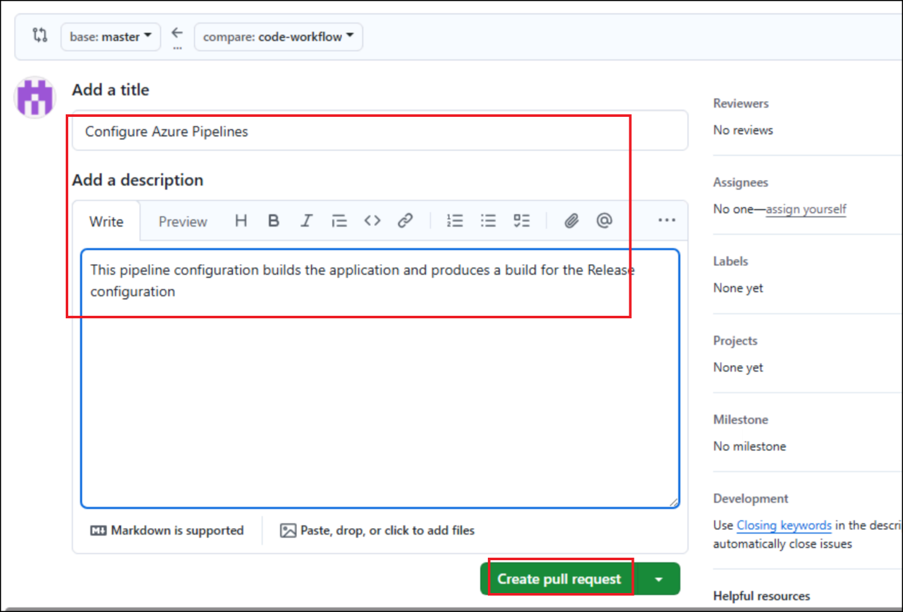

Note : Scroll down and if any conflict ,resolve them

5.  Switch back to GEC repo-\> pull request and click on **Merge pull
    request**

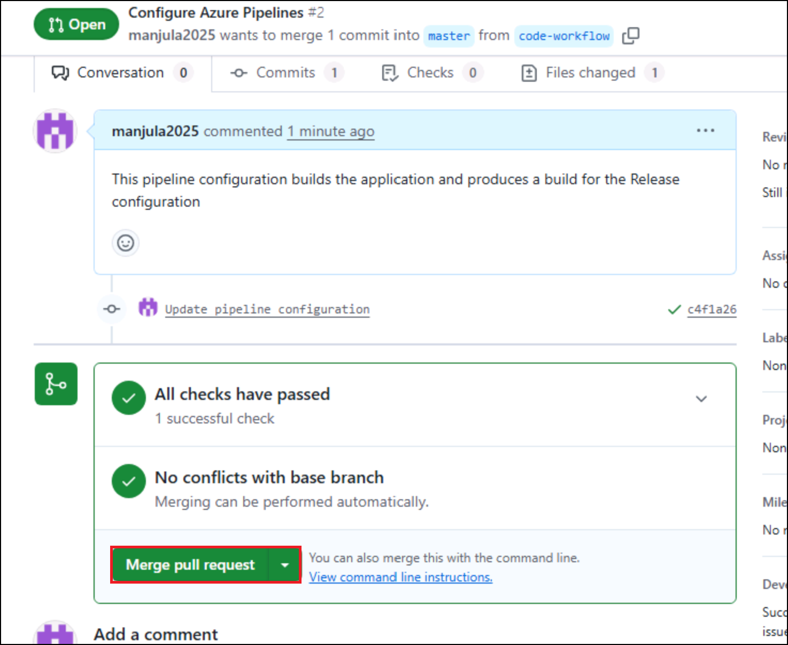

6.  Keep the default comment and click on **Confirm merge.**

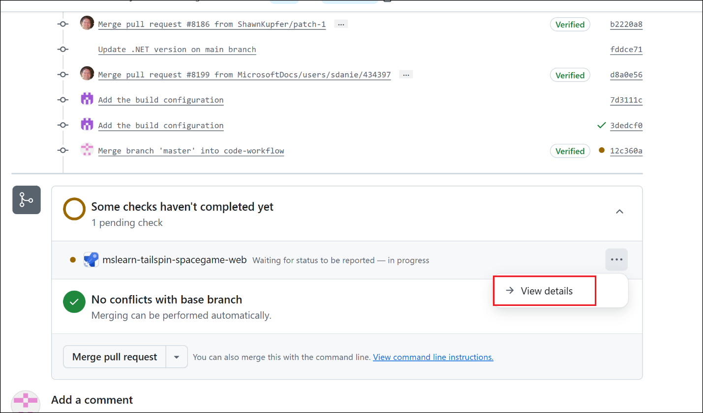

## Exercise 3 - Push a change through the pipeline

In this unit, you'll practice the complete code workflow by pushing a
small change to the *Space Game* website to GEC.

Mara has been given the task of changing some text on the home page of
the website, *Index.cshtml*. In this unit, you'll follow along.

Let's briefly review the steps to follow to complete the task:

- Synchronize your local repository with the latest main branch on GEC.

- Create a branch to hold your changes.

- Make the code changes you need, and verify them locally.

- Push your branch to GEC.

- Merge any recent changes from the main branch on GEC into your local
  working branch, and verify that your changes still work.

- Push up any remaining changes, watch Azure Pipelines build the
  application, and submit your pull request.

### Task 1 : Fetch the latest main branch

In the previous unit, you created a pull request and merged
your code-workflow branch into the main branch on GitHub. Now you need
to pull the changes to main back to your local branch.

The git pull command fetches the latest code from the remote repository
and merges it into your local repository. This way, you know you're
working with the latest code base.

1.  Switch back to Visula studio, In your terminal, run git checkout
    main to switch to the main branch:

git checkout master

2.  To pull down the latest changes, run this git pull command:

git pull origin master

3.  Select the code file Tailspin.SpaceGame.Web.csproj and replace
    **netcoreapp3.1** with **net8.0** in between tag
    \<TargetFramework\>and save the file

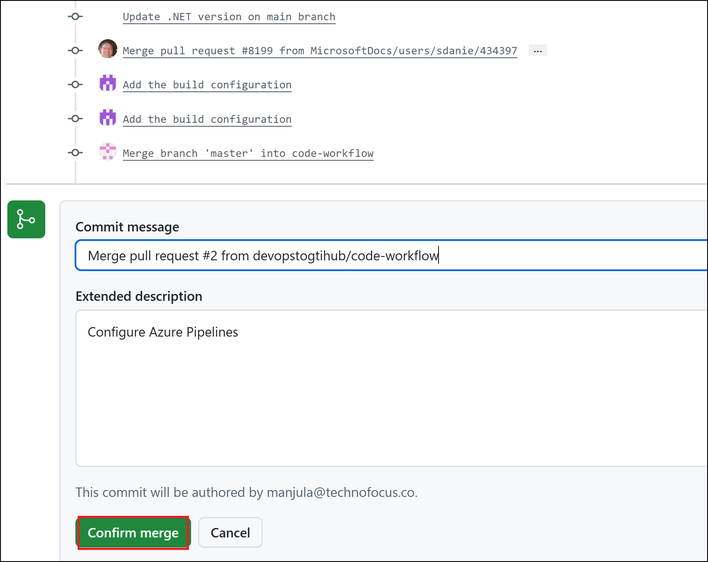

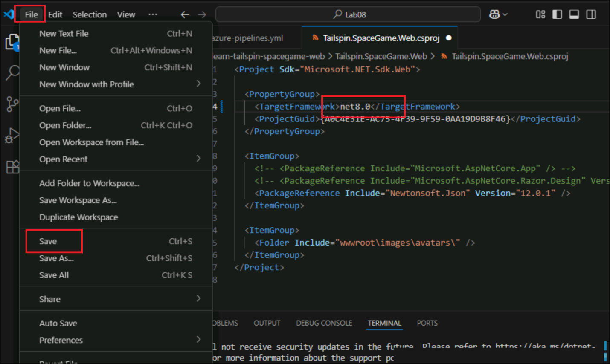

4.  In Visual Studio Code, go to the terminal window and run the
    following dotnet build command to build the application:

dotnet build --configuration Release

5.  Run the following dotnet run command to run the application:

dotnet run --configuration Release --no-build --project
Tailspin.SpaceGame.Web

6.  After your computer trusts your local SSL certificate, run
    the dotnet run command a second time and go
    to http://localhost:5000 from a new browser tab to see the running
    application.

.

### Task 2 : Make changes and test it locally

1.  In Visual Studio terminal, Press Ctrl+C and run the following git
    checkout command:

git checkout -B feature/home-page-text

2.  In Visual Studio Code, open ***Index.cshtml*** in
    the ***Tailspin.SpaceGame.Web/Views/Home*** directory.

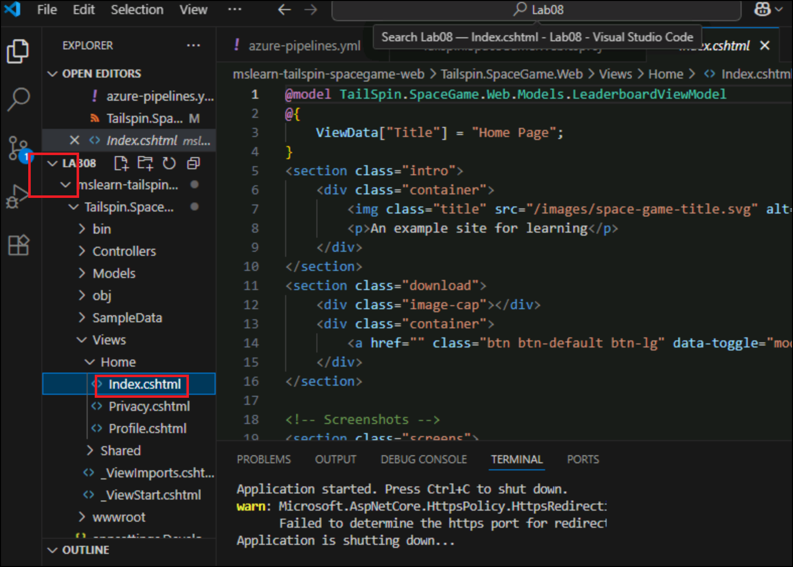

3.  Look for this text near the top of the page:

\<p\>An example site for learning\</p\>

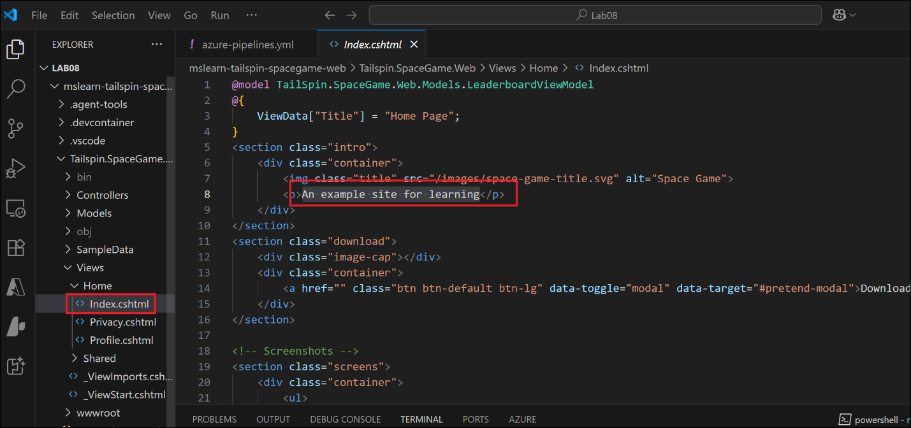

12. replace the text in the previous step with the following "mistyped"
    text, and then save the file: Note that the word "oficial" is
    intentionally mistyped. We'll address that error later in this
    module.Save the file

\<p\>Welcome to the oficial Space Game site!\</p\>

13. In your terminal, run the following dotnet build command to build
    the application:

dotnet build --configuration Release

14. Run the following dotnet run command to run the application:

dotnet run --configuration Release --no-build --project
Tailspin.SpaceGame.Web

15. On a new browser tab, go to http://localhost:5000 to see the running
    application.

You can see that the home page contains the updated text.

16. When you're finished, return to the terminal window, and then
    press **Ctrl+C** to stop the running application.

### Task 3 :Commit and push your branch

Here you'll stage your changes to *Index.cshtml*, commit the change to
your branch, and push your branch up to GitHub.

1.  Run git status to check and see whether there are uncommitted
    changes on your branch: You'll see that Index.cshtml has been
    modified. Like before, the next step is to make sure that Git is
    tracking this file, which is called staging the file.

git status

2.  Run the following git add command to stage *Index.cshtml*:

git add Tailspin.SpaceGame.Web/Views/Home/Index.cshtml

3.  Run the following git commit command to commit your staged file to
    the feature/home-page-text branch:

git commit -m "Improve the text at the top of the home page"

4.  Run this git push command to push, or upload,
    the feature/home-page-text branch to your repository on GitHub:

git push origin feature/home-page-text

5.  Just as before, you can locate your branch on GitHub from the branch
    drop-down box.

### Task 4 : Watch Azure Pipelines build the application

Just as you did previously, Azure Pipelines automatically queues the
build when you push changes to GitHub.

As an optional step, trace the build as it moves through the pipeline,
and verify that the build succeeds.

**Synchronize any changes to the main branch**

While you were busy working on your feature, changes might have been
made to the remote main branch. Before you create a pull request, it's
common practice to get the latest from the remote main branch.

To do this, first check out, or switch to, the main branch. Then, merge
the remote main branch with your local main branch.

Next, check out your feature branch, and then merge your feature branch
with the main branch.

Let's try the process now.

1.  In your terminal, run this git checkout command to check out
    the main branch:

git checkout master

2.  To download the latest changes to the remote main branch and merge
    those changes into your local main branch, run this git
    pull command:

git pull origin master

3.  To check out your feature branch, run git checkout:

git checkout feature/home-page-text

4.  Merge your feature branch with main:

git merge master

. 

### Task 5 : Push your local branch again

When you incorporate changes from the remote repository into your local
feature branch, you need to push your local branch back to the remote
repository a second time.

Although you didn't incorporate any changes from the remote repository,
let's practice the process to see what happens.

1.  In a browser, sign in to [GitHub](https://www.github.com/).Go to
    your **GEC- lab08-migrate-branch-buildbadge** repository. On Yellow
    banner” **feature/home-page-text had recent pushes X minute ago”**
    click on **Compare & pull request**

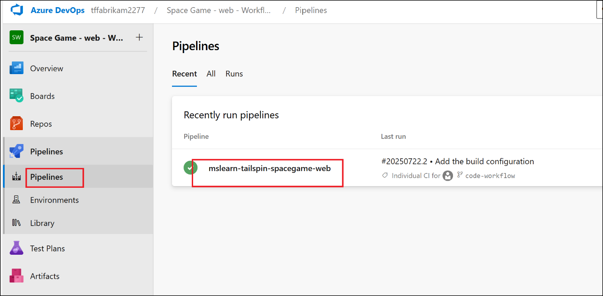

2.  Enter a title and a description for your pull request

    - **Title**: ***Improve the text at the top of the home page***

    &nbsp;

    - **Description**: ***Received the latest home page text from the
      product team.***

3.  To complete your pull request, select **Create pull request**.This
    step doesn't merge any code. It tells others that you have changes
    that you're proposing to merge.The pull request window is displayed.
    As before, a pull request triggers Azure Pipelines to build your
    application by default.

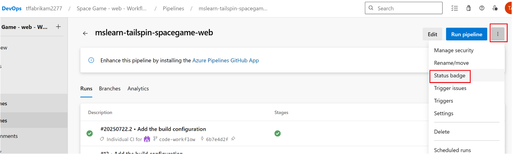

4.  Click on **Merge pull request.**

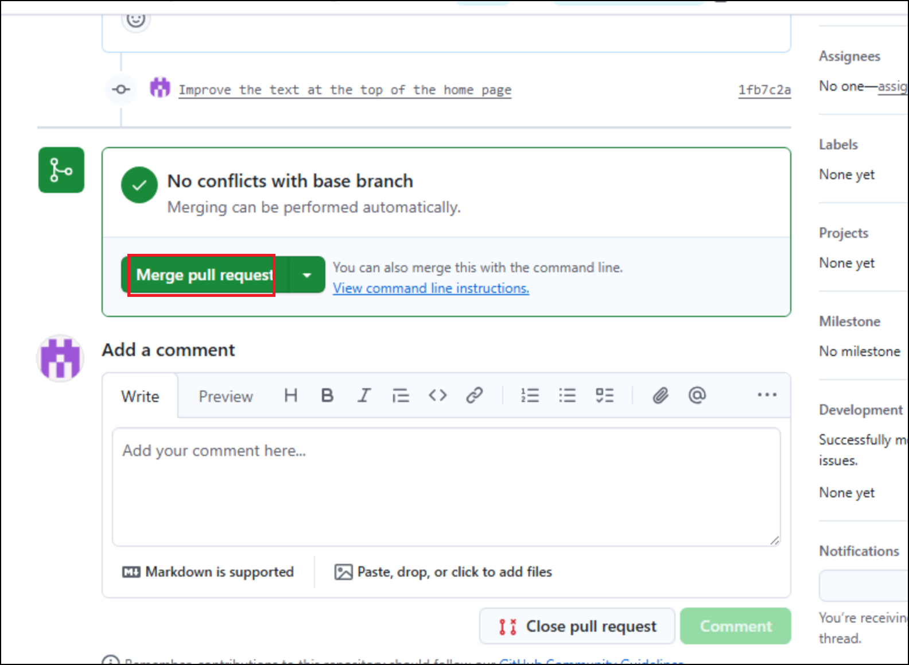

5.  Keep the default comment and click on **Confirm merge.**

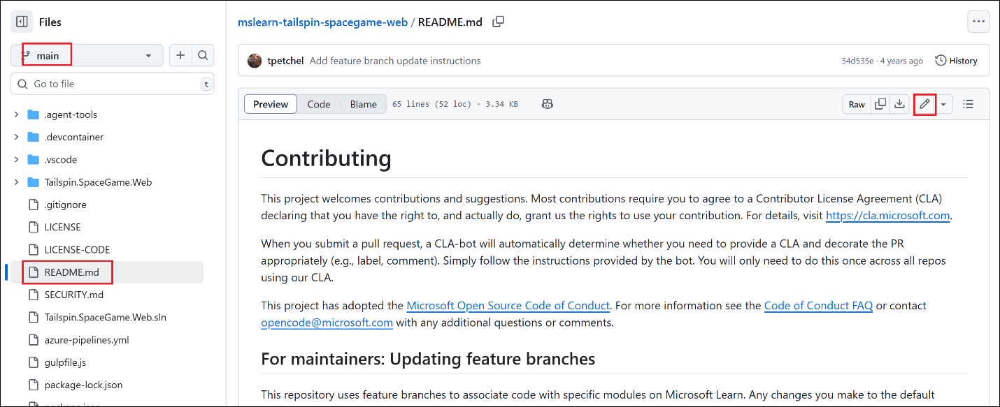

## Exercise 4 - Add a build badge

It's important for team members to know the build status. An easy way to
quickly determine the build status is to add a build badge to
the *README.md* file on GitHub. Let's check in on the team to see how
it's done.

### Task 3 : Add a build history widget to the dashboard

1.  In Azure DevOps -\>Project, select **Overview**, then
    select **Dashboards**.Select **Add a widget**.

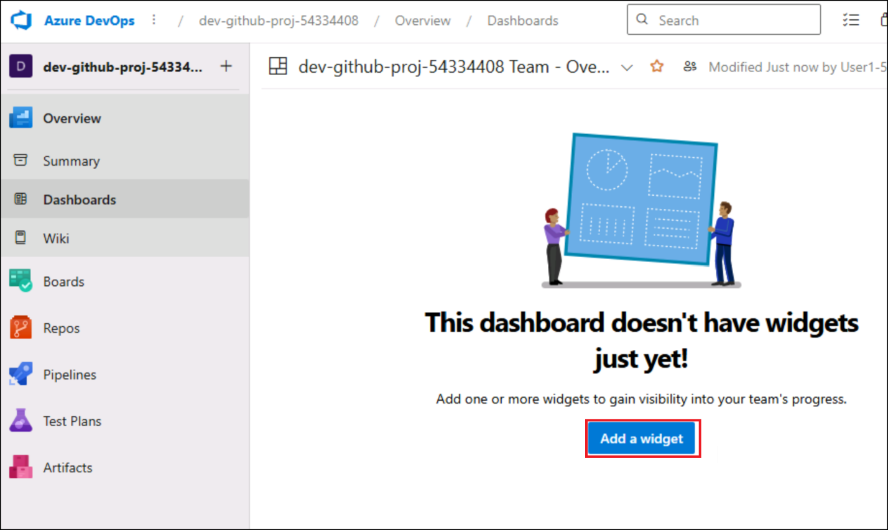

2.  In the **Add widget** pane, search for **Build History**. Select
     **Build History** tile and click on **Add**.

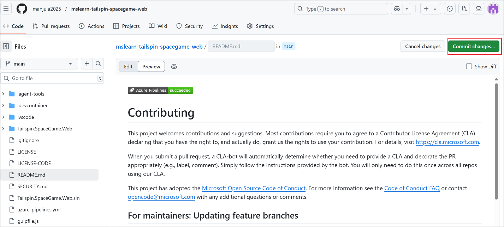

3.  Select the **Gear** icon to configure the widget.

    1.  Keep the **Build History** title.

    &nbsp;

    1.  In the **Pipeline** drop-down list, select your pipeline.

    &nbsp;

    1.  Keep **All branches** selected.

    2.  Select **Save**.

> 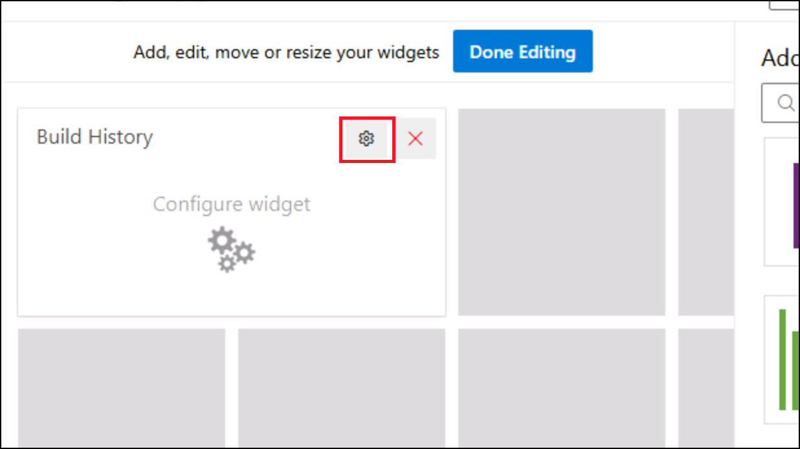
>
> 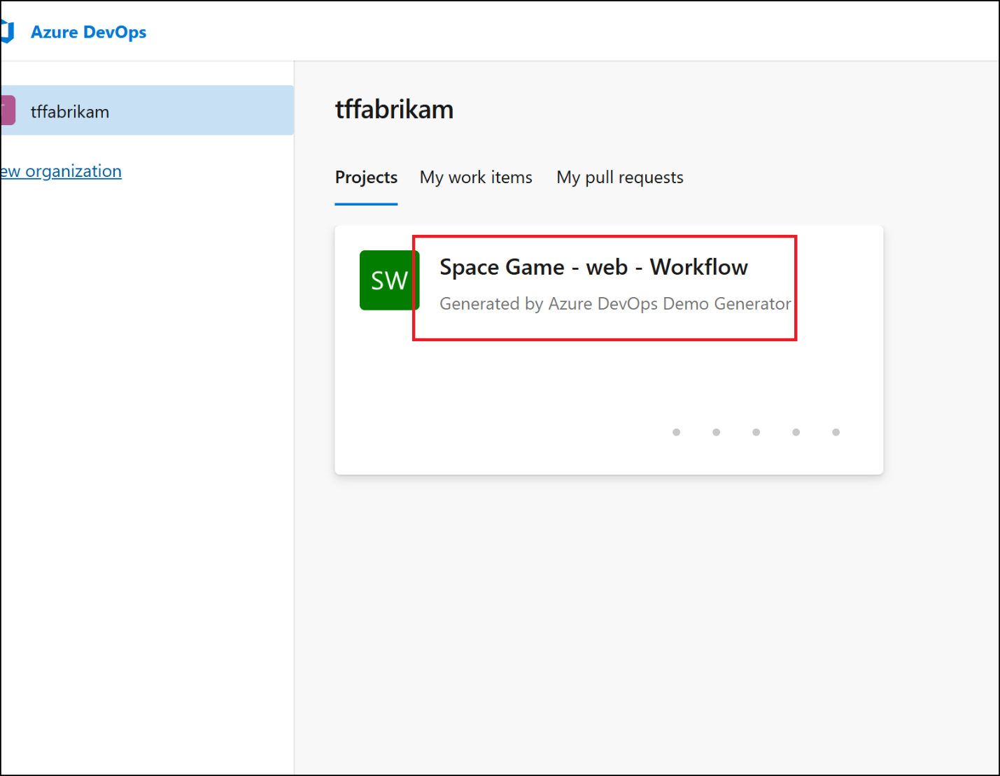

4.  Select **Done Editing**.The **Build History** widget is displayed on
    the dashboard.

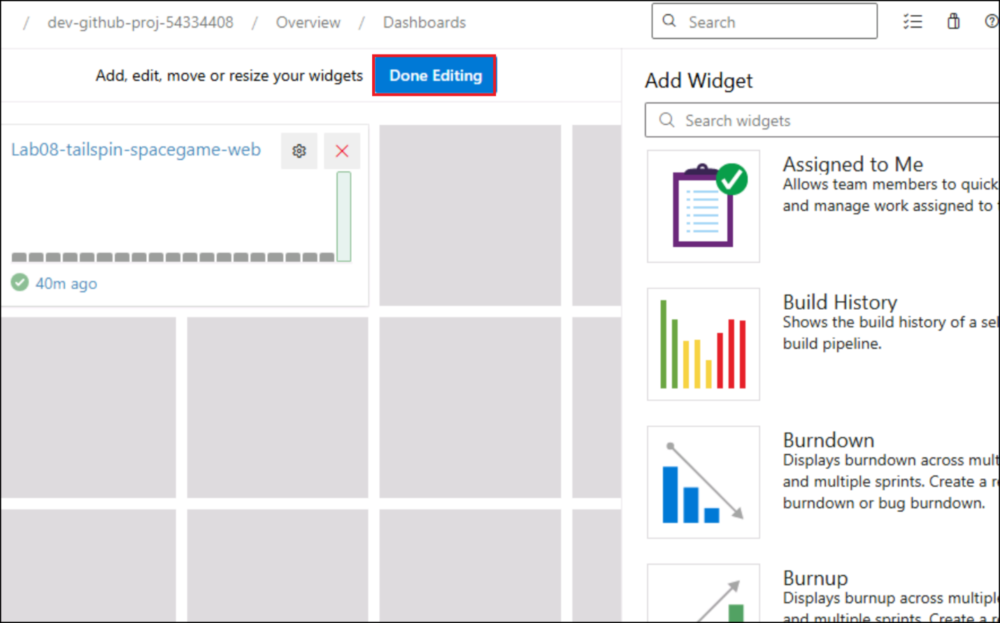

5.  Hover over each build to view the build number, when the build was
    completed, and the elapsed build time.Each build succeeded, so the
    bars on the widget are all green. If the build had failed, it would
    appear in red.

> 

6.  Select one of the bars to drill down into that build.

### Task 4 : Set up approvals

In this section, you'll set up a rule on GitHub that requires at least
one reviewer to approve a pull request before it can be merged into
the main branch. You'll then verify that the rule works by pushing up a
fix to the typing error that Mara made earlier.

1.  In GitHub, go to devopstogtihub/lab08-migrate-branch-buildbadge
    repository.Select the **Settings** tab near the top of the page.

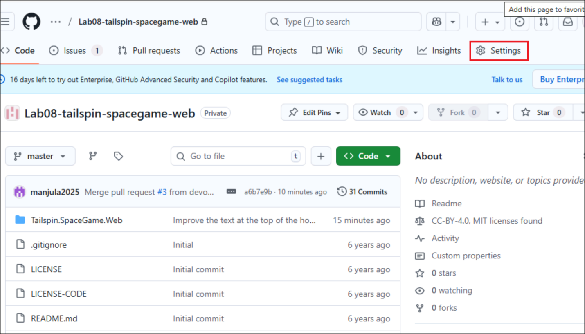

2.  On the left menu, select **Branches**.Make Select **Add classic
    branch protection rule**.

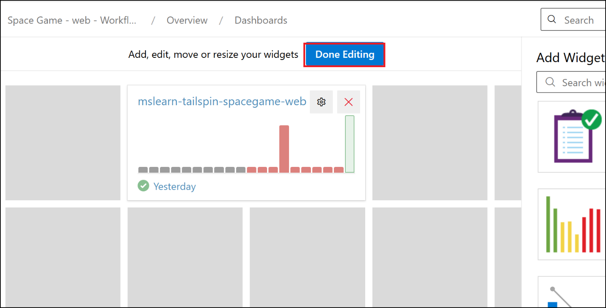

3.  Under **Branch name pattern**, enter **master**.

- Select the **Require a pull request before merging** check box.

- Select the **Require approvals** check box.

- Keep the **Required approving reviews** value at **1**.

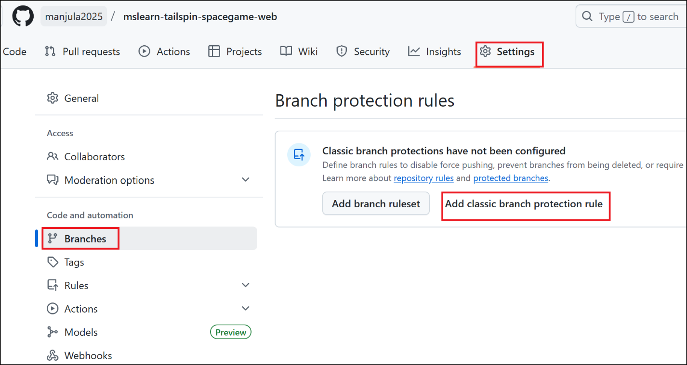

4.  Select **Create**.Sign with your account details if it prompts.

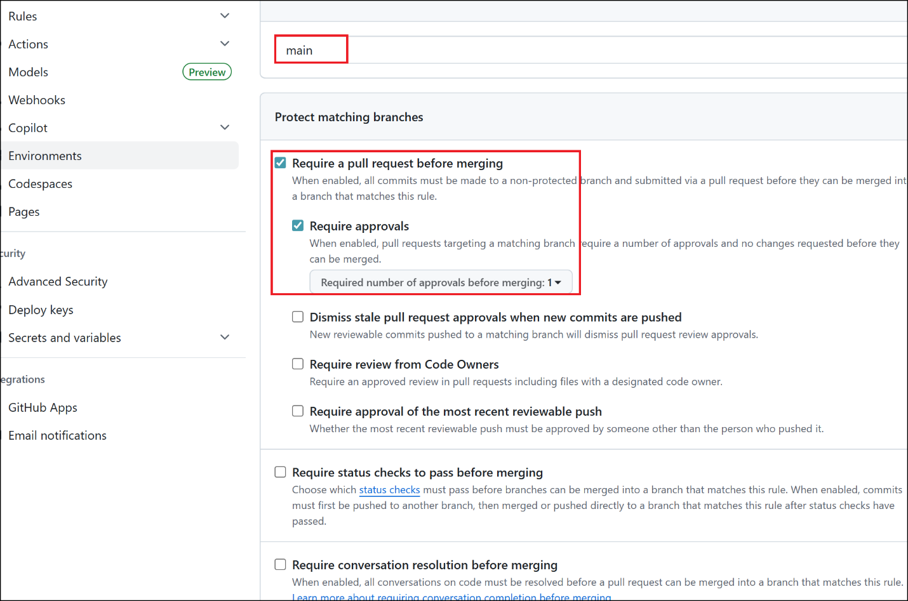

### Summary :

In this lab, we successfully migrated the repository from Azure DevOps
to GitHub Enterprise Cloud using the **GitHub CLI migration tool**.  
We:

1.  **Set up Azure DevOps environment** – cloned the demo generator
    project, created the target ADO project, and moved initial work
    items to “Doing.”

2.  **Migrated repository** – authenticated with Azure DevOps and GitHub
    using PATs, granted migration permissions, and executed migration
    commands with gh ado2gh.

3.  **Configured Azure Pipelines** – updated the build YAML in a new
    branch, resolved conflicts, pushed to GEC, and verified CI builds in
    Azure DevOps.

4.  **Created and merged pull requests** – collaborated through PRs to
    integrate changes into main, resolving conflicts and ensuring builds
    succeeded.

5.  **Pushed a change through the pipeline** – modified a web page,
    tested locally, committed to a feature branch, pushed to GEC, and
    confirmed a successful pipeline run.

6.  **Added build badge and build history widget** – updated README.md
    with Azure Pipelines badge and configured dashboards for ongoing
    build visibility.

7.  **Applied branch protection rules** – enforced at least one approval
    before merging PRs into masters.

By the end of the lab, the repository was fully operational on GitHub
Enterprise Cloud with CI/CD pipelines intact, build status visibility
enabled, and collaboration rules in place, simulating a real-world
migration and DevOps workflow.
