# Lab 09 -Testing & Code Quality in GitHub After Azure DevOps Migration

## Exercise 1 - Set up your Azure DevOps environment

In this unit, you'll ensure that your Microsoft Azure DevOps
organization is set up to complete the rest of this module.

To do this, you:

- Set up an Azure DevOps project for this module.

- Move the work item for this module on Azure Boards to
  the **Doing** column.

- Make sure your project is set up locally so that you can push changes
  to the pipeline.

### Task 1 : Create an Azure DevOps personal access token

1.  Create an Azure DevOps personal access token (PAT). Open a new tab
    in your browser and navigate to - <https://portal.azure.com/> and
    sign in with assigned account.

2.  Search for **Azure DevOps** and select **Azure DevOps
    organizations**.

3.  Click on **My Azure DevOps Organization** hyper link.

4.  Click on **Create new organization** button.

5.  Click on **Continue**.

6.  Enter the organization name as : **tffabrikamXXX** (should be
    unique, replace XXX with nunber)enter the characters shown in your
    screen and then click on **Continue**.

7.  In the top right corner of the screen, click **User
    settings**.Click Personal access tokens.

8.  Select **+ New Token**

9.  Enter the name as : **devopstoken** and select the following scopes
    (you may need to select Show all scopes at the bottom of the page to
    reveal all scopes):

    - Agents Pool: **Read & write**

    - Build: **Read & execute**

    - Code: **Read, write, & manage**

    - Deployment Groups : Read & manage

    - GitHub Connections: Read & manage

    - Pipeline Resources: Use and manage

    - Project and Team: **Read, write, & manage**

    - Pull Request Threads: Read & write

    - Release: **Read, write, execute, & manage**

    - Service Connections: **Read, query, & manage**

    - Team Dashboard: Read & manage

    - Task Groups: **Read, create, & manage**

    - **Test Management: Read & write**

    - Variable Groups: **Read, create, & manage**

10. Copy the generated API token and save it in a safe location. For
    your security, it won't be shown again.

### Task 2 : Download and configure the agent

1.  From Left down corner, click on **Organization settings**.

2.  Choose **Agent pools**.Select the **Default** pool.

3.  Select the **Agents** tab, and choose **New agent**.

4.  On the **Get the agent** dialog box, choose **Windows**.On the left
    pane, select the processor architecture of the installed Windows OS
    version on your machine. The x64 agent version is intended for
    64-bit Windows, whereas the x86 version is intended for 32-bit
    Windows. If you aren't sure which version of Windows is
    installed, [follow these instructions to find
    out](https://learn.microsoft.com/en-us/windows/client-management/windows-version-search).

5.  On the right pane, click the **Download** button.

6.  Follow the instructions on the page to download the agent.

7.  Unpack the agent into the directory of your choice. Make sure that
    the path to the directory contains no spaces because tools and
    scripts don't always properly escape spaces. A recommended folder
    is C:\agents. Extracting in the download folder or other user
    folders may cause permission issues.

** Important**

We strongly recommend you configure the agent from an elevated
PowerShell window. If you want to configure as a service, this
is **required**.You must not use [**Windows PowerShell
ISE**](https://learn.microsoft.com/en-us/powershell/scripting/windows-powershell/ise/introducing-the-windows-powershell-ise) to
configure the agent.

** Important**

For security reasons we strongly recommend making sure the agents folder
(C:\agents) is only editable by admins.

** Note**

Please avoid using mintty based shells, such as git-bash, for agent
configuration. Mintty is not fully compatible with native Input/Output
Windows API and we can't guarantee the setup script will work correctly
in this case.

### Task 3 : Configure and run the agent

1.  Start an elevated (PowerShell) window as administrator and set the
    location to where you unpacked the agent.

cd “C:\agents“

2.  Run config.cmd. This will ask you a series of questions to configure
    the agent. When setup asks for your server URL, for Azure DevOps
    Services, answer https://dev.azure.com/{your-organization}.

.\config.cmd

3.  The authentication method used for registering the agent is used
    only during agent registration. Press Enter accepting the
    Authentication mthos is PAT when prompts for -**Enter authentication
    type (press enter for PAT) and then enter your PAT and press
    Enter.**

> 

4.  Press Enter when prompts “Enter agent pool (press enter for
    default)”

5.  Type Agent name of your choice and press Enter

6.  Press Enter when prompt “Enter work folder (press enter for \_work)”
    as we want to use **Default** Agent

7.  Just Enter when prompt Enter run agent as service? (Y/N) (press
    enter for N) and Enter configure autologon and run agent on startup?
    (Y/N) (press enter for N)

> 

8.  Run the following the command to start the agent.

.\run.cmd

9.  Minimize the window and continue with next tasks.

Note : To restart the agent, press Ctrl+C to stop the agent, and then
run **run.cmd** to restart it.

### Task 4 : Get the Azure DevOps project

Here, you ensure that your Azure DevOps organization is set up to
complete the rest of this module. You do this by running a template that
creates a project for you in Azure DevOps.

1.  Open Visual Studio from Desktop and sign in with your accounts.

2.  Click on **Clone a repository**

3.  Enter Repository location as
    <https://github.com/microsoft/AzDevOpsDemoGenerator.git> and select
    location and then click on **Clone**.

4.  **Set ADOGenerator as the Startup Project** In Visual Studio.
    Right-click on the ADOGenerator project in the Solution Explorer.
    Select **Set as Startup Project**.

> 

5.  **Build the Solution** Build the solution to ensure all dependencies
    are restored and the project compiles successfully.

6.  In Visual Studio, **right-click on the solution in the Solution
    Explorer** and select **Build Solution.**

> Note : Alternatively, you can use the command line: dotnet build

7.  Wait for the build to complete.

8.  Run the Project To run the project as a console application. In
    Visual Studio**, press F5** or click on the **Start** button.

Note : Alternatively, you can run the project from the command line:

> **dotnet run --project src/ADOGenerator/ADOGenerator.csproj**
>
> 

9.  Enter **1** (Create a new project….)when prompted for options

10. When prompted to **Enter the template number from the list of
    templates**, enter ** 24 **for** Run quality tests in your build
    pipeline using Azure Pipelines using Git and GitHub**, then
    press **Enter**.

> 

11. Choose your authentication method as Personal Access Token (PAT).
    Type **2** and press Enter.

** Note:**If you set up a PAT, make sure to authorize the
necessary **scopes**. For this module, you can use **Full access**, but
in a real-world situation, you should ensure you grant only the
necessary scopes.

12. Enter your Azure DevOps organization name (eg :**tffabrikanXX**),
    then press **Enter**.

13. Enter your Azure DevOps PAT, then press **Enter**.

14. Enter a project name such as ***Space Game - web - Tests***, then
    press **Enter**.

15. Once your project is created, go to your Azure DevOps organization
    in your browser
    (at https://dev.azure.com/\<your-organization-name\>/) and select
    the project.

### Task 5 : Fetch the branch from GitHub

1.  On GitHub, go to
    the https://github.com/MicrosoftDocs/mslearn-tailspin-spacegame-web.git repository.

2.  Select **Fork** at the top-right of the screen.

3.  Choose your GitHub account as the Owner, then select **Create
    fork**.

4.  Select Code, and then, from the HTTPS tab, select the copy button to
    copy the URL to your clipboard.

5.  Open Visual Studio Code, go to the terminal window.

> 

6.  Update below command with your forked repo link and run the git
    clone command. Replace YOURUSERNAME with your GitHub username.

> git clone
> https://github.com/\<\<YOURUSERNAME\>\>/mslearn-tailspin-spacegame-web.git
>
> 

7.  Open Terminal and run below command to go the folder

cd mslearn-tailspin-spacegame-web

8.  A *remote* is a Git repository where team members collaborate (like
    a repository on GitHub). Here you list your remotes and add a remote
    that points to Microsoft's copy of the repository so that you can
    get the latest sample code.

9.  Run the following command to list your remotes:

git remote -v

10. Origin specifies your repository on GitHub. When you fork code from
    another repository, the original remote (the one you forked from) is
    commonly named upstream.

11. Run the following command to create a remote named *upstream* that
    points to the Microsoft repository:

> git remote add upstream
> https://github.com/MicrosoftDocs/mslearn-tailspin-spacegame-web.git
>
> git remote -v

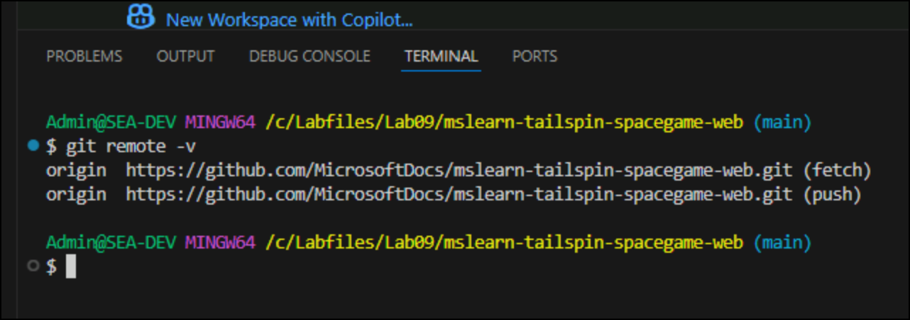

## Exercise 2 - Add unit tests to your application

In this unit, we'll add unit tests to the automated build that we
created with Microsoft Azure Pipelines. Regression bugs are creeping
into your team's code and breaking the leaderboard's filtering
functionality. Specifically, the wrong game mode keeps appearing.

The following image illustrates the problem. When a user selects "Milky
Way" to show only scores from that game map, they get results from other
game maps, such as Andromeda.

Here's the process to follow:

1.  Fetch a branch from the GitHub repository that contains the unit
    tests.

2.  Run the tests locally to verify that they pass.

3.  Add tasks to your pipeline configuration to run the tests and
    collect the results.

4.  Push the branch to your GitHub repository.

5.  Watch your Azure Pipelines project automatically build the
    application and run the tests.

###  Task 1 : Create a service connection for ARM and GitHub

Here, you create a service connection that enables Azure Pipelines to
access your Azure subscription. Azure Pipelines uses this service
connection to deploy the website to App Service. You created a similar
service connection in the previous labs.

** Important:**Make sure that you're signed in to both the Azure portal
and Azure DevOps under the same Microsoft account.

1.  In Azure DevOps, go to your **Space Game - web – Tests** project.

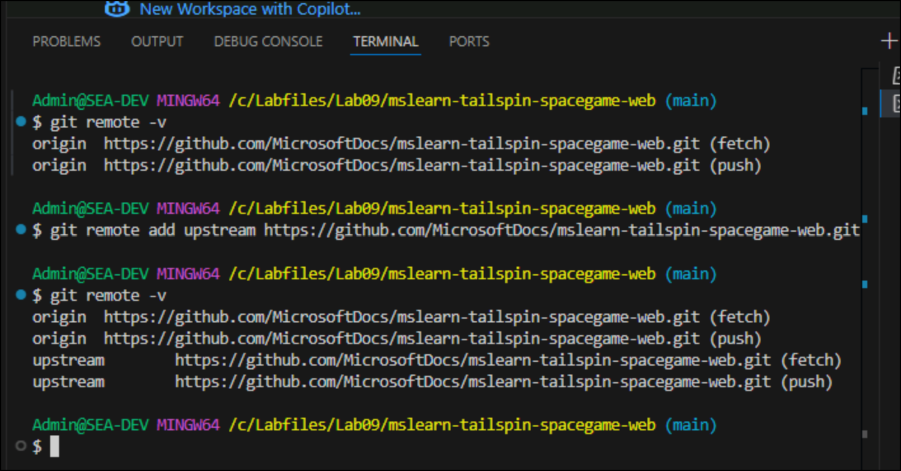

2.  From the lower-left corner of the page, select **Project settings**.

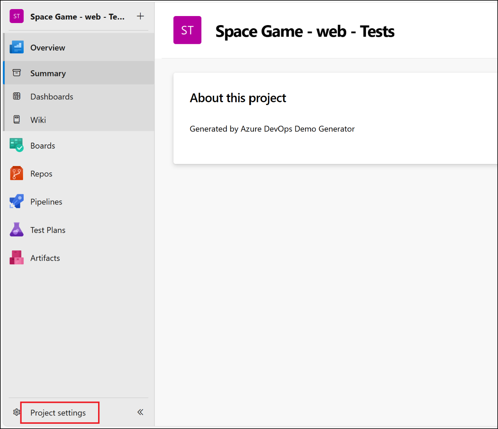

3.  Click on **Service connections** under **Pipelines** and then click
    on **New Service connection** button.

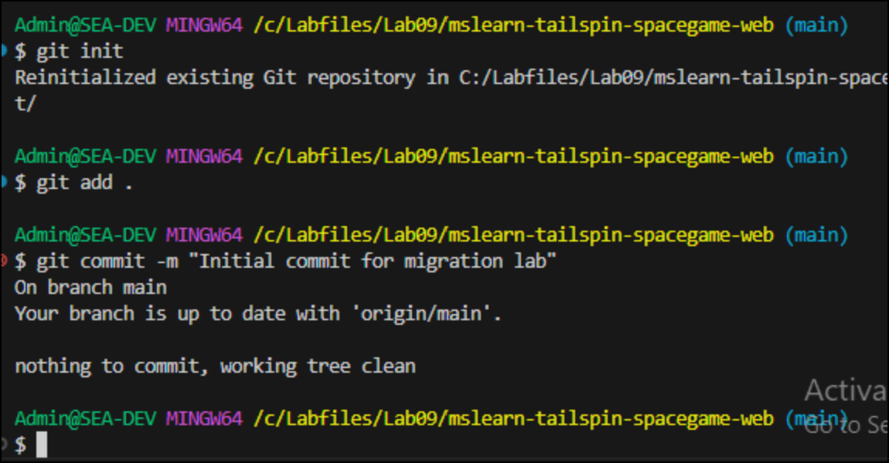

4.  Select **GitHub** and then click **Next**.

5.  Select **AzurePipelines** from **OAuth Configuration** drop down and
    then click on **Authorize** button.

6.  Sign into GitHub .Keep the default service name, select **Grant
    access permission to all pipelines** security check box and then
    click on **Save** .

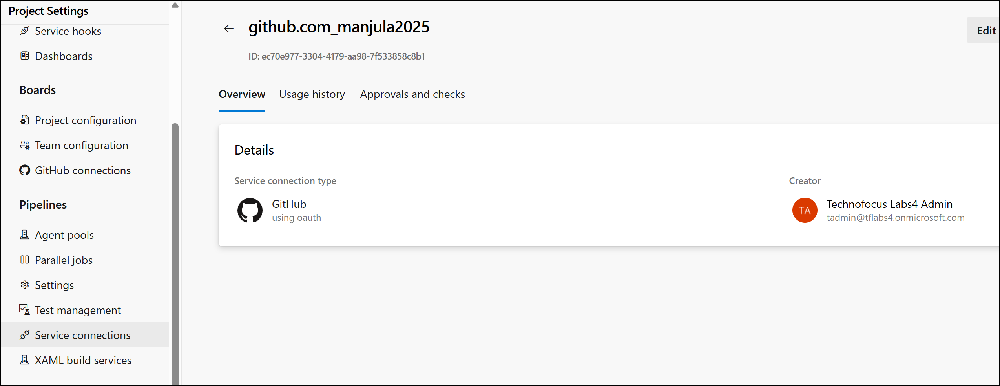

7.  Click on project name from top navigation menu.

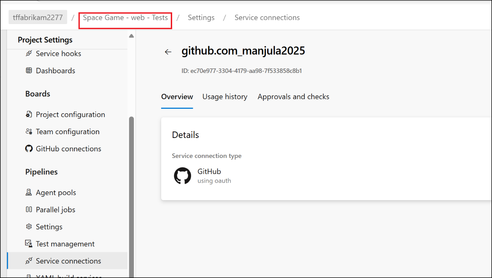

8.  Select the Pipelines from left navigation menu and select the
    pipeline to **Edit**.

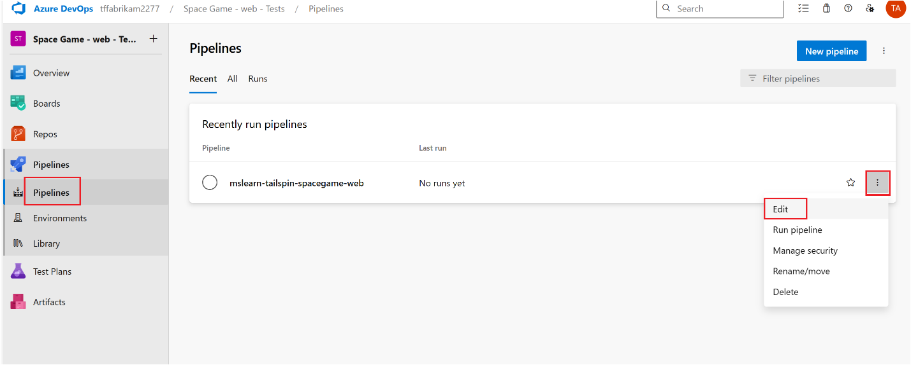

9.  Select **unit-tests** branch and then click next to **Run** button
    and select **Triggers**.

10. Configure CI settings under **Triggers** tab, **select Override the
    YAML continuous integration trigger from here** checkbox and then
    include **unit-tests** branch

11. Select **YAML** tab and select **Pipeline and select Default agent
    pool under Default agent pool for YAML drop down**

12. Select **YAML** tab and select **Get sources-\>GitHub** and then
    click on **Repository**

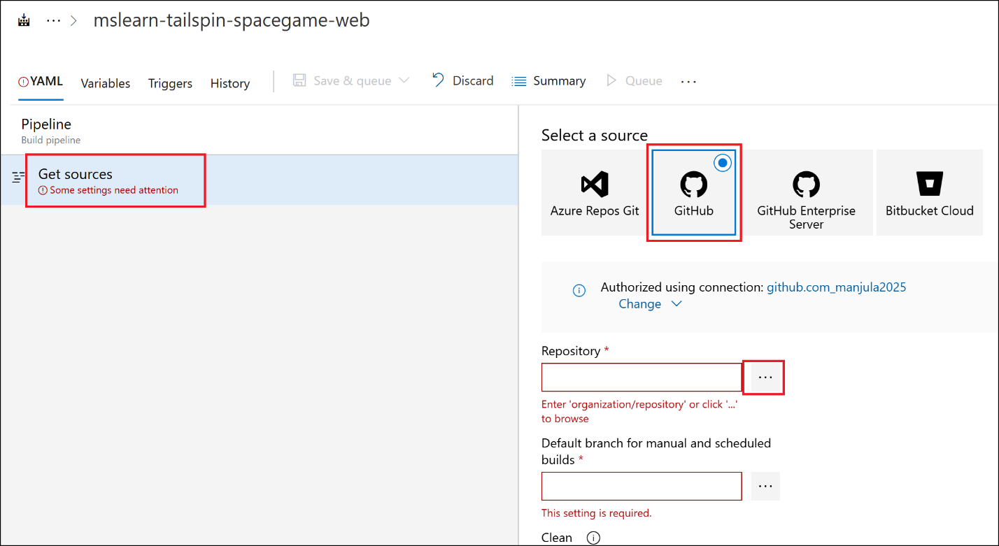

13. Select the repo - **mslearn-tailspin-spacegame-web** and then click
    on **Select** button.

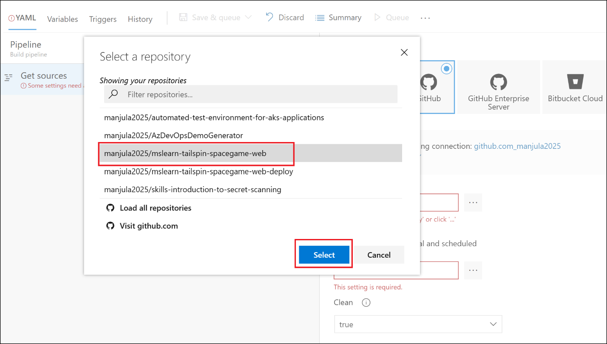

14. Keep all the default values and then click on **Save & queue-\>
    Save**.

15. Enter some comment and click on Save to save the build pipeline.

### Task 2 : Add and Run unit tests

Here, you'll fetch the unit-tests branch from GitHub and check out, or
switch to, that branch.

This branch contains the *Space Game* project that you worked with in
the previous modules and an Azure Pipelines configuration to start with.

1.  In Visual Studio Code, open the integrated terminal.

2.  Run the following git commands to fetch a branch
    named unit-tests from the Microsoft repository, and then switch to
    that branch.

git fetch upstream unit-tests

git checkout -B unit-tests upstream/unit-tests

3.  The format of this command enables you to get starter code from the
    Microsoft GitHub repository, known as upstream. Shortly, you'll push
    this branch to your GitHub repository, known as origin.

4.  As an optional step, open the *azure-pipelines.yml* file in Visual
    Studio Code and familiarize yourself with the initial configuration.

5.  Run dotnet build to build each project in the solution.

dotnet build --configuration Release

6.  Run the following dotnet test command to run the unit tests:

dotnet test --configuration Release --no-build

The --no-build flag specifies not to build the project before running
it. You don't need to build the project because you built it in the
previous step.

7.  Notice that there were five total tests. Although we defined just
    one test method, FetchOnlyRequestedGameRegion, that test is run five
    times, once for each game map as specified in the TestCase inline
    data.

8.  Run the tests a second time. This time, provide the --logger option
    to write the results to a log file.

dotnet test Tailspin.SpaceGame.Web.Tests --configuration Release
--no-build --logger trx

You see from the output that a TRX file is created in
the **TestResults** directory.

A TRX file is an XML document that contains the results of a test run.
It's a popular format for test results because Visual Studio and other
tools can help you visualize the results.

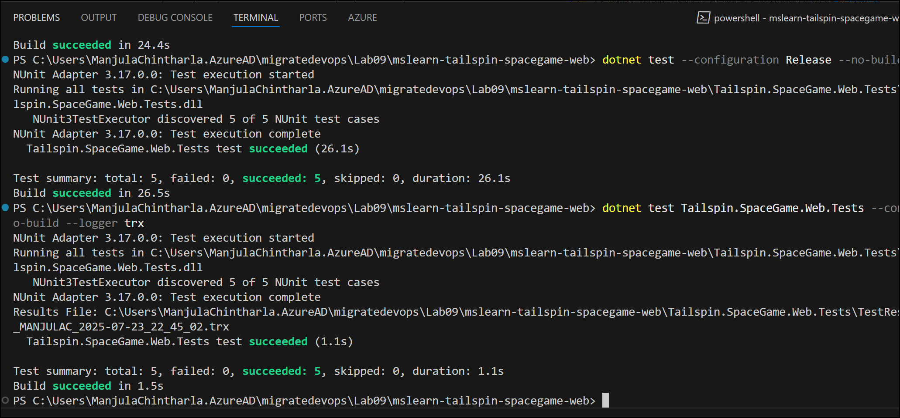

Later, you'll see how Azure Pipelines can help you visualize and track
your test results as they run through the pipeline.

** Note:**TRX files are not meant to be included in source control.
A *.gitignore* file allows you to specify which temporary and other
files you want Git to ignore. The project's *.gitignore* file is already
set up to ignore anything in the *TestResults* directory.

9.  As an optional step, in Visual Studio Code, open
    the *DocumentDBRepository_GetItemsAsyncShould.cs* file from
    the *Tailspin.SpaceGame.Web.Tests* folder and examine the test code.
    Even if you're not interested in building .NET apps specifically,
    you might find the test code useful because it resembles code you
    might see in other unit test frameworks.

**Add tasks to your pipeline configuration**

Here, you'll configure the build pipeline to run your unit tests and
collect the results.

1.  In Visual Studio Code, modify *azure-pipelines.yml* as follows:

> trigger:
>
> \- '\*'
>
> pool:
>
>   name: 'Default'
>
>   demands:
>
>   - npm
>
> variables:
>
>   buildConfiguration: 'Release'
>
>   wwwrootDir: 'Tailspin.SpaceGame.Web/wwwroot'
>
>   dotnetSdkVersion: '8.x'
>
> steps:
>
> \- task: UseDotNet@2
>
>   displayName: 'Use .NET SDK $(dotnetSdkVersion)'
>
>   inputs:
>
>     version: '$(dotnetSdkVersion)'
>
> \- task: Npm@1
>
>   displayName: 'Run npm install'
>
>   inputs:
>
>     verbose: false
>
> \- script: './node_modules/.bin/node-sass $(wwwrootDir) --output
> $(wwwrootDir)'
>
>   displayName: 'Compile Sass assets'
>
> \- script: 'npx gulp'
>
>   displayName: 'Run gulp tasks'
>
> \- script: 'echo "$(Build.DefinitionName), $(Build.BuildId),
> $(Build.BuildNumber)" \> buildinfo.txt'
>
>   displayName: 'Write build info'
>
>   workingDirectory: $(wwwrootDir)
>
> \- task: DotNetCoreCLI@2
>
>   displayName: 'Restore project dependencies'
>
>   inputs:
>
>     command: 'restore'
>
>     projects: '\*\*/\*.csproj'
>
> \- task: DotNetCoreCLI@2
>
>   displayName: 'Build the project - $(buildConfiguration)'
>
>   inputs:
>
>     command: 'build'
>
>     arguments: '--no-restore --configuration $(buildConfiguration)'
>
>     projects: '\*\*/\*.csproj'
>
> \- task: DotNetCoreCLI@2
>
>   displayName: 'Run unit tests - $(buildConfiguration)'
>
>   inputs:
>
>     command: 'test'
>
>     arguments: '--no-build --configuration $(buildConfiguration)'
>
>     publishTestResults: true
>
>     projects: '\*\*/\*.Tests.csproj'
>
> \- task: DotNetCoreCLI@2
>
>   displayName: 'Publish the project - $(buildConfiguration)'
>
>   inputs:
>
>     command: 'publish'
>
>     projects: '\*\*/\*.csproj'
>
>     publishWebProjects: false
>
>     arguments: '--no-build --configuration $(buildConfiguration)
> --output $(Build.ArtifactStagingDirectory)/$(buildConfiguration)'
>
>     zipAfterPublish: true
>
> \- task: PublishBuildArtifacts@1
>
>   displayName: 'Publish Artifact: drop'
>
>   condition: succeeded()

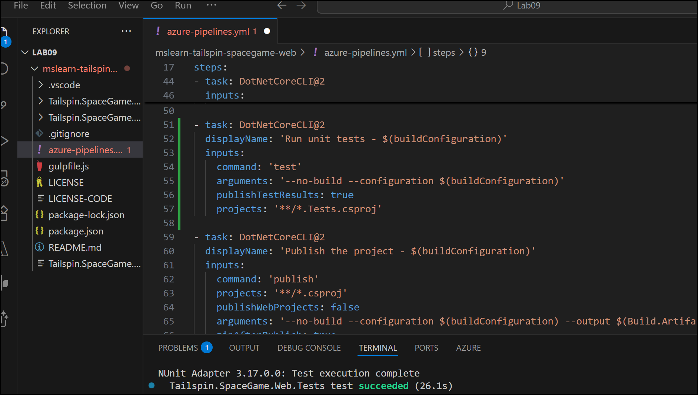

2.  In the integrated terminal, add *azure-pipelines.yml* to the index,
    commit the changes, and push the branch up to GitHub.

git add azure-pipelines.yml

git commit -m "Run and publish unit tests"

git push origin unit-tests

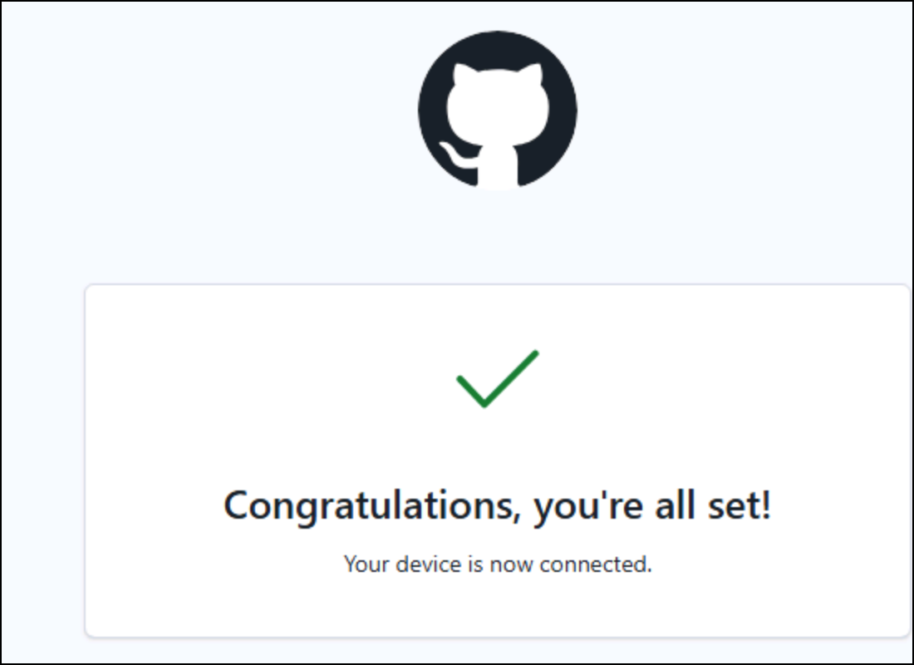

6.  Switch back to Azure Pipelines, Click on running pipeline.

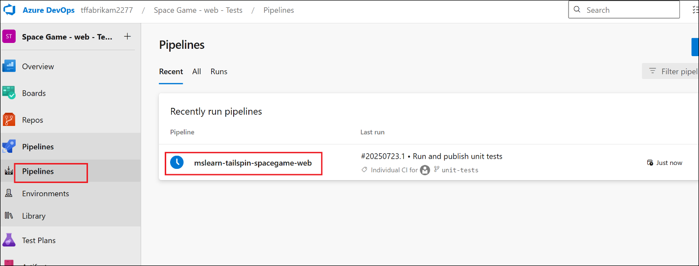

7.  Click on the running job.

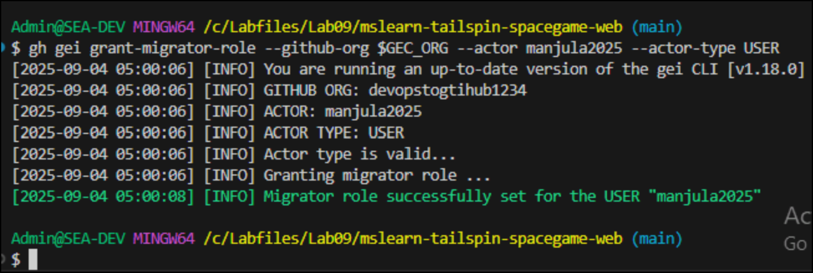

8.  Click on **View** button next to warning message “  
    **This pipeline needs permission to access a resource before this
    run can continue**”

9.  Click on **Permit** and permit access for the job to run.

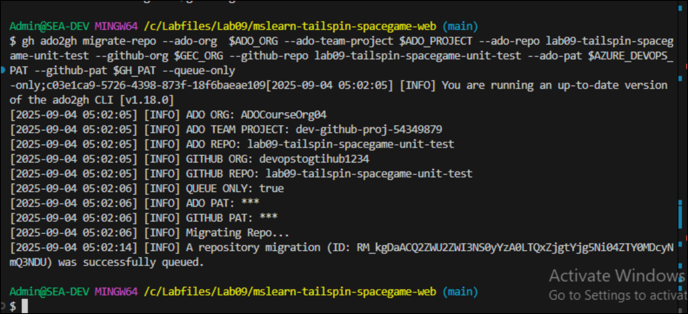

10. Click on Job,You see that the **Run unit tests - Release** task runs
    the unit tests just as you did manually from the command line.

11. Navigate back to the pipeline summary.

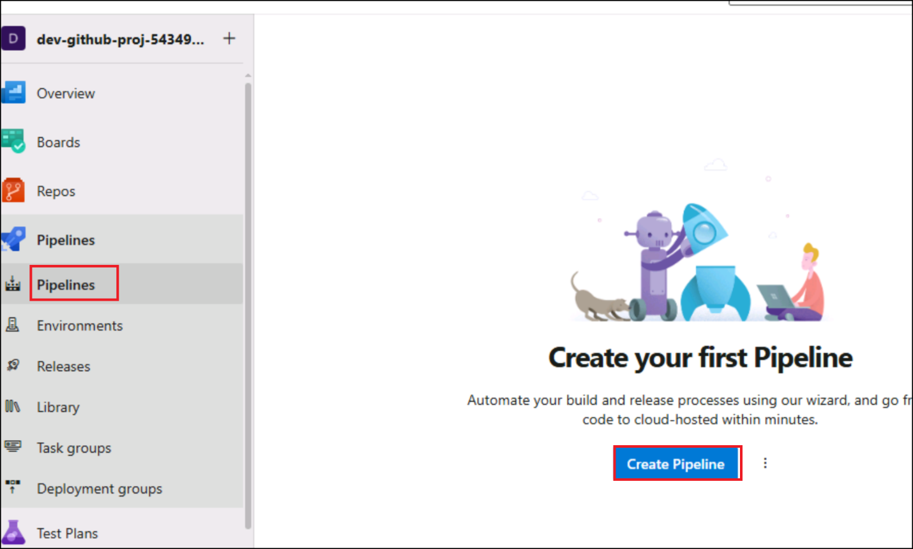

12. Move to the **Tests** tab.You see a summary of the test run. All
    five tests have passed.

13. In Azure DevOps, select **Test Plans**, and then select **Runs**.You
    see the most recent test runs, including the one you just ran.

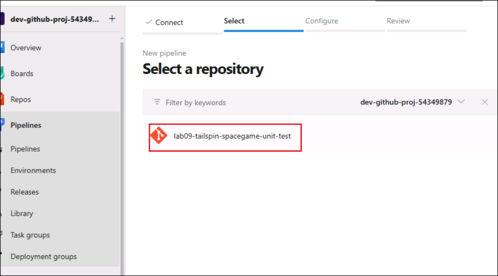

14. Double-click the most recent test run.You see a summary of the
    results.

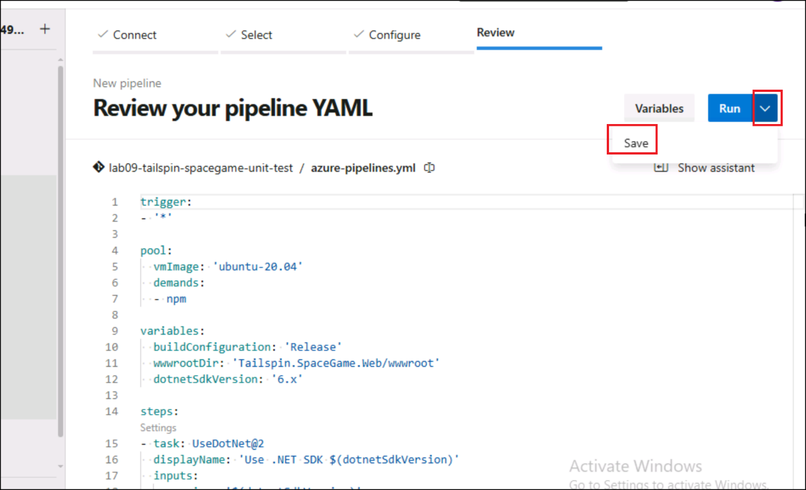

## Exercise 3 - Add a testing widget to your dashboard

In this unit, you'll add a widget to your dashboard to help visualize
your test runs over time.

### Task 1 : Add the widget to the dashboard

1.  In your Azure DevOps project, select **Overview**, and then
    select **Dashboards**.

** Note:**If you ran the template to create the Azure DevOps project,
you won't see the dashboard widgets you set up in previous modules.

2.  Select **Add a widget**.

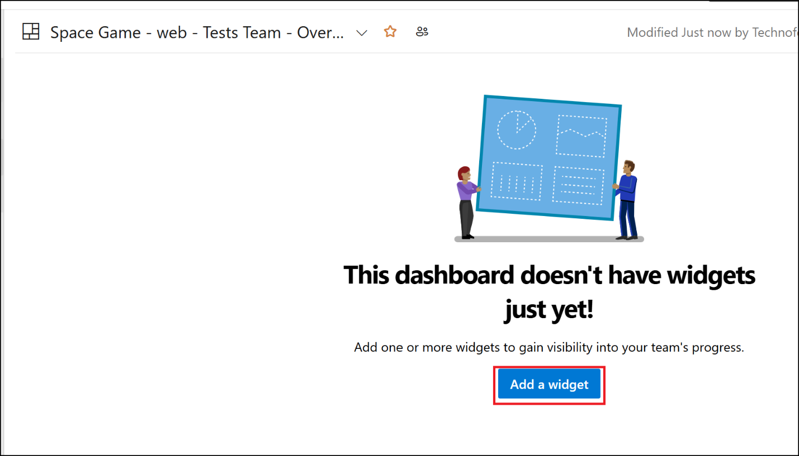

3.  In the **Add Widget** pane, search for **Test Results
    Trend**.Select **Test Results Trend** and then click on **Add**.

4.  Select the **Gear** icon to configure the widget.

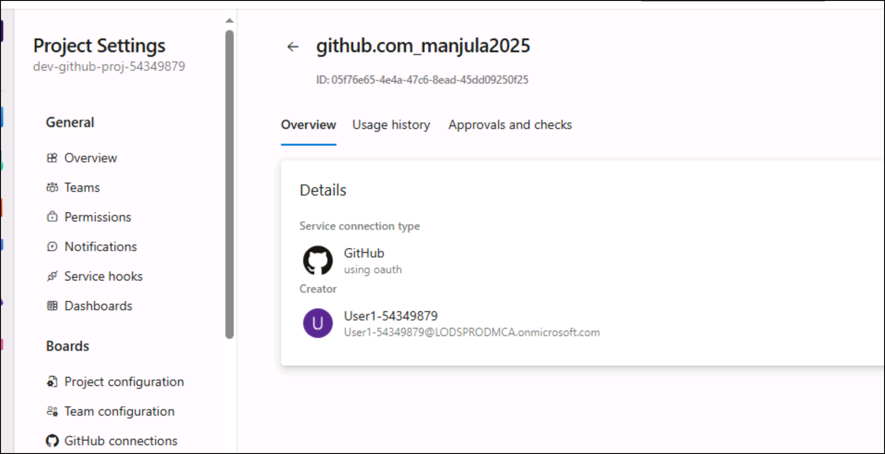

5.  Under Build pipeline, select your pipeline.Keep the other default
    settings.Select **Save**.

> 

6.  Select **Done Editing**.

## Exercise 4 - Perform code coverage testing

Much like the tool you use for unit testing, the tool you use for code
coverage depends on the programming language and application framework.

When you target .NET applications to run on
Linux, [coverlet](https://github.com/tonerdo/coverlet) is a popular
option. Coverlet is a cross-platform, code-coverage library for .NET.

### Task 1 : Run code coverage locally

Before you write any pipeline code, you can try things manually to
verify the process.

1.  In Visual Studio Code, open the integrated terminal.

2.  Run the following dotnet new command to create a local tool manifest
    file. The command creates a file named *.config/dotnet-tools.json*.

dotnet new tool-manifest

3.  Run the following dotnet tool install command to install
    ReportGenerator. This command installs the latest version
    of ReportGenerator and adds an entry to the tool manifest file.

dotnet tool install dotnet-reportgenerator-globaltool

4.  Run the following dotnet add package command to add
    the coverlet.msbuild package to
    the *Tailspin.SpaceGame.Web.Tests* project:

dotnet add Tailspin.SpaceGame.Web.Tests package coverlet.msbuild

5.  Run the following dotnet test command to run your unit tests and
    collect code coverage:

** Note:**If you're using the PowerShell terminal in Visual Studio, the
line continuation character is a backtick (**\`**), so use that
character in place of the backslash character (**\\**) for multi-line
commands.

dotnet test --no-build --configuration Release /p:CollectCoverage=true /p:CoverletOutputFormat=cobertura /p:CoverletOutput=./TestResults/Coverage/

6.  Run the following dotnet tool run command to use ReportGenerator to
    convert the Cobertura file to HTML.Many HTML files will appear in
    the *CodeCoverage* folder at the root of the project.

> dotnet tool run reportgenerator -reports:./Tailspin.SpaceGame.Web.Tests/TestResults/Coverage/coverage.cobertura.xml -targetdir:./CodeCoverage -reporttypes:HtmlInline_AzurePipelines

7.  In Visual Studio Code, expand the *CodeCoverage* folder,
    **right-click *index.htm***, and then select **Reveal in File
    Explorer** (**Reveal in Finder** on macOS or **Open Containing
    Folder** on Linux).

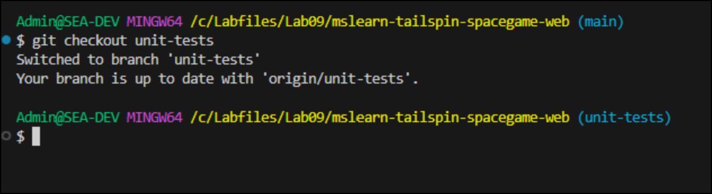

8.  In Windows Explorer (Finder on macOS),
    double-click ***index.htm*** to open it in a web browser.

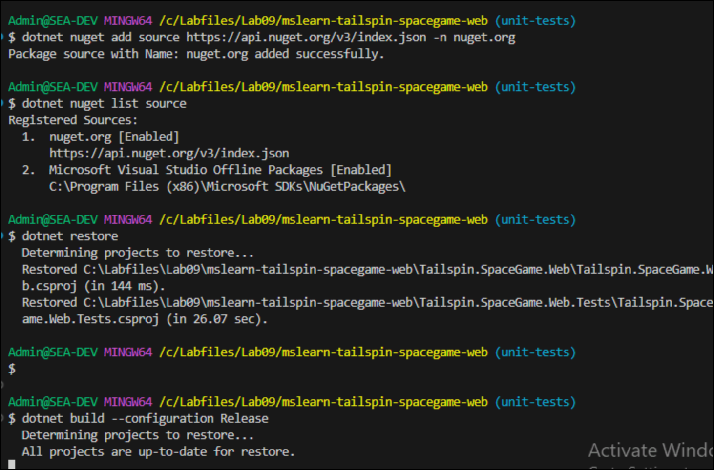

9.  You'll see the coverage report summary.

10. Scroll to the bottom of the page to see a coverage breakdown by
    class type.

### Task 2 : Configure pipeline to include code-coverage branch

1.  Select pipeline and click on Edit.

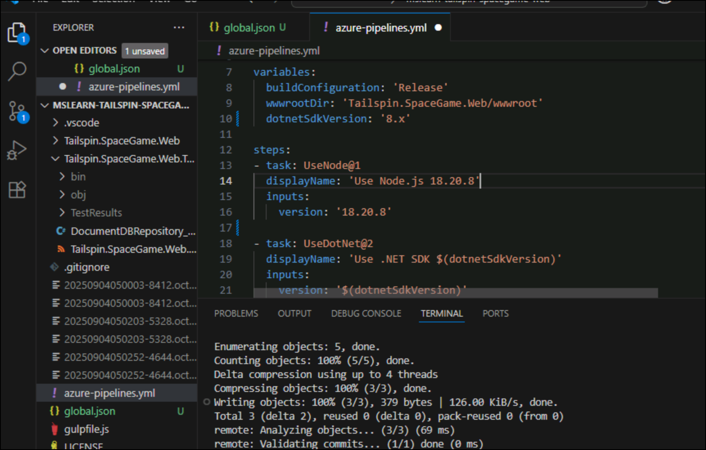

2.  Select code-coverage branch ,select Triggers from run.

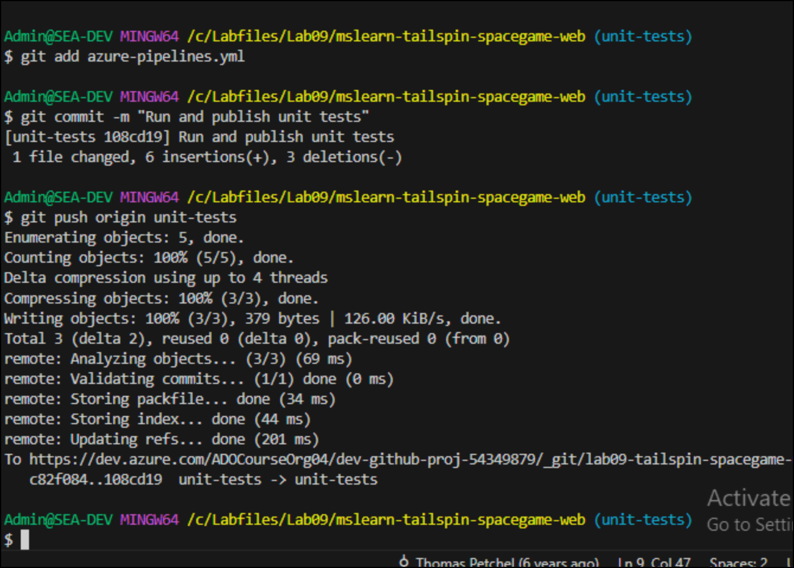

3.  Select CI-repo and include code-coverage branch under Branch filters
    as show in below image.

4.  Enter comment and then save.

### Task 3 : Create a branch

Now that you can build a code coverage report locally, you're ready to
add tasks to your build pipeline, which performs the same tasks.

In this section, you'll create a branch named code-coverage, based on
the unit-tests branch, to hold your work. In practice, you'd ordinarily
create this branch from the main branch.

1.  In Visual Studio Code, open the integrated terminal.

2.  In the terminal, run the following git checkout command to create a
    branch named code-coverage:

git checkout -B code-coverage

3.  Replace  *azure-pipelines.yml* with below code

> trigger:
>
> \- '\*'
>
> pool:
>
>   name: 'Default'
>
>   demands:
>
>   - npm
>
> variables:
>
>   buildConfiguration: 'Release'
>
>   wwwrootDir: 'Tailspin.SpaceGame.Web/wwwroot'
>
>   dotnetSdkVersion: '8.x'
>
> steps:
>
> \- task: UseDotNet@2
>
>   displayName: 'Use .NET SDK $(dotnetSdkVersion)'
>
>   inputs:
>
>     version: '$(dotnetSdkVersion)'
>
> \- task: Npm@1
>
>   displayName: 'Run npm install'
>
>   inputs:
>
>     verbose: false
>
> \- script: './node_modules/.bin/node-sass $(wwwrootDir) --output
> $(wwwrootDir)'
>
>   displayName: 'Compile Sass assets'
>
> \- script: 'npx gulp'
>
>   displayName: 'Run gulp tasks'
>
> \- script: 'echo "$(Build.DefinitionName), $(Build.BuildId),
> $(Build.BuildNumber)" \> buildinfo.txt'
>
>   displayName: 'Write build info'
>
>   workingDirectory: $(wwwrootDir)
>
> \- task: DotNetCoreCLI@2
>
>   displayName: 'Restore project dependencies'
>
>   inputs:
>
>     command: 'restore'
>
>     projects: '\*\*/\*.csproj'
>
> \- task: DotNetCoreCLI@2
>
>   displayName: 'Build the project - $(buildConfiguration)'
>
>   inputs:
>
>     command: 'build'
>
>     arguments: '--no-restore --configuration $(buildConfiguration)'
>
>     projects: '\*\*/\*.csproj'
>
> \- task: DotNetCoreCLI@2
>
>   displayName: 'Install .NET tools from local manifest'
>
>   inputs:
>
>     command: custom
>
>     custom: tool
>
>     arguments: 'restore'
>
> \- task: DotNetCoreCLI@2
>
>   displayName: 'Run unit tests - $(buildConfiguration)'
>
>   inputs:
>
>     command: 'test'
>
>     arguments: '--no-build --configuration $(buildConfiguration)
> /p:CollectCoverage=true /p:CoverletOutputFormat=cobertura
> /p:CoverletOutput=$(Build.SourcesDirectory)/TestResults/Coverage/'
>
>     publishTestResults: true
>
>     projects: '\*\*/\*.Tests.csproj'
>
> \- task: DotNetCoreCLI@2
>
>   displayName: 'Create code coverage report'
>
>   inputs:
>
>     command: custom
>
>     custom: tool
>
>     arguments: 'run reportgenerator
> -reports:$(Build.SourcesDirectory)/\*\*/coverage.cobertura.xml
> -targetdir:$(Build.SourcesDirectory)/CodeCoverage
> -reporttypes:HtmlInline_AzurePipelines'
>
> \- task: PublishCodeCoverageResults@1
>
>   displayName: 'Publish code coverage report'
>
>   inputs:
>
>     codeCoverageTool: 'cobertura'
>
>     summaryFileLocation:
> '$(Build.SourcesDirectory)/\*\*/coverage.cobertura.xml'
>
> \- task: DotNetCoreCLI@2
>
>   displayName: 'Publish the project - $(buildConfiguration)'
>
>   inputs:
>
>     command: 'publish'
>
>     projects: '\*\*/\*.csproj'
>
>     publishWebProjects: false
>
>     arguments: '--no-build --configuration $(buildConfiguration)
> --output $(Build.ArtifactStagingDirectory)/$(buildConfiguration)'
>
>     zipAfterPublish: true
>
> \- task: PublishBuildArtifacts@1
>
>   displayName: 'Publish Artifact: drop'
>
>   condition: succeeded()

4.  

5.  Add and commit the *Tailspin.SpaceGame.Web.Tests.csproj* file, which
    now contains a reference to the coverlet.msbuild package:

git add Tailspin.SpaceGame.Web.Tests/Tailspin.SpaceGame.Web.Tests.csproj

git commit -m "Add coverlet.msbuild package"

6.  Add and commit the tool manifest file, *dotnet-tools.json*:

git add .config/dotnet-tools.json

git commit -m "Add code coverage"

7.  Add and commit *azure-pipelines.yml*, which contains your updated
    build configuration:

git add azure-pipelines.yml

git commit -m "Add code coverage"

8.  Push the code-coverage branch to GitHub.

git push origin code-coverage

9.  In Azure Pipelines, trace the build through each of the steps.\\

> 

10. Click on running pipeline

> 

11. Click on the running job.

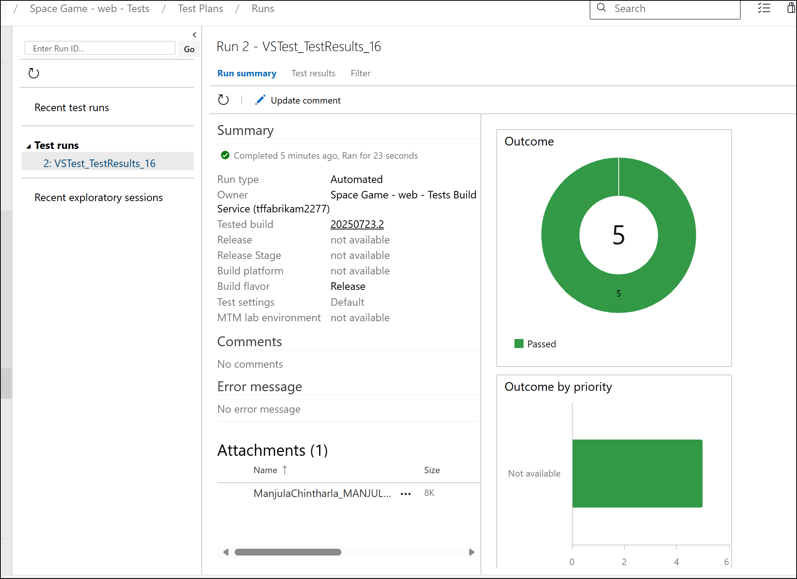

12. Wait for the job to complete successfully and then click back arrow
    to navigate to summary page.

13. When the build finishes, go back to the Summary page and select
    the **Code Coverage** tab.You view the same results that you did
    when you ran the tests locally.

### Task 3 : Add the dashboard widget

In the previous section, you added the **Test Results Trend** widget to
your dashboard, which lets others quickly review test result trends over
time.

Here, you'll add a second widget that summarizes code coverage.

1.  In a new browser tab, go
    to [marketplace.visualstudio.com](https://marketplace.visualstudio.com/).On
    the **Azure DevOps** tab, search for **code coverage**.

2.  Select **Code Coverage Widgets** (published by Shane Davis).

3.  Select **Get it free**.

4.  In the drop-down list, select your Azure DevOps
    organization.Select **Install**.

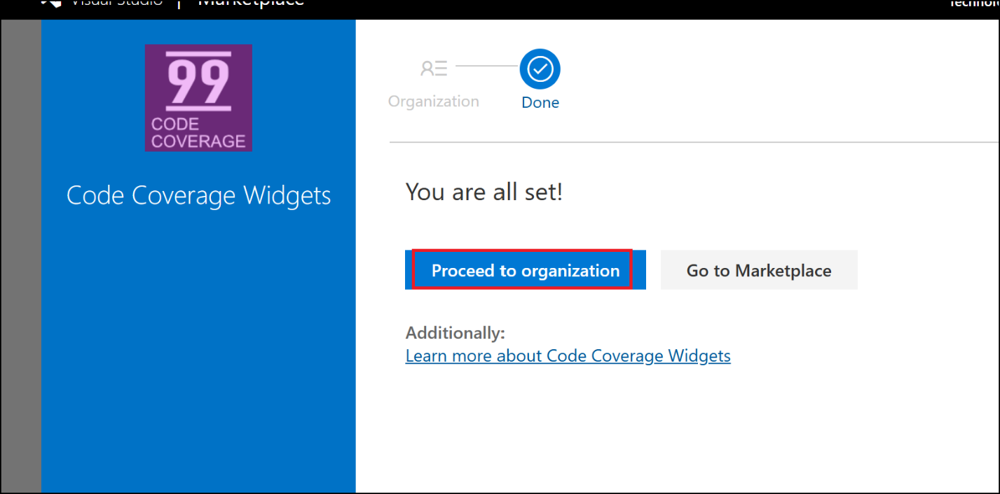

5.  Go back to Azure DevOps.Go
    to **Overview** \> **Dashboards**.Select **Edit**.

6.  Search for **Code Coverage**, and then select **Code Coverage**.
    Select it and then click on **Add**.

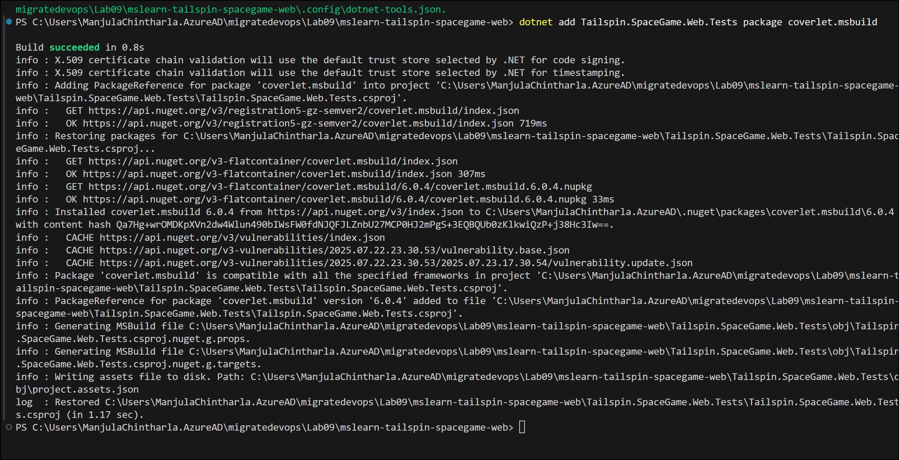

7.  Select the **Gear** icon to configure the widget.

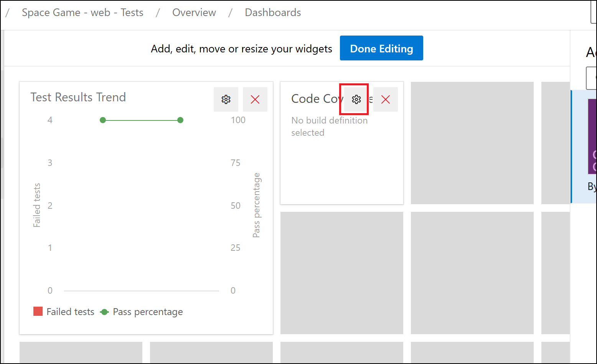

8.  Keep all the default settings, except for:

    - Width: Enter **2**

    &nbsp;

    - Build definition: Select your pipeline

    &nbsp;

    - Coverage measurement: select **Lines**

    &nbsp;

    - Select **Save**.

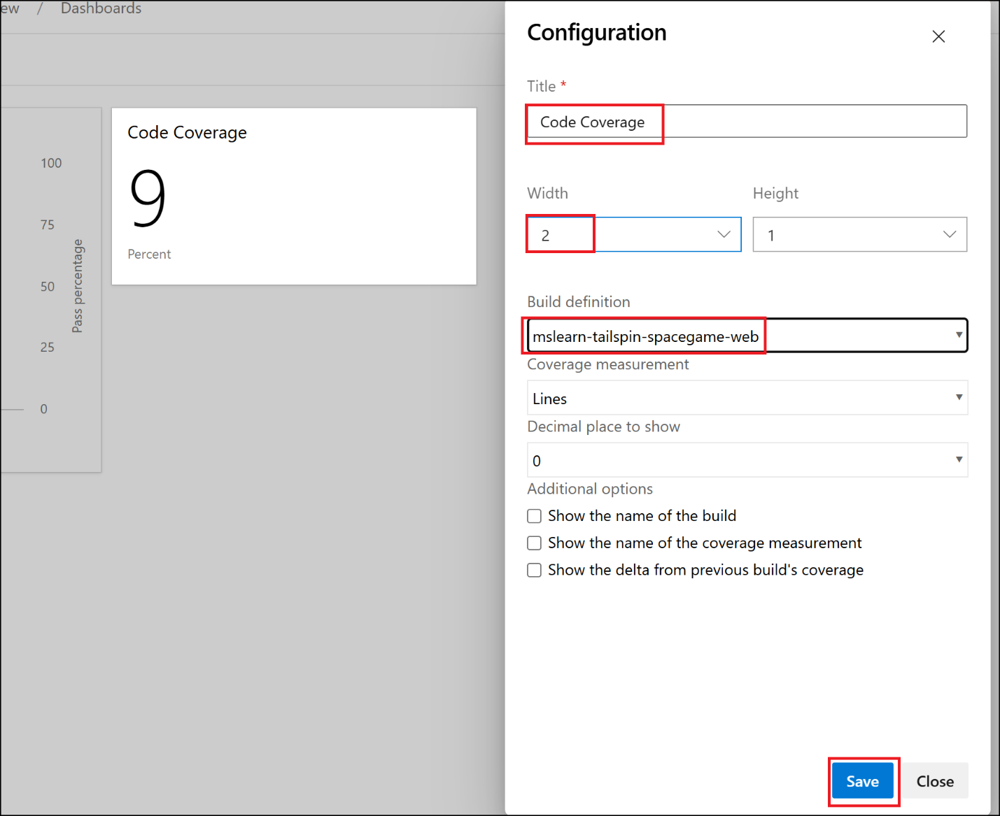

9.  Select **Done Editing**.The widget shows the percentage of code your
    unit tests cover.

## Exercise 6 - Clean up your Azure DevOps environment

You're all done with the tasks for this module. You can now move the
work item to the **Done** state on Microsoft Azure Boards and clean up
your Microsoft Azure DevOps environment.

**Task 1: Delete the Azure DevOps project**

This option deletes your Azure DevOps project, including what's on Azure
Boards and your build pipeline. In future modules, you'll be able to run
another template that brings up a new project in a state where this one
leaves off. Choose this option to delete your Azure DevOps project if
you don't need it for future reference.

To delete the project:

1.  In Azure DevOps, go to your project. Earlier, we recommended that
    you name this project **Space Game - web - Tests**.

2.  Select **Project settings** in the lower-left corner of the Azure
    Devops page.

3.  In the **Project details** area, scroll down, and then
    select **Delete**.

4.  In the window that appears, enter the project name, and then
    select **Delete** a second time.

> 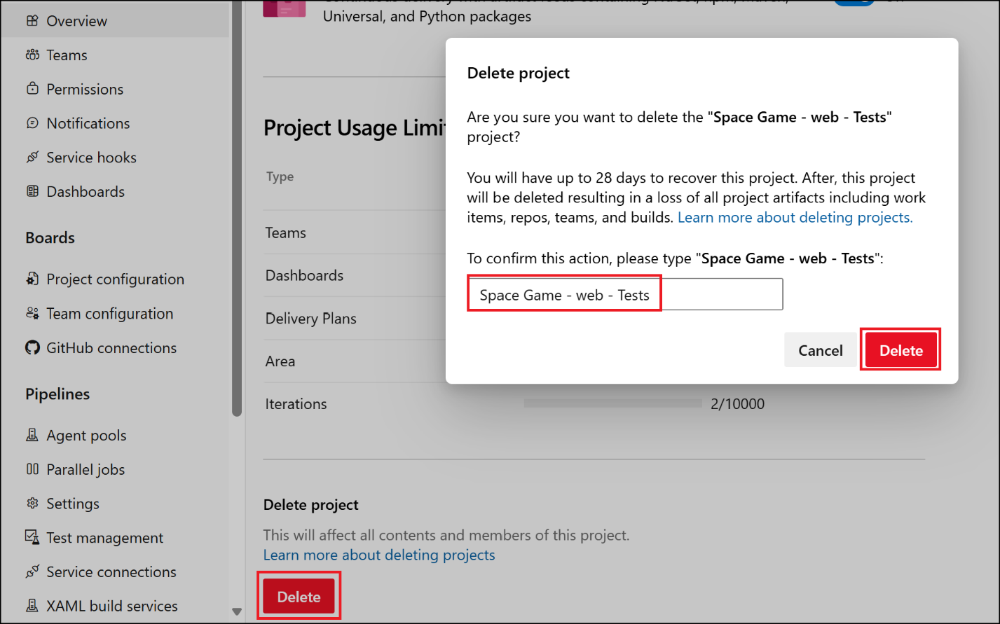
