# Lab 09 -Testing & Code Quality in GitHub After Azure DevOps Migration

## Exercise 1 - Set up your Azure DevOps environment

In this unit, you'll ensure that your Microsoft Azure DevOps
organization is set up to complete the rest of this module.

To do this, you:

- Set up an Azure DevOps project for this module.

- Move the work item for this module on Azure Boards to
  the **Doing** column.

- Make sure your project is set up locally so that you can push changes
  to the pipeline.

### Task 1 – Install and Authenticate GitHub CLI

1.  Open Powershell as administrator from tool bar and run below command
    to install GitHub Cli

  +++winget install --id GitHub.cli+++

  

  

2.  Close the PowerShell window.

3.  By default, GitHub CLI is installed in below location. Add GitHubCLI to system PATH

  +++C:\Program Files\GitHub CLI+++

4.  Press **Win + S** and search for **Environment Variables** and
    select **Edit the system environment variables**

  

5.  In the **System Properties** window, click **Environment
    Variables**.

  

6.  Under **System variables**, find and select **Path**, then
    click **Edit**.

  

7.  Click **New** and **add** GitHub CLI path and then click  **OK-\>OK-\>OK**.

  +++C:\Program Files\GitHub CLI+++

  

8.  Restart the PowerShell and run below command login.(Use your
    personal GitHub account used for day1 labs )

  +++gh --version+++

  +++gh auth login+++

  

9.  Follow the interactive prompts:

    1.  Choose **GitHub.com**

    2.  Select **HTTPS**

    3.  Authenticate via browser

  

  

  

10. Click on **Authorize github** button.

  

  

11. Switch back to PowerShell window.

  

12. After login, confirm by running:

  +++gh auth status+++

  

13. Verify GEC Org Admin Permissions. If you can list org repos, you’re
    properly authenticated and ready.Replace ORG-NAME with your
    organization name and then run it.

  +++gh repo list ORG-NAME+++

  

### Task 2 – Install the GEI (GitHub Enterprise Importer) Extension

1.  Run below command to install GitHub Enterprise importer extension.

  +++gh extension install github/gh-gei+++

  

2.  Confirm installation:

  +++gh gei -h+++

  

3.  Verify installation:

  +++gh gei --help+++

  

### Task 3 : Create an Azure DevOps personal access token

1.  Create an Azure DevOps personal access token (PAT). Open a new tab
    in your browser and navigate to - <https://portal.azure.com/> and
    sign in with assigned account.

  

  

2.  **Cancel** the Welcome window.

  

3.  Search for +++Azure DevOps+++ and select **Azure DevOps
    organizations**.

  

4.  Click on **My Azure DevOps Organization** hyper link.

  

5.  Keep the default values and then click on **Continue** button.

  

6.  Click on the existing organization link as shown in below image.

  

7.  In the top right corner of the screen, click **User settings**.
    Click **Personal access tokens**.

  

8.  Select **+ New Token**

  

9.  Enter the name as : +++devopstoken+++ and select Full access scope and
    then click on **Create**

  

10. Copy the generated API token and save it in a safe location. For
    your security, it won't be shown again.

  

### Task 4 : Create Repos in ADO

1.  Switch back to DevOps Organization page and click on the existing
    project.

  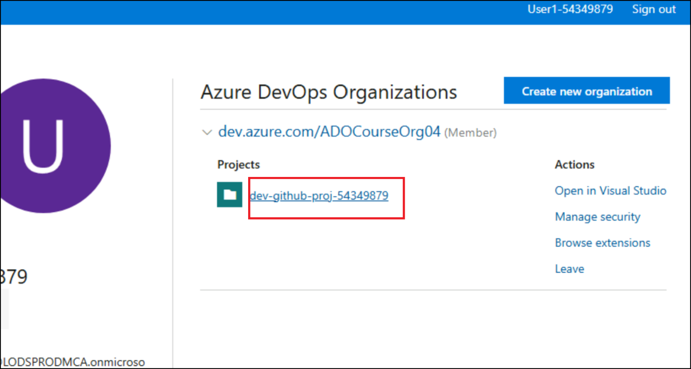

2.  Hover on **Repos** from left navigation menu and select **Files**.

  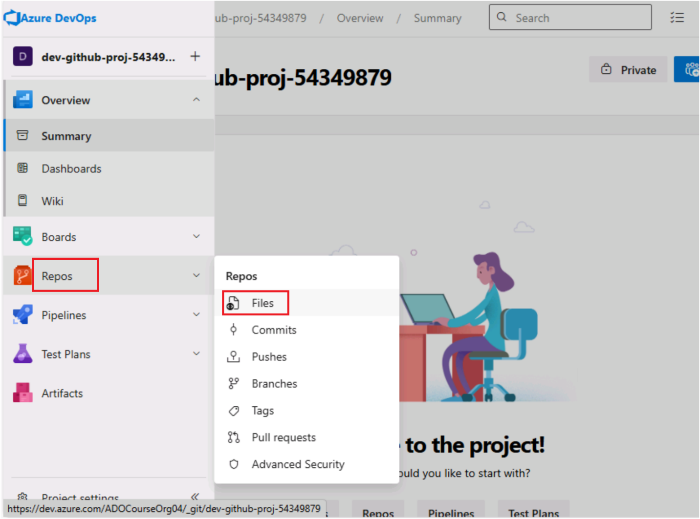

3.  Click on the project drop down form top navigation menu and select
    **New repository**.

  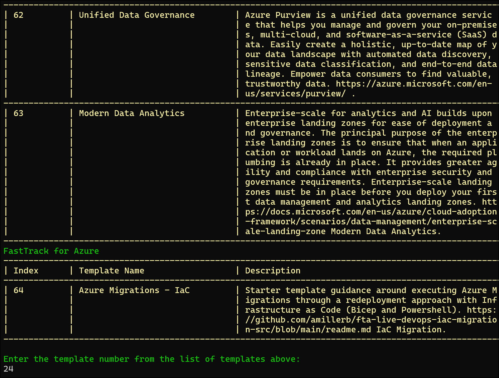

4.  Enter the Repository name as **lab09-tailspin-spacegame-unit-test**.
    Unselect “Add a README” checkbox and then click on **Create**.

  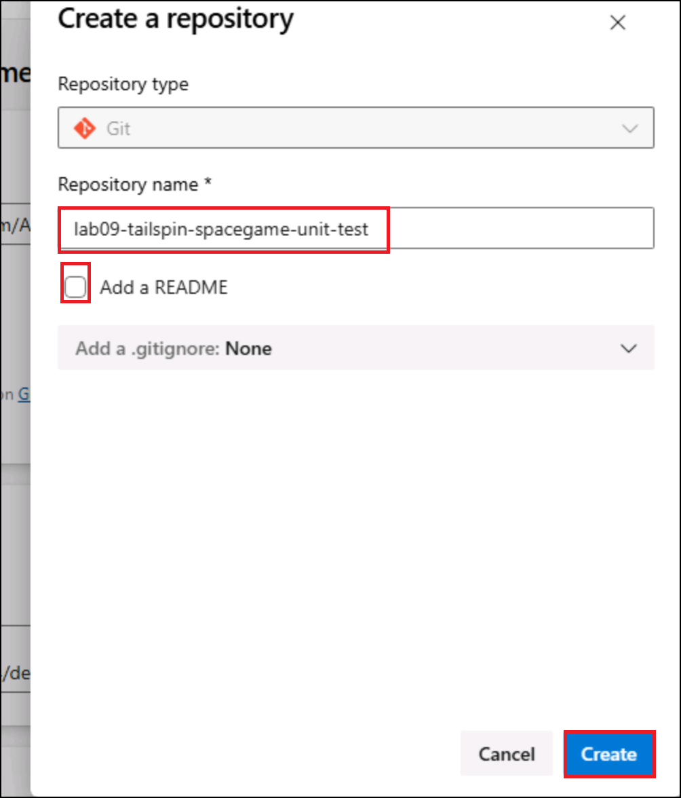

  

5.  Copy the HTTPS url to use in next exercise 2

  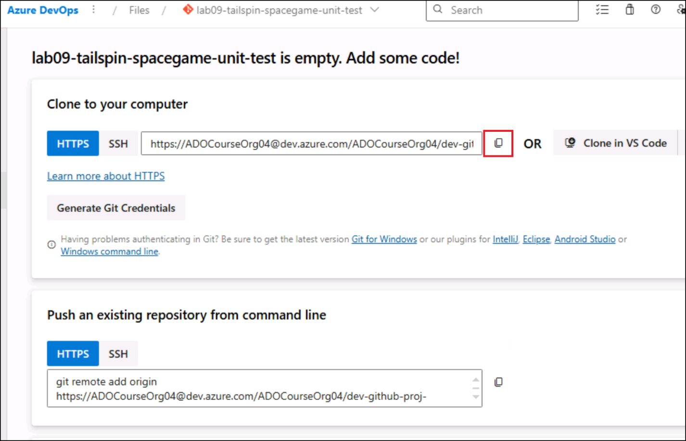

### Task 4 : Create GitHub personal access token (You can re-use the same PAT created in Day 1 else follow this task to create new PAT)

1.  Open GitHub in new browser tab and sign in with your GitHub account.

2.  Click on profile from right top corner and select **Settings**.

  

3.  Click on **Developer settings** from left navigation menu.

  

4.  Expand Persnal access tokens -\> Tokens(Classic). Click on Generate
    new token -\> Generate new token (classic)

  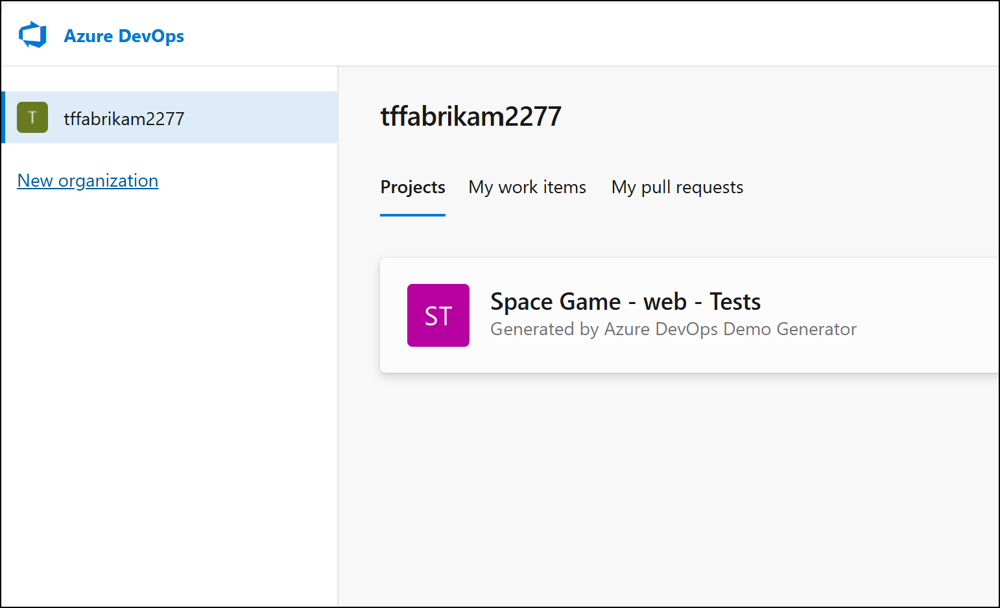

5.  Enter Note as : **githubtoken** and select all the scope items.

  

6.  Click on **Generate token**

  

7.  Copy and save the token in a note pad to use in upcoming tasks.

  

### Task 5 : Fetch the branch from GitHub

1.  Open Visual Studio Code, go to the terminal window.

  

2.  Click on File-\> Open Folder

  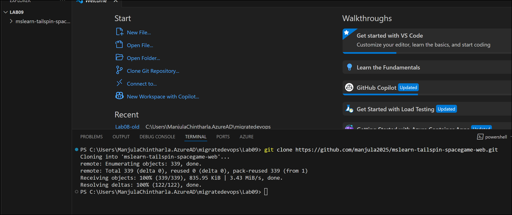

3.  Navigate to the path “C:\Labfiles\Lab09” and select the
    mslearn-tailspin-spacegame-web" folder

  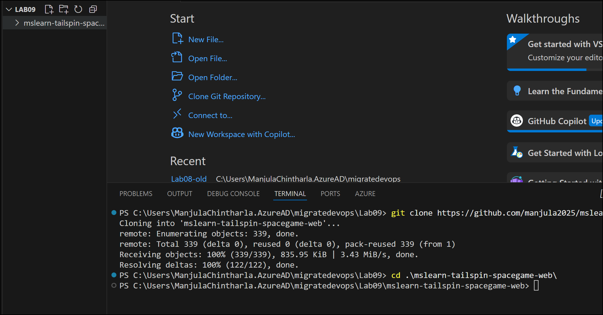

4.  Open new terminal and select Bash.

  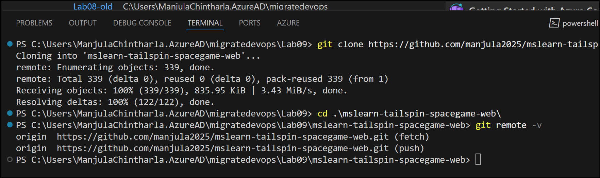

5.  A *remote* is a Git repository where team members collaborate (like
    a repository on GitHub). Here you list your remotes and add a remote
    that points to Microsoft's copy of the repository so that you can
    get the latest sample code.

6.  Run the following command to list your remotes:

  +++git remote -v+++

  

7.  Origin specifies your repository on GitHub. When you fork code from
    another repository, the original remote (the one you forked from) is
    commonly named upstream.

8.  Run the following command to create a remote named *upstream* that
    points to the Microsoft repository:

  +++git remote add upstream https://github.com/MicrosoftDocs/mslearn-tailspin-spacegame-web.git+++

  +++git remote -v+++

  

## Exercise 2 - Add unit tests to your application

In this unit, we'll add unit tests to the automated build that we
created with Microsoft Azure Pipelines. Regression bugs are creeping
into your team's code and breaking the leaderboard's filtering
functionality. Specifically, the wrong game mode keeps appearing.

The following image illustrates the problem. When a user selects "Milky
Way" to show only scores from that game map, they get results from other
game maps, such as Andromeda.

Here's the process to follow:

1.  Fetch a branch from the GitHub repository that contains the unit
    tests.

2.  Run the tests locally to verify that they pass.

3.  Add tasks to your pipeline configuration to run the tests and
    collect the results.

4.  Push the branch to your GitHub repository.

5.  Watch your Azure Pipelines project automatically build the
    application and run the tests.

### Task 1 : Push Repo in Azure DevOps

1.  **Replace** you@example.com **with your GitHub account and Your Name
    to be replaced with your Github account username in the below
    commands and run them.**

  ++++git config --global user.email "you@example.com"+++

  +++git config --global user.name "Your Name"+++

  

2.  **Run below commands to push the repo.**

  +++git init+++

  +++git add .+++

  +++git commit -m "Initial commit for migration lab"+++

  

3.  **Switch back to GitBash and run below command to sign into Azure.
    Select Work or school account option and click on Continue.**

  +++az login+++

  

4.  **Sign in with your cloud slice accounts.**

  - Username: +++@lab.CloudPortalCredential(User1).Username+++

  - Password: +++@lab.CloudPortalCredential(User1).Password+++

  

  

5.  **Click on Yes,all apps button and then click on Done.**

  

  

6.  **Select your subscription and then press enter.**

  

7.  **Run below command to push local folder to Azure Devops .(Replace**
    https://dev.azure.com/ADOCourseOrg04/dev-github-proj-53969426/\_git/azure-search-openai-migrated
    **with the https link you copied in previous step -Azure DevOps
    repos**

  +++git remote set-url origin <Devops Repo Https url>+++

  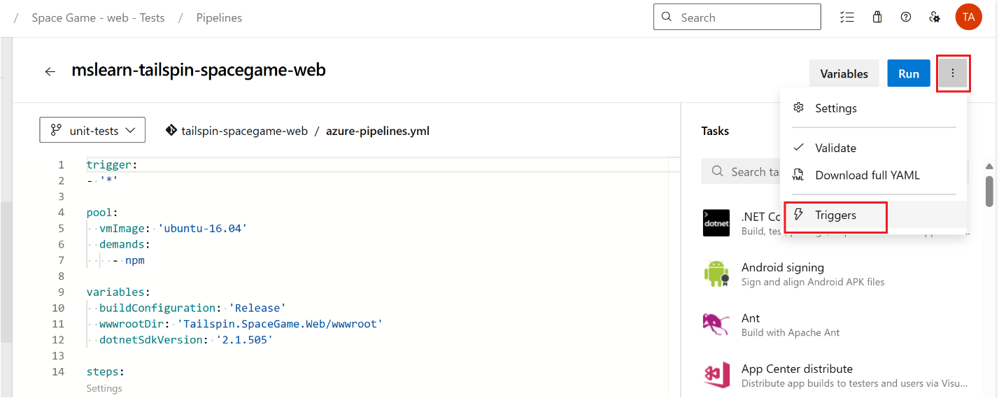

8.  Run below command to fetch all remote branchs. Sign in with your
    cloud slice account when prompts

  +++git fetch --all+++

  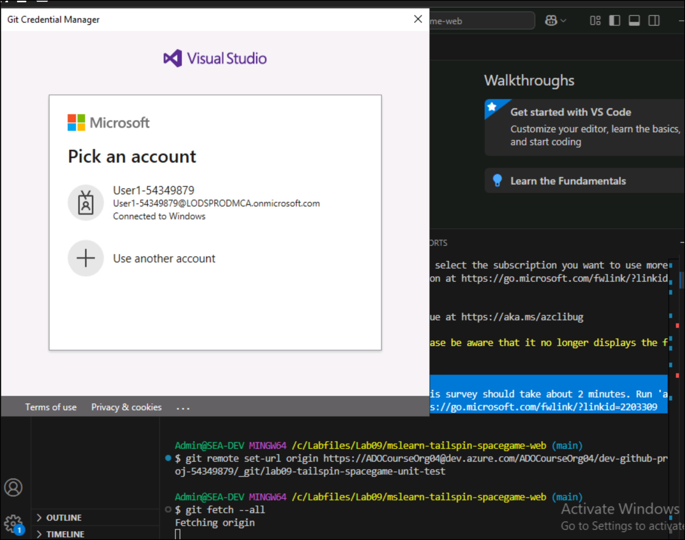

  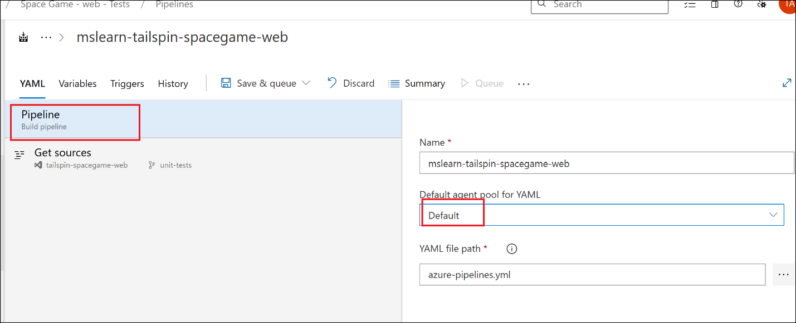

9.  Run below code to create local tracking branches for each remote
    branch

  ```
for branch in $(git branch -r | grep -v '\->'); do
  git branch --track ${branch#origin/} $branch
done
```

  

10. Run below command to pull all branches to update them locally

  +++git pull --all+++

  

11. **Run below command to push the repo to Devops . if it prompts to
    sign in ,sign in with your DevOps account.**

  +++git push -u origin --all+++

  

>**Note : If you already have repo in Devops then follow steps to pull
and resolve conflict – 1. Pull from DevOps with unrelated history:**
**git pull origin main --allow-unrelated-histories Step 2 : Resolve
conflicts in files like .gitignore, README.md. Step 3 : Stage the
resolved files - git add .**  **git commit -m "Resolved merge conflicts"**

12. **Go back to Azure Devops project and check** Repos-\> Files.You
    should see your repo here .

  

### Task 2 : Migrate Azure DevOps Repo to GitHub Enterprise Cloud

1.  Switch back to Visual Studio and run below commands to set
    environment varaibles. Make sure to update variables with your
    values and then run them.

  +++export AZURE_DEVOPS_PAT="YOUR_AZDO_PAT"+++

  +++export GH_PAT="ghp_xxxxxxxxxxxxxxxxxxxxx"+++

  +++export ADO_ORG="your-ado-org"+++ # eg - ADOCourseOrg04

  +++export GEC_ORG="your-githubEC-org"+++ # e.g. devopstogtihub1234

  +++export ADO_PROJECT="your-existing ADO_Projectname"+++ # eg-dev-github-proj-XXXXXXXX

  

2.  Run below commands to verify GitHub login status. If not logged in
    then run 2^(nd) command gh auth login and follow the process to
    loginto GitHub.

  +++gh auth status+++

  +++gh auth login+++

  

  

  

  

  

  

3.  Run below command to grant migrator role to your account.(replace
    your-github-username with your username)

  +++gh gei grant-migrator-role --github-org $GEC_ORG --actor <your-github-username> --actor-type USER+++

  

  >eg :gh gei grant-migrator-role --github-org devopstogtihub1234 --actor chintharlamanjula --actor-type USER

4.  Run below command to install GitHub cli extensions

  +++gh extension install github/gh-ado2gh+++

  

5.  Run below dry-run command to migrate repos to GEC**  
    (Note: We have used repo -** **tailspin-spacegame-web-deploy . You
    can check this in your ADO-\>Org-\> Project-\> Repo )**

  +++gh ado2gh migrate-repo --ado-org  $ADO_ORG --ado-team-project $ADO_PROJECT --ado-repo lab09-tailspin-spacegame-unit-test --github-org $GEC_ORG --github-repo lab09-tailspin-spacegame-unit-test --ado-pat $AZURE_DEVOPS_PAT --github-pat $GH_PAT --queue-only+++

  

6. Copy repository migration and update below command with migration id
    and run.

  +++gh ado2gh wait-for-migration  --migration-id <MIGRATION_ID> --github-pat $GH_PAT+++

  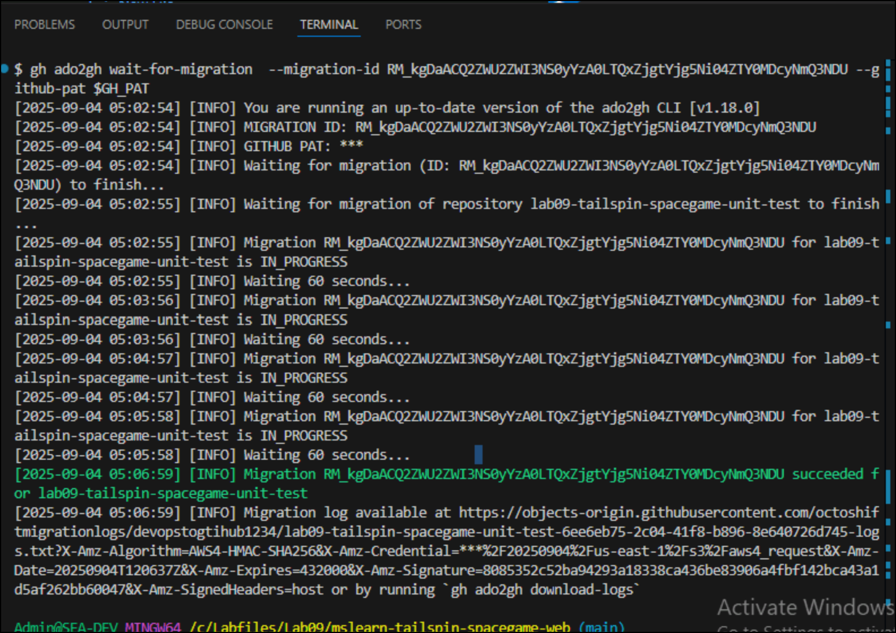

7. Switch back to Github GEC -\> organization and you should see repo

  

### Task 3 : Create pipeline to use GEC repo

1.  Click on **Pipelines** from left navigation menu and then select
    Pipeline.Click on **Create Pipeline**.

  

2.  Select **Azure Repo git** tile

  

3.  Select the **Lab09-tailspin-spacegame-iunit-test** repo.

  

4.  Click on **Run** drop down and select **Save**.

  

###  Task 4 : Create a service connection for ARM and GitHub

Here, you create a service connection that enables Azure Pipelines to
access your Azure subscription. Azure Pipelines uses this service
connection to deploy the website to App Service. You created a similar
service connection in the previous labs.

**Important:** Make sure that you're signed in to both the Azure portal
and Azure DevOps under the same Microsoft account.

1.  In Azure DevOps, go to your **exisitng** project.From the lower-left
    corner of the page, select **Project settings**.

  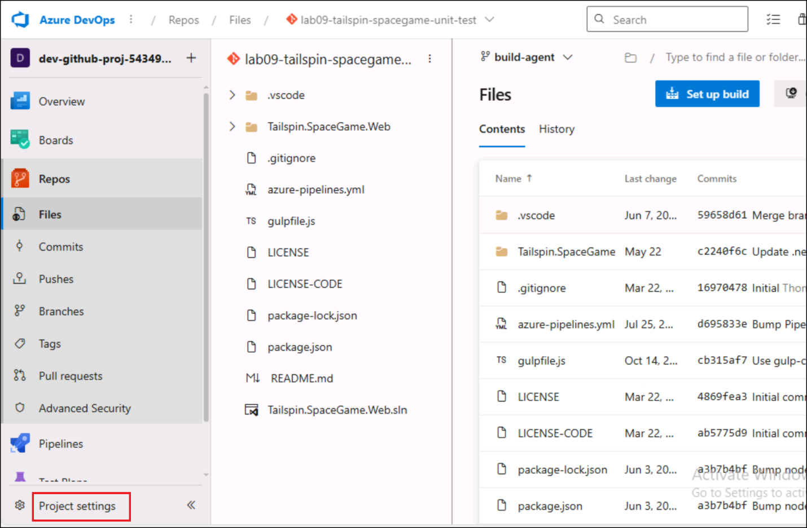

2.  Click on **Service connections** under **Pipelines** and then click
    on **New Service connection** button.

  

3.  Select **GitHub** and then click **Next**.

  

4.  Select **AzurePipelines** from **OAuth Configuration** drop down and
    then click on **Authorize** button.

  

5.  Sign into GitHub .Keep the default service name, then click on
    **Save** .

  

6.  Select the Pipelines from left navigation menu and select the
    pipeline to **Edit**.

  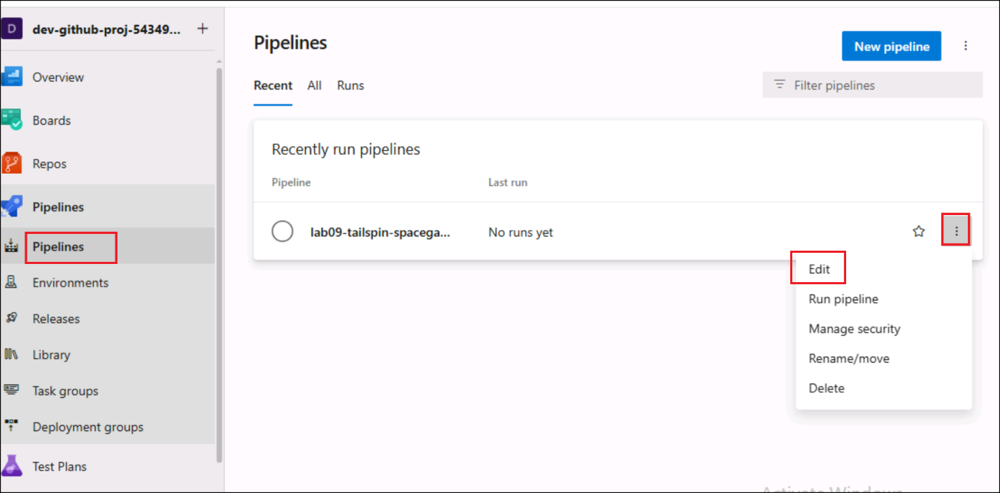

7.  Select **unit-tests** branch and then click next to **Run** button
    and select **Triggers**.

  

8.  Click on TAML tab without making any changes to triggers

  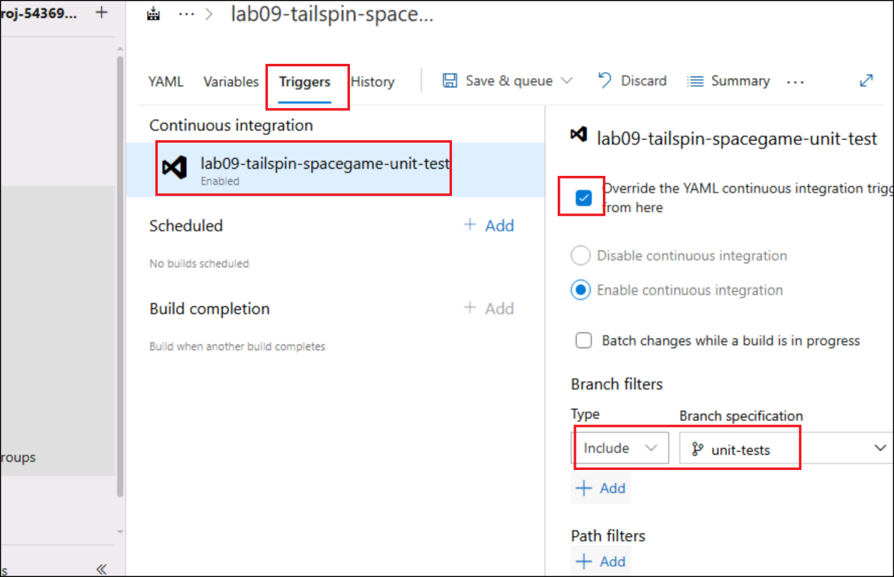

9.  Select **YAML** tab and select **Get sources-\>GitHub** and then
    click on **Repository**

  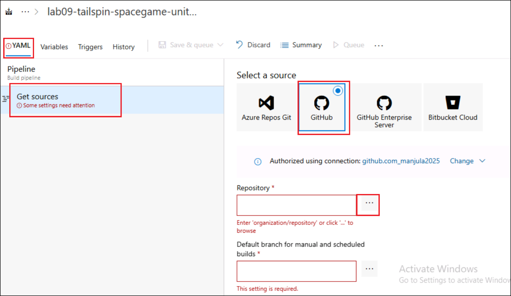

10. Select the repo – **Lab09-tailspin-spacegame-unit-test** and then
    click on **Select** button.

  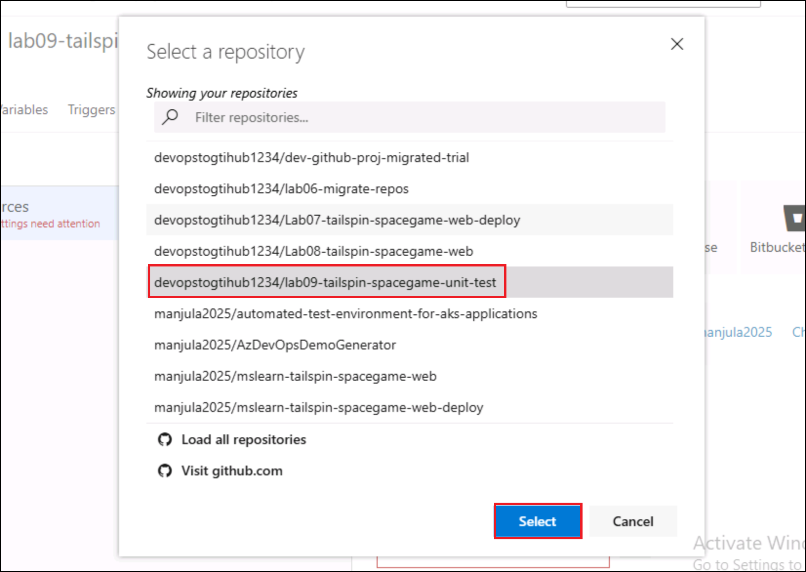

11. Keep all the default values and then click on **Save & queue-\>
    Save**.

  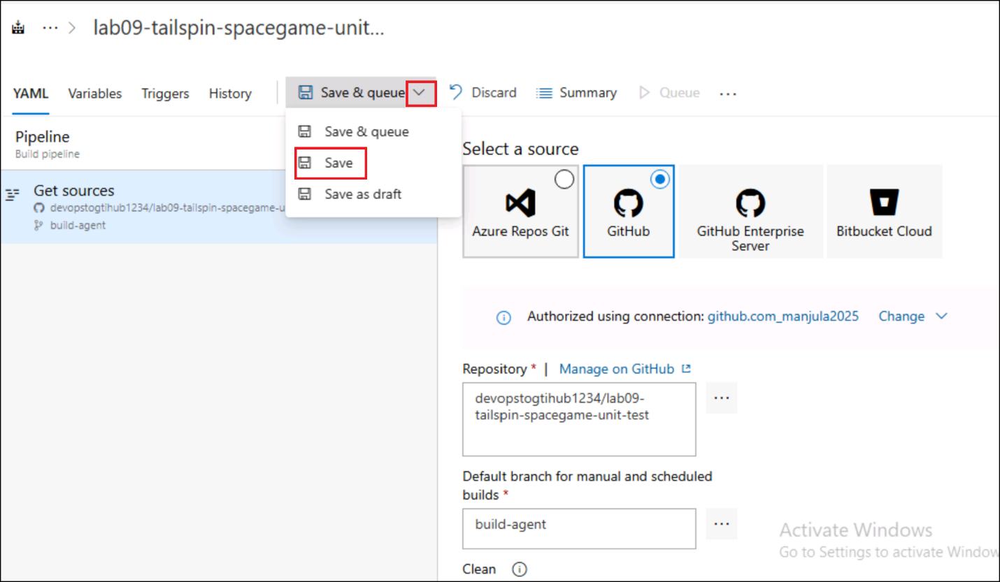

12. Enter some comment and click on Save to save the build pipeline.

  

### Task 5 : Add and Run unit tests

Here, you'll fetch the unit-tests branch from GitHub and check out, or
switch to, that branch.

This branch contains the *Space Game* project that you worked with in
the previous modules and an Azure Pipelines configuration to start with.

1.  We had already added unit-test branch in Exercise .lets run below
    command to switch to unit-tests branch

  +++git checkout unit-tests+++

  

2.  The format of this command enables you to get starter code from the
    Microsoft GitHub repository, known as upstream. Shortly, you'll push
    this branch to your GitHub repository, known as origin.

3.  As an optional step, open the *azure-pipelines.yml* file in Visual
    Studio Code and familiarize yourself with the initial configuration.

4.  Run below command to Add NuGet.org as a Source and verify

  +++dotnet nuget add source https://api.nuget.org/v3/index.json -n nuget.org+++

  +++dotnet nuget list source+++

1.  Run dotnet build to build each project in the solution.

  +++dotnet build --configuration Release+++

  

2.  Run the following dotnet test command to run the unit tests:

  +++dotnet test --configuration Release --no-build+++

  The --no-build flag specifies not to build the project before running it. You don't need to build the project because you built it in the previous step.

  

3.  Notice that there were five total tests. Although we defined just
    one test method, FetchOnlyRequestedGameRegion, that test is run five
    times, once for each game map as specified in the TestCase inline
    data.

4.  Run the tests a second time. This time, provide the --logger option
    to write the results to a log file.

  +++dotnet test Tailspin.SpaceGame.Web.Tests --configuration Release --no-build --logger trx+++

  You see from the output that a TRX file is created in the **TestResults** directory.

  A TRX file is an XML document that contains the results of a test run.It's a popular format for test results because Visual Studio and other tools can help you visualize the results.

  

  Later, you'll see how Azure Pipelines can help you visualize and track your test results as they run through the pipeline.

  >**Note:**TRX files are not meant to be included in source control.A *.gitignore* file allows you to specify which temporary and other files you want Git to ignore. The project's *.gitignore* file is already set up to ignore anything in the *TestResults* directory.

5.  As an optional step, in Visual Studio Code, open
    the *DocumentDBRepository_GetItemsAsyncShould.cs* file from
    the *Tailspin.SpaceGame.Web.Tests* folder and examine the test code.
    Even if you're not interested in building .NET apps specifically,
    you might find the test code useful because it resembles code you
    might see in other unit test frameworks.

  **Add tasks to your pipeline configuration**

  Here, you'll configure the build pipeline to run your unit tests and
collect the results.

1.  In Visual Studio Code, replace the code in
     *azure-pipelines.yml* with below code and save the file
  ```
  trigger:
  branches:
    include:
      - '*'

pool:
  vmImage: 'windows-latest'  # Microsoft-hosted agent

variables:
  buildConfiguration: 'Release'
  wwwrootDir: 'Tailspin.SpaceGame.Web/wwwroot'
  dotnetSdkVersion: '8.x'

steps:
  - task: UseNode@1
    displayName: 'Use Node.js 18.20.2'
    inputs:
      version: '18.20.2'  # Updated to latest valid version

  - task: UseDotNet@2
    displayName: 'Use .NET SDK $(dotnetSdkVersion)'
    inputs:
      version: '$(dotnetSdkVersion)'

  - task: Npm@1
    displayName: 'Run npm install'
    inputs:
      verbose: false

  - script: './node_modules/.bin/node-sass $(wwwrootDir) --output $(wwwrootDir)'
    displayName: 'Compile Sass assets'

  - script: 'npx gulp'
    displayName: 'Run gulp tasks'

  - script: 'echo "$(Build.DefinitionName), $(Build.BuildId), $(Build.BuildNumber)" > buildinfo.txt'
    displayName: 'Write build info'
    workingDirectory: $(wwwrootDir)

  - task: DotNetCoreCLI@2
    displayName: 'Restore project dependencies'
    inputs:
      command: 'restore'
      projects: '**/*.csproj'

  - task: DotNetCoreCLI@2
    displayName: 'Build the project - $(buildConfiguration)'
    inputs:
      command: 'build'
      arguments: '--no-restore --configuration $(buildConfiguration)'
      projects: '**/*.csproj'

  - task: DotNetCoreCLI@2
    displayName: 'Run unit tests - $(buildConfiguration)'
    inputs:
      command: 'test'
      arguments: '--no-build --configuration $(buildConfiguration)'
      publishTestResults: true
      projects: '**/*.Tests.csproj'

  - task: DotNetCoreCLI@2
    displayName: 'Publish the project - $(buildConfiguration)'
    inputs:
      command: 'publish'
      projects: '**/*.csproj'
      publishWebProjects: false
      arguments: '--no-build --configuration $(buildConfiguration) --output $(Build.ArtifactStagingDirectory)/$(buildConfiguration)'
      zipAfterPublish: true

  - task: PublishBuildArtifacts@1
    displayName: 'Publish Artifact: drop'
    condition: succeeded()
  ```


  

2.  In the integrated terminal, add *azure-pipelines.yml* to the index,
    commit the changes, and push the branch up to GitHub.

  +++git add azure-pipelines.yml+++

  +++git commit -m "Run and publish unit tests"+++

  +++git push origin unit-tests+++

  

6.  Switch back to Azure Pipelines, Click on running pipeline.

  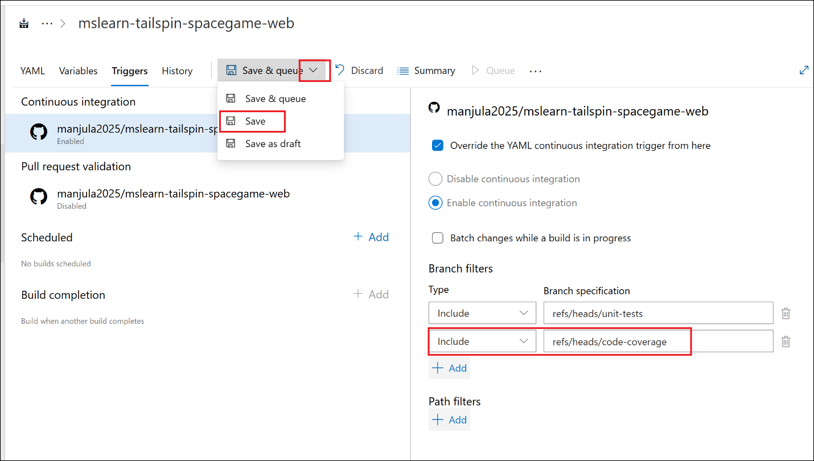

7.  Click on the running job.

  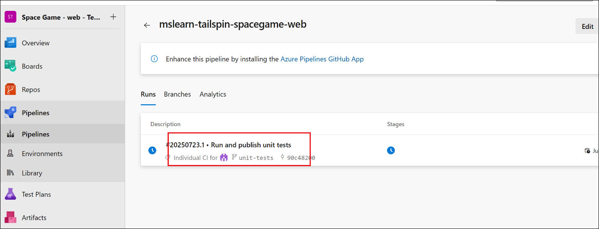

8.  Click on **View** button next to warning message “**This pipeline needs permission to access a resource before this
    run can continue**”

  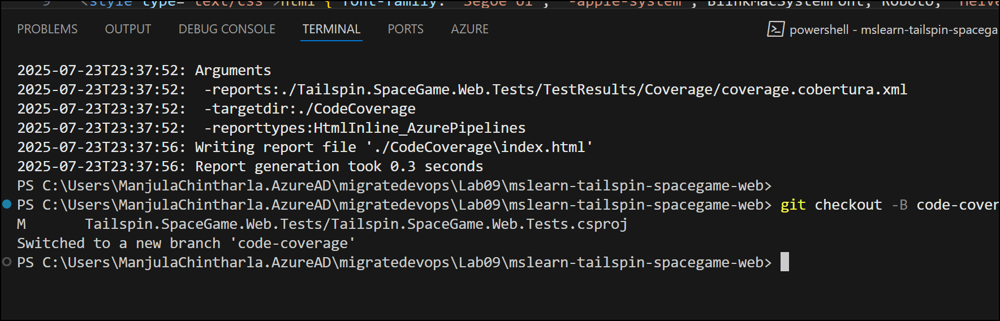

9.  Click on **Permit** and permit access for the job to run.

  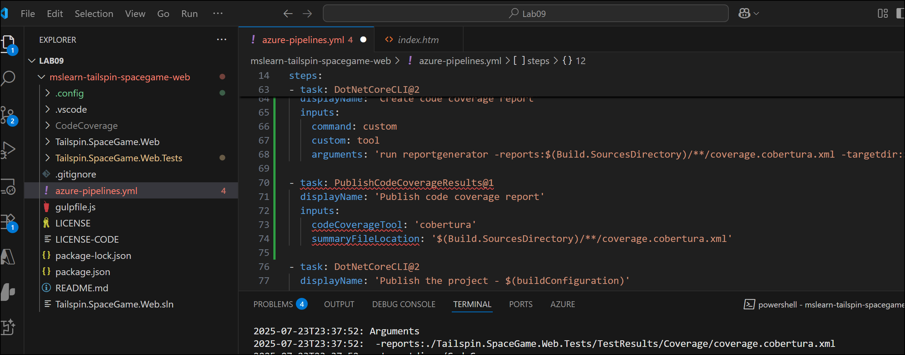

10. Click on Job,You see that the **Run unit tests - Release** task runs
    the unit tests just as you did manually from the command line.

  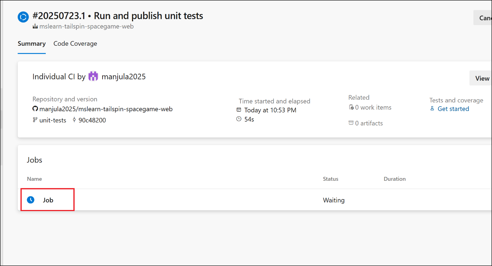

11. Navigate back to the pipeline summary.

  

  

12. Move to the **Tests** tab.You see a summary of the test run. All
    five tests have passed.

  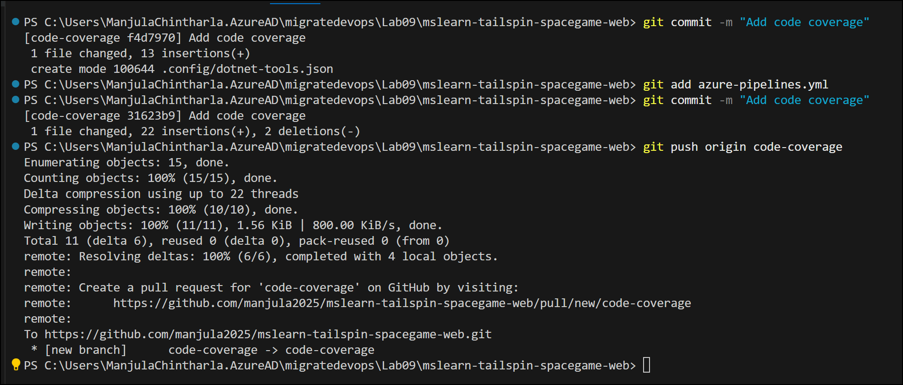

13. In Azure DevOps, select **Test Plans**, and then select **Runs**.You
    see the most recent test runs, including the one you just ran.

  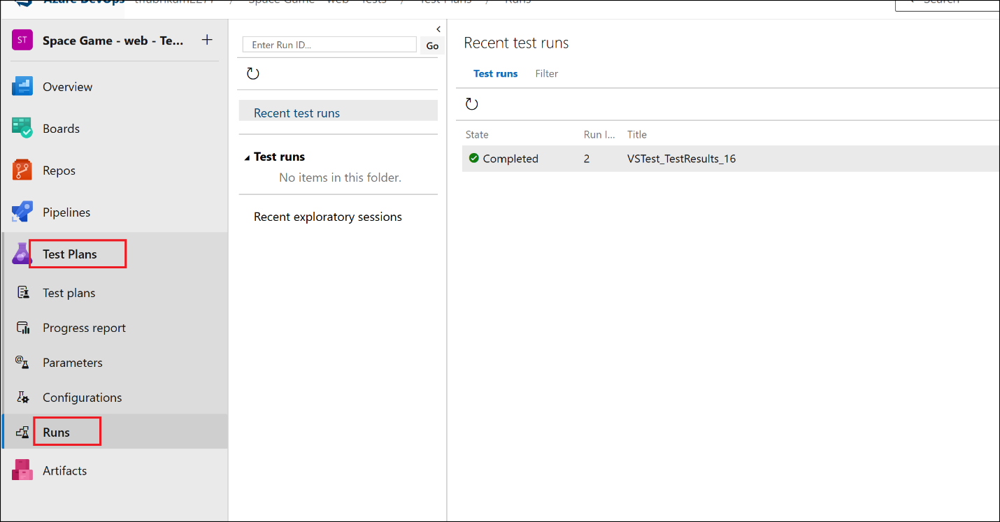

14. Double-click the most recent test run.You see a summary of the
    results.

  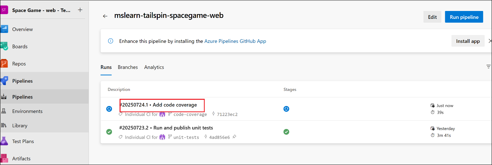

  

## Exercise 3 - Add a testing widget to your dashboard

In this unit, you'll add a widget to your dashboard to help visualize
your test runs over time.

### Task 1 : Add the widget to the dashboard

1.  In your Azure DevOps project, select **Overview**, and then
    select **Dashboards**.

  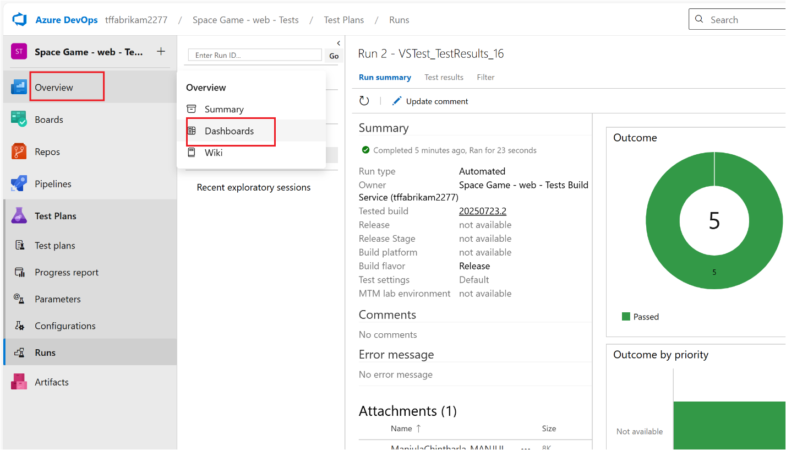

  >**Note:**If you ran the template to create the Azure DevOps project,
you won't see the dashboard widgets you set up in previous modules.

2.  Select **Add a widget**.

  

3.  In the **Add Widget** pane, search for **Test Results
    Trend**.Select **Test Results Trend** and then click on **Add**.

  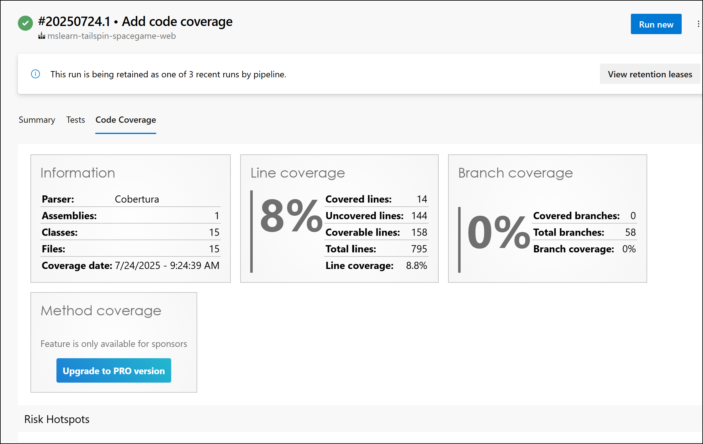

4.  Select the **Gear** icon to configure the widget.

  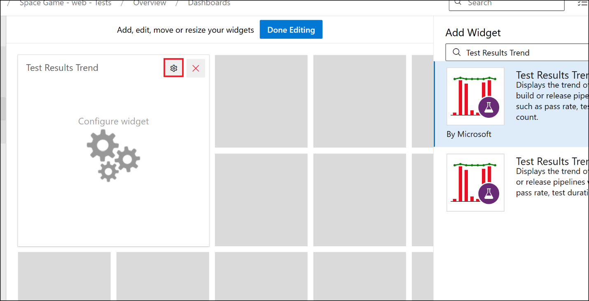

5.  Under Build pipeline, select your pipeline.Keep the other default
    settings.Select **Save**.

  

6.  Select **Done Editing**.

  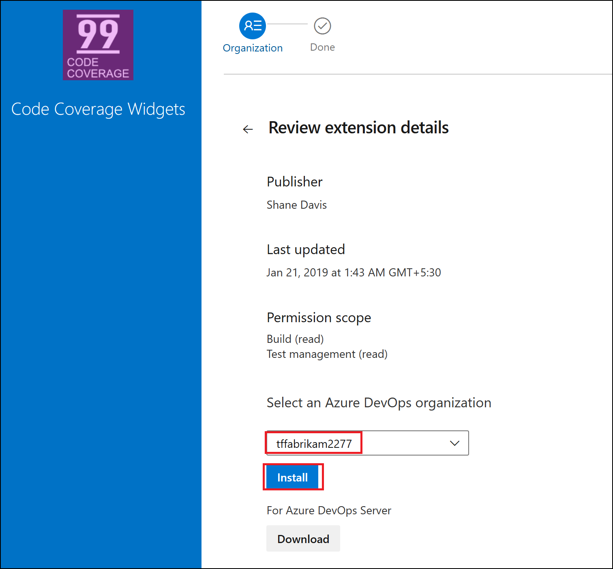

## Exercise 4 - Perform code coverage testing

Much like the tool you use for unit testing, the tool you use for code
coverage depends on the programming language and application framework.

When you target .NET applications to run on
Linux, [coverlet](https://github.com/tonerdo/coverlet) is a popular
option. Coverlet is a cross-platform, code-coverage library for .NET.

### Task 1 : Run code coverage locally

Before you write any pipeline code, you can try things manually to
verify the process.

1.  In Visual Studio Code, open the integrated terminal.

2.  Run the following dotnet new command to create a local tool manifest
    file. The command creates a file named *.config/dotnet-tools.json*.

  +++dotnet new tool-manifest+++

  

3.  Run the following dotnet tool install command to install
    ReportGenerator. This command installs the latest version
    of ReportGenerator and adds an entry to the tool manifest file.

  +++dotnet tool install dotnet-reportgenerator-globaltool+++

  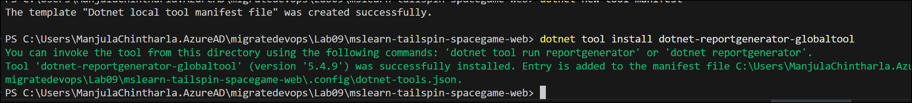

4.  Run the following dotnet add package command to add the coverlet.msbuild package to
    the *Tailspin.SpaceGame.Web.Tests* project:

  +++dotnet add Tailspin.SpaceGame.Web.Tests package coverlet.msbuild+++

  

5.  Run the following dotnet test command to run your unit tests and
    collect code coverage:

  >**Note:**If you're using the PowerShell terminal in Visual Studio, the
line continuation character is a backtick (**\`**), so use that
character in place of the backslash character (**\\**) for multi-line
commands.

  +++dotnet test --no-build --configuration Release /p:CollectCoverage=true /p:CoverletOutputFormat=cobertura /p:CoverletOutput=./TestResults/Coverage/+++

  +++dotnet test Tailspin.SpaceGame.Web.Tests/Tailspin.SpaceGame.Web.Tests.csproj --collect:"XPlat Code Coverage"+++

  

6.  Run the following dotnet tool run command to use ReportGenerator to
    convert the Cobertura file to HTML.Many HTML files will appear in
    the *CodeCoverage* folder at the root of the project.

  +++dotnet tool run reportgenerator -reports:./Tailspin.SpaceGame.Web.Tests/TestResults/Coverage/coverage.cobertura.xml -targetdir:./CodeCoverage -reporttypes:HtmlInline_AzurePipelines

  

7.  In Visual Studio Code, expand the *CodeCoverage* folder,
    **right-click *index.htm***, and then select **Reveal in File
    Explorer** (**Reveal in Finder** on macOS or **Open Containing
    Folder** on Linux).

  

8.  In Windows Explorer (Finder on macOS),
    double-click ***index.htm*** to open it in a web browser.

  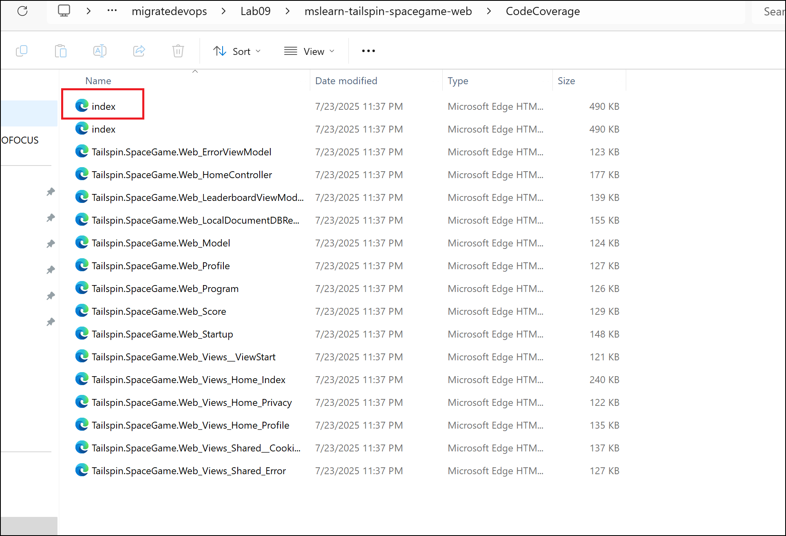

9.  You'll see the coverage report summary.

  

10. Scroll to the bottom of the page to see a coverage breakdown by
    class type.

  

### Task 2 : Configure pipeline to include code-coverage branch

1.  Select pipeline and click on Edit.

  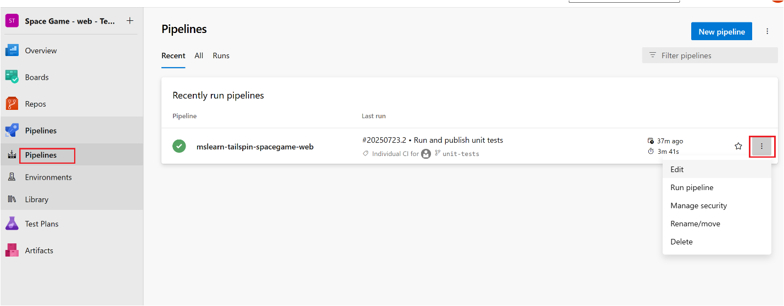

2.  Select **code-coverage** branch ,select **Triggers** from run.

  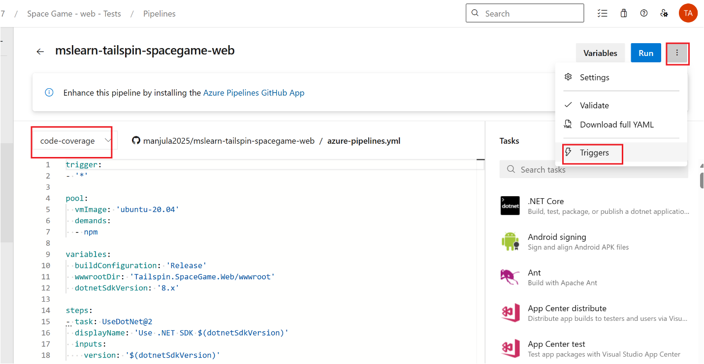

3.  Select CI-repo and include code-coverage branch under Branch filters
    as show in below image.

  

4.  Enter comment and then save.

  

### Task 3 : Create a branch

Now that you can build a code coverage report locally, you're ready to
add tasks to your build pipeline, which performs the same tasks.

In this section, you'll create a branch named code-coverage, based on
the unit-tests branch, to hold your work. In practice, you'd ordinarily
create this branch from the main branch.

1.  In Visual Studio Code, open the integrated terminal.

2.  In the terminal, run the following git checkout command to create a
    branch named code-coverage:

  +++git checkout -B code-coverage+++

  

3.  Replace  *azure-pipelines.yml* with below code

  ```
  trigger:
  - '*'

pool:
  vmImage: 'windows-latest'  # Microsoft-hosted agent

variables:
  buildConfiguration: 'Release'
  wwwrootDir: 'Tailspin.SpaceGame.Web/wwwroot'
  dotnetSdkVersion: '8.x'

steps:
  - task: UseNode@1
    displayName: 'Use Node.js 18.20.2'
    inputs:
      version: '18.20.2'

  - task: UseDotNet@2
    displayName: 'Use .NET SDK $(dotnetSdkVersion)'
    inputs:
      version: '$(dotnetSdkVersion)'

  - task: Npm@1
    displayName: 'Run npm install'
    inputs:
      verbose: false

  - script: './node_modules/.bin/node-sass $(wwwrootDir) --output $(wwwrootDir)'
    displayName: 'Compile Sass assets'

  - script: 'npx gulp'
    displayName: 'Run gulp tasks'

  - script: 'echo "$(Build.DefinitionName), $(Build.BuildId), $(Build.BuildNumber)" > buildinfo.txt'
    displayName: 'Write build info'
    workingDirectory: $(wwwrootDir)

  - task: DotNetCoreCLI@2
    displayName: 'Restore project dependencies'
    inputs:
      command: 'restore'
      projects: '**/*.csproj'

  - task: DotNetCoreCLI@2
    displayName: 'Build the project - $(buildConfiguration)'
    inputs:
      command: 'build'
      arguments: '--no-restore --configuration $(buildConfiguration)'
      projects: '**/*.csproj'

  - task: DotNetCoreCLI@2
    displayName: 'Install .NET tools from local manifest'
    inputs:
      command: custom
      custom: tool
      arguments: 'restore'

  - task: DotNetCoreCLI@2
    displayName: 'Run unit tests - $(buildConfiguration)'
    inputs:
      command: 'test'
      arguments: '--no-build --configuration $(buildConfiguration) /p:CollectCoverage=true /p:CoverletOutputFormat=cobertura /p:CoverletOutput=$(Build.SourcesDirectory)/TestResults/Coverage/'
      publishTestResults: true
      projects: '**/*.Tests.csproj'

  - task: DotNetCoreCLI@2
    displayName: 'Create code coverage report'
    inputs:
      command: custom
      custom: tool
      arguments: 'run reportgenerator -reports:$(Build.SourcesDirectory)/**/coverage.cobertura.xml -targetdir:$(Build.SourcesDirectory)/CodeCoverage -reporttypes:HtmlInline_AzurePipelines'

  - task: PublishCodeCoverageResults@1
    displayName: 'Publish code coverage report'
    inputs:
      codeCoverageTool: 'cobertura'
      summaryFileLocation: '$(Build.SourcesDirectory)/**/coverage.cobertura.xml'

  - task: DotNetCoreCLI@2
    displayName: 'Publish the project - $(buildConfiguration)'
    inputs:
      command: 'publish'
      projects: '**/*.csproj'
      publishWebProjects: false
      arguments: '--no-build --configuration $(buildConfiguration) --output $(Build.ArtifactStagingDirectory)/$(buildConfiguration)'
      zipAfterPublish: true

  - task: PublishBuildArtifacts@1
    displayName: 'Publish Artifact: drop'
    condition: succeeded()
```

  

4.  Add and commit the *Tailspin.SpaceGame.Web.Tests.csproj* file, which
    now contains a reference to the coverlet.msbuild package:

  +++git add Tailspin.SpaceGame.Web.Tests/Tailspin.SpaceGame.Web.Tests.csproj+++

  +++git commit -m "Add coverlet.msbuild package"+++

  

5.  Add and commit the tool manifest file, *dotnet-tools.json*:

  +++git add .config/dotnet-tools.json+++

  +++git commit -m "Add code coverage"+++

  

6.  Add and commit *azure-pipelines.yml*, which contains your updated
    build configuration:

  +++git add azure-pipelines.yml+++

  +++git commit -m "Add code coverage"+++

  

7.  Push the code-coverage branch to GitHub.

  +++git push origin code-coverage+++

  

8.  In Azure Pipelines, trace the build through each of the steps.

  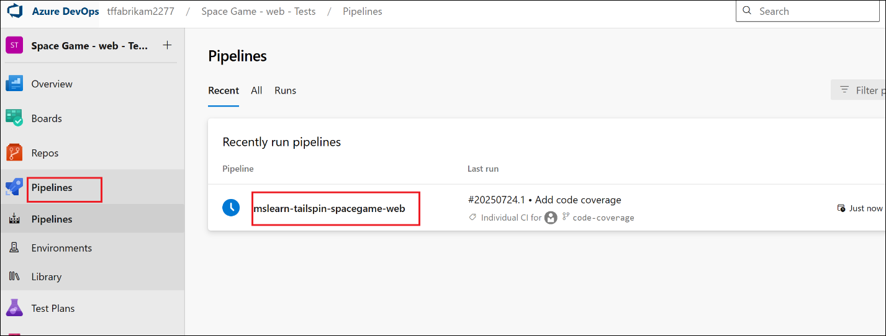

9.  Click on running pipeline

  

10. Click on the running job.

  +++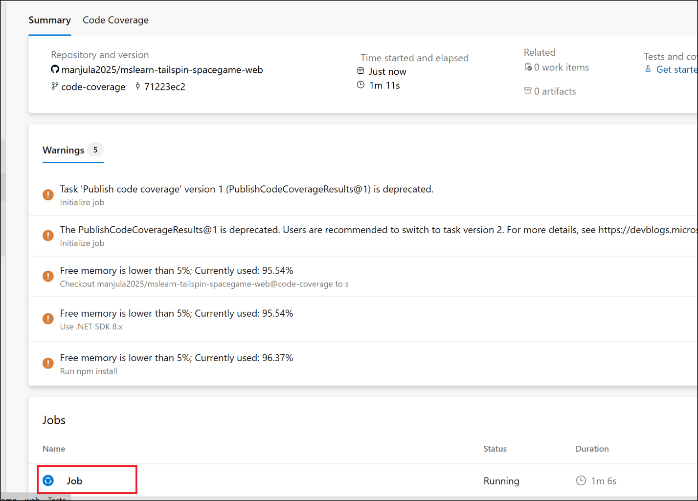+++

11. Wait for the job to complete successfully and then click back arrow
    to navigate to summary page.

  

  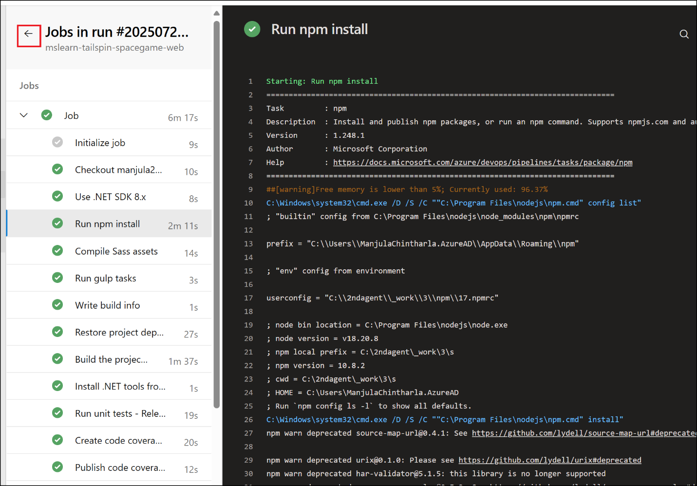

12. When the build finishes, go back to the Summary page and select
    the **Code Coverage** tab.You view the same results that you did
    when you ran the tests locally.

  

### Task 3 : Add the dashboard widget

In the previous section, you added the **Test Results Trend** widget to
your dashboard, which lets others quickly review test result trends over
time.

Here, you'll add a second widget that summarizes code coverage.

1.  In a new browser tab, go to +++https://marketplace.visualstudio.com/+++.On
    the **Azure DevOps** tab, search for **code coverage**.

2.  Select **Code Coverage Widgets** (published by Shane Davis).

  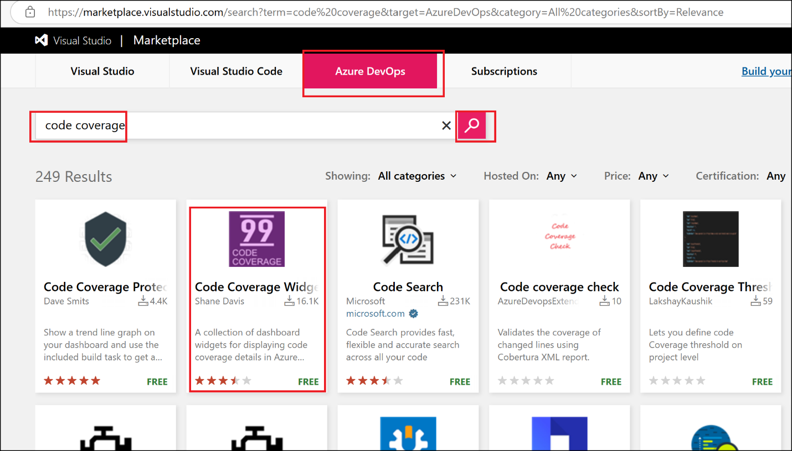

3.  Select **Get it free**.

  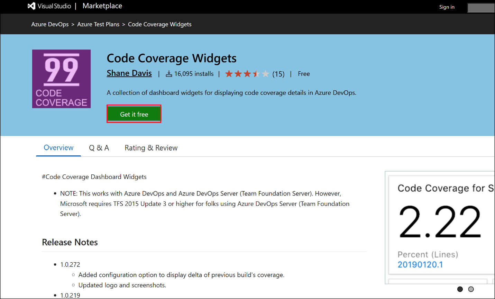

4.  In the drop-down list, select your Azure DevOps
    organization.Select **Install**.

  

  

5.  Go back to Azure DevOps.Go
    to **Overview** \> **Dashboards**.Select **Edit**.

  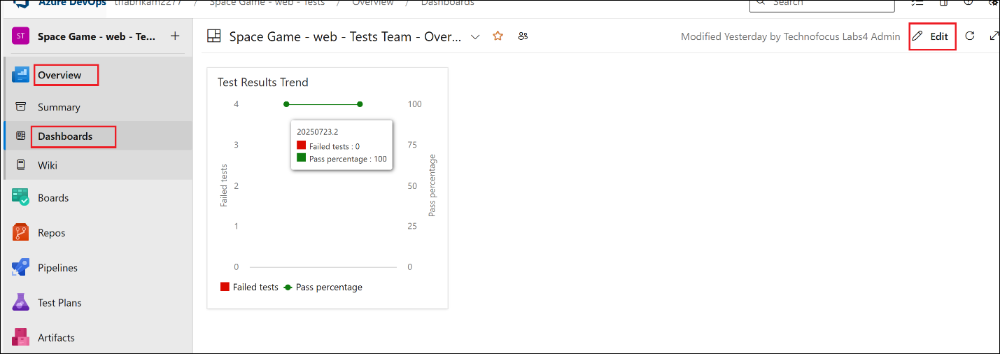

6.  Search for **Code Coverage**, and then select **Code Coverage**.
    Select it and then click on **Add**.

  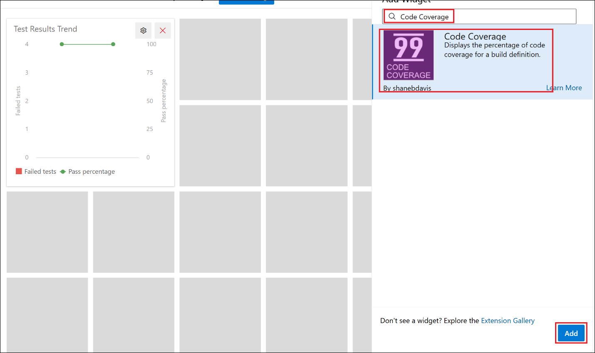

7.  Select the **Gear** icon to configure the widget.

  

8.  Keep all the default settings, except for:

  - Width: Enter 2
  - Build definition: Select your pipeline
  - Coverage measurement: select Lines
  - Select **Save**.


  

9.  Select **Done Editing**.The widget shows the percentage of code your
    unit tests cover.

  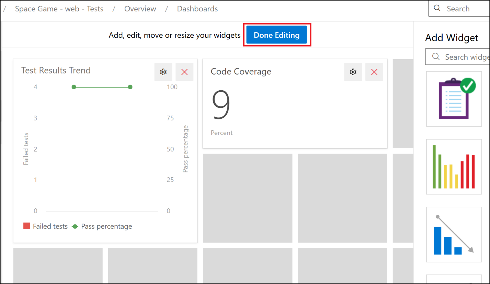

## Exercise 6 - Clean up your Azure DevOps environment

You're all done with the tasks for this module. You can now move the
work item to the **Done** state on Microsoft Azure Boards and clean up
your Microsoft Azure DevOps environment.

**Task 1: Delete the Azure DevOps project**

This option deletes your Azure DevOps project, including what's on Azure
Boards and your build pipeline. In future modules, you'll be able to run
another template that brings up a new project in a state where this one
leaves off. Choose this option to delete your Azure DevOps project if
you don't need it for future reference.

To delete the project:

1.  In Azure DevOps, go to your project. Earlier, we recommended that
    you name this project **Space Game - web - Tests**.

2.  Select **Project settings** in the lower-left corner of the Azure
    Devops page.

  

3.  In the **Project details** area, scroll down, and then
    select **Delete**.

4.  In the window that appears, enter the project name, and then
    select **Delete** a second time.

  


