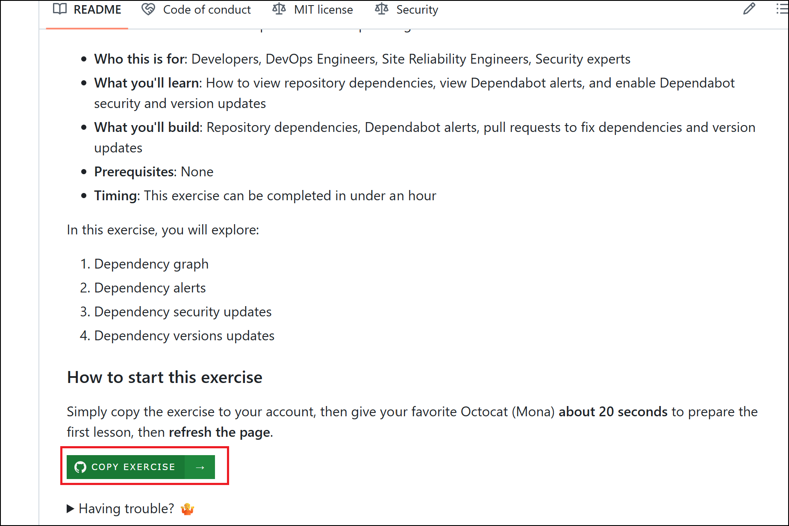
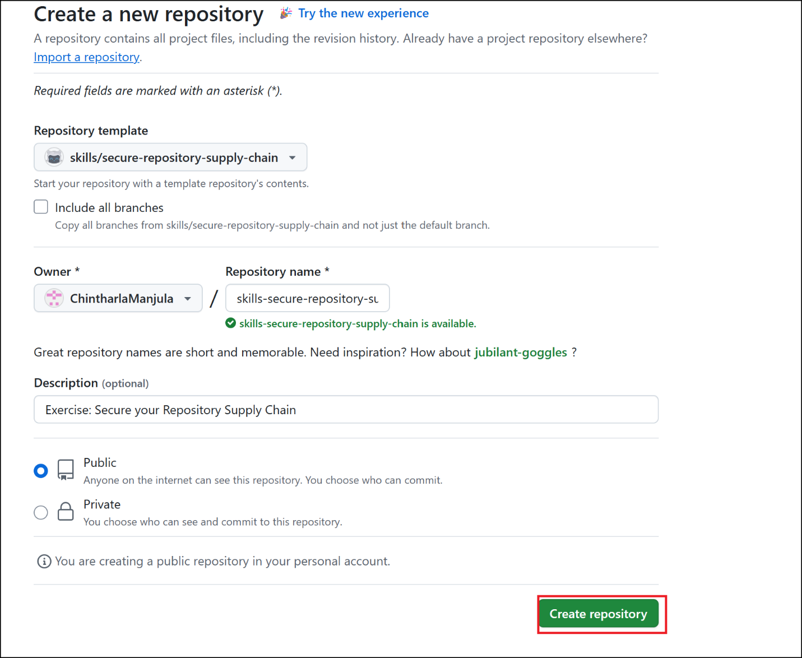
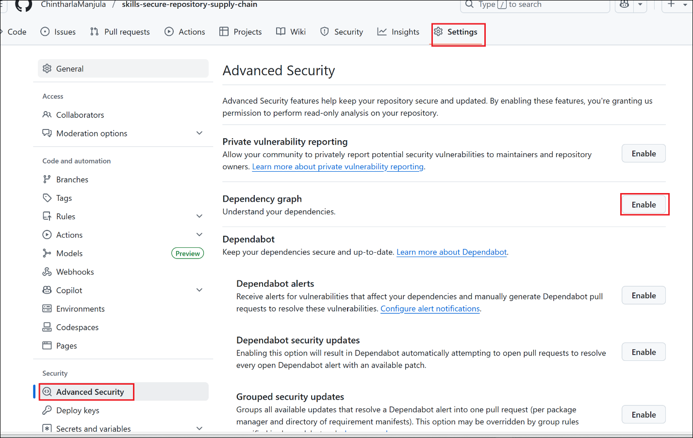

# Lab 11 - Secure your repository's supply chain

## Exercise 1: Review and add dependencies using dependency graph

**What's the big deal about securing your repository's supply chain?**:
With the accelerated use of open source, most projects depend on
hundreds of open-source dependencies. This poses a security problem:
what if the dependencies you're using are vulnerable? You could be
putting your users at risk of a supply chain attack. One of the most
important things you can do to protect your supply chain is to patch
your vulnerable dependencies and replace any malware.

GitHub offers a range of features to help you understand the
dependencies in your environment, know about vulnerabilities in those
dependencies, and patch them. The supply chain features on GitHub are:

- Dependency graph

- Dependency review

- Dependabot alerts

- Dependabot updates

  - Dependabot security updates

  - Dependabot version updates

**What is a dependency graph**: The dependency graph is a summary of the
manifest and lock files stored in a repository and any dependencies that
are submitted for the repository using the dependency submission API
(beta). For each repository, it shows:

- Dependencies, the ecosystems and packages it depends on

- Dependents, the repositories and packages that depend on it

### Task 1: Verify that dependency graph is enabled

Dependency graph is enabled by default for all new public repositories.

1.  Open a browser and navigate to - +++https://github.com/skills/secure-repository-supply-chain.git+++.
    Sign in with your GitHub account.

2.  Click on **COPY EXERCISE** .

  

3.  Keep default values and then click on **Create repository.**

  

4.  Navigate to the **Settings** tab.Click **Advanced
    Security**.Verify **Dependency Graph** is **Enabled**

  

