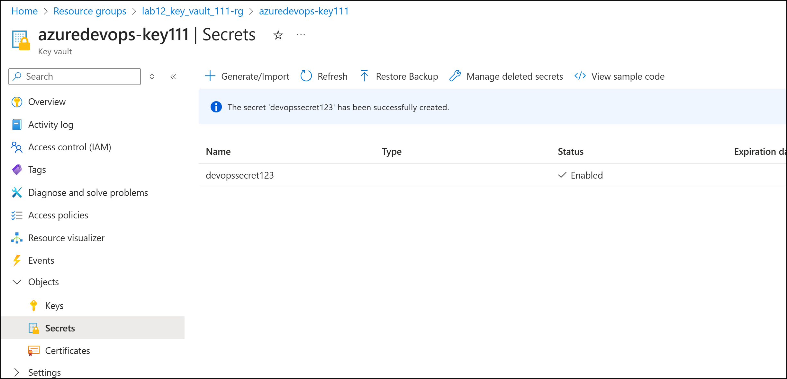
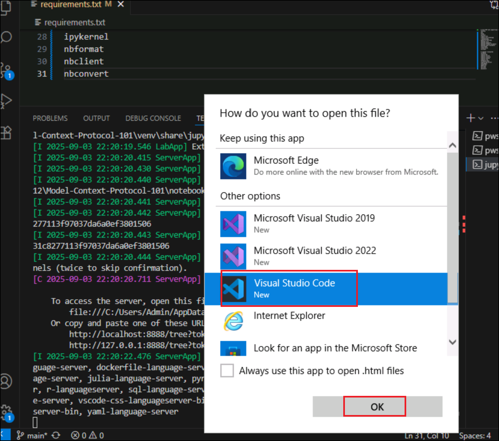
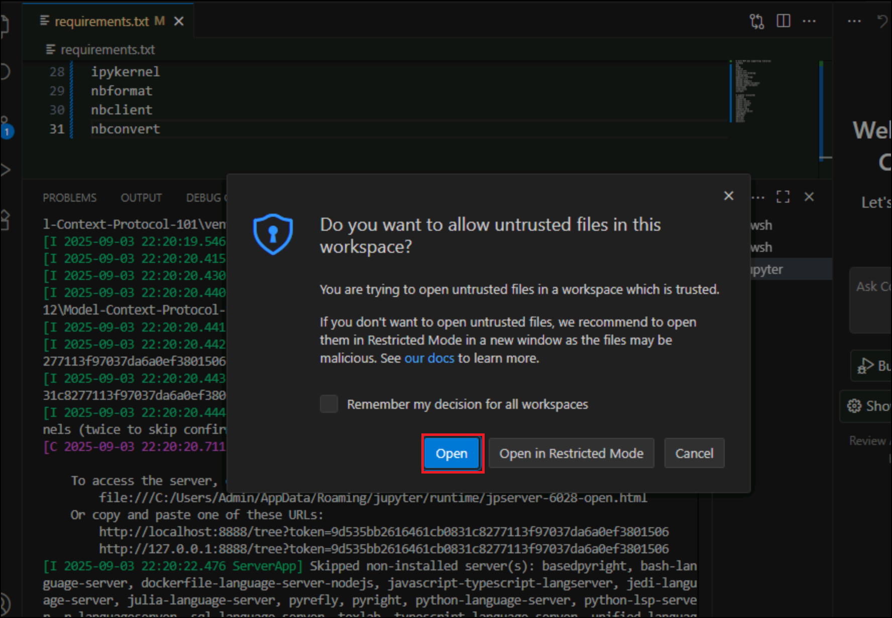
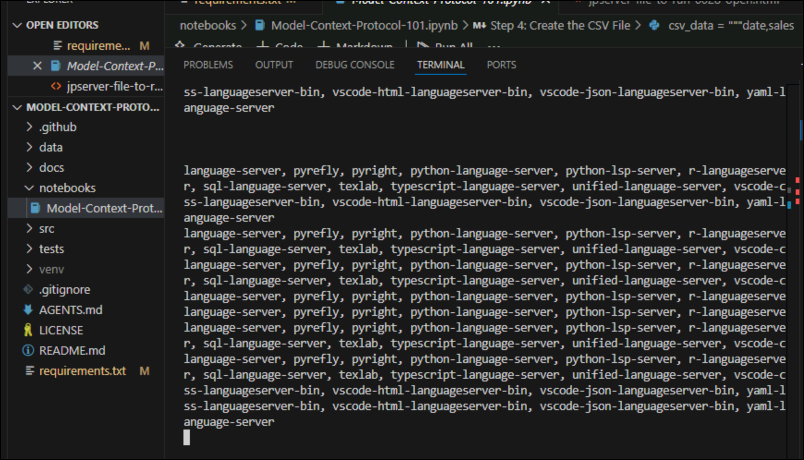

# \# Lab 12 - Integrate GitHub with Azure Key Vault for Secret Management

To get some quick experience with Azure Key Vault, let's create a new
Key Vault and do the most basic operation available: store a secret.
Creating a vault in the Azure portal requires no initial configuration.
Your signed-in user identity is automatically granted the full set of
secret management permissions, and you can start adding secrets
immediately. Once you have a vault, adding and managing secrets can be
done from any Azure administrative interface, including the Azure
portal, the Azure CLI, and Azure PowerShell.

### \### Task 1 : Create a new Azure Key Vault

Let's start by creating a new Key Vault in the Azure portal.

1.  Sign in to the Azure portal – +++<https://portal.azure.com>+++ and
    sign in with your Azure subscription account .

2.  In the search bar enter +++**Key Vault+++**  and select it.

3.  Select **Create**. The **Create key vault** pane appears.

4.  On the **Basics** tab, enter the following values for each setting.

    - Subscription : Your Azure subscription

    - Resource Group – Select **ResourceGroup1**

    - Name : +++**azuredevops-keyXXXX+++ (XXXX Is your subscription id
      shown in subscription field)**

    - and keep all the default values and then click on **Review +
      Create.**

> 

5.  After validation passes, select **Create** to create the Azure Key
    Vault.

6.  After the deployment is complete, select **Go to resource**.
    Your *Key vault* pane appears.

> 

### \### Task 2 : Assign a role to create key vault

1.  Click on Access control (IAM) from left navigation menu. Click on
    **Add** drop down and then select **Add role assignment.**

2.  Search for **+++Key Vault Administrator+++** and select it and then
    click on **Next**.

3.  Click on **Select members** link ,search for you tenant and select
    it from the list and then click on **Select** button.

4.  Click on **Review + assign** button.

5.  Click on **Review + assign** button under **Review + assign**
    window.

## \### Task 3 : Add a secret

Next, add a new secret to the vault.

1.  In the left menu pane, under **Objects**, select **Secrets**.
    The **Secrets** pane appears for your key vault.

2.  In the top menu bar, select **Generate/Import**. The **Create a
    secret** pane appears.

3.  Enter a **name, value**, and (optional) content type.
    Select **Create** to add the secret. The **Secrets** pane reappears.

> 
>
> 

4.  Select your secret from the list. The **Versions** pane appears for
    your secret.

> 

5.  Click on the current version.

6.  Select **Show Secret Value** to see the value assigned to the
    secret.

## \## Exercise 2 : Securing Agent Data with Model Context Protocol (MCP)

Learn how to use MCP to securely connect an AI agent to a PostgreSQL
database using **row-level security (RLS)** and **role-based access**,
simulating real-world enterprise access control.

Python 3.10+ or Node.js (for MCP server)

- PostgreSQL (local or cloud)

- GitHub repository (for agent code)

- VS Code or any IDE

- GitHub CLI (optional)

  1.  Open Visual Studio-\> Terminal-\>Bash and run below command to
      navigate to the repository.

> cd "C:\Labfiles\Lab12\Model-Context-Protocol-101"

2.  Run below command to set Up Python Environment. Isolating
    dependencies avoids conflicts so independent agents spend less time
    troubleshooting setups

python -m venv venv

source venv/Scripts/activate

3.  Open requirements.txt and replace the packages with below pacakges

> \# Core MCP and supporting libraries
>
> fastmcp
>
> mcp
>
> httpx
>
> authlib
>
> argon2-cffi
>
> argon2-cffi-bindings
>
> cryptography
>
> pydantic-settings
>
> openapi-core
>
> openapi-pydantic
>
> openapi-schema-validator
>
> openapi-spec-validator
>
> jsonschema
>
> isoduration
>
> cyclopts
>
> \# Jupyter ecosystem
>
> notebook
>
> jupyterlab
>
> jupyter-server
>
> jupyter-console
>
> jupyter-events
>
> jupyter-lsp
>
> notebook-shim
>
> jupyterlab-server
>
> ipywidgets
>
> ipykernel
>
> nbformat
>
> nbclient
>
> nbconvert
>
> 

4.  Run below command to install dependencies. A single command installs
    everything needed so independent agents can start experimenting
    right away.

> pip install -r requirements.txt
>
> 

5.  Run this command to install Jupyter Notebook:

> pip install notebook
>
> 

6.  Run Jupyter Notebook. Interactive notebooks showcase MCP features
    without extra scripting, letting independent agents focus on
    results.

> jupyter notebook notebooks/Model-Context-Protocol-101.ipynb
>
> 
>
> 

7.  Jupyter is up and running now.

> 

8.  Open **Model-Context-Protocol-101.ipynb** in Jupyter Notebook and
    understand MCP Architecture.

- Identify the three components:

&nbsp;

- **Host**: Where the agent lives (e.g., GitHub Action or chatbot).

- **Client**: Connects the host to external tools.

- **Server**: Wraps the tool/data source (PostgreSQL).

> 

9\. Configure PostgreSQL with RLS. Run below command to create Roles

CREATE ROLE HeadOffice;

CREATE ROLE StoreManager;

2\. Create Table and Enable RLS

CREATE TABLE sales ( id SERIAL PRIMARY KEY, region TEXT, amount INT,
owner TEXT ); ALTER TABLE sales ENABLE ROW LEVEL SECURITY;

3\. Add RLS Policies

CREATE POLICY head_office_policy ON sales FOR SELECT USING (region =
'HQ'); CREATE POLICY store_manager_policy ON sales FOR SELECT USING
(owner = current_user);

📝 **Exercise**: Insert sample data and test access using different
roles.

✅ Step 5: Pass Role Context via MCP Headers

In your agent code (Python):

MCPToolResource( server_label="ZavaSalesAnalysisMcpServer",
headers={"x-rls-user-id": request.rls_user_id}, require_approval="never"
)

📝 **Exercise**: Modify the header dynamically based on user role.

✅ Step 6: Secure the MCP Server

In your MCP server logic:

- Extract x-rls-user-id from headers.

- Validate against allowed roles.

- Default to read-only if missing.

user_id = request.headers.get("x-rls-user-id", "readonly")

📝 **Exercise**: Log all access attempts with timestamp and role.

✅ Step 7: Simulate Role-Based Access

Run the agent with:

- x-rls-user-id: HeadOffice

- x-rls-user-id: StoreManager

Observe:

- Data visibility differences

- Audit logs

📝 **Exercise**: Compare query results and document access behavior.

✅ Step 8: Review Security Best Practices

Discuss:

- **Confused Deputy Problem**: How to prevent agents from misusing
  elevated roles.

- **OAuth Proxy Risks**: Why direct token passing can be dangerous.

- **Static vs Dynamic Registration**: When to use dynamic client
  onboarding.

📝 **Reflection**: Write a short summary of how MCP enforces least
privilege.

🏁 Lab Completion Checklist

✅ MCP server running  
✅ PostgreSQL with RLS configured  
✅ Agent passing role headers  
✅ Access differences observed  
✅ Security risks discussed

Would you like me to generate a GitHub repo template or a printable
student worksheet based on this guide? I can also help you adapt this
for a classroom demo or instructor-led walkthrough.
