# Lab 12 - Integrate GitHub with Azure Key Vault for Secret Management

To get some quick experience with Azure Key Vault, let's create a new
Key Vault and do the most basic operation available: store a secret.
Creating a vault in the Azure portal requires no initial configuration.
Your signed-in user identity is automatically granted the full set of
secret management permissions, and you can start adding secrets
immediately. Once you have a vault, adding and managing secrets can be
done from any Azure administrative interface, including the Azure
portal, the Azure CLI, and Azure PowerShell.

### Task 1 : Create a new Azure Key Vault

Let's start by creating a new Key Vault in the Azure portal.

1.  Sign in to the Azure portal – <https://portal.azure.com> and sign in
    with your Azure subscription account .

2.  In the search bar enter **Key Vault**  and select it.

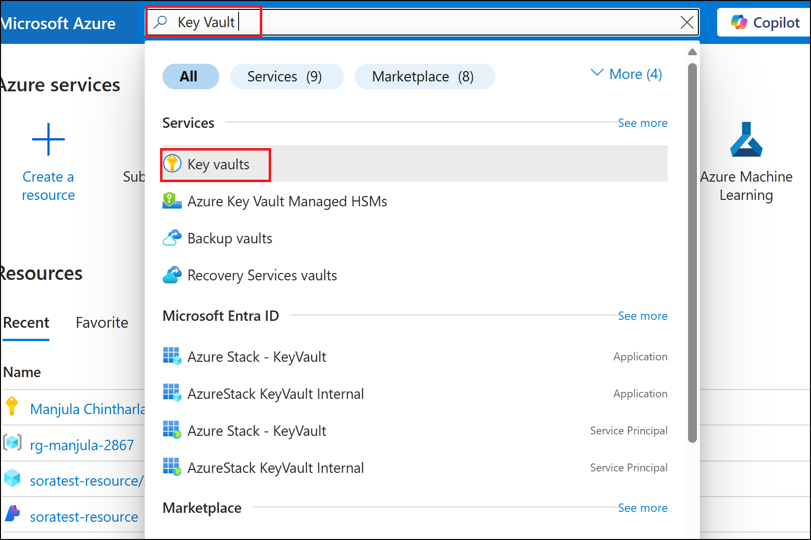

3.  Select **Create**. The **Create key vault** pane appears.

4.  On the **Basics** tab, enter the following values for each setting.

> Subscription : Your Azure subscription
>
> Resource Group – **Create New** - **lab12_key_vault_111-rg**- \>Ok

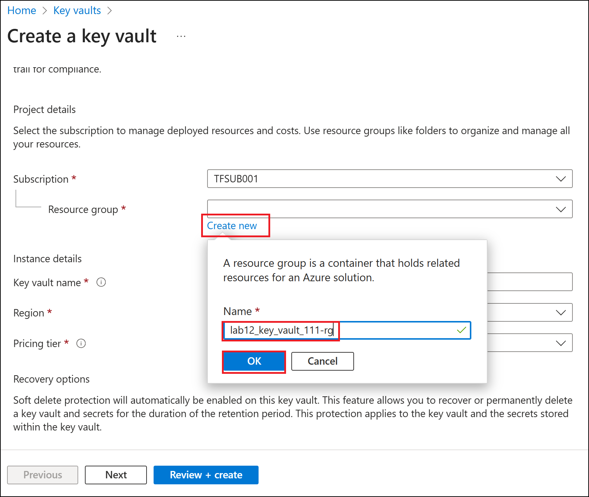

5.  Enter Key vault name as **azuredevops-keyXXX**(XXX can be unique
    number**)** and keep all the default values and then click on
    **Review + Create.**

> 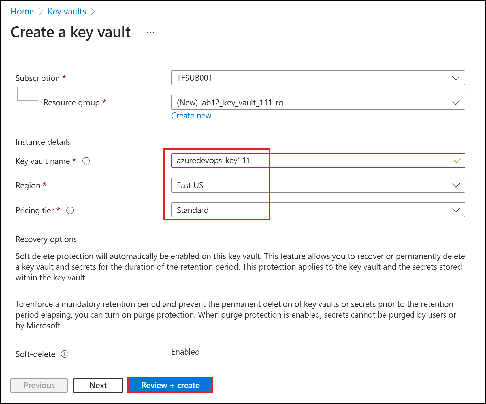

6.  After validation passes, select **Create** to create the Azure Key
    Vault.

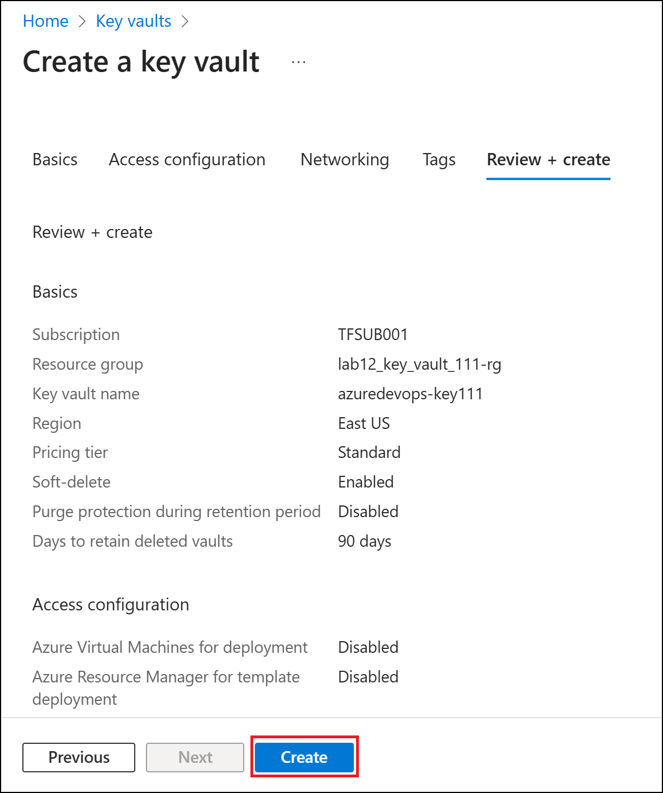

7.  After the deployment is complete, select **Go to resource**.
    Your *Key vault* pane appears.

> 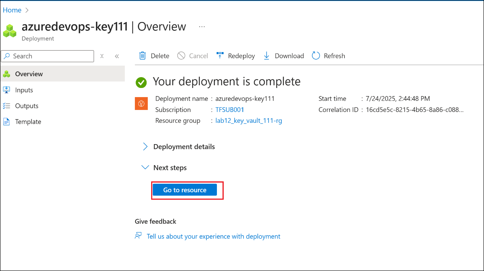

### Task 2 : Assign a role to create key vault

1.  Click on Access control (IAM) from left navigation menu. Click on
    **Add** drop down and then select **Add role assignment.**

2.  Search for **Key Vault Administrator** and select it and then click
    on **Next**.

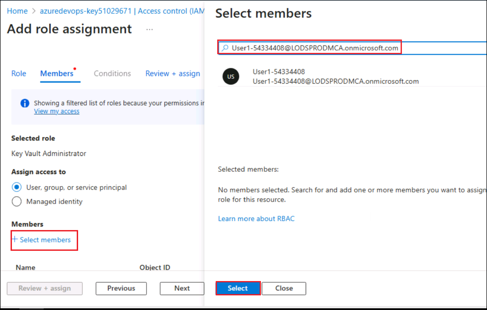

3.  Click on Select members link ,search for you tenant and select it
    from the list and then click on **Select** button.

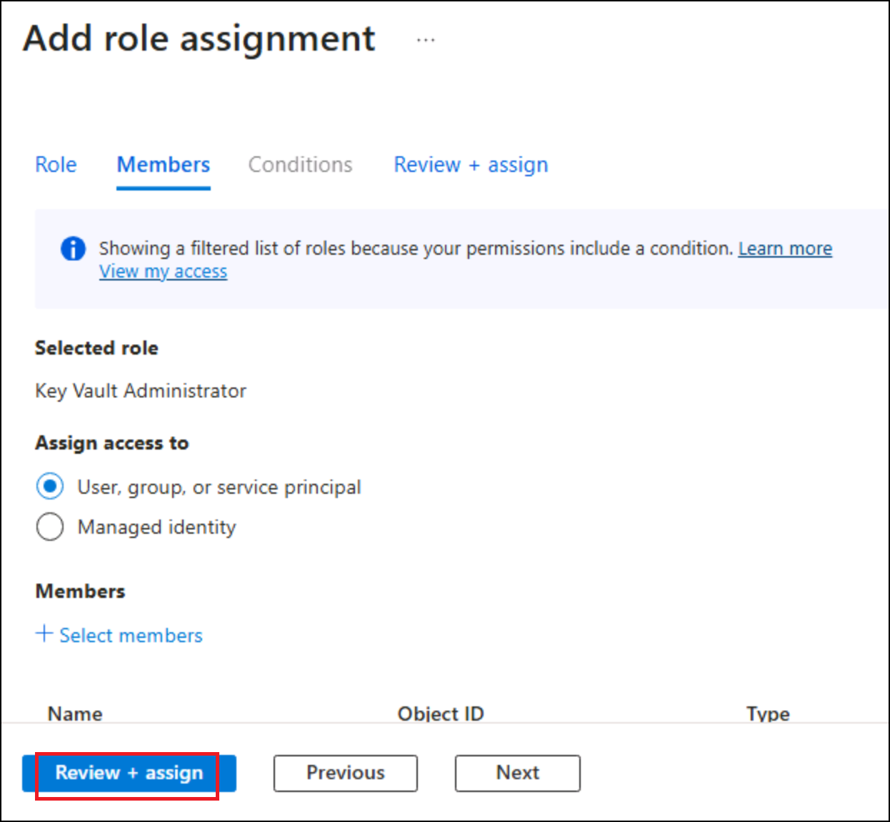

4.  Click on **Review + assign** button.

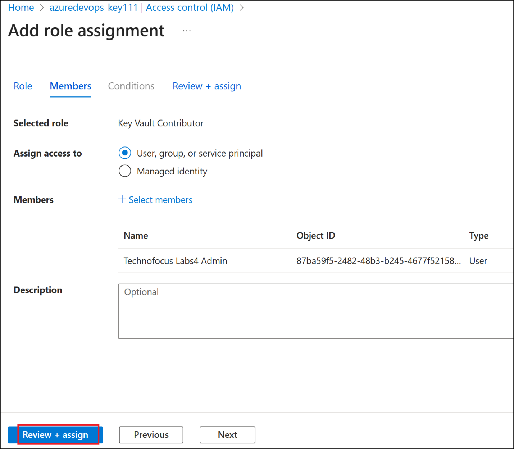

5.  Click on **Review + assign** button under **Review + assign**
    window.

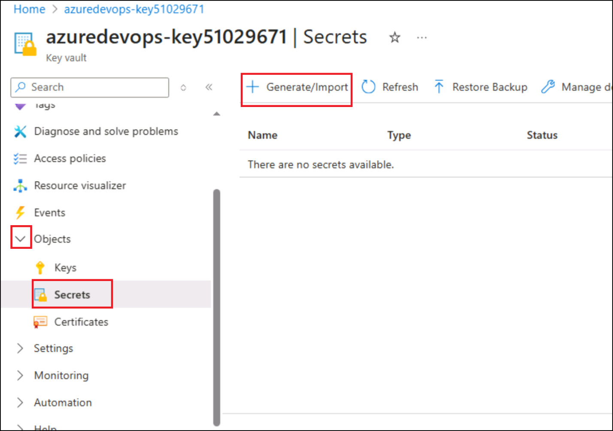

## Task 3 : Add a secret

Next, add a new secret to the vault.

1.  In the left menu pane, under **Objects**, select **Secrets**.
    The **Secrets** pane appears for your key vault.

2.  In the top menu bar, select **Generate/Import**. The **Create a
    secret** pane appears.

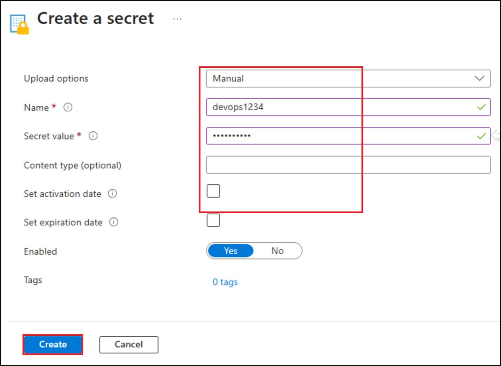

3.  Enter a **name, value**, and (optional) content type.
    Select **Create** to add the secret. The **Secrets** pane reappears.

> 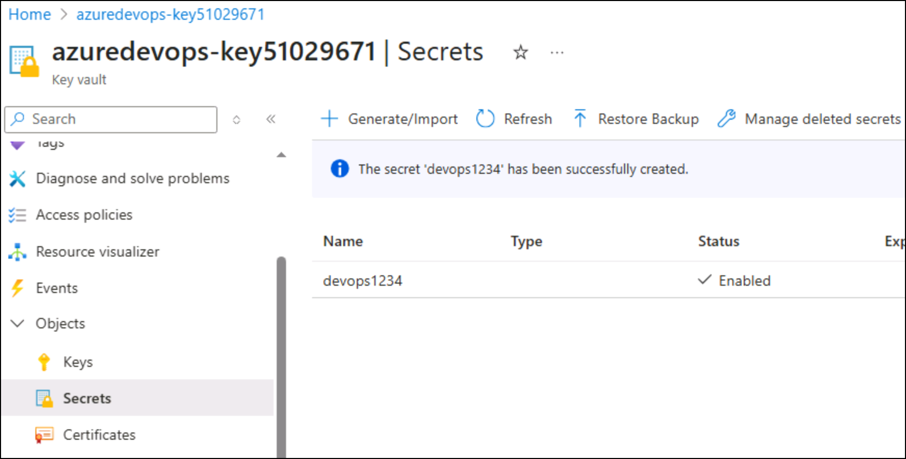
>
> 

4.  Select your secret from the list. The **Versions** pane appears for
    your secret.

> 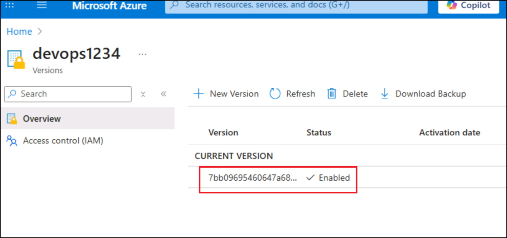

5.  Select **Show Secret Value** to see the value assigned to the
    secret.

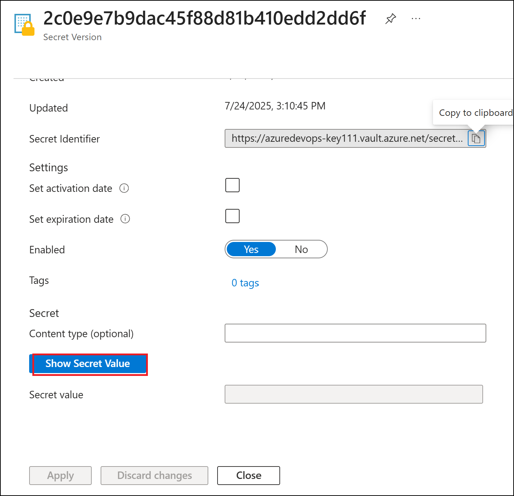
